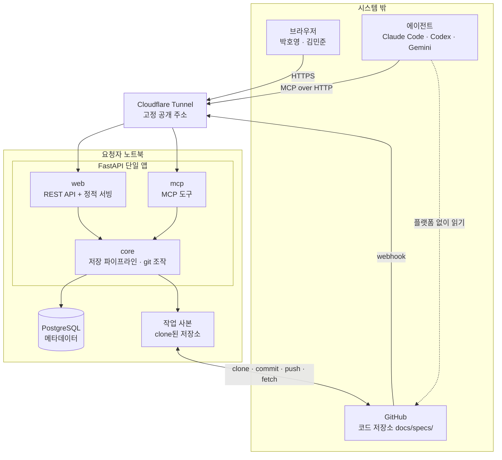
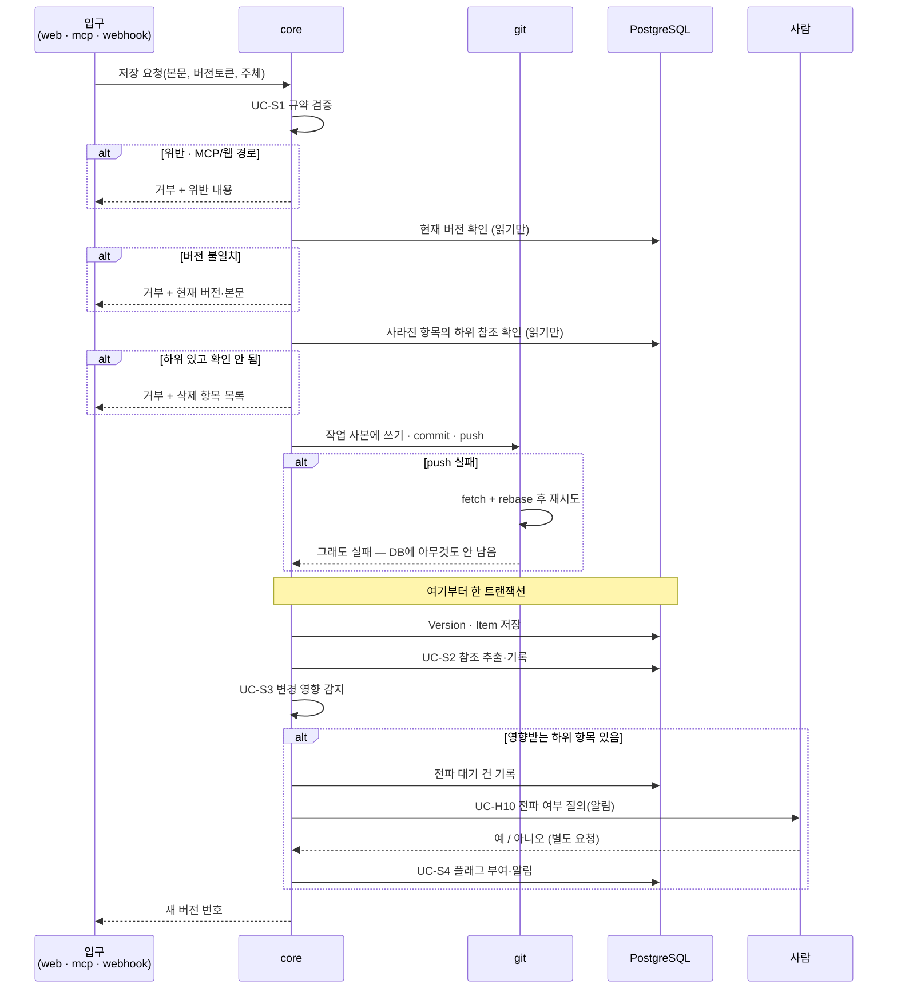

# 인프라 아키텍처: 싱크독 (SyncDoc)

---

## 0. 이 문서가 다루는 것

앞 단계(RFQ~USECASE)는 **무엇을** 만드는지를 정했다. 이 문서부터 **어떻게** 만드는지를 정한다.

여기서 정하는 것: 구성 요소와 경계, 기술 스택, 데이터가 어디 사는지, 요청이 어떻게 흐르는지, 인증, 배치.
여기서 정하지 않는 것: 도메인 모델과 클래스(다음 단계), API 시그니처, 테이블 컬럼.

---

## 1. 제약

앞 단계에서 확정되어 이 설계를 묶는 조건들이다.

#### C1 명세 원본은 각 프로젝트 코드 저장소의 `docs/specs/`에 산다

출처: [[SYNC-PRD-001#R5]]

#### C2 저장소가 단일 진실 원천이다. DB는 색인이며 재구축 가능해야 한다

출처: [[SYNC-PRD-001#N3]]

#### C3 입구가 둘이다 — 사람은 웹, 에이전트는 MCP. 본문 쓰기는 MCP와 GitHub push뿐이고 웹은 읽기·상태·댓글·되돌리기

출처: [[SYNC-PRD-001#R9]], USECASE 액터

#### C4 저장 경로(MCP·GitHub push, 그리고 웹의 되돌리기·상태 변경)가 **같은 파이프라인**을 거쳐야 한다

출처: UC-S1~S3

#### C5 플랫폼이 꺼져 있어도 팀원이 저장소에서 명세를 읽고 쓸 수 있어야 한다. 싱크독이 관여하지 않는 경로이므로 유스케이스가 아니라 제약이며, R1(frontmatter에 상태)·R5(MD를 git에)로 충족된다

출처: [[SYNC-PRD-001#N3]], [[SYNC-SCN-001#S7]]

#### C6 실사용 2~3명. 같이 일하는 사람만 쓴다

출처: RFQ

#### C7 요청자 노트북에서 서버가 돈다. 상시 가동 서버가 없다

출처: RFQ

#### C8 저장 파이프라인 중간에 사람 판단이 끼어든다 (UC-S3 → UC-H10 → UC-S4)

출처: USECASE

#### C9 바이브코딩으로 혼자 만든다

출처: RFQ


**C7과 C8이 이 설계의 두 축이다.** C7 때문에 상시 가동을 전제한 구조를 쓸 수 없고, C8 때문에 저장이 한 번의 트랜잭션으로 끝나지 않는다.

---

## 2. 구성도



**설명**

- **Cloudflare Tunnel** — 노트북이 공개 IP 없이 고정 주소를 갖게 한다. 브라우저·에이전트·GitHub webhook이 모두 이 주소로 들어온다. 노트북에서 밖으로 나가는 연결만 쓰므로 방화벽 설정이 필요 없다.
- **FastAPI 단일 앱** — 입구는 둘이지만 앱은 하나다. 이유는 4.1 참조.
- **작업 사본** — 등록된 저장소를 노트북에 clone해 둔 것. 저장 시 여기에 쓰고 커밋해 push한다.
- **점선** — 플랫폼을 거치지 않고 에이전트가 저장소를 직접 읽는 경로. C5의 보장.

---

## 3. 기술 스택

| 층 | 선택 | 이유 |
|---|---|---|
| 백엔드 | Python 3.12 / FastAPI | 요청자 주력 언어. MCP 파이썬 SDK 사용 가능 |
| 프론트엔드 | React + Vite + TS (SPA, `frontend/`). 유저용 탭 렌더링은 **`tools/view_build.py`를 TS로 옮긴 것**(`md.ts`·`views.ts`·타입별 모듈) — `react-markdown`은 쓰지 않는다(뷰 규약과 바이트 단위로 같아야 해서). `mermaid`(다이어그램) · `react-flow`(UI-8 그래프. **dagre는 안 쓴다** — UI-8 규칙이 열을 11단계로 고정해 배치가 결정적이다) · diff는 직접 | 빌드 결과는 `syncdoc/web/static/`으로, FastAPI가 `/{path:path}` 폴백으로 서빙. 별도 호스팅 없음 |
| 메타데이터 DB | PostgreSQL | 아래 참고 |
| Git 조작 | GitPython 또는 `git` CLI 호출 | 작업 사본에서 clone·commit·push |
| 다이어그램 | mermaid.js (브라우저 렌더링). 서버 생성물 없음 | PRD R10 |
| 외부 노출 | Cloudflare Tunnel | C7을 우회하는 유일한 현실적 방법 |
| 인증 | GitHub OAuth (웹) / 개인 토큰 (MCP) | 5장 |
| 실행 | Docker Compose (app + db) | 명령 하나로 켜고 끈다 |

> **PostgreSQL 선택에 따르는 부담** — 노트북에서 앱을 켤 때마다 DB 컨테이너가 함께 떠 있어야 한다. 2~3명 규모에서는 SQLite로도 충분하며 설치와 기동이 없다. 나중에 상시 가동 서버로 옮길 계획이 있다면 지금 PostgreSQL로 시작하는 편이 이전 비용을 줄인다. 그 계획이 없다면 SQLite가 가볍다. 이 문서는 PostgreSQL 기준으로 작성한다.

---

## 4. 내부 구조

### 4.1 입구는 둘, 알맹이는 하나

```
FastAPI 단일 앱
├── web    ← REST API + React 빌드 결과 서빙
├── mcp    ← MCP 도구 정의
└── core   ← 알맹이. 입구와 무관하게 동일하게 동작
```

`core`의 내부 구조는 이 문서에서 정하지 않는다. 도메인 개념이 나온 뒤에 그 경계를 따라 나누는 것이 맞으므로, 도메인 모델과 클래스 명세 단계로 넘긴다.

**왜 프로세스를 나누지 않는가.** C4가 이유다. 저장 파이프라인이 세 경로에서 똑같이 돌아야 하는데, 프로세스를 나누면 파이프라인 코드를 두 벌 갖거나 한쪽이 다른 쪽을 내부 API로 호출하게 된다. 두 벌이면 언젠가 어긋나고, 내부 호출이면 프로세스 하나와 그 사이 통신을 더 관리해야 한다. 2~3명이 쓰는 앱에서 치를 비용이 아니다.

경로로 구분한다.

| 경로 | 용도 |
|---|---|
| `/api/*` | 웹 REST API |
| `/mcp` | MCP 엔드포인트 |
| `/auth/*` | GitHub OAuth 콜백 |
| `/hooks/github` | GitHub webhook 수신 |
| `/` 및 정적 | React 빌드 결과 |

나중에 부하가 문제가 되면 `core`를 그대로 둔 채 `web`과 `mcp`를 각각 다른 프로세스로 띄우면 된다. 지금 나눌 필요는 없다.

### 4.2 저장 파이프라인

C4의 실체. 세 경로가 모두 이 함수 하나로 들어온다.



**C8이 여기서 드러난다.** UC-S3에서 사람 판단을 기다려야 하므로 저장이 한 번의 요청으로 끝나지 않는다. 설계상 처리는 이렇게 나눈다.

- 검증·버전 검사·삭제 검사는 DB를 읽기만 하고, **push가 성공한 뒤** Version·참조·영향을 한 트랜잭션으로 쓴다. push 실패면 롤백할 게 없다. 새 버전 번호는 즉시 돌려준다.
- 전파 대기 건은 DB에 남기고 알림만 보낸다. 사람의 응답은 나중에 별도 요청으로 들어온다.
- 응답이 없으면 UC-H10 확장 `2b`에 따라 "전파 미결정" 상태로 남는다. 이 상태가 DB에 실재해야 한다.

### 4.3 작업 사본

저장소마다 노트북에 clone본을 하나 둔다. 모든 git 조작은 여기서 일어난다.

- 프로젝트 등록(UC-A1) 시 clone
- 저장 시 쓰기 → commit → push
- push 거부 시 fetch + rebase 후 재시도 (UC-S7 확장 `2a`)
- 커밋 메시지는 규격을 따른다. 본문 변경 `spec(문서ID): 요약`, 상태 변경만 `status(문서ID): 이전 → 새상태`. 상태만 바꿔도 커밋이 생기며 접두어로 걸러 볼 수 있다. 둘째 줄부터 이유 — 변경 이력 절을 원본에 두지 않기 때문(STD-001 1.7)
- 파일 경로는 [[SYNC-STD-001]] 1.1 — `docs/specs/{TYPE}/{doc_id}.md`, `_templates/`, `assets/`, `STD/`
- **저장은 저장소 단위 락** 안에서 한다. 두 에이전트가 같은 저장소에 동시에 push하면 한쪽 rebase가 충돌하기 때문(클래스 4.7)
- webhook 또는 폴링으로 외부 변경 감지 시 fetch → 변경 파일 추출 → 파이프라인 재실행

**주의**: 커밋 작성자는 요청한 사람의 GitHub 계정으로 남긴다. MCP 경로에서도 지시한 사람 계정을 쓴다. UC-A6의 "작성 주체 기록"이 실제 커밋 이력과 일치해야 한다.

---

## 5. 인증과 접근

C6이 요구하는 것은 권한 구분이 아니라 **누가 들어올 수 있는가**다. PRD 비목표에 역할·권한 관리를 두지 않기로 했으므로, 들어온 사람은 모두 같은 일을 할 수 있다.

| 액터 | 방식 | 확인하는 것 |
|---|---|---|
| 사람 (웹) | GitHub OAuth | 등록된 저장소에 접근 권한이 있는 GitHub 계정인가 |
| 에이전트 (MCP) | 개인 액세스 토큰 | 사람이 웹에서 발급한 토큰인가. 토큰은 발급한 사람에 묶인다 |
| GitHub (webhook) | 서명 검증 | webhook secret으로 요청이 GitHub에서 왔는지 |

**GitHub OAuth를 고른 이유**는 여러 문제를 하나로 묶기 때문이다.

- 접근 통제 — 저장소 권한이 곧 접근 권한. 별도 사용자 관리가 없다
- 사용자 식별 — PRD 미결사항이던 "계정 로그인 vs 이름 입력"이 해결된다
- 커밋 작성자 — 각자의 계정으로 커밋이 남는다. 한 계정으로 몰지 않는다
- 저장소 접근 — 각자의 토큰으로 push한다

**공개 경로 — Quick Tunnel**: 도메인 없이 `cloudflared tunnel --url http://localhost:8000`으로 `https://xxx.trycloudflare.com` 임시 주소를 받는다. 공짜지만 **켤 때마다 주소가 바뀐다.**

- **webhook은 걸지 않는다.** Payload URL이 매번 바뀌어 못 쓴다. 대신 **폴링만으로 간다** — `POLL_INTERVAL_SECONDS`(기본 300). GitHub 직접 push(UC-G1·S7)는 5분 안에 반영된다. 기동 시 따라잡기가 있어 꺼져 있던 동안의 커밋도 들어온다
- **OAuth 앱**은 켤 때마다 callback URL을 새 주소로 고친다(3분). 앱 하나에 로컬용(`http://localhost:8000/auth/github/callback`)과 공개용 콜백을 **둘 다 등록해 두면** 양쪽에서 로그인된다 — 앱이 `redirect_uri`를 보내기 때문이다(SEQ-8). `.env`의 `PUBLIC_BASE_URL`을 같이 바꾼다
- **`PUBLIC_BASE_URL`의 쓰임**: 앱이 `redirect_uri`를 만들 때 쓴다. 요청 Host가 이 값의 host와 같으면 이 값을, 아니면 요청에서 만든다(`auth.callback_url`). 터널 뒤에서는 프록시가 https를 http로 보이게 하므로 요청만으로는 스킴을 못 믿는다. 비어 있으면 요청에서만 만든다
- 고정 주소가 필요해지면 도메인을 사서 Named Tunnel로 바꾼다 — 그때 webhook도 켠다(v2)

**저장소는 public**: v1은 public 저장소만 다룬다 — `git.fetch`가 토큰 없이 돌기 때문. private 지원은 v2(MS-009 미결). `clone`·`push`는 등록자 토큰을 쓰므로 public이어도 쓰기에는 권한이 필요하다.

**컨테이너 빌드**: Dockerfile은 두 단계다 — `node`로 `frontend/`를 빌드해 `syncdoc/web/static`에 넣고, `python`으로 앱을 담는다. 프런트 빌드 단계가 없으면 새 클론에서 화면이 빈 채로 뜬다.

**MCP 배치**: `mcp` 2.x `MCPServer`, streamable HTTP. FastAPI 안에 `/mcp` **정확 경로 Route**로(Mount면 뒤 라우트를 삼킨다). 세션 매니저는 인스턴스당 한 번만 돌므로 lifespan마다 앱을 새로 만든다. DNS rebinding 보호는 터널 뒤 고정 도메인이라 끈다.

**웹 세션**: 테이블 없이 서명 쿠키 `syncdoc_session`(`itsdangerous`)에 `github_login`만 담고, 요청마다 `AccountService.user_by_login`으로 User를 얻는다. 노트북 재시작에도 로그인이 유지된다.

**MCP 인증이 다른 이유**: 에이전트에는 브라우저가 없어 OAuth 동의 화면을 띄울 수 없다. 사람이 웹에 로그인한 뒤 토큰을 발급받아 자기 에이전트 설정에 넣는다. 토큰으로 들어온 요청은 발급자 계정으로 기록된다.

**커밋 작성자를 계정으로 잇기**: OAuth로 들어온 사람은 계정이 확실하지만, **GitHub에서 바로 push한 커밋은 다르다.** git 커밋이 남기는 신원은 이름(`%an`)과 이메일(`%ae`)뿐이고, 이름은 아무 문자열이라 계정과 못 잇는다. 이어지는 길은 둘이다.

- **앞으로의 커밋** — GitHub Settings → Emails에서 **`Keep my email addresses private`를 켠다.** 커밋 이메일이 `{숫자}+{로그인ID}@users.noreply.github.com`으로 나가고 앱이 거기서 로그인 ID를 바로 뽑는다(MS-009 `git.changed_files`). `Block command line pushes that expose my email`도 함께 켜면 실수로 실제 메일이 새는 것을 git이 막는다. **로컬 `git config user.email`을 그 noreply 주소로 바꿔야** 효력이 있다
- **이미 실제 메일로 나간 커밋** — 그 메일을 UI-13 내 계정 카드(2.5·2.6)에 등록하고 **인덱스 재구축을 한 번 돌린다.** 재구축이 git을 다시 읽으면서 작성자를 이메일로 찾아 붙인다

둘 중 하나도 안 하면 같은 사람이 계정 둘로 갈리고, 로그인한 쪽 계정에는 아무것도 안 달려 **내 할 일이 빈다**(#34). 이건 사람이 한 번 해 두는 설정이라 앱이 대신 못 한다.

**GitHub 토큰 보관**: 각자의 계정으로 커밋·push하려면 서버가 각 사용자의 GitHub OAuth 토큰을 갖고 있어야 한다. 요청자 노트북이지만 역할은 서버이므로, **토큰은 앱 비밀키로 암호화해 DB에 보관한다.** 비밀키는 DB 밖(환경 변수 또는 별도 파일)에 두어 DB만 유출되어도 토큰이 풀리지 않게 한다. 토큰은 저장소 `repo` 범위만 요청한다. OAuth 앱에서 **"Expire user access tokens"를 끈다** — 토큰 갱신 경로가 없어(MS-006 미결) 만료되면 push가 죽는다. git 작업 사본의 `.git/config`에는 토큰을 남기지 않는다 — push할 때만 URL에 붙인다(MS-009 `git.clone`·`commit_push`).

### 5.1 비밀키 교체

토큰 암호화 키를 바꿔야 할 때가 온다 — 유출이 의심되거나 정기 교체 정책이 생기면.

**세션 서명 키와 토큰 암호화 키를 나눈다.** 같은 키를 쓰면 토큰 키를 바꾸는 순간 모든 세션
쿠키가 무효가 되어 전원이 다시 로그인한다. `SESSION_SECRET`과 `SECRET_KEY`를 따로 둔다.

**옛 키를 함께 받는다.** `SECRET_KEY_OLD`가 있으면 복호화는 두 키로 시도하고 암호화는 늘 새
키로 한다. 재암호화가 끝나면 옛 키를 지운다.

절차는 셋이다.
1. 새 키를 만들어 `SECRET_KEY`에, 지금 키를 `SECRET_KEY_OLD`에 넣고 다시 띄운다
2. 재암호화를 돌린다 — 모든 사용자의 저장된 토큰을 옛 키로 풀어 새 키로 다시 담근다
3. `SECRET_KEY_OLD`를 지운다

**옛 키 없이 바꾸면 저장된 GitHub 토큰이 전부 못 풀린다.** 그때 복호화 실패는 사람이 읽을 수
있는 오류여야 한다([[SYNC-MS-006#AccountService.github_token_for]]) — 안 그러면 원인 모를 500이
나가고, 유일한 복구가 "전원 재로그인"이 된다.

### 5.2 설정값

| 이름 | 기본 | 무엇 |
|---|---|---|
| `SECRET_KEY` | — | GitHub 토큰 암호화 키. 필수 |
| `SECRET_KEY_OLD` | 없음 | 교체 중일 때만. 복호화에만 쓴다 |
| `SESSION_SECRET` | — | 세션 쿠키 서명. 토큰 키와 나눈다 |
| `POLL_INTERVAL_SECONDS` | 300 | 폴링 주기. 0 이하면 폴링을 켜지 않는다 |
| `DIFF_CONTEXT_LINES` | 3 | diff에서 앞뒤로 함께 보여줄 줄 수 |
| `PUSH_RETRIES` | 3 | push 거부 시 rebase 후 재시도 횟수 |
| `BACKUP_INTERVAL_SECONDS` | 86400 | 추적 데이터 백업 주기(6.1). 0 이하면 백업을 켜지 않는다 |
| `REPOS_DIR` | `/var/syncdoc/repos` | 작업 사본이 사는 곳 |

---

## 6. 데이터가 사는 곳

C2에 따라 **저장소가 원본이고 DB는 색인**이다. 어느 쪽에 무엇이 사는지가 명확해야 재구축(UC-S6)이 성립한다.

| 데이터 | 사는 곳 | DB 유실 시 |
|---|---|---|
| 명세 본문 | 저장소 `docs/specs/*.md` | 손실 없음 |
| 문서 상태 | 저장소 frontmatter | 손실 없음 |
| 첨부 파일 | 저장소 `docs/specs/assets/` | 손실 없음 |
| 버전 이력 | 저장소 git 커밋 | 손실 없음 |
| 참조 관계 | DB (본문에서 추출) | 본문에서 재추출 가능 |
| 프로젝트 등록 | DB | 재등록 필요 |
| 플래그 (확인 필요·끊어진 참조) | DB | **복구 불가** |
| 전파 대기·미결정 | DB | **복구 불가** |
| 댓글 | DB | **복구 불가** |
| 발급 토큰 | DB | 재발급 필요 |

**복구 불가 항목이 셋 있다.** 원본에 없는, 시스템이 만든 정보이기 때문이다. C2가 보장하는 것은 "명세와 참조가 살아남는다"이지 "모든 것이 살아남는다"가 아니다. **그래서 이 셋을 저장소에 함께 커밋한다.** 명세와 무관한 파일이 섞이는 값을 치르고 셋을 살린다.

### 6.1 추적 데이터 백업

| 항목 | 결정 |
|---|---|
| 무엇을 | `flags` · `propagation_decisions` · `comments` 세 테이블. **뼈대만** — 자유 텍스트는 뺀다(아래) |
| 어떤 형식 | **자연키 JSON.** 숫자 `id`가 아니라 `문서ID#항목ID` · **커밋 해시** · `github_login`으로 적는다 |
| 어디에 | 저장소 `backup/tracking.json` |
| 언제 | 앱이 `BACKUP_INTERVAL_SECONDS`(기본 하루)마다. **지난 백업과 내용이 같으면 커밋하지 않는다** |
| 누가 | 저장소 등록자(`repositories.registered_by_user_id`)의 토큰으로 push |
| 복원 | clone → 인덱스 재구축(UC-S6) → 가져오기(UI-14 요소 6). 이름으로 다시 붙는다 |

**버전은 커밋 해시로 적는다. 버전 번호로는 안 된다.** 재구축은 커밋마다 버전을 만들므로 번호가 전부 다시 매겨진다 — 실측으로 96건이 263건이 됐다. 백업 당시의 `v12`는 복원 뒤 다른 커밋을 가리킨다. 열쇠는 `(문서ID, 커밋 해시)`이고, 이것은 재구축 안의 재연결이 이미 쓰는 열쇠다([[SYNC-MS-004#TrackingService.relink_versions]]).

**자유 텍스트는 안 싣는다 — 저장소가 public이기 때문이다.** 아래 "비밀이 구조적으로 안 들어간다"가 덮는 것은 토큰과 해시뿐이다. `comments.body`와 `propagation_decisions.reason`은 **사람이 자유롭게 쓰는 글**이라 내부 맥락·이름·주소가 들어갈 수 있다. 그래서 뼈대만 싣는다.

| 테이블 | 싣는 것 | 빼는 것 |
|---|---|---|
| `flags` | 종류·대상 항목·원인 항목·원인 버전·담당자·부여 시각·해제자·해제 시각·수정 동반 여부 | — |
| `propagation_decisions` | 버전·선택·영향 항목 목록·바뀐 항목 목록·결정자·결정 시각 | **`reason`** |
| `comments` | 문서·줄 번호·줄 해시·작성자·해결 여부·작성 시각·원래 위치·부모 관계 | **`body`** |

**복원하면 "여기 댓글이 있었다"는 살아나고 내용은 안 돌아온다.** 플래그·전파결정은 손실이 없다 — 둘은 구조만으로 이뤄져 있고 `reason`은 사람이 나중에 다시 적을 수 있는 부가 설명이다. 본문까지 지키려면 저장소를 private으로 돌리거나 백업만 따로 private 저장소에 두어야 하는데, 이 프로젝트는 공개를 유지하기로 했다.

**왜 `pg_dump`가 아닌가.** 세 테이블은 전부 `items.id`·`versions.id`·`documents.id`·`users.id`를 숫자로 가리킨다. DB를 잃고 저장소에서 재구축하면 그 id가 전부 새로 부여되므로, 세 테이블만 뜬 덤프는 복원 시 엉뚱한 행을 가리키거나 외래키가 깨진다. 전체 덤프는 id가 맞지만 저장소가 public이라 암호화된 GitHub 토큰과 토큰 해시가 공개된다. **자연키 JSON은 비밀이 구조적으로 안 들어가고 재구축과도 맞물린다.**

**변경 감지에는 안 걸린다.** 파이프라인은 `docs/specs/` 아래만 본다(MS-009 `changed_files`의 prefix). `backup/`은 폴링이 명세 변경으로 오해하지 않는다. 다만 `behind_by`를 세는 `git.rev_list_count`에는 경로 제한이 없어 백업 push 직후 한 주기 동안 `밀림 1`로 보인다 — 다음 폴링이 처리할 파일 0개로 정리한다.

**같은 파일을 두 번 쓰면 커밋이 안 생긴다.** `git.commit_push`가 `git diff --cached --quiet`로 이미 판정한다([[SYNC-MS-009#git.commit_push]]) — 백업이 따로 비교할 필요가 없다. 대신 **JSON을 결정적으로 써야 한다**: 키 정렬·행 정렬·고정 들여쓰기. **내보낸 시각 같은 값을 파일에 넣으면 내용이 안 바뀌어도 매번 커밋이 난다.**

**백업이 멈춘 것을 사람이 알아야 한다.** 등록자가 다시 로그인하지 않아 토큰이 풀리면 push가 매번 실패하고 로그에만 남는다 — **백업이 몇 달 없었다는 걸 DB를 잃는 날 알게 된다.** 그래서 마지막 백업 시각을 관리 화면에 내보낸다(UI-14 요소 2.4). 그 값은 **DB가 아니라 git에서 읽는다**(`backup/tracking.json`의 마지막 커밋 시각) — DB를 잃어도 남아야 하는 성질이라 백업 자신과 같은 곳에 살아야 한다.

**재구축 안의 재연결과 다른 문제다.** 같은 뿌리(재구축이 `versions` id를 새로 부여한다)에서 나왔지만 다루는 상황이 다르다. **DB가 살아 있는 채로 재구축하는 경우**는 옛 지도를 뜰 수 있으므로 트랜잭션 안에서 커밋 해시로 다시 잇는다([[SYNC-MS-004#TrackingService.relink_versions]], #38) — 백업 파일이 필요 없다. 이 절의 백업은 **DB를 통째로 잃은 경우**를 위한 것이다. 그때는 옛 지도가 없으므로 저장소에 남긴 자연키가 유일한 단서다. 둘 다 필요하다.

---

## 7. 외부 변경 감지

C7 때문에 원래는 webhook을 받을 수 없었으나, Cloudflare Tunnel로 공개 주소가 생기므로 받을 수 있다.

- **주 경로**: GitHub webhook → `/hooks/github` → 서명 검증 → fetch → 변경 파일 파이프라인 (UC-G1 기본 흐름)
- **보조 경로**: 5분 주기 폴링. webhook 유실과 서버가 꺼져 있던 구간을 메운다 (UC-G1 확장 `1a`, `1b`)

두 경로 모두 있지만 **v1은 폴링만 쓴다** — Quick Tunnel 주소가 바뀌어 webhook을 걸 수 없다(5장). webhook 수신 엔드포인트(`POST /hooks/github`)는 구현되어 있고 서명 검증도 되므로, 고정 주소가 생기면 저장소에 등록만 하면 된다. 노트북이 꺼져 있던 동안의 커밋은 켜질 때 따라잡기가 가져온다 — 이 절차가 폴링만 쓸 때 더 중요하다.

**밀린 커밋이 여럿이면 최종 상태만 저장한다.** `last_processed_commit..HEAD` 범위의 변경 파일을 한 번에 읽어 파일마다 버전 하나. 중간 커밋은 git에만 남는다. 커밋마다 버전을 복원하는 건 재구축(UC-S6)뿐이다.

---

## 8. 배치와 운영

```
docker compose up
├── app   FastAPI + React 빌드 결과   :8000
└── db    PostgreSQL                  :5432
```

Cloudflare Tunnel은 노트북에서 별도로 실행하며 `:8000`을 공개 주소에 연결한다.

**이미지에 담기는 것** — 백엔드 코드, React 빌드 결과, 그리고 `docs/specs/`의 `_templates/`와 `STD/` 사본. 저장소 작업 사본에서 규약·템플릿을 못 읽을 때 [[SYNC-API-002#get_template]]이 이 사본으로 대체한다. 둘 중 하나라도 빠지면 그 대체가 배포본에서만 조용히 실패한다.

**운영상 전제**
- 노트북이 꺼지면 웹과 MCP가 모두 멈춘다. 이 구조의 근본 한계이며 C5(저장소 직접 읽기)가 대비책이다.
- 켜질 때마다 밀린 커밋 따라잡기(7장)가 자동으로 돌아야 한다.
- 작업 사본이 손상되면 다시 clone하고 UC-S6으로 인덱스를 재구축한다.

---

## 9. 미결사항

- [x] SQLite vs PostgreSQL 최종 확정 — 3장 참고. 상시 가동 서버로 옮길 계획 유무에 달렸다 — 결정: PostgreSQL. 3장이 이미 그 기준으로 쓰였고 `docker-compose.yml`이 postgres:16-alpine, `config.py`의 기본 DSN도 psycopg
- [x] 플래그·댓글의 백업 방식 — 6장 참고. DB 덤프를 저장소에 커밋할지, 유실을 감수할지 — 결정: 저장소에 커밋한다 — 세 테이블을 자연키 JSON으로 `backup/tracking.json`에, 앱이 하루 한 번, 바뀐 게 없으면 커밋하지 않는다. 상세는 6.1
- [x] MCP 토큰의 만료·회수 정책 — 결정: 만료는 두지 않는다(`expires_at=None`, MS-006 그대로). 회수는 사람이 UI-13에서 폐기하는 것 하나. `access_tokens.expires_at` 컬럼과 검증 분기는 남겨 둔다 — 정책이 바뀌면 발급만 고치면 된다
- [x] 토큰 암호화 비밀키의 보관 위치와 교체 절차 — 결정: 보관 위치는 지금대로 `.env`(DB 밖). 교체를 대비한다 — (1) 복호화 실패(`InvalidToken`)를 잡아 읽을 수 있는 오류로 바꾸고, (2) 옛 키를 함께 받아 복호화는 둘 다·암호화는 새 키로(`MultiFernet`), (3) 재암호화 유틸을 둔다. **세션 서명 키를 토큰 암호화 키와 분리한다** — 지금은 같은 키라 교체가 곧 전원 로그아웃이다
- [x] 저장소를 여러 개 등록했을 때 작업 사본 디스크 사용량 한도 — 결정: 한도보다 **회수 경로가 먼저다.** 지금은 프로젝트 삭제 API도 MCP 도구도 없어 한 번 등록하면 작업 사본이 디스크에서 사라지지 않는다. `ProjectService.delete_project`와 `DELETE /api/projects/{code}`를 만든다. 용량 한도·쿼터는 v2 — 노트북 한 대에 프로젝트 몇 개 수준에서는 이르다
- [x] Cloudflare Tunnel 고정 주소용 도메인 확보 여부 — 결정: v1은 Quick Tunnel(도메인 없음, 5장). 고정 주소가 필요해지면 도메인을 사서 Named Tunnel — v2
- [x] 원격 기본 브랜치 `main` 고정 — 다른 브랜치 저장소 지원은 v2 — 결정: `main` 고정 (CODE-001 3장). 다른 브랜치 저장소는 v2
