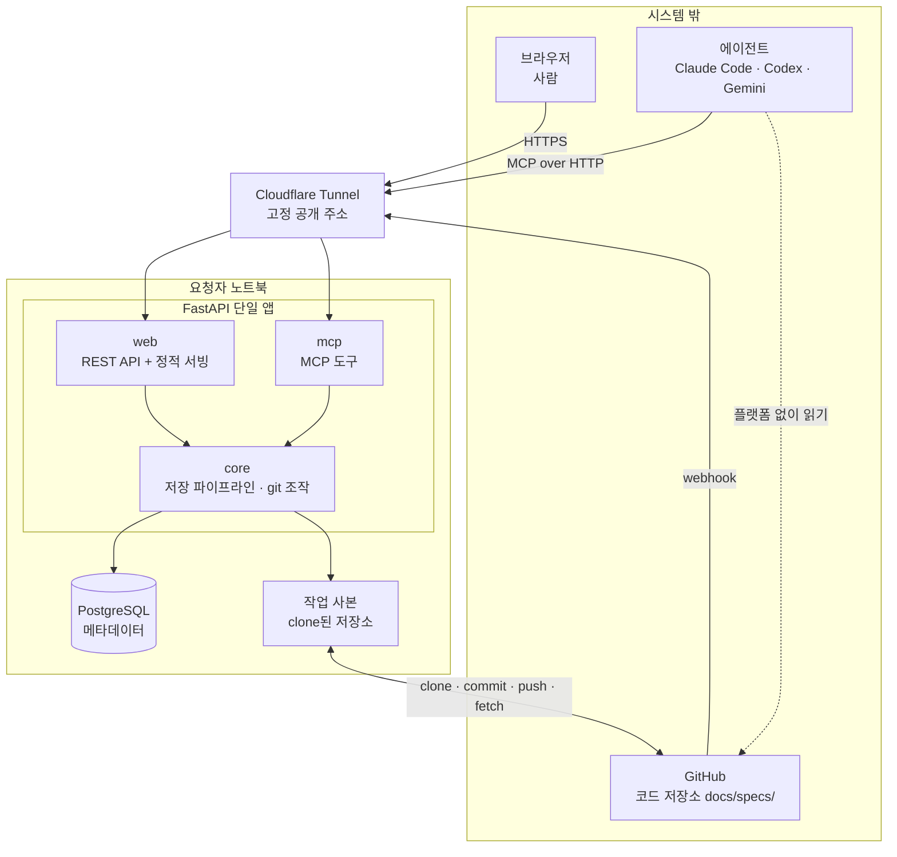
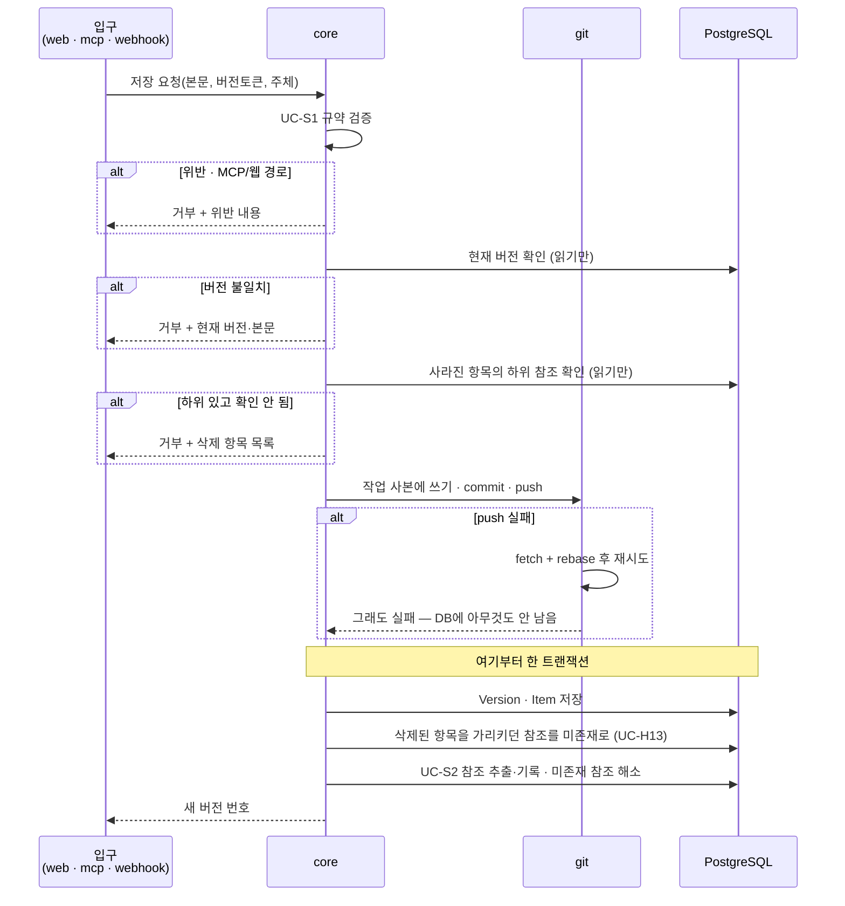

# 인프라 아키텍처: 싱크독 (SyncDoc)

---

## 0. 이 문서가 다루는 것

앞 단계(RFQ~USECASE)는 **무엇을** 만드는지를 정했다. 이 문서부터 **어떻게** 만드는지를 정한다.

여기서 정하는 것: 구성 요소와 경계, 기술 스택, 데이터가 어디 사는지, 요청이 어떻게 흐르는지, 인증, 배치.
여기서 정하지 않는 것: 도메인 모델과 클래스(다음 단계), API 시그니처, 테이블 컬럼.

---

## 1. 제약

앞 단계에서 확정되어 이 설계를 묶는 조건들이다.

#### C1 명세 원본은 각 프로젝트 코드 저장소의 `docs/specs/`에 산다

출처: [[SYNC-PRD-001#R5]]

#### C2 저장소가 단일 진실 원천이다. DB는 색인이며 재구축 가능해야 한다

출처: [[SYNC-PRD-001#N3]]

#### C3 입구가 둘이다 — 사람은 웹, 에이전트는 MCP. 본문 쓰기는 MCP와 GitHub push뿐이고 웹은 읽기·상태·되돌리기·휴지통

출처: [[SYNC-PRD-001#R9]], USECASE 액터

#### C4 저장 경로(MCP·GitHub push, 그리고 웹의 되돌리기·상태 변경)가 **같은 파이프라인**을 거쳐야 한다

출처: UC-S1·S2

#### C5 플랫폼이 꺼져 있어도 팀원이 저장소에서 명세를 읽고 쓸 수 있어야 한다. 싱크독이 관여하지 않는 경로이므로 유스케이스가 아니라 제약이며, R1(frontmatter에 상태)·R5(MD를 git에)로 충족된다

출처: [[SYNC-PRD-001#N3]], [[SYNC-SCN-001#S7]]

#### C6 한 사람이 자기 프로젝트를 쓴다. 사용자는 몇 명이어도 각자다

출처: [[SYNC-RFQ-001]] 7장. v1은 「실사용 2~3명, 같이 일하는 사람만」이었다 — 실제로는 한 사람이 프로젝트 하나를 혼자 다 썼다

#### C7 요청자 노트북에서 서버가 돈다. 상시 가동 서버가 없다

출처: RFQ

#### C9 바이브코딩으로 혼자 만든다

출처: RFQ


**C7이 이 설계의 축이다.** 상시 가동을 전제한 구조를 쓸 수 없다. v1에는 C8(저장 파이프라인 중간에 사람 판단이 끼어든다)이 둘째 축이었으나 전파를 빼면서 사라졌다([[SYNC-DOM-001]] 3.3) — 저장은 이제 요청 하나로 끝난다.

---

## 2. 구성도



**설명**

- **Cloudflare Tunnel** — 노트북이 공개 IP 없이 고정 주소를 갖게 한다. 브라우저·에이전트·GitHub webhook이 모두 이 주소로 들어온다. 노트북에서 밖으로 나가는 연결만 쓰므로 방화벽 설정이 필요 없다.
- **FastAPI 단일 앱** — 입구는 둘이지만 앱은 하나다. 이유는 4.1 참조.
- **작업 사본** — 등록된 저장소를 노트북에 clone해 둔 것. 저장 시 여기에 쓰고 커밋해 push한다.
- **점선** — 플랫폼을 거치지 않고 에이전트가 저장소를 직접 읽는 경로. C5의 보장.

---

## 3. 기술 스택

| 층 | 선택 | 이유 |
|---|---|---|
| 백엔드 | Python 3.12 / FastAPI | 요청자 주력 언어. MCP 파이썬 SDK 사용 가능 |
| 프론트엔드 | React + Vite + TS (SPA, `frontend/`). 유저용 탭 렌더링은 **`tools/view_build.py`를 TS로 옮긴 것**(`md.ts`·`views.ts`·타입별 모듈) — `react-markdown`은 쓰지 않는다(뷰 규약과 바이트 단위로 같아야 해서). `mermaid`(다이어그램) · `react-flow`(UI-8 그래프. **dagre는 안 쓴다** — UI-8 규칙이 열을 11단계로 고정해 배치가 결정적이다) · diff는 직접 | 빌드 결과는 `syncdoc/web/static/`으로, FastAPI가 `/{path:path}` 폴백으로 서빙. 별도 호스팅 없음 |
| 메타데이터 DB | PostgreSQL | 아래 참고 |
| Git 조작 | GitPython 또는 `git` CLI 호출 | 작업 사본에서 clone·commit·push |
| 다이어그램 | mermaid.js (브라우저 렌더링). 서버 생성물 없음 | PRD R10 |
| 외부 노출 | Cloudflare Tunnel | C7을 우회하는 유일한 현실적 방법 |
| 인증 | GitHub OAuth (웹) / 개인 토큰 (MCP) | 5장 |
| 모델 호출 | 외부 모델 API. `infra/llm.py` 어댑터 하나 | 읽는 중 질의([[SYNC-PRD-001#R11]])에만. 5.3 |
| 실행 | Docker Compose (app + db) | 명령 하나로 켜고 끈다 |

> **PostgreSQL 선택에 따르는 부담** — 노트북에서 앱을 켤 때마다 DB 컨테이너가 함께 떠 있어야 한다. 혼자 쓰는 규모에서는 SQLite로도 충분하며 설치와 기동이 없다. 나중에 상시 가동 서버로 옮길 계획이 있다면 지금 PostgreSQL로 시작하는 편이 이전 비용을 줄인다. 그 계획이 없다면 SQLite가 가볍다. 이 문서는 PostgreSQL 기준으로 작성한다.

---

## 4. 내부 구조

### 4.1 입구는 둘, 알맹이는 하나

```
FastAPI 단일 앱
├── web    ← REST API + React 빌드 결과 서빙
├── mcp    ← MCP 도구 정의
└── core   ← 알맹이. 입구와 무관하게 동일하게 동작
```

`core`의 내부 구조는 이 문서에서 정하지 않는다. 도메인 개념이 나온 뒤에 그 경계를 따라 나누는 것이 맞으므로, 도메인 모델과 클래스 명세 단계로 넘긴다.

**왜 프로세스를 나누지 않는가.** C4가 이유다. 저장 파이프라인이 세 경로에서 똑같이 돌아야 하는데, 프로세스를 나누면 파이프라인 코드를 두 벌 갖거나 한쪽이 다른 쪽을 내부 API로 호출하게 된다. 두 벌이면 언젠가 어긋나고, 내부 호출이면 프로세스 하나와 그 사이 통신을 더 관리해야 한다. 혼자 쓰는 앱에서 치를 비용이 아니다.

경로로 구분한다.

| 경로 | 용도 |
|---|---|
| `/api/*` | 웹 REST API |
| `/mcp` | MCP 엔드포인트 |
| `/auth/*` | GitHub OAuth 콜백 |
| `/hooks/github` | GitHub webhook 수신 |
| `/` 및 정적 | React 빌드 결과 |

나중에 부하가 문제가 되면 `core`를 그대로 둔 채 `web`과 `mcp`를 각각 다른 프로세스로 띄우면 된다. 지금 나눌 필요는 없다.

### 4.2 저장 파이프라인

C4의 실체. 세 경로가 모두 이 함수 하나로 들어온다.



**저장은 요청 하나로 끝난다.** 검증·버전 검사·삭제 검사는 DB를 읽기만 하고, **push가 성공한 뒤** Version·참조를 한 트랜잭션으로 쓴다. push 실패면 롤백할 게 없다. 새 버전 번호는 즉시 돌려준다. v1에는 여기에 변경 영향 감지와 사람의 전파 판단이 끼어 있어 저장이 두 요청에 걸쳤다 — 전파를 빼면서 그 갈래가 사라졌다.

### 4.3 작업 사본

저장소마다 노트북에 clone본을 하나 둔다. 모든 git 조작은 여기서 일어난다.

- 프로젝트 등록(UC-A1) 시 clone
- 저장 시 쓰기 → commit → push
- push 거부 시 fetch + rebase 후 재시도 (UC-S7 확장 `2a`)
- 커밋 메시지는 규격을 따른다. 본문 변경 `spec(문서ID): 요약`, 상태 변경만 `status(문서ID): 이전 → 새상태`. 상태만 바꿔도 커밋이 생기며 접두어로 걸러 볼 수 있다. 둘째 줄부터 이유 — 변경 이력 절을 원본에 두지 않기 때문(STD-001 1.7)
- 파일 경로는 [[SYNC-STD-001]] 1.1 — `docs/specs/{TYPE}/{doc_id}.md`, `_templates/`, `assets/`, `STD/`
- **저장은 저장소 단위 락** 안에서 한다. 두 에이전트가 같은 저장소에 동시에 push하면 한쪽 rebase가 충돌하기 때문(클래스 4.7)
- webhook 또는 폴링으로 외부 변경 감지 시 fetch → 변경 파일 추출 → 파이프라인 재실행

**주의**: 커밋 작성자는 요청한 사람의 GitHub 계정으로 남긴다. MCP 경로에서도 지시한 사람 계정을 쓴다. UC-A6의 "작성 주체 기록"이 실제 커밋 이력과 일치해야 한다.

---

## 5. 인증과 접근

C6이 요구하는 것은 권한 구분이 아니다. 여기서는 **누가 들어오는가**와 **무엇이 보이는가**를 나눈다. 들어오는 것은 GitHub 계정이면 되고, 보이는 것은 자기가 등록한 프로젝트뿐이다([[SYNC-PRD-001#R12]]). PRD 비목표에 역할·권한 관리를 두지 않기로 했으므로, 자기 프로젝트 안에서는 모두 같은 일을 할 수 있다 — 역할은 없고 소유만 있다.

| 액터 | 방식 | 확인하는 것 |
|---|---|---|
| 사람 (웹) | GitHub OAuth | GitHub 계정으로 들어오고, 자기가 등록한 프로젝트만 본다 |
| 에이전트 (MCP) | 개인 액세스 토큰 | 사람이 웹에서 발급한 토큰인가. 토큰은 발급한 사람에 묶이고, 발급자가 소유한 프로젝트만 연다 |
| GitHub (webhook) | 서명 검증 | webhook secret으로 요청이 GitHub에서 왔는지 |

**GitHub OAuth를 고른 이유**는 여러 문제를 하나로 묶기 때문이다.

- 접근 통제 — 로그인은 GitHub 계정. **무엇이 보이는가는 등록자(소유자)인가로 가른다**([[SYNC-PRD-001#R12]]). 별도 사용자 관리가 없다. v1 문구 「저장소 권한이 곧 접근 권한」은 코드가 검사한 적이 없었다(#75·#91) — 소유가 그 자리를 맡는다
- 사용자 식별 — PRD 미결사항이던 "계정 로그인 vs 이름 입력"이 해결된다
- 커밋 작성자 — 각자의 계정으로 커밋이 남는다. 한 계정으로 몰지 않는다
- 저장소 접근 — 각자의 토큰으로 push한다

**공개 경로 — Named Tunnel (고정 주소)**: Cloudflare에 올린 도메인 아래 호스트 하나(`PUBLIC_BASE_URL`)를 Zero Trust → Tunnels에서 만든 터널에 잇고, 노트북에서 `cloudflared tunnel run --token $TUNNEL_TOKEN`으로 붙인다. **재부팅해도 주소가 같다** — OAuth 콜백·MCP 등록·에이전트 설정을 한 번만 한다. `.env`에 `TUNNEL_TOKEN`(터널 토큰 — 대시보드가 준다. 비밀이므로 채팅·커밋에 안 적는다)과 `PUBLIC_BASE_URL`(고정 호스트)을 둔다. `scripts/tunnel.sh`가 `TUNNEL_TOKEN`이 있으면 이 모드로 뜬다.

**대안 — Quick Tunnel (도메인 없음)**: `TUNNEL_TOKEN`이 비어 있으면 `cloudflared tunnel --url http://localhost:8000`으로 `https://xxx.trycloudflare.com` 임시 주소를 받는다. 공짜지만 **켤 때마다 주소가 바뀐다** — 스크립트가 `PUBLIC_BASE_URL`을 새 주소로 덮어쓰고, 사람이 OAuth 콜백·MCP 등록을 다시 한다.

- **webhook**: Named Tunnel이면 걸 수 있다(Payload URL `{PUBLIC_BASE_URL}/hooks/github`, Secret = `WEBHOOK_SECRET`) — **선택이다.** 폴링은 어느 모드든 그대로 돈다 — `POLL_INTERVAL_SECONDS`(기본 300). GitHub 직접 push(UC-G1·S7)는 5분 안에 반영되고, 기동 시 따라잡기가 있어 꺼져 있던 동안의 커밋도 들어온다. Quick Tunnel이면 Payload URL이 매번 바뀌어 못 건다
- **OAuth 앱**: 앱 하나에 로컬용(`http://localhost:8000/auth/github/callback`)과 공개용 콜백을 **둘 다 등록해 두면** 양쪽에서 로그인된다 — 앱이 `redirect_uri`를 보내기 때문이다(SEQ-8). Named Tunnel이면 한 번, Quick Tunnel이면 켤 때마다 공개용 콜백을 고친다(3분)
- **`PUBLIC_BASE_URL`의 쓰임**: 앱이 `redirect_uri`를 만들 때 쓴다. 요청 Host가 이 값의 host와 같으면 이 값을, 아니면 요청에서 만든다(`auth.callback_url`). 터널 뒤에서는 프록시가 https를 http로 보이게 하므로 요청만으로는 스킴을 못 믿는다. 비어 있으면 요청에서만 만든다
- Quick → Named로 바꾸는 날: `.env`에 `TUNNEL_TOKEN`·`PUBLIC_BASE_URL` 넣고 `scripts/tunnel.sh` → OAuth 콜백을 고정 주소로 한 번 고침 → 팀원·에이전트의 MCP 등록을 고정 주소로. 그 뒤로는 재부팅 때 `scripts/tunnel.sh`만

**저장소는 public**: v1은 public 저장소만 다룬다 — `git.fetch`가 토큰 없이 돌기 때문. private 지원은 v2(MS-009 미결 — 그때 OAuth 범위도 `repo`로 넓혀야 한다). `clone`·`push`는 각자의 토큰을 쓰므로 public이어도 쓰기에는 권한이 필요하다. **소유와 저장소 권한은 다른 축이다** — 싱크독은 소유로 보이는 것을 가르고, GitHub는 push에서 저장소 권한을 가른다.

**컨테이너 빌드**: Dockerfile은 두 단계다 — `node`로 `frontend/`를 빌드해 `syncdoc/web/static`에 넣고, `python`으로 앱을 담는다. 프런트 빌드 단계가 없으면 새 클론에서 화면이 빈 채로 뜬다.

**MCP 배치**: `mcp` 2.x `MCPServer`, streamable HTTP. FastAPI 안에 `/mcp` **정확 경로 Route**로(Mount면 뒤 라우트를 삼킨다). 세션 매니저는 인스턴스당 한 번만 돌므로 lifespan마다 앱을 새로 만든다. DNS rebinding 보호는 터널 뒤 고정 도메인이라 끈다.

**웹 세션**: 테이블 없이 서명 쿠키 `syncdoc_session`(`itsdangerous`)에 `github_login`만 담고, 요청마다 `AccountService.user_by_login`으로 User를 얻는다. 노트북 재시작에도 로그인이 유지된다. 만료는 14일(Starlette 기본값).

**쿠키 검사는 시계가 뒤로 가도 견뎌야 한다.** `itsdangerous`는 서명 시각이 지금보다 **미래면** 만료로 보고 거절한다. 그 예외를 Starlette이 **조용히 빈 세션**으로 바꾸므로 방금 로그인한 사람이 401을 받는다 — 실측으로 부하 중 60초에 두 번씩 그런 순간이 왔다(#17). 그래서 **위쪽 만료(`age > 14일`)만 보고 아래쪽(`age < 0`)은 안 본다.** 미래 시각 쿠키는 세션 서명 키가 있어야 만들 수 있으니 받아들여도 잃는 게 없다([[SYNC-STD-004#DEV-18]]).

**MCP 인증이 다른 이유**: 에이전트에는 브라우저가 없어 OAuth 동의 화면을 띄울 수 없다. 사람이 웹에 로그인한 뒤 토큰을 발급받아 자기 에이전트 설정에 넣는다. 토큰으로 들어온 요청은 발급자 계정으로 기록된다.

**커밋 작성자를 계정으로 잇기**: OAuth로 들어온 사람은 계정이 확실하지만, **GitHub에서 바로 push한 커밋은 다르다.** git 커밋이 남기는 신원은 이름(`%an`)과 이메일(`%ae`)뿐이고, 이름은 아무 문자열이라 계정과 못 잇는다. 이어지는 길은 둘이다.

- **앞으로의 커밋** — GitHub Settings → Emails에서 **`Keep my email addresses private`를 켠다.** 커밋 이메일이 `{숫자}+{로그인ID}@users.noreply.github.com`으로 나가고 앱이 거기서 로그인 ID를 바로 뽑는다(MS-009 `git.changed_files`). `Block command line pushes that expose my email`도 함께 켜면 실수로 실제 메일이 새는 것을 git이 막는다. **로컬 `git config user.email`을 그 noreply 주소로 바꿔야** 효력이 있다
- **이미 실제 메일로 나간 커밋** — 그 메일을 UI-13 내 계정 카드(2.5·2.6)에 등록하고 **인덱스 재구축을 한 번 돌린다.** 재구축이 git을 다시 읽으면서 작성자를 이메일로 찾아 붙인다

둘 중 하나도 안 하면 같은 사람이 계정 둘로 갈리고, 로그인한 쪽 계정에는 아무것도 안 달려 **이력의 작성자가 남으로 뜬다**(#34). 이건 사람이 한 번 해 두는 설정이라 앱이 대신 못 한다.

**GitHub 토큰 보관**: 각자의 계정으로 커밋·push하려면 서버가 각 사용자의 GitHub OAuth 토큰을 갖고 있어야 한다. 요청자 노트북이지만 역할은 서버이므로, **토큰은 앱 비밀키로 암호화해 DB에 보관한다.** 비밀키는 DB 밖(환경 변수 또는 별도 파일)에 두어 DB만 유출되어도 토큰이 풀리지 않게 한다. 토큰은 `public_repo` 범위만 요청한다 — v1은 public 저장소만 다루고(`git.fetch`가 토큰 없이 돈다), push와 저장소 생성은 그 범위로 충분하다. `repo`는 그 사람의 모든 비공개 저장소 전체 권한이라 쓰지 않는 것을 받는 셈이었다. 범위를 줄이기 전에 받은 토큰은 다음 로그인 때까지 옛 범위로 남는다. OAuth 앱에서 **"Expire user access tokens"를 끈다** — 토큰 갱신 경로가 없어(MS-006 미결) 만료되면 push가 죽는다. git 작업 사본의 `.git/config`에는 토큰을 남기지 않는다 — push할 때만 URL에 붙인다(MS-009 `git.clone`·`commit_push`).

### 5.1 비밀키 교체

토큰 암호화 키를 바꿔야 할 때가 온다 — 유출이 의심되거나 정기 교체 정책이 생기면.

**세션 서명 키와 토큰 암호화 키를 나눈다.** 같은 키를 쓰면 토큰 키를 바꾸는 순간 모든 세션
쿠키가 무효가 되어 전원이 다시 로그인한다. `SESSION_SECRET`과 `SECRET_KEY`를 따로 둔다.

**옛 키를 함께 받는다.** `SECRET_KEY_OLD`가 있으면 복호화는 두 키로 시도하고 암호화는 늘 새
키로 한다. 재암호화가 끝나면 옛 키를 지운다.

절차는 셋이다.
1. 새 키를 만들어 `SECRET_KEY`에, 지금 키를 `SECRET_KEY_OLD`에 넣고 다시 띄운다
2. 재암호화를 돌린다 — 모든 사용자의 저장된 토큰을 옛 키로 풀어 새 키로 다시 담근다
3. `SECRET_KEY_OLD`를 지운다

**옛 키 없이 바꾸면 저장된 GitHub 토큰이 전부 못 풀린다.** 그때 복호화 실패는 사람이 읽을 수
있는 오류여야 한다([[SYNC-MS-006#AccountService.github_token_for]]) — 안 그러면 원인 모를 500이
나가고, 유일한 복구가 "전원 재로그인"이 된다.

### 5.2 설정값

**이 표가 `config.py`의 전부다.** 하나가 늘면 여기와 `.env.example`을 같이 고친다. 대조하는 검사기가 없으므로 사람이 지킨다.

| 이름 | 기본 | 무엇 |
|---|---|---|
| `DATABASE_URL` | 로컬 기본값 | 메타데이터 DB 주소 |
| `SECRET_KEY` | — | GitHub 토큰 암호화 키. 필수 |
| `SECRET_KEY_OLD` | 없음 | 교체 중일 때만. 복호화에만 쓴다 (5.1) |
| `SESSION_SECRET` | 없으면 `SECRET_KEY` | 세션 쿠키 서명. 토큰 키와 나눈다 (5.1) |
| `GITHUB_CLIENT_ID` | — | OAuth 앱 |
| `GITHUB_CLIENT_SECRET` | — | OAuth 앱 |
| `WEBHOOK_SECRET` | 없음 | push webhook 서명 검증 (7장) |
| `PUBLIC_BASE_URL` | 없음 | 공개 주소. 비면 로컬만 (8장) |
| `POLL_INTERVAL_SECONDS` | 300 | 폴링 주기. 0 이하면 폴링을 켜지 않는다 |
| `DIFF_CONTEXT_LINES` | 3 | diff에서 앞뒤로 함께 보여줄 줄 수 |
| `PUSH_RETRIES` | 3 | push 거부 시 rebase 후 재시도 횟수 |
| `REPOS_DIR` | `/var/syncdoc/repos` | 작업 사본이 사는 곳 |
| `LLM_API_KEY` | **빈 값** | 모델 키. 비면 읽는 중 질의가 꺼진다 (5.3) |
| `LLM_MODEL` | — | 쓸 모델 이름 (5.3) |
| `LLM_MAX_TURNS` | 10 | 한 대화에서 서버가 받는 최대 턴 수 (5.3) |

`TUNNEL_TOKEN`은 앱이 읽지 않는다. `scripts/tunnel.sh`가 쓰는 값이라 `.env`에만 있다 (8장).

### 5.3 모델 호출

읽는 중 질의([[SYNC-PRD-001#R11]])만 외부 모델 API를 부른다. 다른 경로는 부르지 않는다.

| 항목 | 결정 |
|---|---|
| 키 | **서버에 하나**(`LLM_API_KEY`). 사람마다 넣지 않는다 — 혼자 쓰는 도구고([[#C6]]), 사람마다 키를 두면 `users`에 컬럼이 늘고 5.1 재암호화가 하나 더 생긴다 |
| 켜고 끄기 | 키가 비면 **기능이 꺼진다.** 화면에서 탭이 사라지고 나머지는 그대로 돈다. **기본이 빈 값이므로 켜는 쪽이 선택이다** |
| 나가는 것 | 보고 있는 항목의 본문 · 그 항목의 상위·하위 참조 이름 · 문서 제목과 상태. **문서 전문이나 프로젝트 전체는 안 나간다** |
| 들어오는 것 | 답 문자열 하나. 저장하지 않는다(6장) |
| 상한 | 맥락은 위가 전부이고, 대화 길이는 `LLM_MAX_TURNS`턴에서 자른다 |
| 실패 | 외부가 실패하면 `llm-unavailable`. **사용량 초과도 여기 접힌다** — GitHub 실패를 `push-failed`로 접는 것과 같은 모양이라 우리 에러 표에 429가 생기지 않는다 |

**사용량 한도를 두지 않는다.** 디스크 한도를 「한도보다 회수 경로가 먼저다」로 닫은 것과 같은 판단이다(9장). 여기서 회수 경로는 **키를 비우는 것**이다. 비용은 서버를 켜 둔 사람이 내고, 서버가 꺼져 있으면 아무것도 나가지 않는다([[#C7]]).

**C5가 이것까지 덮지는 않는다.** 플랫폼이 꺼졌을 때의 대비책은 저장소를 직접 읽는 것인데, 모델의 답은 저장소에 없다. 질문 탭은 서버가 꺼지면 대체 경로 없이 멈춘다. 읽기 자체는 영향받지 않으므로 [[#C5]]의 보장은 그대로다.

---

## 6. 데이터가 사는 곳

C2에 따라 **저장소가 원본이고 DB는 색인**이다. 어느 쪽에 무엇이 사는지가 명확해야 재구축(UC-S6)이 성립한다.

| 데이터 | 사는 곳 | DB 유실 시 |
|---|---|---|
| 명세 본문 | 저장소 `docs/specs/*.md` | 손실 없음 |
| 문서 상태 | 저장소 frontmatter | 손실 없음 |
| 첨부 파일 | 저장소 `docs/specs/assets/` | 손실 없음 |
| 버전 이력 | 저장소 git 커밋 | 손실 없음 |
| 참조 관계 | DB (본문에서 추출) | 본문에서 재추출 가능 |
| 프로젝트 등록 | DB | 재등록 필요 |
| 발급 토큰 | DB | 재발급 필요 |
| 질문과 답([[SYNC-PRD-001#R11]]) | **어디에도 없다.** 브라우저 메모리 | 해당 없음 |

**복구 불가 항목이 없다.** 원본에 없는 것은 프로젝트 등록과 발급 토큰뿐이고 둘 다 다시 만들면 된다. 끊어진 참조도 본문에서 재추출된다 — `is_missing`은 저장된 사실이 아니라 대상이 있는지를 본 결과다. v1에는 플래그·전파결정·댓글이 있어 세 표를 자연키 JSON으로 저장소 `backup/tracking.json`에 하루 한 번 커밋했다(옛 6.1). 셋을 빼면서([[SYNC-DOM-001]] 3.3) 백업도 함께 사라졌다. 그 파일은 각 저장소에 그대로 두고 지우지 않는다 — 파이프라인이 보는 경로(`docs/specs/`) 밖이라 아무것도 오해하지 않고, 옛 기록을 태그 `v1-collab`의 코드로 되살릴 유일한 사본이다.

---

## 7. 외부 변경 감지

C7 때문에 원래는 webhook을 받을 수 없었으나, Cloudflare Tunnel로 공개 주소가 생기므로 받을 수 있다.

- **주 경로**: GitHub webhook → `/hooks/github` → 서명 검증 → fetch → 변경 파일 파이프라인 (UC-G1 기본 흐름)
- **보조 경로**: 5분 주기 폴링. webhook 유실과 서버가 꺼져 있던 구간을 메운다 (UC-G1 확장 `1a`, `1b`)

두 경로 모두 있지만 **v1은 폴링만 쓴다** — Quick Tunnel 주소가 바뀌어 webhook을 걸 수 없다(5장). webhook 수신 엔드포인트(`POST /hooks/github`)는 구현되어 있고 서명 검증도 되므로, 고정 주소가 생기면 저장소에 등록만 하면 된다. 노트북이 꺼져 있던 동안의 커밋은 켜질 때 따라잡기가 가져온다 — 이 절차가 폴링만 쓸 때 더 중요하다.

**밀린 커밋이 여럿이면 최종 상태만 저장한다.** `last_processed_commit..HEAD` 범위의 변경 파일을 한 번에 읽어 파일마다 버전 하나. 중간 커밋은 git에만 남는다. 커밋마다 버전을 복원하는 건 재구축(UC-S6)뿐이다.

---

## 8. 배치와 운영

```
docker compose up
├── app   FastAPI + React 빌드 결과   :8000
└── db    PostgreSQL                  :5432
```

Cloudflare Tunnel은 노트북에서 별도로 실행하며 `:8000`을 공개 주소에 연결한다.

**이미지에 담기는 것** — 백엔드 코드, React 빌드 결과, 그리고 `docs/specs/`의 `_templates/`와 `STD/` 사본. 저장소 작업 사본에서 규약·템플릿을 못 읽을 때 [[SYNC-API-002#get_template]]이 이 사본으로 대체한다. 둘 중 하나라도 빠지면 그 대체가 배포본에서만 조용히 실패한다.

**운영상 전제**
- 노트북이 꺼지면 웹과 MCP가 모두 멈춘다. 이 구조의 근본 한계이며 C5(저장소 직접 읽기)가 대비책이다.
- 켜질 때마다 밀린 커밋 따라잡기(7장)가 자동으로 돌아야 한다.
- 작업 사본이 손상되면 다시 clone하고 UC-S6으로 인덱스를 재구축한다.

---

## 9. 미결사항

- [x] SQLite vs PostgreSQL 최종 확정 — 3장 참고. 상시 가동 서버로 옮길 계획 유무에 달렸다 — 결정: PostgreSQL. 3장이 이미 그 기준으로 쓰였고 `docker-compose.yml`이 postgres:16-alpine, `config.py`의 기본 DSN도 psycopg
- [x] 플래그·댓글의 백업 방식 — 6장 참고. DB 덤프를 저장소에 커밋할지, 유실을 감수할지 — 결정: 저장소에 커밋한다 — 세 테이블을 자연키 JSON으로 `backup/tracking.json`에, 앱이 하루 한 번, 바뀐 게 없으면 커밋하지 않는다 → **v2에서 세 테이블과 함께 뺐다**(카드 V). 백업할 것이 없다
- [x] MCP 토큰의 만료·회수 정책 — 결정: 만료는 두지 않는다(`expires_at=None`, MS-006 그대로). 회수는 사람이 UI-13에서 폐기하는 것 하나. `access_tokens.expires_at` 컬럼과 검증 분기는 남겨 둔다 — 정책이 바뀌면 발급만 고치면 된다
- [x] 토큰 암호화 비밀키의 보관 위치와 교체 절차 — 결정: 보관 위치는 지금대로 `.env`(DB 밖). 교체를 대비한다 — (1) 복호화 실패(`InvalidToken`)를 잡아 읽을 수 있는 오류로 바꾸고, (2) 옛 키를 함께 받아 복호화는 둘 다·암호화는 새 키로(`MultiFernet`), (3) 재암호화 유틸을 둔다. **세션 서명 키를 토큰 암호화 키와 분리한다** — 지금은 같은 키라 교체가 곧 전원 로그아웃이다
- [x] 저장소를 여러 개 등록했을 때 작업 사본 디스크 사용량 한도 — 결정: 한도보다 **회수 경로가 먼저다.** 지금은 프로젝트 삭제 API도 MCP 도구도 없어 한 번 등록하면 작업 사본이 디스크에서 사라지지 않는다. `ProjectService.delete_project`와 `DELETE /api/projects/{code}`를 만든다. 용량 한도·쿼터는 v2 — 노트북 한 대에 프로젝트 몇 개 수준에서는 이르다
- [x] Cloudflare Tunnel 고정 주소용 도메인 확보 여부 — 결정: v1은 Quick Tunnel(도메인 없음, 5장). 고정 주소가 필요해지면 도메인을 사서 Named Tunnel — v2 → **2026-09-16 도메인이 있어 Named Tunnel로 바꾼다**(카드 Q). 재부팅마다 OAuth 콜백·MCP 등록을 다시 하는 것이 두 번 반복되자 바꿨다. Quick Tunnel은 도메인 없는 사람의 대안으로 남긴다
- [x] 원격 기본 브랜치 `main` 고정 — 다른 브랜치 저장소 지원은 v2 — 결정: `main` 고정 (CODE-001 3장). 다른 브랜치 저장소는 v2
