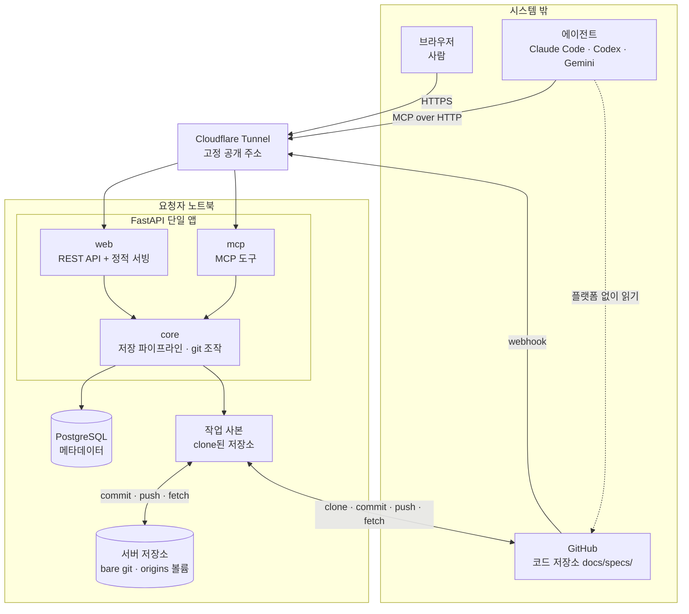
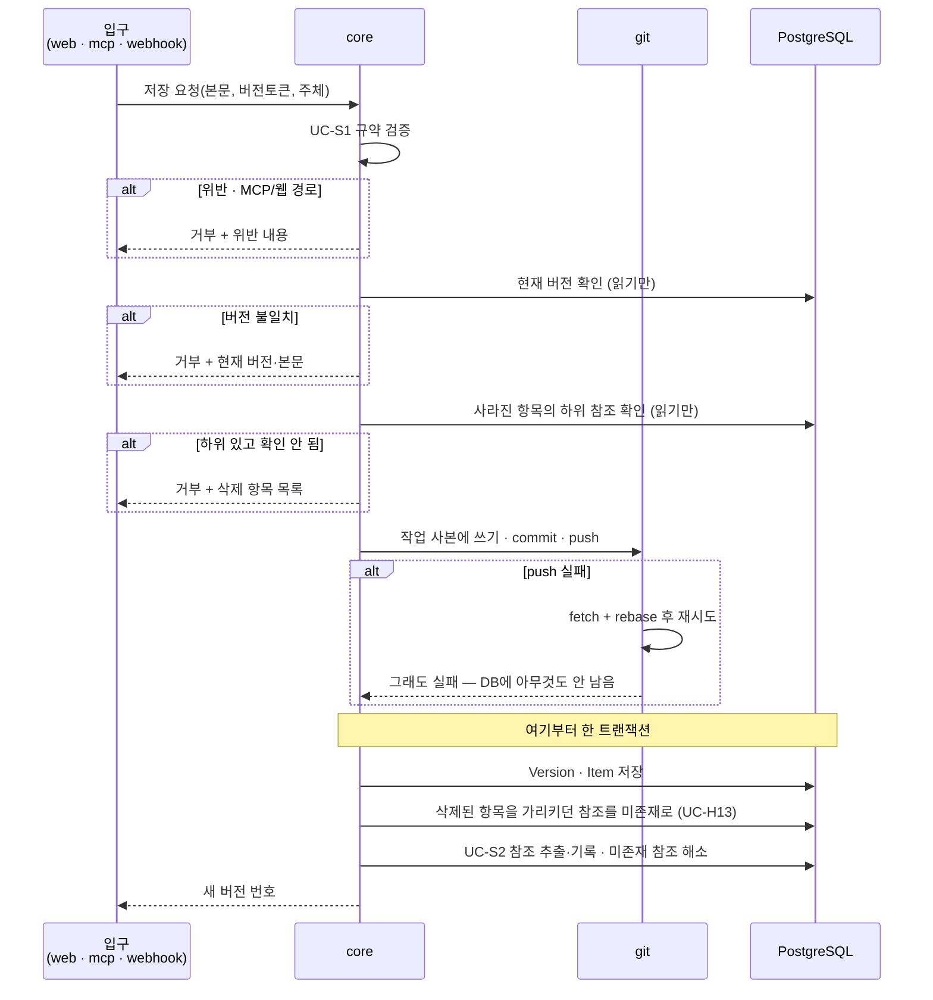

# 인프라 아키텍처: 싱크독 (SyncDoc)

---

## 0. 이 문서가 다루는 것

앞 단계(RFQ~USECASE)는 **무엇을** 만드는지를 정했다. 이 문서부터 **어떻게** 만드는지를 정한다.

여기서 정하는 것: 구성 요소와 경계, 기술 스택, 데이터가 어디 사는지, 요청이 어떻게 흐르는지, 인증, 배치.
여기서 정하지 않는 것: 도메인 모델과 클래스(다음 단계), API 시그니처, 테이블 컬럼.

---

## 1. 제약

앞 단계에서 확정되어 이 설계를 묶는 조건들이다.

**C7이 이 설계의 축이다.** 상시 가동을 전제한 구조를 쓸 수 없다. v1에는 C8(저장 파이프라인 중간에 사람 판단이 끼어든다)이 둘째 축이었으나 전파를 빼면서 사라졌다([[SYNC-DOM-001]] 3.3) — 저장은 이제 요청 하나로 끝난다.

#### C1 명세 원본은 각 프로젝트 코드 저장소의 `docs/specs/`에 산다

출처: [[SYNC-PRD-001#R5]] · [[SYNC-PRD-001#R14]] — 저장소는 프로젝트마다 GitHub 저장소 또는 서버 저장소(싱크독 서버 안의 git)

#### C2 저장소가 단일 진실 원천이다. DB는 색인이며 재구축 가능해야 한다

출처: [[SYNC-PRD-001#N3]]

#### C3 입구가 둘이다 — 사람은 웹, 에이전트는 MCP. 본문 쓰기는 MCP와 저장소 push뿐이고 웹은 읽기·상태·되돌리기·휴지통

출처: [[SYNC-PRD-001#R9]], USECASE 액터

#### C4 저장 경로(MCP·저장소 push, 그리고 웹의 되돌리기·상태 변경)가 **같은 파이프라인**을 거쳐야 한다

출처: UC-S1·S2

#### C5 플랫폼이 꺼져 있어도 팀원이 저장소에서 명세를 읽고 쓸 수 있어야 한다. 싱크독이 관여하지 않는 경로이므로 유스케이스가 아니라 제약이며, R1(frontmatter에 상태)·R5(MD를 git에)로 충족된다

출처: [[SYNC-PRD-001#N3]], [[SYNC-SCN-001#S7]]. GitHub 프로젝트의 제약이다 — 서버 저장소([[SYNC-PRD-001#R14]])는 싱크독 서버 안에 있어 플랫폼과 함께 돈다. 서버 저장의 대비책은 사람의 clone과 볼륨 백업(6장)이다

#### C6 한 사람이 자기 프로젝트를 쓴다. 사용자는 몇 명이어도 각자다

출처: [[SYNC-RFQ-001]] 7장. v1은 「실사용 2~3명, 같이 일하는 사람만」이었다 — 실제로는 한 사람이 프로젝트 하나를 혼자 다 썼다

#### C7 요청자 노트북에서 서버가 돈다. 상시 가동 서버가 없다

출처: RFQ

#### C9 바이브코딩으로 혼자 만든다

출처: RFQ

#### C10 폐쇄망판은 인터넷 없이 돈다 — 실행 중 바깥 요청이 없고, 반입은 이미지 묶음 하나다. 로그인이 없고 한 사람이 쓴다

출처: [[SYNC-PRD-001#R15]] · [[SYNC-PRD-001#N4]]. 코드는 하나이고 설정 `EDITION=closed`가 판을 가른다(8.1). 릴리즈 이름은 인터넷판이 **싱크독_깃허브**, 폐쇄망판이 **싱크독_로컬**이다(카드 BU)

---

## 2. 구성도


```mermaid
graph TB
    subgraph outside["시스템 밖"]
        BR["브라우저<br/>사람"]
        AG["에이전트<br/>Claude Code · Codex · Gemini"]
        GH["GitHub<br/>코드 저장소 docs/specs/"]
    end

    CF["Cloudflare Tunnel<br/>고정 공개 주소"]

    subgraph laptop["요청자 노트북"]
        subgraph app["FastAPI 단일 앱"]
            WEB["web<br/>REST API + 정적 서빙"]
            MCP["mcp<br/>MCP 도구"]
            CORE["core<br/>저장 파이프라인 · git 조작"]
            WEB --> CORE
            MCP --> CORE
        end
        PG[("PostgreSQL<br/>메타데이터")]
        FS["작업 사본<br/>clone된 저장소"]
        OR[("서버 저장소<br/>bare git · origins 볼륨")]
        CORE --> PG
        CORE --> FS
        FS <-->|commit · push · fetch| OR
    end

    BR -->|HTTPS| CF
    AG -->|MCP over HTTP| CF
    GH -->|webhook| CF
    CF --> WEB
    CF --> MCP
    FS <-->|clone · commit · push · fetch| GH
    AG -.->|플랫폼 없이 읽기| GH
```

**설명**

- **Cloudflare Tunnel** — 노트북이 공개 IP 없이 고정 주소를 갖게 한다. 브라우저·에이전트·GitHub webhook이 모두 이 주소로 들어온다. 노트북에서 밖으로 나가는 연결만 쓰므로 방화벽 설정이 필요 없다.
- **FastAPI 단일 앱** — 입구는 둘이지만 앱은 하나다. 이유는 4.1 참조.
- **작업 사본** — 등록된 저장소를 노트북에 clone해 둔 것. 저장 시 여기에 쓰고 커밋해 push한다.
- **서버 저장소** — GitHub 대신 서버 저장을 고른 프로젝트의 원격([[SYNC-PRD-001#R14]]). 노트북(서버) 안의 bare git이고, 작업 사본은 GitHub 저장소와 똑같이 이것을 clone해 쓴다. 그래서 파이프라인·재구축·코드 그래프가 저장 방식을 가리지 않는다.
- **점선** — 플랫폼을 거치지 않고 에이전트가 저장소를 직접 읽는 경로. C5의 보장.

---

## 3. 기술 스택

| 층 | 선택 | 이유 |
|---|---|---|
| 백엔드 | Python 3.12 / FastAPI | 요청자 주력 언어. MCP 파이썬 SDK 사용 가능 |
| 프론트엔드 | React + Vite + TS (SPA, `frontend/`). 유저용 탭 렌더링은 **`tools/view_build.py`를 TS로 옮긴 것**(`md.ts`·`views.ts`·타입별 모듈) — `react-markdown`은 쓰지 않는다(뷰 규약과 바이트 단위로 같아야 해서). `mermaid`(다이어그램) · UI-8 참조 그래프는 **라이브러리 없이 직접 SVG**(열이 11단계로 고정이라 배치가 결정적) · `d3-force`(UI-17 코드 그래프의 힘 배치만. 그리기는 `<canvas>`, 끌기·줌·이동은 직접. npm으로 번들에 담아 CDN 없음 — [[#C10]]) · diff는 직접 | 빌드 결과는 `syncdoc/web/static/`으로, FastAPI가 `/{path:path}` 폴백으로 서빙. 별도 호스팅 없음 |
| 메타데이터 DB | PostgreSQL | 아래 참고 |
| Git 조작 | GitPython 또는 `git` CLI 호출 | 작업 사본에서 clone·commit·push. 서버 저장소는 `git init --bare`로 만든다 — git이 이미지에 들어 있어 폐쇄망에도 따로 설치할 것이 없다 |
| 다이어그램 | mermaid.js (브라우저 렌더링). 서버 생성물 없음 | PRD R10 |
| 글꼴 | Pretendard·IBM Plex Mono를 **앱이 담는다**(npm 패키지를 빌드 때 `/fonts/{패키지}-{판}/`로 복사) | CDN을 부르지 않는다 — 폐쇄망판([[#C10]])이 바깥 없이 돌고, 인터넷판도 같은 파일을 쓴다. 판 번호가 경로에 있어 1년 immutable |
| 외부 노출 | Cloudflare Tunnel | C7을 우회하는 유일한 현실적 방법 |
| 인증 | GitHub OAuth (웹) / 개인 토큰 (MCP) | 5장 |
| 모델 호출 | 외부 모델 API. `infra/llm.py` 어댑터 하나 | 읽는 중 질의([[SYNC-PRD-001#R11]])에만. 5.3 |
| 첨부 | `python-multipart`(업로드 파싱) · `pypdf`(PDF 글자 추출). 바이트는 PostgreSQL `bytea` | 질문에 붙이는 파일(5.3). 새 저장 서비스를 두지 않는다 — 10MB×수십 개 규모라 DB로 충분하고, 커지면 바이트 자리만 객체 저장소로 옮긴다 |
| 코드 그래프 | graphify(`graphifyy` — tree-sitter 문법 26종, 모델 없음) + 싱크독의 보강(파이썬은 AST, TS/JS는 graphify가 이미 쓰는 tree-sitter-typescript — 카드 BL) + networkx Louvain(`louvain_communities`, resolution 1.0, seed 42, 모델 없음)과 graphify의 허브 라벨을 서버 프로세스 안에서 — 함수의 커뮤니티(UI-17). graphify `cluster`는 안 쓴다 — 응집도 재쪼개기가 커뮤니티를 100개 넘게 만든다(#253). 싱크독 저장소 1초쯤 | 명세↔코드 대조([[SYNC-PRD-001#R13]]). 결과는 DB `code_graphs`에 줄인 모양으로(6장). 이미지가 170MB쯤 커진다 |
| git 입구 | `git http-backend`(이미지 안 git을 CGI로) | 서버 저장소의 clone·push([[SYNC-PRD-001#R14]]). 따로 Git 서버를 두지 않고 앱 경로 하나로 받는다 |
| 실행 | Docker Compose (app + db) | 명령 하나로 켜고 끈다 |

> **PostgreSQL 선택에 따르는 부담** — 노트북에서 앱을 켤 때마다 DB 컨테이너가 함께 떠 있어야 한다. 혼자 쓰는 규모에서는 SQLite로도 충분하며 설치와 기동이 없다. 나중에 상시 가동 서버로 옮길 계획이 있다면 지금 PostgreSQL로 시작하는 편이 이전 비용을 줄인다. 그 계획이 없다면 SQLite가 가볍다. 이 문서는 PostgreSQL 기준으로 작성한다.

---

## 4. 내부 구조

### 4.1 입구는 둘, 알맹이는 하나

```
FastAPI 단일 앱
├── web    ← REST API + React 빌드 결과 서빙
├── mcp    ← MCP 도구 정의
└── core   ← 알맹이. 입구와 무관하게 동일하게 동작
```

`core`의 내부 구조는 이 문서에서 정하지 않는다. 도메인 개념이 나온 뒤에 그 경계를 따라 나누는 것이 맞으므로, 도메인 모델과 클래스 명세 단계로 넘긴다.

**왜 프로세스를 나누지 않는가.** C4가 이유다. 저장 파이프라인이 세 경로에서 똑같이 돌아야 하는데, 프로세스를 나누면 파이프라인 코드를 두 벌 갖거나 한쪽이 다른 쪽을 내부 API로 호출하게 된다. 두 벌이면 언젠가 어긋나고, 내부 호출이면 프로세스 하나와 그 사이 통신을 더 관리해야 한다. 혼자 쓰는 앱에서 치를 비용이 아니다.

경로로 구분한다.

| 경로 | 용도 |
|---|---|
| `/api/*` | 웹 REST API |
| `/mcp` | MCP 엔드포인트 |
| `/auth/*` | GitHub OAuth 콜백 |
| `/hooks/github` | GitHub webhook 수신 |
| `/git/{코드}.git/*` | 서버 저장소의 git 입구 — clone·push(개인 토큰). `info/refs`·`git-upload-pack`·`git-receive-pack` 셋만 |
| `/fonts/*` | 앱이 담은 글꼴(판 번호가 든 경로). 화면 틀과 폐쇄망판의 배치 iframe이 쓴다 |
| `/specs/*` | 이미지 안의 규약·템플릿 사본(`STD/`·`_templates/`)을 글자로. 폐쇄망판 README의 규약 링크가 가리킨다 |
| `/` 및 정적 | React 빌드 결과 |

**API 앞머리는 화면 틀로 떨어지지 않는다(#158).** `/api`·`/auth`·`/hooks`·`/mcp`·`/git` 아래 없는 경로는 메서드와 무관하게 404 problem+json(`not-found`, [[SYNC-API-001]] 2장)이다. 화면 틀 대체 라우트가 이 앞머리를 받지 않는다 — 전에는 `GET /api/없는경로`에 화면 틀(HTML, 200)이 나가 오타 난 호출이 성공처럼 보였고, `POST`는 대체 라우트 때문에 405가 났다.

**정적 파일은 서버가 캐시 규칙을 말한다**(#124). 말하지 않으면 Cloudflare 기본값(4시간)과 브라우저 추측이 채워, 배포 뒤에도 옛 화면이 뜬다.

| 무엇 | `Cache-Control` | 왜 |
|---|---|---|
| 화면 틀 `index.html`(`/`·화면 주소 전부) | `no-cache` | 매번 새 판인지 묻는다. 바뀌지 않았으면 304라 가볍다 — 배포하면 다음 요청에 새 번들을 가리킨다 |
| 번들 `/assets/*`(이름에 해시) | `public, max-age=31536000, immutable` | 내용이 바뀌면 이름이 바뀌므로 낡을 수 없다 |
| `/assets/`에 **없는** 파일 | `404` + `no-store` | 화면 틀로 떨어뜨리지 않는다 — 떨어뜨리면 옛 탭이 HTML을 스크립트로 읽다 깨지고, 그 HTML이 에지에 4시간 남았다 |
| 그 밖의 파일(사용 방법 그림) | `no-cache` | 이름이 안 바뀌어 매번 새 판인지 묻는다. 1시간으로 두었더니 그림을 바꿔도 이미 본 사람은 옛 그림을 봤다 — 에지가 4시간으로 덮어 최대 4시간(#151) |

**「매번 묻는다」는 서버가 304로 답해야 가볍다(#151).** 요청의 `If-None-Match`가 파일의 ETag와 같거나, ETag 없이 온 `If-Modified-Since`가 수정 시각보다 늦으면 본문 없이 `304`다. Cloudflare를 거친 화면 틀에는 ETag가 떨어져 브라우저가 수정 시각으로만 묻는다. 전에는 서버가 304를 한 번도 돌려주지 않았다 — 그림은 에지가 자기 사본으로 304를 줬지만 에지가 서버에 다시 물을 때마다 본문이 터널로 다시 왔고, 화면 틀은 늘 200이었다.

**배포 전에 열어 둔 탭**은 옛 코드가 돈다. 그 탭이 나중에 불러오는 조각(그림 등)을 못 찾으면 **한 번 새로고침**해 새 판이 된다(`vite:preloadError`). 30초 안에 또 나면 새로고침하지 않는다 — 서버가 정말 고장 났을 때 무한 새로고침을 막는다.

나중에 부하가 문제가 되면 `core`를 그대로 둔 채 `web`과 `mcp`를 각각 다른 프로세스로 띄우면 된다. 지금 나눌 필요는 없다.

### 4.2 저장 파이프라인

C4의 실체. 세 경로가 모두 이 함수 하나로 들어온다.


```mermaid
sequenceDiagram
    participant E as 입구<br/>(web · mcp · webhook)
    participant P as core
    participant R as git
    participant D as PostgreSQL

    E->>P: 저장 요청(본문, 버전토큰, 주체)
    P->>P: UC-S1 규약 검증
    alt 위반 · MCP/웹 경로
        P-->>E: 거부 + 위반 내용
    end
    P->>D: 현재 버전 확인 (읽기만)
    alt 버전 불일치
        P-->>E: 거부 + 현재 버전·본문
    end
    P->>D: 사라진 항목의 하위 참조 확인 (읽기만)
    alt 하위 있고 확인 안 됨
        P-->>E: 거부 + 삭제 항목 목록
    end
    P->>R: 작업 사본에 쓰기 · commit · push
    alt push 실패
        R->>R: fetch + rebase 후 재시도
        R-->>P: 그래도 실패 — DB에 아무것도 안 남음
    end
    Note over P,D: 여기부터 한 트랜잭션
    P->>D: Version · Item 저장
    P->>D: 삭제된 항목을 가리키던 참조를 미존재로 (UC-H13)
    P->>D: UC-S2 참조 추출·기록 · 미존재 참조 해소
    P-->>E: 새 버전 번호
```

**저장은 요청 하나로 끝난다.** 검증·버전 검사·삭제 검사는 DB를 읽기만 하고, **push가 성공한 뒤** Version·참조를 한 트랜잭션으로 쓴다. push 실패면 롤백할 게 없다. 새 버전 번호는 즉시 돌려준다. v1에는 여기에 변경 영향 감지와 사람의 전파 판단이 끼어 있어 저장이 두 요청에 걸쳤다 — 전파를 빼면서 그 갈래가 사라졌다.

### 4.3 작업 사본

저장소마다 노트북에 clone본을 하나 둔다. 모든 git 조작은 여기서 일어난다.

- 프로젝트 등록(UC-A1) 시 clone. 서버 저장이면 서버 저장소(`ORIGINS_DIR/{코드}.git`)를 먼저 만들고 그것을 clone한다
- 저장 시 쓰기 → commit → push
- push 거부 시 fetch + rebase 후 재시도 (UC-S7 확장 `2a`)
- 커밋 메시지는 규격을 따른다. 본문 변경 `spec(문서ID): 요약`, 상태 변경만 `status(문서ID): 이전 → 새상태`. 상태만 바꿔도 커밋이 생기며 접두어로 걸러 볼 수 있다. 둘째 줄부터 이유 — 변경 이력 절을 원본에 두지 않기 때문(STD-001 1.7)
- 파일 경로는 [[SYNC-STD-001]] 1.1 — `docs/specs/{TYPE}/{doc_id}.md`, `_templates/`, `assets/`, `STD/`
- **저장은 저장소 단위 락** 안에서 한다. 두 에이전트가 같은 저장소에 동시에 push하면 한쪽 rebase가 충돌하기 때문(클래스 4.7)
- webhook 또는 폴링으로 외부 변경 감지 시 fetch → 변경 파일 추출 → 파이프라인 재실행
- **코드 그래프는 작업 사본에서 만들지 않는다**([[SYNC-UC-001#UC-S8]]). 그 커밋을 `git archive`로 임시 폴더에 풀어 거기서 graphify를 돌린다 — 작업 사본에 `graphify-out/`이 생겨 커밋·리셋을 방해하지 않고, `.gitignore`된 빌드 산출물이 섞이지 않는다. graphify는 **환경변수를 비운 채** 돈다 — 코드 추출에는 모델이 필요 없고, 모델 키가 새지 않게

**주의**: 커밋 작성자는 요청한 사람의 GitHub 계정으로 남긴다. MCP 경로에서도 지시한 사람 계정을 쓴다. UC-A6의 "작성 주체 기록"이 실제 커밋 이력과 일치해야 한다.

---

## 5. 인증과 접근

C6이 요구하는 것은 권한 구분이 아니다. 여기서는 **누가 들어오는가**와 **무엇이 보이는가**를 나눈다. 들어오는 것은 **허용한 GitHub 계정**이고(`ALLOWED_LOGINS` — 비면 GitHub 계정이면 누구나, 카드 BP), 보이는 것은 자기가 등록한 프로젝트뿐이다([[SYNC-PRD-001#R12]]). PRD 비목표에 역할·권한 관리를 두지 않기로 했으므로, 자기 프로젝트 안에서는 모두 같은 일을 할 수 있다 — 역할은 없고 소유만 있다.

| 액터 | 방식 | 확인하는 것 |
|---|---|---|
| 사람 (웹) | GitHub OAuth | 허용 목록(`ALLOWED_LOGINS`) 안의 GitHub 계정만 들어온다 — 목록 밖이면 계정을 만들지 않고 거절하고, 이미 있는 세션도 401로 비운다(카드 BP). 자기가 등록한 프로젝트만 본다 |
| 사람 (웹, 폐쇄망판) | **로그인 없음** — 켜질 때 둔 로컬 사용자 하나([[#C10]]) | 요청 Host가 허용 목록(`127.0.0.1`·`localhost`·`[::1]`·`PUBLIC_BASE_URL`의 host)인가 — 이름을 바꿔 들어오는 DNS rebinding을 막는다. 쓰기 요청(POST·PUT·PATCH·DELETE)의 Origin이 있으면 같은 곳인가 — 다른 사이트가 보내는 요청을 막는다. 둘 다 `forbidden-origin` 403. MCP·git은 토큰이라 Origin을 보지 않는다 |
| 에이전트 (MCP) | 개인 액세스 토큰 | 사람이 웹에서 발급한 토큰인가, 발급한 사람이 허용 목록 안인가(카드 BP). 토큰은 발급한 사람에 묶이고, 발급자가 소유한 프로젝트만 연다 |
| GitHub (webhook) | 서명 검증 | webhook secret으로 요청이 GitHub에서 왔는지 |
| 사람의 git (서버 저장소) | HTTP Basic — **비밀번호 칸에 개인 토큰**(MCP와 같은 토큰) | 토큰의 주인이 허용 목록 안이고(카드 BP) 그 프로젝트의 소유자인가, 서버 저장 프로젝트인가. 아이디 칸은 보지 않는다 — 토큰이 사람을 정한다. 틀리면 401과 `WWW-Authenticate`로 git이 다시 묻게, 남의 것·GitHub 저장은 404 |

**허용 목록은 폐쇄망판에 없다** — 로그인이 없고 로컬 사용자 하나라 검사하지 않는다. **포트는 이 PC에만 연다**(카드 BP) — 앱 8000과 DB 5432를 `127.0.0.1`에 묶는다. 바깥에서 들어오는 길은 공개 주소(Tunnel — 앱 컨테이너 안쪽으로 붙는다) 하나다. 노트북의 다른 망 기기에서 DB·앱 포트로 바로 닿지 못한다.

**GitHub OAuth를 고른 이유**는 여러 문제를 하나로 묶기 때문이다.

- 접근 통제 — 로그인은 GitHub 계정. **무엇이 보이는가는 등록자(소유자)인가로 가른다**([[SYNC-PRD-001#R12]]). 별도 사용자 관리가 없다. v1 문구 「저장소 권한이 곧 접근 권한」은 코드가 검사한 적이 없었다(#75·#91) — 소유가 그 자리를 맡는다
- 사용자 식별 — PRD 미결사항이던 "계정 로그인 vs 이름 입력"이 해결된다
- 커밋 작성자 — 각자의 계정으로 커밋이 남는다. 한 계정으로 몰지 않는다
- 저장소 접근 — 각자의 토큰으로 push한다

**공개 경로 — Named Tunnel (고정 주소)**: Cloudflare에 올린 도메인 아래 호스트 하나(`PUBLIC_BASE_URL`)를 Zero Trust → Tunnels에서 만든 터널에 잇고, 노트북에서 `cloudflared tunnel run`으로 붙인다. **재부팅해도 주소가 같다** — OAuth 콜백·MCP 등록·에이전트 설정을 한 번만 한다. `.env`에 `TUNNEL_TOKEN`(터널 토큰 — 대시보드가 준다. 비밀이므로 채팅·커밋에 안 적는다)과 `PUBLIC_BASE_URL`(고정 호스트)을 둔다. `scripts/tunnel.sh`가 `TUNNEL_TOKEN`이 있으면 이 모드로 뜬다. **터널은 compose 서비스 `tunnel`이다**(#284) — 스크립트가 git에 안 올리는 `docker-compose.override.yml`을 만들어 공식 `cloudflare/cloudflared` 이미지를 app과 **네트워크를 같이 쓰게**(`network_mode: service:app`) 띄운다. 대시보드의 대상 `http://localhost:8000`이 곧 app이라 대시보드를 안 고친다. 토큰은 그 파일에 적지 않고 compose가 `.env`에서 `${TUNNEL_TOKEN}`을 채운다. app·db·tunnel 모두 `restart: unless-stopped`라 Docker가 뜨면 같이 뜬다 — 전에는 호스트 `nohup cloudflared`라 재부팅을 못 넘겨 공개 주소가 530이었다(2026-10-02)

**대안 — Quick Tunnel (도메인 없음)**: `TUNNEL_TOKEN`이 비어 있으면 `cloudflared tunnel --url http://localhost:8000`으로 `https://xxx.trycloudflare.com` 임시 주소를 받는다. 공짜지만 **켤 때마다 주소가 바뀐다** — 스크립트가 `PUBLIC_BASE_URL`을 새 주소로 덮어쓰고, 사람이 OAuth 콜백·MCP 등록을 다시 한다.

- **webhook**: Named Tunnel이면 걸 수 있다(Payload URL `{PUBLIC_BASE_URL}/hooks/github`, Secret = `WEBHOOK_SECRET`) — **선택이다.** 폴링은 어느 모드든 그대로 돈다 — `POLL_INTERVAL_SECONDS`(기본 300). GitHub 직접 push(UC-G1·S7)는 5분 안에 반영되고, 기동 시 따라잡기가 있어 꺼져 있던 동안의 커밋도 들어온다. Quick Tunnel이면 Payload URL이 매번 바뀌어 못 건다
- **OAuth 앱**: 앱 하나에 로컬용(`http://localhost:8000/auth/github/callback`)과 공개용 콜백을 **둘 다 등록해 두면** 양쪽에서 로그인된다 — 앱이 `redirect_uri`를 보내기 때문이다(SEQ-8). Named Tunnel이면 한 번, Quick Tunnel이면 켤 때마다 공개용 콜백을 고친다(3분)
- **`PUBLIC_BASE_URL`의 쓰임**: 앱이 `redirect_uri`를 만들 때 쓴다. 요청 Host가 이 값의 host와 같으면 이 값을, 아니면 요청에서 만든다(`auth.callback_url`). 터널 뒤에서는 프록시가 https를 http로 보이게 하므로 요청만으로는 스킴을 못 믿는다. 비어 있으면 요청에서만 만든다
- **502·504는 앞단이 덮는다**: Cloudflare는 원본이 보낸 502·504를 자기 오류 페이지로 바꾼다 — Named·Quick 둘 다, 무료 플랜에는 끄는 설정이 없다. 그러면 problem+json의 `reason`이 사람에게 닿지 않으므로 앱은 두 코드를 쓰지 않고, 앱 밖(GitHub·모델) 실패는 424로 보낸다([[SYNC-API-001]] 2장, #76). 500·503은 원본 본문이 통과한다
- Quick → Named로 바꾸는 날: `.env`에 `TUNNEL_TOKEN`·`PUBLIC_BASE_URL` 넣고 `scripts/tunnel.sh` → OAuth 콜백을 고정 주소로 한 번 고침 → 팀원·에이전트의 MCP 등록을 고정 주소로. 그 뒤로는 재부팅해도 할 일이 없다(8장 「재부팅 뒤」)

**서버 저장소에는 토큰이 없다.** 원격이 서버 안의 경로라 GitHub 토큰을 쓰지 않는다 — `git.commit_push`는 원격이 `https://`일 때만 토큰을 구한다. 그래서 서버 저장 프로젝트는 GitHub 토큰 없이 등록·저장·되돌리기가 된다([[SYNC-PRD-001#R14]]).

**새 저장소의 공개 여부는 만들 때 고른다 — 고르지 않으면 비공개다**(카드 BS, 2026-10-06): 프로젝트를 만들 때(UI-3 2.8 · `init_project`의 `private`) 고르고, 고르지 않으면 `GITHUB_REPO_PRIVATE`(기본 참)대로 비공개로 생긴다. #310(2026-10-04)은 서버 설정 하나였다. 공개로 올라가는 것은 막지 않는다 — 보안 이슈가 있는 일은 싱크독_로컬([[SYNC-PRD-001#R15]])이 맡는다. 이미 있는 저장소의 공개 여부는 바꾸지 않는다(공개면 경고 로그만). 그래서 OAuth 범위는 `repo admin:repo_hook`이다 — 비공개 저장소를 만들고 읽으려면 `repo`가 필요하다(전에는 `public_repo`, v1은 공개 전용이었다). 범위를 넓히기 전에 받은 토큰은 다음 로그인까지 옛 범위다. **비공개 저장소의 fetch는 등록한 사람의 토큰으로**(`repositories.registered_by_user_id`) — 폴링·재구축도 사람 없이 돈다. 토큰을 못 구하면 토큰 없이 시도한다(공개 저장소는 그래도 된다). `clone`·`push`는 각자의 토큰을 쓰므로 공개여도 쓰기에는 권한이 필요하다. **소유와 저장소 권한은 다른 축이다** — 싱크독은 소유로 보이는 것을 가르고, GitHub는 push에서 저장소 권한을 가른다.

**컨테이너 빌드**: Dockerfile은 두 단계다 — `node`로 `frontend/`를 빌드해 `syncdoc/web/static`에 넣고, `python`으로 앱을 담는다. 프런트 빌드 단계가 없으면 새 클론에서 화면이 빈 채로 뜬다.

**MCP 배치**: `mcp` 2.x `MCPServer`, streamable HTTP. FastAPI 안에 `/mcp` **정확 경로 Route**로(Mount면 뒤 라우트를 삼킨다). 세션 매니저는 인스턴스당 한 번만 돌므로 lifespan마다 앱을 새로 만든다. DNS rebinding 보호는 터널 뒤 고정 도메인이라 끈다.

**웹 세션**: 테이블 없이 서명 쿠키 `syncdoc_session`(`itsdangerous`)에 `github_login`만 담고, 요청마다 `AccountService.user_by_login`으로 User를 얻는다. 노트북 재시작에도 로그인이 유지된다. 만료는 14일(Starlette 기본값).

**쿠키 검사는 시계가 뒤로 가도 견뎌야 한다.** `itsdangerous`는 서명 시각이 지금보다 **미래면** 만료로 보고 거절한다. 그 예외를 Starlette이 **조용히 빈 세션**으로 바꾸므로 방금 로그인한 사람이 401을 받는다 — 실측으로 부하 중 60초에 두 번씩 그런 순간이 왔다(#17). 그래서 **위쪽 만료(`age > 14일`)만 보고 아래쪽(`age < 0`)은 안 본다.** 미래 시각 쿠키는 세션 서명 키가 있어야 만들 수 있으니 받아들여도 잃는 게 없다([[SYNC-STD-004#DEV-18]]).

**MCP 인증이 다른 이유**: 에이전트에는 브라우저가 없어 OAuth 동의 화면을 띄울 수 없다. 사람이 웹에 로그인한 뒤 토큰을 발급받아 자기 에이전트 설정에 넣는다. 토큰으로 들어온 요청은 발급자 계정으로 기록된다.

**커밋 작성자를 계정으로 잇기**: OAuth로 들어온 사람은 계정이 확실하지만, **GitHub에서 바로 push한 커밋은 다르다.** git 커밋이 남기는 신원은 이름(`%an`)과 이메일(`%ae`)뿐이고, 이름은 아무 문자열이라 계정과 못 잇는다. 이어지는 길은 둘이다.

- **앞으로의 커밋** — GitHub Settings → Emails에서 **`Keep my email addresses private`를 켠다.** 커밋 이메일이 `{숫자}+{로그인ID}@users.noreply.github.com`으로 나가고 앱이 거기서 로그인 ID를 바로 뽑는다(MS-009 `git.changed_files`). `Block command line pushes that expose my email`도 함께 켜면 실수로 실제 메일이 새는 것을 git이 막는다. **로컬 `git config user.email`을 그 noreply 주소로 바꿔야** 효력이 있다
- **이미 실제 메일로 나간 커밋** — 그 메일을 UI-13 내 계정 카드(2.5·2.6)에 등록하고 **인덱스 재구축을 한 번 돌린다.** 재구축이 git을 다시 읽으면서 작성자를 이메일로 찾아 붙인다

둘 중 하나도 안 하면 같은 사람이 계정 둘로 갈리고, 로그인한 쪽 계정에는 아무것도 안 달려 **이력의 작성자가 남으로 뜬다**(#34). 이건 사람이 한 번 해 두는 설정이라 앱이 대신 못 한다.

**GitHub 토큰 보관**: 각자의 계정으로 커밋·push하려면 서버가 각 사용자의 GitHub OAuth 토큰을 갖고 있어야 한다. 요청자 노트북이지만 역할은 서버이므로, **토큰은 앱 비밀키로 암호화해 DB에 보관한다.** 비밀키는 DB 밖(환경 변수 또는 별도 파일)에 두어 DB만 유출되어도 토큰이 풀리지 않게 한다. 토큰은 `repo`와 `admin:repo_hook` 두 범위를 요청한다(5장 위 — #310부터. v1은 공개 저장소만 다뤄 `public_repo`였다). `repo`는 그 사람의 비공개 저장소 전체 권한이다 — 비공개 저장소를 만들고 읽으려면 필요해 받아들였다. `admin:repo_hook`은 앱이 push 통지를 걸고(7장, 카드 AF) 서버 저장으로 옮길 때 지우는(카드 BQ) 데만 쓴다 — **훅 말고는 쓰지 않는다**. 범위를 바꾸기 전에 받은 토큰은 **다음 로그인까지 옛 범위로 남는다**. OAuth 앱에서 **"Expire user access tokens"를 끈다** — 토큰 갱신 경로가 없어(MS-006 미결) 만료되면 push가 죽는다. git 작업 사본의 `.git/config`에는 토큰을 남기지 않는다 — push할 때만 URL에 붙인다(MS-009 `git.clone`·`commit_push`).

### 5.1 비밀키 교체

토큰 암호화 키를 바꿔야 할 때가 온다 — 유출이 의심되거나 정기 교체 정책이 생기면.

**세션 서명 키와 토큰 암호화 키를 나눈다.** 같은 키를 쓰면 토큰 키를 바꾸는 순간 모든 세션
쿠키가 무효가 되어 전원이 다시 로그인한다. `SESSION_SECRET`과 `SECRET_KEY`를 따로 둔다.

**옛 키를 함께 받는다.** `SECRET_KEY_OLD`가 있으면 복호화는 두 키로 시도하고 암호화는 늘 새
키로 한다. 재암호화가 끝나면 옛 키를 지운다.

절차는 셋이다.
1. 새 키를 만들어 `SECRET_KEY`에, 지금 키를 `SECRET_KEY_OLD`에 넣고 다시 띄운다
2. 재암호화를 돌린다 — 모든 사용자의 저장된 토큰을 옛 키로 풀어 새 키로 다시 담근다
3. `SECRET_KEY_OLD`를 지운다

**옛 키 없이 바꾸면 저장된 GitHub 토큰이 전부 못 풀린다.** 그때 복호화 실패는 사람이 읽을 수
있는 오류여야 한다([[SYNC-MS-006#AccountService.github_token_for]]) — 안 그러면 원인 모를 500이
나가고, 유일한 복구가 "전원 재로그인"이 된다.

### 5.2 설정값

**이 표가 `config.py`의 전부다.** 하나가 늘면 여기와 `.env.example`을 같이 고친다. 대조하는 검사기가 없으므로 사람이 지킨다.

| 이름 | 기본 | 무엇 |
|---|---|---|
| `DATABASE_URL` | 로컬 기본값 | 메타데이터 DB 주소 |
| `SECRET_KEY` | — | GitHub 토큰 암호화 키. 필수 |
| `SECRET_KEY_OLD` | 없음 | 교체 중일 때만. 복호화에만 쓴다 (5.1) |
| `SESSION_SECRET` | 없으면 `SECRET_KEY` | 세션 쿠키 서명. 토큰 키와 나눈다 (5.1) |
| `GITHUB_CLIENT_ID` | — | OAuth 앱 |
| `GITHUB_CLIENT_SECRET` | — | OAuth 앱 |
| `ALLOWED_LOGINS` | 없음 | 로그인할 수 있는 GitHub 계정, 쉼표로(대소문자 무시). **비면 GitHub 계정이면 누구나**(예전 동작). 목록 밖 계정은 새 로그인·세션·개인 토큰(MCP·git) 모두 막힌다(5장, 카드 BP). 폐쇄망판은 보지 않는다 |
| `GITHUB_REPO_PRIVATE` | `true` | 프로젝트를 만들 때 공개 여부를 고르지 않으면 쓰는 기본값 — 참이면 비공개(5장, 카드 BS). 화면은 이 값으로 공개 여부(UI-3 2.8)의 처음 선택을 정한다. 이미 있는 저장소의 공개 여부는 바꾸지 않는다 |
| `WEBHOOK_SECRET` | 없음 | push webhook 서명 검증 (7장). **비면 통지를 걸지도 받지도 않는다** |
| `PUBLIC_BASE_URL` | 없음 | 공개 주소. 비면 로컬만 (8장). OAuth 콜백과 **webhook 주소**(7장) 둘에 쓴다 |
| `POLL_INTERVAL_SECONDS` | 300 | 폴링 주기. 0 이하면 폴링을 켜지 않는다 |
| `DIFF_CONTEXT_LINES` | 3 | diff에서 앞뒤로 함께 보여줄 줄 수 |
| `PUSH_RETRIES` | 3 | push 거부 시 rebase 후 재시도 횟수 |
| `REPOS_DIR` | `/var/syncdoc/repos` | 작업 사본이 사는 곳 |
| `ORIGINS_DIR` | `/var/syncdoc/origins` | 서버 저장소가 사는 곳(`{코드}.git`)과 보관 폴더(`_archive/`). **원본이므로 볼륨으로 남기고 백업한다**(6장) |
| `STORAGE_MODES` | `github,server` | 이 서버에서 켠 저장 방식. 쉼표로 둘 중 하나 이상. 켜지 않은 방식으로는 프로젝트를 만들 수 없다([[SYNC-PRD-001#R14]]) |
| `SPECS_URL` | `https://github.com/HoyoungParkme/syncdoc/blob/main/docs/specs` | 새 저장소 README가 규약·템플릿을 가리키는 주소. 싱크독 저장소를 옮기면 바꾼다 (카드 AB). **폐쇄망판에서 기본값 그대로면** `{PUBLIC_BASE_URL}/specs` — 이미지 안 사본(8.1) |
| `LLM_API_KEY` | **빈 값** | 모델 키. 비면 읽는 중 질의가 꺼진다 (5.3) |
| `LLM_API_URL` | 싱크독_깃허브 `https://api.openai.com/v1/chat/completions` · 싱크독_로컬 **없음** | OpenAI 호환 Chat Completions 주소. 호환 서버면 바꾼다. 싱크독_로컬은 기본 주소가 없다 — 사내 주소를 넣어야 질문 탭이 생긴다 (5.3, [[SYNC-PRD-001#R15]]) |
| `LLM_MODEL` | `gpt-4o` | 쓸 모델 이름 (5.3). mini는 항목 본문에 있는 것도 「모른다」고 내 첫날 바꿨다 |
| `LLM_MAX_TURNS` | 10 | 한 대화에서 서버가 받는 최대 턴 수 (5.3) |
| `EDITION` | `internet` | 판 — `internet`(싱크독_깃허브) 또는 `closed`(싱크독_로컬, 8.1). closed면 로그인이 없고(로컬 사용자), 저장 방식은 서버만, GitHub 로그인·통지 경로가 없다. 화면 이름과 MCP 서버 이름(`syncdoc_github`·`syncdoc_local`)이 이 값을 따른다 |
| `LOCAL_LOGIN` | `local` | 폐쇄망판 로컬 사용자의 아이디 — 커밋 작성자(`{아이디}@syncdoc.local`)에 쓰인다 |
| `LOCAL_NAME` | `LOCAL_LOGIN`과 같게 | 폐쇄망판 로컬 사용자의 표시 이름 — 이력·설정에 보인다 |

`TUNNEL_TOKEN`은 앱이 읽지 않는다. compose가 터널 서비스에 넘기는 값이고 `scripts/tunnel.sh`가 있는지만 본다 — `.env`에만 있다 (5장·8장, #284).

### 5.3 모델 호출

읽는 중 질의([[SYNC-PRD-001#R11]])만 외부 모델 API를 부른다. 다른 경로는 부르지 않는다. 모델이 읽기 도구로 같은 프로젝트를 스스로 읽는 ReAct 루프다(사용자 결정 2026-09-22 — 맥락을 미리 싣는 대신 관계도를 따라 읽게 한다).

| 항목 | 결정 |
|---|---|
| 어디에 | **OpenAI 호환 Chat Completions**(`LLM_API_URL`). 회사를 고정하지 않는다 — 같은 모양의 API를 내는 서버(OpenAI·로컬 모델 등)면 주소만 바꾼다. 요청은 `POST {LLM_API_URL}`, `Authorization: Bearer`, 본문 `{model, messages, tools, tool_choice}`(function calling), 답은 `choices[0].message`의 `content` 또는 `tool_calls`. 호환 서버가 `tool_choice: none`을 못 받으면 마무리 호출을 `tools` 없이 보낸다 |
| 키 | **서버에 하나**(`LLM_API_KEY`). 사람마다 넣지 않는다 — 혼자 쓰는 도구고([[#C6]]), 사람마다 키를 두면 `users`에 컬럼이 늘고 5.1 재암호화가 하나 더 생긴다 |
| 켜고 끄기 | 키나 주소가 비면 **기능이 꺼진다.** 화면에서 탭이 사라지고 나머지는 그대로 돈다. **키의 기본이 빈 값이므로 켜는 쪽이 선택이다.** 싱크독_로컬은 주소에도 기본값이 없다 — 넣지 않은 채 키만 넣어 바깥(OpenAI)으로 나가는 일이 없다([[SYNC-PRD-001#R15]]·[[SYNC-PRD-001#N4]]). 키를 받지 않는 사내 모델 서버면 키 칸에 아무 글자나 넣는다 |
| 도구 | 읽기 여덟 — 항목 본문 · 참조(상위·하위 1홉, 문서 참조는 제목·상태, 끊어진 건 「아직 없음」) · 사슬(전이) · 문서 목록 · 문서 전문 · **첨부 글자**(이 대화에 붙인 글자·PDF 파일의 추출 텍스트) · **코드 대조**(코드 그래프) · **코드 본문**(그래프 커밋의 커밋된 파일, 비밀 꼴 제외, 300줄 — 카드 AZ). **전부 읽기**이고 소유 검사를 지나며 **같은 프로젝트 안**만이다. 쓰는 도구는 어떤 경우에도 없다 |
| 첨부 | 사람이 질문에 붙인 파일. 이미지(png·jpg·webp·gif ≤10MB)는 **그 질문의 사용자 메시지에 그대로**(data URL, vision) 실리고 뒤 턴에는 다시 안 실린다. 글자 파일(md·txt·csv·json·yaml)·PDF(≤1MB)는 업로드 때 글자를 뽑아 두고 모델이 도구로 필요할 때 읽는다 — 맥락에 미리 싣지 않는 원칙 그대로. 한 질문에 8개. 종류·상한 밖은 업로드에서 거절(413·415) |
| 나가는 것 | 시작 맥락(문서 제목·상태·버전 + 그 문서의 항목 ID·이름 + 이 대화의 첨부 이름·종류·크기. 본문 없음) + 이 질문의 이미지 + 모델이 도구로 읽는 같은 프로젝트의 문서·항목·참조·첨부 글자·**코드 본문**(같은 프로젝트 저장소의 커밋된 파일만, `.env`·키·인증서 같은 비밀 꼴은 거부). 프로젝트 밖은 안 나간다 |
| 들어오는 것 | 답 문자열 하나. 질문·답·진행 줄·읽은 것을 **대화에 저장한다**(6장). 앞 턴은 저장된 대화에서 `LLM_MAX_TURNS`턴까지 실린다 |
| 상한 | **도구 8번 · 전체 120초**(호출 사이에서 검사하고 호출 하나는 60초라 최악 180초) · 대화 길이는 `LLM_MAX_TURNS`턴. **맥락 글자 상한은 없다** — 넘으면 외부가 거절하고 `llm-unavailable`로 접힌다. 상한에 닿으면 「읽은 것으로 답하라」는 마무리 호출을 한 번 더 한다 |
| 진행 | 응답은 SSE. 모델이 읽기 전에 쓰는 한 줄과 읽은 대상이 이벤트로 차례로 나간다. **첫 이벤트 전의 오류는 HTTP 상태 코드, 뒤의 오류는 `error` 이벤트** |
| 로그 | 질문마다 호출 수·입출력 토큰·걸린 시간을 **서버 로그 한 줄**. 본문은 로그에 안 적는다 — 본문이 사는 곳은 대화 표뿐이다 |
| 세션 | 스트림을 열 때 한 번 인증한다. 도중 재검사는 없다 — 최대 3분이다 |
| 실패 | 외부가 실패하면 `llm-unavailable`. **사용량 초과도 여기 접힌다** — GitHub 실패를 `push-failed`로 접는 것과 같은 모양이라 우리 에러 표에 429가 생기지 않는다 |

**사용량 한도를 두지 않는다.** 디스크 한도를 「한도보다 회수 경로가 먼저다」로 닫은 것과 같은 판단이다(9장). 상한은 질문 하나 안의 호출 수와 시간뿐이고, 여기서 회수 경로는 **키를 비우는 것**이다. 얼마나 나가는지는 로그의 usage로 본다. 비용은 서버를 켜 둔 사람이 내고, 서버가 꺼져 있으면 아무것도 나가지 않는다([[#C7]]).

**C5가 이것까지 덮지는 않는다.** 플랫폼이 꺼졌을 때의 대비책은 저장소를 직접 읽는 것인데, 모델의 답은 저장소에 없다. 질문 탭은 서버가 꺼지면 대체 경로 없이 멈춘다. 읽기 자체는 영향받지 않으므로 [[#C5]]의 보장은 그대로다.

---

## 6. 데이터가 사는 곳

C2에 따라 **저장소가 원본이고 DB는 색인**이다. 어느 쪽에 무엇이 사는지가 명확해야 재구축(UC-S6)이 성립한다.

| 데이터 | 사는 곳 | DB 유실 시 |
|---|---|---|
| 명세 본문 | 저장소 `docs/specs/*.md` | 손실 없음 |
| 문서 상태 | 저장소 frontmatter | 손실 없음 |
| 첨부 파일 | 저장소 `docs/specs/assets/` | 손실 없음 |
| 버전 이력 | 저장소 git 커밋 | 손실 없음 |
| 참조 관계 | DB (본문에서 추출) | 본문에서 재추출 가능 |
| 프로젝트 등록 | DB | 재등록 필요 |
| 발급 토큰 | DB | 재발급 필요 |
| 서버 저장소([[SYNC-PRD-001#R14]]) | `ORIGINS_DIR/{코드}.git` — 서버 저장 프로젝트의 명세·첨부·이력 원본 | 손실 없음. 대신 **볼륨을 잃으면 원본을 잃는다** — 백업 대상 |
| 보관된 서버 저장소 | `ORIGINS_DIR/_archive/{코드}-{UTC 시각}.git` — 해제한 서버 저장 프로젝트 | 손실 없음. 같은 코드로 가져오면 되살린다(UC-A1 3b) |
| 코드 그래프([[SYNC-PRD-001#R13]]) | DB `code_graphs` — 프로젝트마다 한 행, 함수·호출 선·항목 ID. **코드 본문은 없다**(저장소에서 읽는다) | 코드에서 다시 만든다 — 다음 코드 커밋이나 재구축(UC-S8) |
| 대화·첨부([[SYNC-PRD-001#R11]]) | **DB에만**(대화·턴·첨부 표. 첨부 바이트도 `bytea`) | **잃는다.** 읽는 사람의 메모라 원본이 없다 — 남길 값은 명세에 옮겼어야 한다. 재구축(UC-S6)은 이 표들을 건드리지 않는다 |

**서버 저장이면 볼륨이 원본이다.** GitHub 프로젝트는 GitHub가 원본을 들고 있지만, 서버 저장 프로젝트는 `ORIGINS_DIR`(볼륨 `origins`)이 유일한 원본이다. 그 볼륨과 DB 덤프를 함께 백업한다 — DB만 백업하면 명세를 잃고, 볼륨만 백업하면 대화·첨부를 잃는다.

**복구 불가 항목은 대화·첨부뿐이다.** 원본에 없는 것 중 프로젝트 등록과 발급 토큰은 다시 만들면 되고, 대화·첨부는 메모라 잃어도 명세는 그대로다(2026-09-29 사용자 결정 — 보관은 편의이지 원본이 아니다). DB 백업(8장)이 유일한 보호다. 끊어진 참조도 본문에서 재추출된다 — `is_missing`은 저장된 사실이 아니라 대상이 있는지를 본 결과다. v1에는 플래그·전파결정·댓글이 있어 세 표를 자연키 JSON으로 저장소 `backup/tracking.json`에 하루 한 번 커밋했다(옛 6.1). 셋을 빼면서([[SYNC-DOM-001]] 3.3) 백업도 함께 사라졌다. 그 파일은 각 저장소에 그대로 두고 지우지 않는다 — 파이프라인이 보는 경로(`docs/specs/`) 밖이라 아무것도 오해하지 않고, 옛 기록을 태그 `v1-collab`의 코드로 되살릴 유일한 사본이다.


### 6.1 정기 백업 (카드 BR)

**노트북이 유일한 사본이다** — 서버 저장 프로젝트는 GitHub에 원본이 없다(2026-10-04, 카드 BQ). 그래서 `scripts/backup.sh`가 하루 한 번 묶어 노트북 밖에 둔다.

| 항목 | 값 |
|---|---|
| 담는 것 | DB 덤프(`pg_dump -Fc` — 등록·버전·상태 이력·대화·첨부·토큰 해시 전부)와 볼륨 `origins`(서버 저장소 원본·보관본). 작업 사본(`repos`)은 원본에서 다시 clone되니 뺀다. **`.env`는 담지 않는다** — 비밀 키는 따로 보관한다(없으면 저장된 GitHub 토큰을 못 풀어 다시 로그인) |
| 암호화 | `gpg --symmetric --cipher-algo AES256`. 암호는 `~/.config/syncdoc/backup.pass`(권한 600) — **사람이 만들고 노트북 밖(비밀번호 관리자 등)에도 둔다. 잃으면 백업을 못 푼다** |
| 자리 | `BACKUP_DIR` — 기본 구글 드라이브 `내 드라이브/syncdoc-backup`(`/mnt/g/…`). 동기화 폴더라 노트북을 잃어도 남고, 내용은 암호화돼 드라이브가 읽지 못한다 |
| 주기·보관 | crontab 매시 정각에 부르고 오늘 것이 있으면 건너뛴다 — 하루 한 번, 꺼져 있던 날도 켜진 뒤 첫 정각에. 최근 `BACKUP_KEEP`(기본 14)개만 남긴다 |
| 설정 | `~/.config/syncdoc/backup.env`(비밀 아님) — `BACKUP_DIR`·`BACKUP_KEEP`·`BACKUP_PASS_FILE` |
| 기록 | `~/.local/state/syncdoc/backup.log` — 만든 것·건너뛴 이유(암호 파일 없음·드라이브 없음) |

**복구** — ① `scripts/backup.sh --verify {파일}`로 풀리는지 본다 ② `gpg -d {파일} | tar -x` → `db.dump`·`origins.tar` ③ `docker compose exec -T db pg_restore --clean --if-exists -U syncdoc -d syncdoc < db.dump` ④ `docker compose cp`로 `origins.tar`를 앱 컨테이너 `/var/syncdoc/`에 풀고 ⑤ `docker compose up -d --build`. 작업 사본은 재구축(UC-S6)이나 다음 저장 때 다시 생긴다
---

## 7. 외부 변경 감지

C7 때문에 원래는 webhook을 받을 수 없었으나, Cloudflare Tunnel로 공개 주소가 생기므로 받을 수 있다.

- **주 경로**: GitHub webhook → `/hooks/github` → 서명 검증 → fetch → 변경 파일 파이프라인 (UC-G1 기본 흐름)
- **보조 경로**: 5분 주기 폴링. webhook 유실과 서버가 꺼져 있던 구간을 메운다 (UC-G1 확장 `1a`, `1b`)

**앱이 통지를 건다(카드 AF).** 프로젝트를 등록할 때 `POST /repos/{owner}/{repo}/hooks`로 push 통지를 걸고, 이미 있는 저장소는 관리 화면(UI-14)에서 눌러 건다. 주소는 `{PUBLIC_BASE_URL}/hooks/github`, 비밀번호는 `WEBHOOK_SECRET`. **둘 중 하나라도 비면 걸지 않는다** — 받는 쪽도 비밀번호가 비면 전부 거부한다(빈 키로 HMAC을 계산하면 소스를 본 누구나 통과한다). 거는 데 실패해도 **등록은 그대로 마친다**(UC-A1 4a) — 통지는 빠르게 하려는 수단이고 폴링이 메운다.

**받는 쪽은 좁게 받는다.** `push` 이벤트의 `refs/heads/main`만 처리한다. 작업 브랜치 push를 받으면 그 브랜치 끝이 「마지막 처리 커밋」에 박혀 이후 밀림 계산이 어긋나고, 브랜치 삭제 통지는 지울 커밋이 없다. 무시한 것도 202로 답하되 사유를 본문에 담는다 — GitHub 전달 로그에서 보이게.

**v1 초기에는 폴링만 썼다** — Quick Tunnel 주소가 바뀌어 통지를 걸 수 없었다. 고정 주소(Named Tunnel)는 카드 Q에서 생겼고, 카드 AF가 그 위에 등록을 붙였다. 노트북이 꺼져 있던 동안의 커밋은 켜질 때 따라잡기가 가져온다.

**코드가 바뀐 커밋이면 코드 그래프를 다시 만든다**([[SYNC-UC-001#UC-S8]]). 명세 처리가 끝난 뒤 저장소 락 **밖에서**, 프로젝트마다 하나씩 — 만드는 동안 또 들어오면 끝난 뒤 최신 커밋으로 한 번 더. 그래프가 아직 없으면 명세만 바뀐 커밋에서도 만든다.

**서버 저장소에는 통지가 없다.** 원격이 서버 안이라 밖에서 바뀌지 않는다 — 바뀌는 길은 싱크독 자신의 커밋과 서버 저장소의 git 입구([[SYNC-PRD-001#R14]])뿐이다. 폴링은 서버 저장소에도 그대로 돈다(서버 안 fetch라 가볍다). 통지 걸기(카드 AF)는 서버 저장소에서 할 것이 없다. **git 입구로 받은 push는 응답을 다 보낸 뒤 곧바로 밀린 커밋을 읽는다**(`pipeline.read_pending`) — 통지를 받은 것과 같은 몇 초다. 읽기가 실패하거나 연결이 끊겨도 폴링이 메운다.

**git 입구는 본문을 다 받은 뒤에 응답을 시작한다.** `git http-backend`는 push 결과 머리를 본문을 다 읽기 전에 내놓는데, 그때 응답을 시작하면 큰 push(chunked)의 본문이 중간에 끊겼다(시험판 실측). 본문을 넘기는 동안 나오는 출력은 모아 두었다가 본문이 끝나면 흘린다. **Cloudflare는 요청 본문을 100MB까지 받는다** — 인터넷판에서 첫 push가 그보다 크면 이력을 나눠 민다.

**밀린 커밋이 여럿이면 최종 상태만 저장한다.** `last_processed_commit..HEAD` 범위의 변경 파일을 한 번에 읽어 파일마다 버전 하나. 중간 커밋은 git에만 남는다. 커밋마다 버전을 복원하는 건 재구축(UC-S6)뿐이다.

---

## 8. 배치와 운영

```
docker compose up
├── app   FastAPI + React 빌드 결과   :8000   볼륨 repos(작업 사본) · origins(서버 저장소)
└── db    PostgreSQL                  :5432   볼륨 pgdata
(tunnel  cloudflared — app과 네트워크를 같이 쓴다. TUNNEL_TOKEN이 있을 때 scripts/tunnel.sh가 override로 더한다)
```

Cloudflare Named Tunnel은 compose 서비스 `tunnel`로 돌며 `:8000`을 공개 주소에 연결한다(5장). 토큰이 없는 Quick Tunnel만 호스트에서 따로 띄운다.

**재부팅 뒤**(#284) — Docker Desktop이 Windows 로그인 때 뜨면 app·db·tunnel이 `restart: unless-stopped`로 같이 뜬다. 할 일은 확인뿐이다.
- `docker compose ps` — app·db(healthy)·tunnel이 `Up`
- 공개 주소 `{PUBLIC_BASE_URL}/health`가 `{"status":"ok"}`
- 테스트 DB 컨테이너(`syncdoc-test-pg`, 5434)도 재시작 정책을 걸어 두었다 — 꺼져 있으면 `docker start syncdoc-test-pg`
- 안 떴으면 `scripts/tunnel.sh` 한 번 — 앱·터널을 다시 올린다
- **app만 골라 다시 만들지 않는다**(`docker compose up -d app`) — tunnel은 app의 네트워크에 붙어 있어 옛 app과 함께 끊긴다. 배포는 늘 전부(`docker compose up -d --build`) — compose가 tunnel도 다시 만든다

**이미지에 담기는 것** — 백엔드 코드, React 빌드 결과, 그리고 `docs/specs/`의 `_templates/`와 `STD/` 사본. [[SYNC-API-002#get_template]]이 템플릿은 **늘** 이 사본으로 주고(사용자 저장소에는 사본이 없다, 카드 AB), 규약은 그 프로젝트 저장소에 `STD/`가 있으면 그것을 먼저 준다. 둘 중 하나라도 이미지에서 빠지면 배포본에서만 조용히 실패한다.

### 8.1 싱크독_로컬 (폐쇄망판)

같은 이미지를 설정 `EDITION=closed`로 띄운다([[#C10]]). 반입물은 스크립트(`scripts/release_local.sh {판}`)가 인터넷 쪽에서 `release/local/`의 compose·설치 안내·`.env.example`을 묶어 만든다. **DB 이미지는 그 PC에 있는 `postgres:16-alpine`을 그대로 담는다** — 없을 때만 받는다. 만들 때마다 받으면 로컬 태그가 새 다이제스트로 옮겨가 같은 PC의 운영 db가 다음 `compose up`에 다시 만들어진다(#262).

```
syncdoc-local-{판}/
├── images.tar.gz        docker save — 앱(syncdoc-app:{판})과 postgres:16-alpine
├── docker-compose.yml   이미지를 불러 쓰기만(build 없음) · EDITION=closed · compose 이름 syncdoc-local · 포트 127.0.0.1:8010 · DB 포트 안 엶
├── .env.example         SECRET_KEY · POSTGRES_PASSWORD · LOCAL_NAME · PUBLIC_BASE_URL(http://127.0.0.1:8010) · LLM_*(사내 주소)
├── INSTALL.md           설치 · 토큰과 에이전트(MCP 이름 syncdoc_local) · git 원격 · 업데이트 · 백업
└── SHA256SUMS
```

- **설치** — `docker load -i images.tar.gz` → `.env` 채우기 → `docker compose up -d`. 스키마는 앱이 켜질 때 올린다
- **업데이트** — 새 묶음을 `docker load` 하고 `SYNCDOC_VERSION`을 바꿔 `docker compose up -d`. 볼륨(`pgdata`·`repos`·`origins`)은 그대로
- **백업** — `pg_dump`와 볼륨 `origins`(서버 저장소 — 원본이다, 6장)를 함께. `repos`는 작업 사본이라 다시 clone된다
- **같은 망에 열 때** — compose 포트를 바꾸고 `PUBLIC_BASE_URL`을 그 주소로 둔다(Host 허용 목록, 5장). 로그인이 없으니 그 망의 누구나 쓰게 된다 — 설치 안내가 경고한다
- **README 규약 링크** — 폐쇄망판은 `{PUBLIC_BASE_URL}/specs`(이미지 안 사본)를 가리킨다. `SPECS_URL`을 주면 그것을 쓴다
- **싱크독_깃허브와 나란히** — compose 이름(`syncdoc-local`)이 달라 컨테이너·볼륨·네트워크가 겹치지 않고, 포트가 8010이라 같은 PC의 싱크독_깃허브(8000)와 같이 돈다. 에이전트에는 `syncdoc_local`로 붙인다 — 한 세션에서 `syncdoc_github`와 함께 쓸 수 있다(카드 BU)

**운영상 전제**
- 노트북이 꺼지면 웹과 MCP가 모두 멈춘다. 이 구조의 근본 한계이며 C5(저장소 직접 읽기)가 대비책이다.
- 켜질 때마다 밀린 커밋 따라잡기(7장)가 자동으로 돌아야 한다.
- 작업 사본이 손상되면 다시 clone하고 UC-S6으로 인덱스를 재구축한다.

---

## 9. 미결사항

- [x] SQLite vs PostgreSQL 최종 확정 — 3장 참고. 상시 가동 서버로 옮길 계획 유무에 달렸다 — 결정: PostgreSQL. 3장이 이미 그 기준으로 쓰였고 `docker-compose.yml`이 postgres:16-alpine, `config.py`의 기본 DSN도 psycopg
- [x] 플래그·댓글의 백업 방식 — 6장 참고. DB 덤프를 저장소에 커밋할지, 유실을 감수할지 — 결정: 저장소에 커밋한다 — 세 테이블을 자연키 JSON으로 `backup/tracking.json`에, 앱이 하루 한 번, 바뀐 게 없으면 커밋하지 않는다 → **v2에서 세 테이블과 함께 뺐다**(카드 V). 백업할 것이 없다
- [x] MCP 토큰의 만료·회수 정책 — 결정: 만료는 두지 않는다(`expires_at=None`, MS-006 그대로). 회수는 사람이 UI-13에서 폐기하는 것 하나. `access_tokens.expires_at` 컬럼과 검증 분기는 남겨 둔다 — 정책이 바뀌면 발급만 고치면 된다
- [x] 토큰 암호화 비밀키의 보관 위치와 교체 절차 — 결정: 보관 위치는 지금대로 `.env`(DB 밖). 교체를 대비한다 — (1) 복호화 실패(`InvalidToken`)를 잡아 읽을 수 있는 오류로 바꾸고, (2) 옛 키를 함께 받아 복호화는 둘 다·암호화는 새 키로(`MultiFernet`), (3) 재암호화 유틸을 둔다. **세션 서명 키를 토큰 암호화 키와 분리한다** — 지금은 같은 키라 교체가 곧 전원 로그아웃이다
- [x] 저장소를 여러 개 등록했을 때 작업 사본 디스크 사용량 한도 — 결정: 한도보다 **회수 경로가 먼저다.** 지금은 프로젝트 삭제 API도 MCP 도구도 없어 한 번 등록하면 작업 사본이 디스크에서 사라지지 않는다. `ProjectService.delete_project`와 `DELETE /api/projects/{code}`를 만든다. 용량 한도·쿼터는 v2 — 노트북 한 대에 프로젝트 몇 개 수준에서는 이르다
- [x] Cloudflare Tunnel 고정 주소용 도메인 확보 여부 — 결정: v1은 Quick Tunnel(도메인 없음, 5장). 고정 주소가 필요해지면 도메인을 사서 Named Tunnel — v2 → **2026-09-16 도메인이 있어 Named Tunnel로 바꾼다**(카드 Q). 재부팅마다 OAuth 콜백·MCP 등록을 다시 하는 것이 두 번 반복되자 바꿨다. Quick Tunnel은 도메인 없는 사람의 대안으로 남긴다
- [x] 원격 기본 브랜치 `main` 고정 — 다른 브랜치 저장소 지원은 v2 — 결정: `main` 고정 (CODE-001 3장). 다른 브랜치 저장소는 v2
