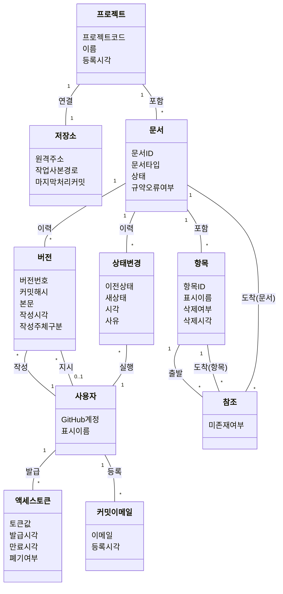

# 도메인 모델: 싱크독 (SyncDoc)

---

## 0. 이 문서가 다루는 것

시스템 안에 어떤 **개념**이 있고, 각각 무엇을 **가지며**, 서로 어떻게 **이어지는지**를 정한다.

세 단계로 진행한다.

| 단계 | 하는 일 | 이 문서의 절 |
|---|---|---|
| 개념 식별 | 유스케이스 문장의 명사를 뽑아 개념인지 속성인지 가른다 | 1장 |
| 개념 모델 작성 | 개념에 속성을 붙이고 관계를 잇는다 | 2·3장 |
| 경계 나누기 | 개념이 많으므로 몇 덩어리로 묶는다 | 4장 |

**판별 기준은 "소프트웨어가 없어도 존재하는가"다.** 종이에 명세를 써서 일해도 문서·항목·참조·상태는 존재한다. 반면 캐시·세션·HTTP 요청은 소프트웨어라서 생긴 것이므로 도메인이 아니다.

여기서 정하지 않는 것: 클래스 메서드 시그니처, 테이블 컬럼과 타입, API 응답 형태, 코드 폴더 구조. 그것들은 클래스 명세·ERD·API 명세에서 채운다. 지금 확정하면 뒤 단계에서 두 번 고치게 된다.

---

## 1. 개념 식별

유스케이스 명세의 **기본 흐름과 확장 문장에 나오는 명사**를 후보로 삼는다. 흐름 문장은 "누가 무엇을 어떻게 한다"이므로, 명사는 다뤄지는 대상이고 동사는 그 대상에 가하는 행위다.

원본 `USECASE_싱크독_v2.2.md`의 흐름·확장 문장 261개에서 센 빈도:

| 후보 | 빈도 | 판정 |
|---|---:|---|
| 항목 | 48 | **개념** |
| 문서 | 42 | **개념** |
| 참조 | 30 | **개념** |
| 버전 | 19 | **개념** |
| 커밋 | 17 | 버전의 속성 (버전 = 커밋) |
| 상태 | 16 | 문서의 속성 + 변경 이력은 **개념** |
| 프로젝트 | 14 | **개념** |
| 규약 | 14 | 규칙. 개념 아님 |
| 코드 | 13 | 프로젝트 코드 = 프로젝트의 속성 |
| 플래그 | 12 | 개념이었다. **v2에서 뺐다**(3.3) |
| 이력 | 12 | 여러 개념의 공통 성격 |
| 본문 | 9 | 버전의 속성 |
| 저장소 | 6 | **개념** |
| 댓글 | 6 | 개념이었다. **v2에서 뺐다**(3.3) |
| 다이어그램 | 6 | 개념 아님. 본문의 코드블록이며 브라우저가 렌더링한다. 서버 생성물이 없다 |
| 뷰 | 6 | 생성물. 캐시 |
| 작성 주체 | 6 | 버전의 속성 → **사용자** 참조 |
| 알림 | 2 | 개념 아님. 사람이 볼 것(규약 오류·미완성·끊어진 참조)은 전부 문서·참조의 속성이라 프로젝트 상세가 세어 보여준다 |
| 템플릿 | 2 | 문서 타입에 딸림 |

**빈도만으로 판정하지 않는다.** 빈도가 낮아도 독립적으로 살아야 하는 것이 있고(사용자), 빈도가 높아도 다른 것의 속성인 것이 있다(커밋, 본문). 아래 둘은 흐름 문장에 명사로 거의 안 나오지만 인프라 설계와 실제 운영에서 필요해진 것이다.

- **액세스 토큰** — 인프라 5장의 MCP 인증
- **커밋 이메일** — GitHub 직접 push로 들어온 커밋의 작성자가 **사용자**로 안 이어지는 것이 실물에서 드러났다(#34). git 커밋이 남기는 신원은 이름과 이메일뿐이고, 그중 계정으로 이어지는 단서는 이메일이다

---

## 2. 개념 모델

---

## 3. 개념별 정리

항목 ID는 영문 개념명이다. 클래스 명세의 클래스명, ERD의 테이블명과 맞춘다 — `Document` ↔ `Document` ↔ `documents`.

#### Project 프로젝트

**프로젝트**는 하나의 명세 체인이 사는 단위다. 프로젝트 코드(영문 대문자 4자 이내)로 식별하며 문서 ID의 앞부분이 된다.

#### Repository 저장소

**저장소**는 명세 원본이 실제로 사는 GitHub 저장소다. 프로젝트와 1:1이다. 인프라 설계상 노트북에 작업 사본을 두므로 그 경로와, 어디까지 처리했는지를 나타내는 마지막 처리 커밋을 갖는다. 마지막 처리 커밋은 [[SYNC-UC-001#UC-G1]] 확장 `1a`(꺼져 있던 동안 밀린 커밋 따라잡기)에 쓰인다.

> 프로젝트와 저장소를 나눈 이유: 1:1이지만 성격이 다르다. 프로젝트는 사람이 부르는 이름이고, 저장소는 물리적 위치와 동기화 상태다. 합치면 프로젝트에 git 관련 속성이 섞인다.

#### Document 문서

**문서**는 11단계 중 하나에 속하는 명세 하나다. 문서 ID(`SYNC-PRD-001`)로 식별한다.

#### Item 항목

**항목**은 문서 안에서 참조 대상이 되는 조각이다. `#R12`처럼 문서 내 유일한 ID를 갖는다.

> **항목이 독립 개체인 이유** — 항목 ID는 본문 안에 있으니 본문에서 매번 뽑으면 될 것 같지만, 안 된다. UC-H13이 "항목 ID는 `삭제됨`으로 이력에 남고 재사용되지 않는다"를 요구한다. 삭제된 항목은 본문에 없는데도 시스템이 그 존재를 기억해야 한다. 그래서 항목은 본문과 별개로 살아야 한다.

#### Version 버전

**버전**은 저장 한 번의 결과다. **버전 = git 커밋**이므로 커밋 해시를 갖는다. 본문 전체를 함께 두는 이유는 diff 계산과 재구축 때 매번 git을 뒤지지 않기 위해서다(캐시 성격).

작성 주체를 둘로 나눈다. **작성한 사용자**(항상 있음)와 **지시한 사용자**(에이전트 경로일 때만). MCP로 에이전트가 썼어도 지시한 사람이 있고, UC-A6이 둘 다 기록하도록 요구한다. `작성주체구분`은 사람인지 에이전트인지를 나타낸다.

> **식별자 결정** — 문서 ID(`SYNC-PRD-001`)와 항목 ID(`#R12`)는 사람이 부르는 이름이며, 저장소 이름이 바뀌면 함께 바뀔 수 있다. 따라서 DB 기본키는 대리키(순번)로 두고 이 ID들은 unique 제약으로 관리한다. 클래스·ERD에서 확정한다.

#### Reference 참조

한 항목이 다른 항목 또는 문서를 근거로 삼는 관계다. **방향이 있다** — 출발(하위)에서 도착(상위)으로. 역방향은 계산으로 얻는다.

**출발은 항상 항목이고, 도착은 항목 또는 문서다.** PRD ID 체계가 `[[문서ID]]` 참조를 허용하고 MINISPEC은 문서 단위로만 참조되기 때문이다. 도착이 문서인 참조는 그 문서의 어느 항목이 바뀌어도 영향받는 것으로 본다. 다만 기본은 항목 참조이며, 문서 참조는 문서 전체를 근거로 삼을 때만 쓴다.

`미존재여부`는 참조 대상 ID가 아직 없을 때 표시한다([[SYNC-UC-001#UC-S2]] 확장 `2a`). 나중에 대상이 생기면 다음 저장 때 해제된다. **대상 항목이 삭제되면 같은 자리로 돌아간다** — 끊어진 참조는 별도 개체가 아니라 미존재 참조다([[SYNC-UC-001#UC-H13]] 5). 대상이 되살아나면 다시 이어진다.

> 참조는 본문에서 추출되므로 DB가 유실돼도 재구축 가능하다. 인프라 6장의 보장이 여기에 걸린다.

#### StatusChange 상태변경

**상태**는 문서의 속성이다(`초안`/`완료`). 별도 개체로 두지 않는다.

**상태변경**은 개체다. 누가·언제·무엇에서 무엇으로 바꿨는지를 UC-H8이 요구한다.

> **주의할 점** — 상태가 두 곳에 산다. 원본 MD의 frontmatter와 DB. 인프라 C2에 따라 **원본이 진실이고 DB는 조회를 빠르게 하기 위한 사본**이다. GitHub에 직접 push해서 frontmatter를 고치면 DB가 따라와야 한다. 반대 방향(DB만 고치고 원본은 그대로)은 있어서는 안 된다. 상태 변경도 결국 원본을 고치고 커밋하는 일이다.

### 3.1 제외 — 알림

처음에는 개념으로 두었으나 뺐다. 알림이 가리키는 대상이 제각각이라 별도 개체로 두면 다형 연관이 필요한데, 그 값어치가 없다. 사람이 볼 것은 규약 오류·미완성·끊어진 참조 셋이고 전부 문서·참조의 속성이다. **프로젝트 상세([[SYNC-UC-001#UC-H14]])가 그것을 직접 세어 보여준다.** 푸시가 아니라 풀이다.

### 3.2 제외 — 다이어그램

처음에는 drawio 생성 상태를 추적하려고 개체로 두었다. drawio를 빼면서(PRD v1.6) 서버가 만드는 그림이 없어졌다. mermaid 코드블록은 본문의 일부이고 브라우저가 렌더링한다. 추적할 상태가 없으므로 개체가 아니다.

### 3.3 제외 — 플래그·전파결정·댓글 (v2)

v1에는 셋이 개념이었다. 상위가 바뀌면 하위에 `확인 필요`가 붙고, 저장마다 전파 여부를 사람이 골랐으며, 줄에 댓글을 달았다. 전부 **여러 사람이 한 명세를 나눠 쓴다**는 전제에서 나온 것이다. 실제로는 한 사람이 프로젝트 하나를 혼자 다 썼고([[SYNC-RFQ-001]] 7장), 혼자에게 이 셋은 자기가 방금 한 일을 자기에게 다시 묻는 장치였다. 그래서 뺐다.

남는 것은 하나다 — **끊어진 참조**. 상위 항목이 사라지면 그것을 가리키던 참조가 미존재로 돌아간다(3장 Reference). 새 개념이 아니라 참조의 속성이므로 개체를 두지 않는다.

#### User 사용자

**사용자**는 GitHub 계정으로 식별한다. 인프라 5장에서 GitHub OAuth로 정했으므로 별도 비밀번호나 프로필이 없다.

#### CommitEmail 커밋 이메일

**커밋 이메일**은 사람이 git 커밋에 쓰는 이메일이다. 한 사람이 여럿을 쓴다 — 회사 메일, 개인 메일, GitHub가 주는 noreply 메일.

git 커밋은 작성자를 이름과 이메일로만 남긴다. 이름은 아무 문자열이라 계정과 못 잇는다. 그래서 **GitHub 직접 push로 들어온 커밋을 사용자로 잇는 단서는 이메일이다.** 커밋 이메일이 없으면 같은 사람이 계정 둘로 갈린다.

사람이 자기 계정에 직접 등록한다. 시스템이 추측하지 않는다 — 이메일 하나가 사람 하나여야 작성자 판정이 답을 하나로 낸다.

#### AccessToken 액세스 토큰

**액세스 토큰**은 MCP 인증용이다. 사람이 웹에서 발급하고 자기 에이전트 설정에 넣는다. 토큰으로 들어온 요청은 발급자 계정으로 기록된다.

---

## 4. 경계

개념이 10개라 그대로 두면 읽기 어렵다. 세 가지를 물어 묶는다.

1. **얘 없이 다른 게 말이 되나** — 항목은 문서 없이 존재할 수 없다. 액세스 토큰은 사용자를 가리키지만 없어도 사용자는 멀쩡하다.
2. **같이 바뀌나** — 저장 한 번에 함께 움직이는 것끼리 묶는다.
3. **어디에도 못 들어가나** — 두 묶음에 걸쳐 있으면 독립시킨다.

| 묶음 | 개념 | 묶은 근거 |
|---|---|---|
| 프로젝트 | 프로젝트, 저장소 | 1:1로 붙어 있고 같이 생기고 같이 사라진다 |
| 명세 | 문서, 항목, 버전, 상태변경 | 저장 한 번에 전부 같이 움직인다 |
| 참조 | 참조 | 서로 다른 문서의 항목을 이어 어느 쪽에도 못 들어간다 |
| 계정 | 사용자, 액세스토큰, 커밋이메일 | 다른 모든 것과 독립적이다 |

**코드 폴더는 여기서 정하지 않는다.** 이 경계가 폴더의 기준이 되겠지만, 확정은 클래스 명세 단계에서 한다. 다만 경계를 정한 이상 규칙 하나가 따라온다 — **묶음 안에서는 서로 자유롭게 참조하되, 묶음끼리는 ID로만 주고받는다.** 참조 묶음이 명세 묶음의 문서 객체를 직접 들고 있으면 안 되고 항목 ID만 가져야 한다.

**참조를 명세 묶음에서 뺀 이유**: 참조는 서로 다른 문서의 항목을 잇는다. 명세 묶음 안에 두면 문서 하나를 다루면서 다른 문서를 건드리게 된다. 별도로 두면 "참조는 항목 ID 두 개를 잇는 것"으로 단순해진다.

---

## 5. 판단이 필요한 지점

**1. 상태의 이중화** — 3장에서 짚은 대로 상태가 frontmatter와 DB 양쪽에 있다. 원본이 진실이므로 상태만 바꿔도 커밋이 생긴다. **결정: 커밋을 만들고 메시지를 `status(문서ID): 이전 → 새상태`로 규격화한다.** 접두어로 본문 변경(`spec`)과 구분되므로 이력에서 걸러 볼 수 있다.

**2. 버전에 본문 전체를 둘지** — **결정: 둔다.** 명세는 텍스트라 작고, diff·이전 버전 조회가 DB 쿼리 한 번으로 끝난다. git은 원본이고 DB는 조회용 사본이라는 원칙에도 맞다.

---

## 6. 미결사항

- [x] 프로젝트 하나에 저장소 여럿이 필요해질 가능성 (현재 1:1 전제) — 결정: v1은 1:1. `Project.repository`가 단수이고 `init_project`가 이미 등록된 저장소를 거부한다(UC-A1 2d). 1:N은 v2
- [x] 항목의 `표시이름`을 시스템이 본문에서 뽑을지, 작성자가 지정할지 — 결정: 시스템이 뽑는다. STD-001 1.3 — 항목 제목(ID 다음 나머지)이 `display_name`. `core/markdown.py`가 구현
