# 클래스 명세: 싱크독 (SyncDoc)

---

## 0. 이 문서가 다루는 것

도메인 모델의 개념을 **코드 구조**로 옮긴다. 폴더 배치, 엔티티 클래스, 서비스의 책임과 메서드 이름까지. 테이블·컬럼 정의는 [[SYNC-DOM-003]] ERD·DD가 맡는다.

**클래스 세 종류와 이 문서의 범위**

| 종류 | 역할 | 우리 구조 | 정의하는 곳 |
|---|---|---|---|
| Entity | 데이터를 갖는 것 | `core/*/models` | 이 문서 2장 + ERD·DD |
| Control | 유스케이스 흐름을 조율하는 것 | `core/*/service`, `pipeline` | 이 문서 3장(의존)·4장(시그니처·다이어그램) |
| Boundary | 바깥과 만나는 것 | `web`, `mcp` | API 명세·화면 명세. 3.1에서 Control과의 연결만 |

**v1은 2장(엔티티)까지, v2에서 3·4장(컨트롤)을, v3에서 시퀀스 되먹임 22개와 규약 되먹임을, v3.1에서 MINISPEC 되먹임(시그니처 8곳·함수 2개·`queries` 2개·infra 시그니처)을 반영했다.** `queries.py`가 새로 생겼고, push가 DB 앞으로 갔고, 서비스가 다른 묶음을 직접 만지던 곳이 전부 인자 전달로 바뀌었다. 3장은 의존 관계 지도, 4장은 묶음별 설계 클래스 다이어그램(메서드 시그니처 + 엔티티 속성 + 규칙이 사는 곳)이다. v1에 있던 '클래스별 책임' 장은 4장과 중복이라 v2.3에서 없앴다.

**전제 (앞 단계에서 결정)**
- ORM 모델 = 도메인 객체. 분리하지 않는다. 규칙은 서비스 계층에 둔다
- 폴더는 도메인 묶음 6개 기준. 그 안에 계층
- 기본키는 대리키. 문서 ID·항목 ID는 unique 제약
- 알림 개체 없음. 내 할 일이 직접 쿼리한다
- 묶음끼리는 ID로만 참조. 객체를 직접 들지 않는다

**본문은 언어 중립으로 쓴다.** FastAPI·SQLAlchemy로 어떻게 옮기는지는 부록에 둔다.

---

## 1. 폴더 구조

프로젝트 `syncdoc` 하나에 **백엔드와 프런트엔드를 나눠 둔다.** 명세·도구는 둘 다 쓰므로 루트에 둔다.

```
syncdoc/                        저장소 = 프로젝트
├── backend/                    파이썬. FastAPI(웹) + MCP 서버
│   ├── app/                    임포트 패키지 — `from app.core… `
│   ├── tests/                  app/ 구조를 그대로 따른다 (STD-004 DEV-14)
│   ├── alembic/ · alembic.ini  마이그레이션 (DEV-7)
│   └── pyproject.toml · uv.lock
│
├── frontend/                   React 소스 (Vite+TS). 빌드 → backend/app/web/static
│                               유저용 탭 렌더링은 tools/view_build.py를 TS로 옮긴 것
│                               (md.ts·views.ts·uc/wireframe/seq/ms.ts)
│
├── docs/specs/                 명세 원본 (STD-001 1.1). 양쪽이 같이 본다
├── tools/                      validate.py · check_code.py · check_ui.py · view_build.py · dev_preview.py
├── scripts/                    tunnel.sh — Quick Tunnel 기동 (INFRA 5장)
├── Dockerfile · docker-compose.yml   배치 (INFRA 8장). 프런트를 빌드해 백엔드 이미지에 담는 2단계
└── AGENTS.md · README.md
```

**backend/app/ 안**

```
app/
├── main.py                 앱 조립. web·mcp 라우터 마운트
├── config.py               환경 변수, 비밀키
├── db.py                   세션, 엔진
│
├── core/                   도메인 묶음 6개. 서로 ID로만 참조
│   ├── project/            프로젝트, 저장소
│   ├── spec/               문서, 항목, 버전, 상태변경
│   ├── reference/          참조
│   ├── tracking/           플래그, 전파결정
│   ├── collab/             댓글
│   ├── account/            사용자, 액세스토큰
│   │
│   ├── types.py            2.7 열거형 · 2.8 DTO. 묶음 전부가 쓰므로 묶음 밖
│   ├── markdown.py         순수 함수 — frontmatter 파싱 · 코드 마스킹 · 헤딩/참조 정규식 · 항목 블록 자르기. spec·reference가 같이 쓴다. DB 없음
│   ├── errors.py           problem+json 타입마다 예외 클래스 하나 (STD-004 DEV-5)
│   ├── pipeline.py         쓰기 조율. 묶음들을 순서대로 부른다
│   └── queries.py          읽기 조합. 여러 묶음에서 ID로 모아 응답 형태를 만든다
│
├── scheduler.py            폴링([[SYNC-MS-007#scheduler.catch_up]]). POLL_INTERVAL_SECONDS(기본 300, 테스트 0)
│
├── web/                    REST API. core를 호출만 한다
│   ├── routers/
│   ├── schemas/            요청·응답 형태
│   ├── auth.py             GitHub OAuth·세션
│   └── static/             React 빌드 결과 (gitignore). /{path:path} SPA 폴백은 라우트 맨 끝
│
├── mcp/                    MCP 도구. core를 호출만 한다
│   ├── tools.py
│   └── auth.py             Bearer → current_user_id (SEQ-C2)
│
└── infra/                  외부 시스템 어댑터
    ├── git.py              clone·commit·push·fetch
    └── github.py           OAuth·webhook 검증
```

**패키지 이름이 `app`인 이유** — 마지막 폴더 이름이 곧 임포트 이름이다. 프로젝트 이름(`syncdoc`)을 그대로 쓰면 `backend/syncdoc/`처럼 이름이 두 번 나온다. `src/`는 담는 상자일 뿐 패키지가 아니라 안에 이름이 또 필요하고(PyPI 배포 라이브러리 관례), 싱크독은 컨테이너로 띄우는 앱이라 그 이점이 없다.

**이 문서에서 파일 경로를 적을 때**는 패키지 안 상대 경로로 쓴다 — `core/spec/service.py`는 `backend/app/core/spec/service.py`를 가리킨다.

**묶음 안 구조** (6개 동일)
```
core/spec/
├── models.py       ORM 모델 = 도메인 객체
├── repository.py   조회·저장. DB만 안다
└── service.py      규칙. 여기서만 모델을 만진다
```

**규칙**
- `web`·`mcp`는 `core/*/service`만 부른다. `models`·`repository`를 직접 만지지 않는다. 나중에 도메인 객체를 분리해야 할 때 `service`만 고치면 되게 하기 위해서다
- `core/A`가 `core/B`를 쓸 때는 `B.service`를 부르고 B의 ID만 받는다. B의 모델 객체를 들고 다니지 않는다
- `pipeline.py`·`queries.py`는 묶음 밖에 있다. 여러 묶음을 부르는 조율자·조합자라 어느 묶음에도 속하지 않는다. 쓰기는 `pipeline`, 읽기 집계는 `queries`
- 라우터·MCP 도구는 한 묶음만 필요하면 그 서비스를, 여러 묶음을 모아야 하면 `queries`를 부른다. 서비스가 다른 서비스를 직접 부르는 건 3.2에 그려진 것뿐
- `infra`는 core가 부른다. core는 git 명령이나 GitHub API를 직접 호출하지 않는다

---

## 2. 엔티티

묶음별로 나눈다. **클래스마다 항목 헤딩 + 그 클래스의 다이어그램.** 관계는 각 클래스 아래 목록으로 적는다. 묶음 전체 그림은 뷰가 조각을 합쳐 만든다(뷰 규약 V-DOM). 각 클래스의 테이블 정의는 ERD·DD의 해당 항목을 참조한다.

### 2.1 프로젝트

#### Project 프로젝트

테이블: [[SYNC-DOM-003#projects]] · 도메인: [[SYNC-DOM-001#Project]]

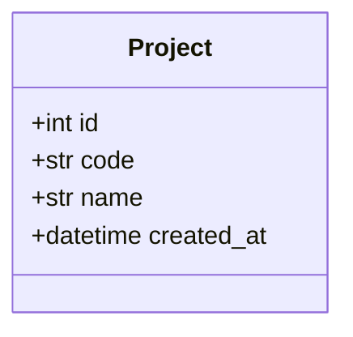

관계
- `Project` 1 — 1 `Repository`

#### Repository 저장소

테이블: [[SYNC-DOM-003#repositories]] · 도메인: [[SYNC-DOM-001#Repository]]

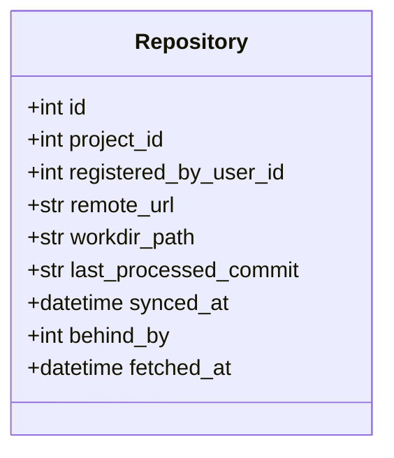

관계
- `Repository` 1 — 1 `Project`

`behind_by`·`fetched_at`은 **폴링이 갱신하고 화면은 읽기만 한다.** 관리 화면(UI-14)과 프로젝트
상세(UI-4)가 이 값을 그대로 보여준다. 화면이 열릴 때마다 `git fetch`를 돌리면 저장소 수만큼
느려지고, 폴링이 이미 5분마다 같은 일을 하고 있어 이중이 된다.

### 2.2 명세

#### Document 문서

테이블: [[SYNC-DOM-003#documents]] · 도메인: [[SYNC-DOM-001#Document]]

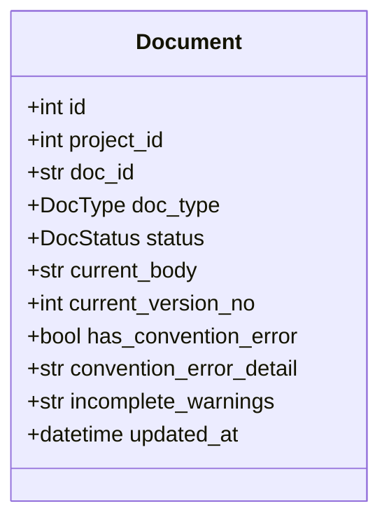

관계
- `Document` 1 — * `Item`
- `Document` 1 — * `Version`
- `Document` 1 — * `StatusChange`

#### Item 항목

테이블: [[SYNC-DOM-003#items]] · 도메인: [[SYNC-DOM-001#Item]]

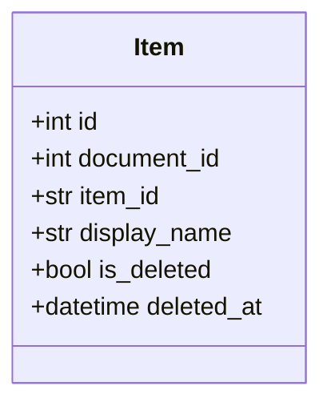

관계
- `Item` * — 1 `Document`

#### Version 버전

테이블: [[SYNC-DOM-003#versions]] · 도메인: [[SYNC-DOM-001#Version]]

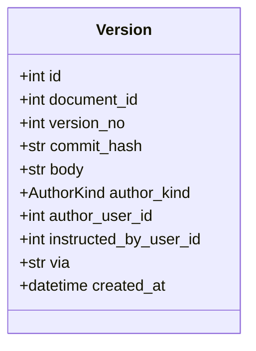

관계
- `Version` * — 1 `Document`

#### StatusChange 상태변경

테이블: [[SYNC-DOM-003#status_changes]] · 도메인: [[SYNC-DOM-001#StatusChange]]

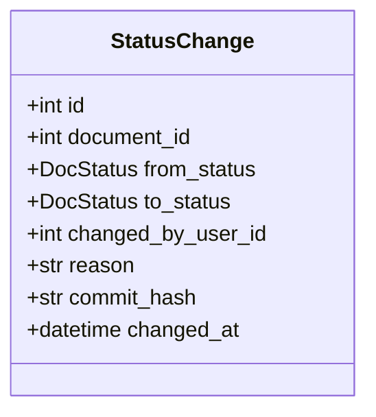

관계
- `StatusChange` * — 1 `Document`

### 2.3 참조

#### Reference 참조

테이블: [[SYNC-DOM-003#references]] · 도메인: [[SYNC-DOM-001#Reference]]

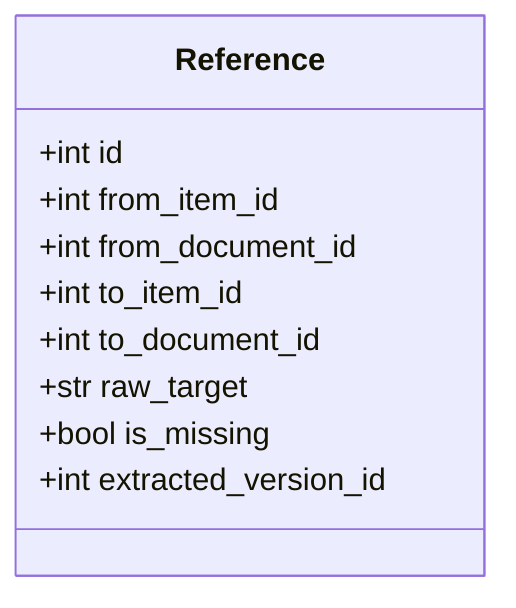

> to_item_id 또는 to_document_id 중 하나만 채워진다. raw_target은 본문에 적힌 문자열 그대로. 미존재 참조 표시용.

### 2.4 추적

#### Flag 플래그

테이블: [[SYNC-DOM-003#flags]] · 도메인: [[SYNC-DOM-001#Flag]]

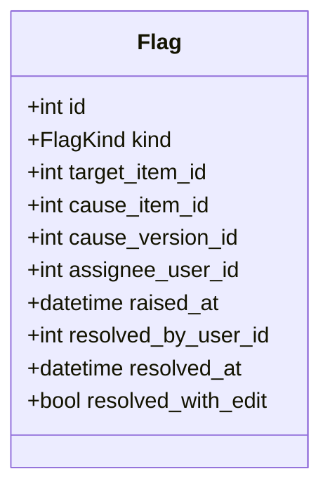

#### PropagationDecision 전파결정

테이블: [[SYNC-DOM-003#propagation_decisions]] · 도메인: [[SYNC-DOM-001#PropagationDecision]]

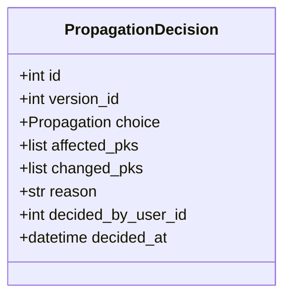

### 2.5 협업

#### Comment 댓글

테이블: [[SYNC-DOM-003#comments]] · 도메인: [[SYNC-DOM-001#Comment]]

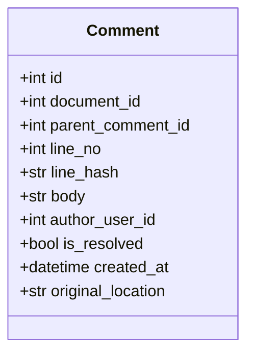

관계
- `Comment` 0..1 — * `Comment` (답글)

### 2.6 계정

#### User 사용자

테이블: [[SYNC-DOM-003#users]] · 도메인: [[SYNC-DOM-001#User]]

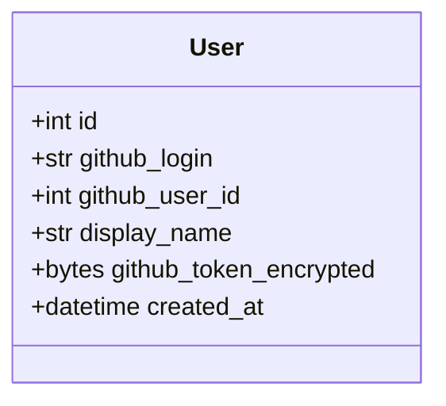

관계
- `User` 1 — * `AccessToken`
- `User` 1 — * `CommitEmail`

#### CommitEmail 커밋이메일

테이블: [[SYNC-DOM-003#commit_emails]] · 도메인: [[SYNC-DOM-001#CommitEmail]]

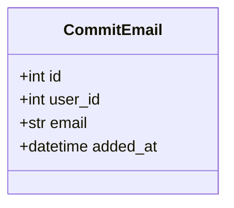

관계
- `CommitEmail` * — 1 `User`

**이메일은 `User`의 속성이 아니라 자식이다.** 한 사람이 여럿을 쓰고(회사·개인·noreply), `email`에 유일 제약이 걸려야 작성자 판정이 답을 하나로 낸다. 컬럼 안 목록으로 두면 제약을 못 걸고 조회가 부분 문자열 대조가 된다 — `a@x.com`이 `aa@x.com`에 걸린다.

#### AccessToken 액세스토큰

테이블: [[SYNC-DOM-003#access_tokens]] · 도메인: [[SYNC-DOM-001#AccessToken]]

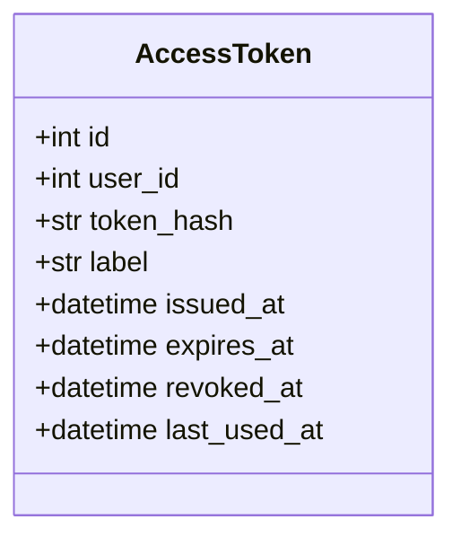

관계
- `AccessToken` * — 1 `User`

### 2.7 열거형

| 이름 | 값 | 쓰는 곳 |
|---|---|---|
| DocType | RFQ, PRD, SCN, UC, INFRA, DOM, UI, API, SEQ, MS, CODE, STD | Document. STD는 단계 밖 |
| DocStatus | draft, review, approved | Document, StatusChange |
| AuthorKind | human, agent | Version |
| FlagKind | needs_check, broken_ref, upstream_impact | Flag. `upstream_impact`는 상위 항목에 붙는다 |
| Propagation | propagate, skip, undecided | PropagationDecision |

---
### 2.8 응답·내부 타입 (DTO)

서비스·`pipeline`·`queries`가 주고받는 내부 타입. MINISPEC 9개 문서가 전부 여기를 참조한다. API 응답 스키마([[SYNC-API-001]] 4장)와 같은 이름은 그것을 그대로 쓴다 — `Document` `DocumentSummary` `Version` `Diff` `SaveResult` `FlagDetail` `FlagSummary` `RebuildResult` `RepoStatus` `Todo` `ItemRef`. 여기는 API에 없는 것만.

| 타입 | 필드 | 쓰는 곳 |
|---|---|---|
| `Entry` | 열거 `mcp` · `web_revert` · `web_status` · `github` · `backup` | pipeline. `backup`은 추적 데이터 백업 커밋의 작성 경로다 — **`versions.via`에 안 닿는다**(백업은 버전 행을 안 만든다) |
| `Author` | `kind: AuthorKind` · `user: User` · `instructed_by: User \| None` · `via: Entry` | pipeline · save · Version 기록. `versions.via`에 `mcp`·`web`·`github`로 접어 저장 |
| `AuthorRef` | `kind: AuthorKind` · `user_id: int` · `instructed_by_id: int \| None` · `via: str` | SpecService가 돌려주는 작성 주체 — **id만**. `UserRef`로 채우는 건 `queries`가 `AccountService.users_by_ids`로 |
| `Violation` | `line: int` · `rule: str` · `message: str` | validate |
| `Warning` | `rule: str` · `message: str` | validate |
| `ValidateResult` | `violations: list[Violation]` · `warnings: list[Warning]` | validate → pipeline |
| `ItemBlock` | `item_id: str` · `display_name: str` · `level: int` · `start_line: int` · `end_line: int` · `text: str` | item_blocks → validate·get_item·save·diff |
| `ItemView` | `doc_id` · `item_id` · `display_name` · `body: str` · `doc_status: DocStatus` · `doc_version_no: int` · `flags: list[str]` | get_item → queries |
| `Document` (DTO) | API `Document` 스키마 + `id: int`(행 pk) · `current_version_id: int`(최근 versions.id — detect_impact의 prev) · `last_author: AuthorRef` · `missing_refs: list[str]`(미존재 참조 raw_target) | get_document. ORM은 `DocumentRow`(DEV-2) |
| `Version` (DTO) | API `Version` 스키마 — `doc_id` `version_no?` `commit_hash` `message` `author: AuthorRef` `created_at` | list_versions · recent_changes. ORM은 `VersionRow`. `create`·`save`는 `VersionRow`를 돌려준다. 내부 필드명(`author_view` 등)은 자유, **API로 나가는 필드명은 API-001 스키마 그대로**(`author`) |
| `DocRef` | `document_id` · `doc_id` · `title` · `stage` · `status` | describe_documents. 문서 단위 참조 대상 표시 |
| `DownstreamView` | `by_item: dict[str, list[ItemRef]]` · `by_document: list[{doc_id, title, items}]` | queries.downstream_view → 추적표 |
| `VersionBrief` | `id` · `document_id` · `version_no` · `commit_hash` · `author: AuthorRef` · `created_at` · `message` | versions_by_ids → 플래그의 cause_version, 미결정 목록, decision_view의 `version` |
| `FlagSummary` (DTO) | API 스키마 + `assignee_id: int \| None` · `target`·`cause`는 `ItemRef` | tracking이 만들지 않는다 — `queries`가 `Flag` 행 + `describe_items` + `versions_by_ids`로. `assignee` 이름은 입구가 `users_by_ids`로 |
| `ItemRef` (DTO) | API 스키마 + `deleted_at`(내부. API로 안 나감) | describe_items. flag_view의 `cause_deleted_at`용 |
| `ItemBrief` | `pk: int` · `doc_id` · `item_id: str \| None` · `stage: int` · `display_name` | list_items_by_project → queries.graph_view |
| `RefEdge` | `from_item_pk: int` · `to_item_pk: int \| None` · `to_document_id: int \| None` · `raw_target: str` · `is_missing: bool` | ReferenceService (다음 묶음) |
| `ExtractResult` | `added: int` · `removed: int` · `missing: int` | reference.extract |
| `DecisionResult` | `choice: Propagation` · `flags_raised: int` | tracking.record_decision |
| `UpstreamCheck` | `target: ItemRef` · `target_version_no: int` · `target_status: DocStatus` · `referenced_from: list[str]` | queries.upstream_checklist → UI-5 다이얼로그 11 |
| `IssuedToken` | `token: AccessToken` · `raw: str` | account.issue_token. `raw`는 응답에만 |
| `ChangedFile` | `path: str` · `status: A\|M\|D` · `commit_hash: str` · `author_login: str` · `message: str` · `author_email: str` | git.changed_files → process_commit. **`author_login`과 `author_email`을 둘 다 싣는다** — login은 `%an` 대체값일 수 있어 신원의 근거가 못 된다([[SYNC-MS-009#git.changed_files]]) |
| `Commit` | `hash: str` · `login: str` · `date: datetime` · `message: str` · `email: str` · `path: str` | git.log → rebuild. `ChangedFile`과 같은 이유로 이메일을 함께 싣는다. `path`는 **그 커밋 시점의 경로** — `--follow`가 이름 바뀌기 전 커밋까지 주므로 지금 경로로는 본문을 못 읽는다([[SYNC-MS-009#git.log]]) |
| `GithubUser` | `id: int` · `login: str` · `name: str` | github.get_user → login_github |
| `RelinkResult` | `relinked: int` · `dropped: list~dict~` | tracking.relink_versions. `dropped`는 `{kind, count, reason}` — 재구축 결과가 그대로 실어 UI-14 5.3에 나간다 |
| `RestoreFlag` | `kind: str` · `target_item_id: int` · `cause_item_id: int \| None` · `cause_version_id: int \| None` · `assignee_user_id: int \| None` · `raised_at: datetime` · `resolved_by_user_id: int \| None` · `resolved_at: datetime \| None` · `resolved_with_edit: bool \| None` | 백업에서 읽어 **pk로 이미 푼** flags 한 행. 자연키를 푸는 것은 `pipeline`의 몫이다 — 추적 묶음은 문서·항목을 모른다 |
| `RestoreDecision` | `version_id: int` · `choice: str` · `affected_pks: list~int~` · `changed_pks: list~int~` · `decided_by_user_id: int \| None` · `decided_at: datetime \| None` | 같음. **`reason`이 없다** — 백업에 안 싣는다(인프라 6.1) |
| `RestoreResult` | `flags: int` · `decisions: int` · `comments: int` · `skipped: int` · `dropped: list~dict~` | pipeline.import_tracking → API. `dropped`가 `RebuildResult`와 같은 모양이라 UI-14 5.3을 그대로 쓴다 |

타입은 여기 한 곳에만 정의한다.

엔티티는 2.1~2.6, 열거형은 2.7.

---

---

## 3. 의존 관계 (v2)

누가 누굴 부르는지. 클래스 다이어그램이 아니라 지도다. 3.1은 입구(Boundary)에서 서비스(Control)로, 3.2는 서비스끼리. 여기 없는 방향은 부르면 안 된다.

### 3.1 Boundary → Control 의존 관계

클래스 다이어그램이 아니라 **의존 그림**이다. 라우터는 클래스가 아니라 함수가 든 파일이므로 박스만 그린다.

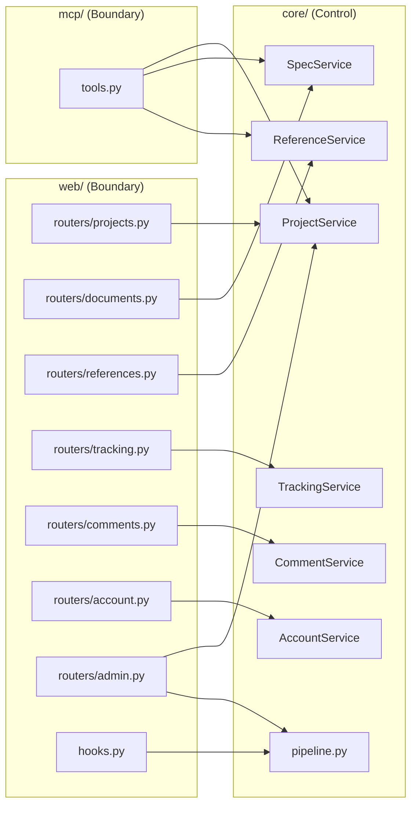

라우터 하나가 묶음 하나를 본다. `admin.py`만 예외로 프로젝트와 파이프라인 둘을 부른다 — 재구축([[SYNC-UC-001#UC-S6]])이 운영 성격이라 어느 묶음에도 안 들어간다. **예외 둘 더** — 라우터가 응답에 사람 이름을 붙이려고 `AccountService.users_by_ids`를 부르는 건 허용(댓글·이력). `documents.py`가 상태 변경·되돌리기를 `pipeline`으로 넘기는 것도 허용 — 둘은 조율이라 `pipeline`에 있다. `mcp/tools.py`는 tracking·collab·account를 부르지 않는다 — 사람 판단 영역이다.

### 3.2 Control 사이의 의존 관계

이것도 의존 그림이다. 화살표 위 글자는 부르는 메서드. 어느 서비스가 어느 서비스를 **부를 수 있는지**를 정한 것이며, 여기 없는 방향은 부르면 안 된다.

```mermaid
flowchart TB
    PL["pipeline.py<br/>쓰기 조율"]
    QR["queries.py<br/>읽기 조합"]
    PS[ProjectService]
    SS[SpecService]
    RS[ReferenceService]
    TS[TrackingService]
    CS[CommentService]
    AS[AccountService]
    GIT[infra/git.py]
    GH[infra/github.py]

    PL -.->|get_document · validate · detect_deleted_items · create · save · apply_frontmatter| SS
    PL -.->|commit_push · read · changed_files| GIT
    PL -.->|extract · downstream · clear| RS
    PL -.->|detect_impact · create_pending · raise_broken · raise_upstream| TS
    PL -.->|relocate| CS
    PL -.->|get| PS
    QR -.->|list_by_project · describe_items · resolve_item · neighbors · diff · …| SS
    QR -.->|upstream · downstream · references_among · count_downstream| RS
    QR -.->|flags_for_* · count_flags* · pending_decisions_for| TS
    PL -.->|raise_upstream (승인 대조)| TS
    QR -.->|count_unresolved* · unresolved_in| CS
    QR -.->|list_projects · get| PS
    QR -.->|users_by_ids| AS
    PS -.->|rebuild| PL
    PS -.->|clone · fetch · rev_list_count| GIT
    TS -.->|downstream · upstream| RS
    TS -.->|diff · last_author| SS
    GIT -.->|github_token_for| AS
    AS -.->|oauth| GH
```

**규칙** — 서비스끼리 직접 부르는 건 `TrackingService → ReferenceService·SpecService`(변경 영향 감지·담당자 결정) 둘뿐이다. `SpecService`는 아무도 부르지 않는다. 나머지 묶음 넘기는 전부 `pipeline`(쓰기)이나 `queries`(읽기)를 거친다. 서비스가 `pipeline`을 부르는 건 `ProjectService.rebuild_index`뿐이다. 4장에서 각 노드를 확대한다.

## 4. 설계 클래스 다이어그램 (v3)

3장이 지도라면 여기는 각 노드를 확대한 것이다. 묶음마다 `«service»` 컨트롤의 **메서드 시그니처**와, 그 서비스가 만지는 엔티티를 한 그림에 둔다. 이게 코딩할 때 보는 그림이다.

**읽는 법** — 시그니처는 API 명세([[SYNC-API-001]], [[SYNC-API-002]])와 시퀀스([[SYNC-SEQ-001]])에서 확정한 것. 반환 타입 중 `Document`·`Diff`·`Todo` 같은 응답 형태는 API 스키마와 같은 이름이다. `-`로 시작하는 메서드는 서비스 안에서만 쓰는 것. 각 그림 아래 표에 메서드마다 어디서 부르는지·유스케이스·던지는 에러를 붙였다. 그림 안 엔티티는 2장의 속성을 그대로 다시 그린다 — 설계 클래스 다이어그램은 서비스와 엔티티 속성이 한 그림에 있어야 읽힌다. **원본에 속성이 두 번 적히는 것이므로 어긋나면 2장이 진실이다.** mermaid 안 클래스는 항목이 아니라(STD-001 1.5) 중복 항목이 되지는 않는다.

**v3에서 바뀐 것** (시퀀스 되먹임) — 서비스는 자기 묶음 테이블만 만진다. 다른 묶음의 것이 필요하면 인자로 받거나(`line_text`, `deleted_item_pks`) `pipeline`·`queries`가 조합한다. 그래서 메서드가 잘게 늘었다.

### 4.1 project

#### ProjectService

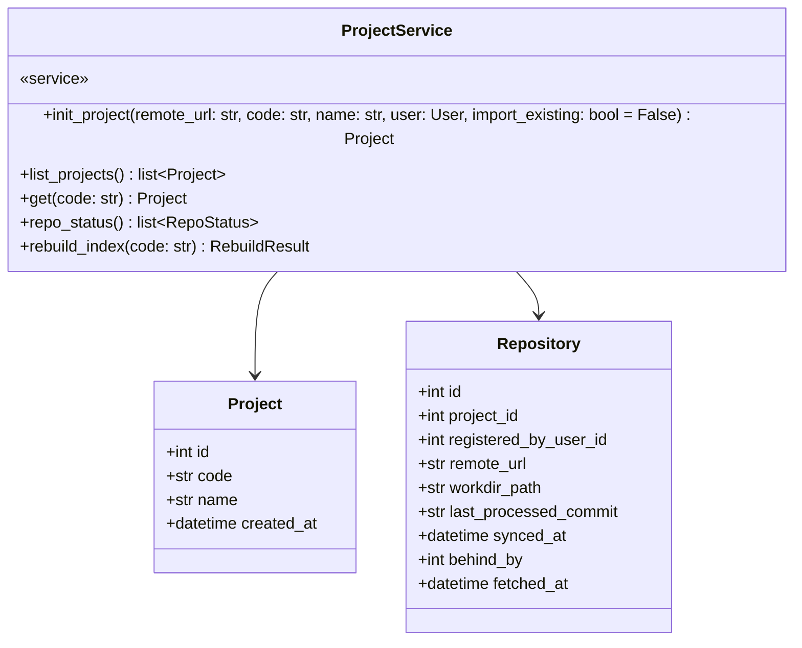

| 메서드 | 부르는 곳 | 유스케이스 | 던지는 에러 |
|---|---|---|---|
| `init_project` | [[SYNC-API-001#POST/api/projects]] · MCP [[SYNC-API-002#init_project]] | [[SYNC-UC-001#UC-A1]] | project-code-conflict, project-code-invalid, existing-specs, push-failed |
| `list_projects` | queries.project_summary | [[SYNC-UC-001#UC-H14]] | |
| `get` | queries · pipeline | — | not-found |
| `repo_status` | [[SYNC-API-001#GET/api/admin/repos]] | [[SYNC-UC-001#UC-G1]] | |
| `rebuild_index` | [[SYNC-API-001#POST/api/admin/repos/{code}/rebuild]] | [[SYNC-UC-001#UC-S6]] | |

**규칙이 사는 곳**
- `init_project`: 코드는 `^[A-Z]{1,4}$`. `docs/specs/`가 이미 있으면 덮어쓰지 않고 `import_existing`으로 분기([[SYNC-UC-001#UC-A1]] 3a). `existing-specs`로 거부할 때 clone한 작업 사본을 지운다(SEQ-4)
- `repo_status`: 저장소마다 `git.fetch` + `rev_list_count`로 `behind_by`. 캐시할지는 미결
- **`documents` 테이블을 모른다.** 단계 요약·건수는 `queries.project_summary`가 `SpecService.list_by_project`와 `TrackingService.count_flags`로 만든다(되먹임 #13)

### 4.2 spec

#### SpecService

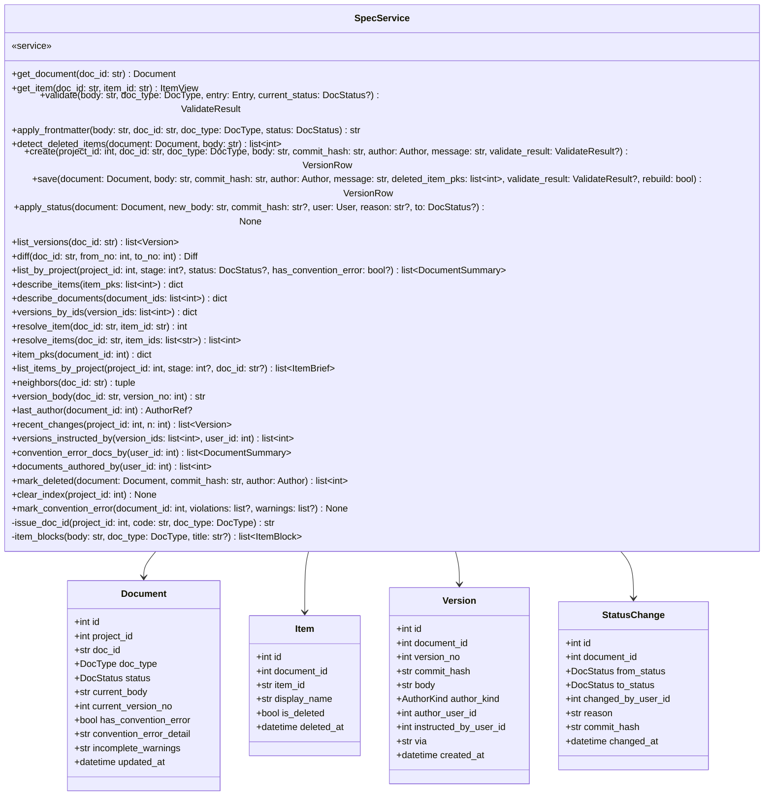

| 메서드 | 부르는 곳 | 유스케이스 | 던지는 에러 |
|---|---|---|---|
| `get_document` | queries.document_view · pipeline | [[SYNC-UC-001#UC-A2]], H2 | not-found |
| `get_item` | queries.item_view · TrackingService.get_flag | [[SYNC-UC-001#UC-A3]] | not-found(+available_items), item-deleted |
| `validate` | pipeline | [[SYNC-UC-001#UC-S1]] | → convention-violation (위반) · warnings (미완성) |
| `apply_frontmatter` | pipeline (create 시) | [[SYNC-UC-001#UC-A6]] | |
| `detect_deleted_items` | pipeline | [[SYNC-UC-001#UC-A6]] 4b | |
| `create` · `save` · `apply_status` | pipeline (push 성공 후) | [[SYNC-UC-001#UC-A6]], [[SYNC-UC-001#UC-H8]] | |
| `list_versions` | [[SYNC-API-001#GET/api/docs/{docId}/versions]] | [[SYNC-UC-001#UC-H6]] | |
| `diff` | queries.diff_with_impact · TrackingService | [[SYNC-UC-001#UC-H6]], S3 | |
| `list_by_project` | queries | [[SYNC-UC-001#UC-A5]], H14, H16 | |
| `describe_items` · `resolve_item(s)` · `list_items_by_project` · `neighbors` | queries | [[SYNC-UC-001#UC-H3]], H4 | |
| `last_author` | TrackingService.raise_flags | [[SYNC-UC-001#UC-S4]] | |
| `recent_changes` · `versions_instructed_by` · `convention_error_docs_by` · `documents_authored_by` | queries | [[SYNC-UC-001#UC-H14]], H15 | |
| `clear_index` · `mark_convention_error` · `mark_deleted` | pipeline.rebuild · process_commit | [[SYNC-UC-001#UC-S6]], G1 | |

**규칙이 사는 곳**
- `validate`: [[SYNC-STD-001]] 3장(위반 13종)·4장(미완성 2종)을 그대로. DOM 타입이면 클래스 명세 2장·4장의 엔티티 속성 일치도 검사해 `entity.mismatch` 경고. 반환은 `(violations, warnings)`. `entry=github`면 위반이어도 저장은 되고 `has_convention_error`로 표시. `entry=mcp`면 frontmatter `status`가 현재와 다르면 `frontmatter.status_change` 위반
- `item_blocks`: 항목 = ID로 시작하는 헤딩(타입 패턴), 블록 = 같은 레벨 이상 다음 헤딩까지, `display_name` = 헤딩 제목. 코드블록·인라인 코드는 건너뜀 (STD-001 1.3). **5장 미결 둘이 여기서 풀렸다**
- `detect_deleted_items`: 현재 `items`(is_deleted=false)와 새 본문의 항목 ID를 대조. 사라진 것의 pk 목록. 하위 참조가 있는지는 모른다 — `pipeline`이 `ReferenceService.downstream`으로 판정(되먹임 #2)
- `save`: 버전 충돌 검사는 하지 않는다 — `pipeline`이 push 전에 한다. Version·Item·Document를 한 트랜잭션에. `status == approved` → `review` + StatusChange. `deleted_item_pks`에 `is_deleted=true`
- 상태 변경·되돌리기는 여기 없다 — 조율이라 `pipeline.change_status`·`pipeline.revert`(4.7). SpecService는 DB만 만지고 전부 sync
- `list_versions`·`recent_changes`: `versions`와 `status_changes`를 시각순으로 합친다. status 행은 `version_no: null`
- `issue_doc_id`: `{code}-{type}-{NNN}`. 같은 프로젝트·타입의 최대 번호 + 1
- frontmatter의 status가 진실. 파이프라인이 저장 때마다 읽어 `documents.status`를 덮어쓴다

### 4.3 reference

#### ReferenceService

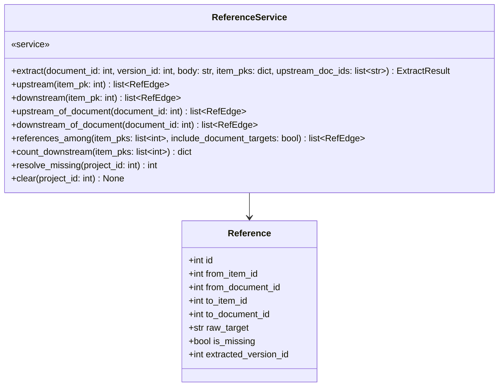

| 메서드 | 부르는 곳 | 유스케이스 |
|---|---|---|
| `extract` | pipeline | [[SYNC-UC-001#UC-S2]] |
| `upstream` · `downstream` · `downstream_of_document` | queries · pipeline · TrackingService | [[SYNC-UC-001#UC-A4]], H3, S3 |
| `references_among` | queries.graph_view | [[SYNC-UC-001#UC-H4]] |
| `count_downstream` | queries.diff_with_impact | [[SYNC-UC-001#UC-H6]] 3a |
| `resolve_missing` | pipeline | [[SYNC-UC-001#UC-S2]] 2a2 |
| `clear` | pipeline.rebuild | [[SYNC-UC-001#UC-S6]] |

**규칙이 사는 곳**
- `extract`: 참조 대상 문자열은 `raw_target`에 그대로. 대상이 없으면 `is_missing=True`, `to_*`는 null. 이전 버전에 있었으나 사라진 참조는 삭제. frontmatter `upstream`은 `to_document_id` 참조로 (STD-001 1.2)
- **pk만 안다.** 사람이 읽을 `doc_id#item_id`와 표시 이름은 `SpecService.describe_items`가 채운다(되먹임 #14)
- `to_document_id`가 채워진 참조는 그 문서의 어느 항목이 바뀌어도 downstream으로 잡힌다

### 4.4 tracking

#### TrackingService

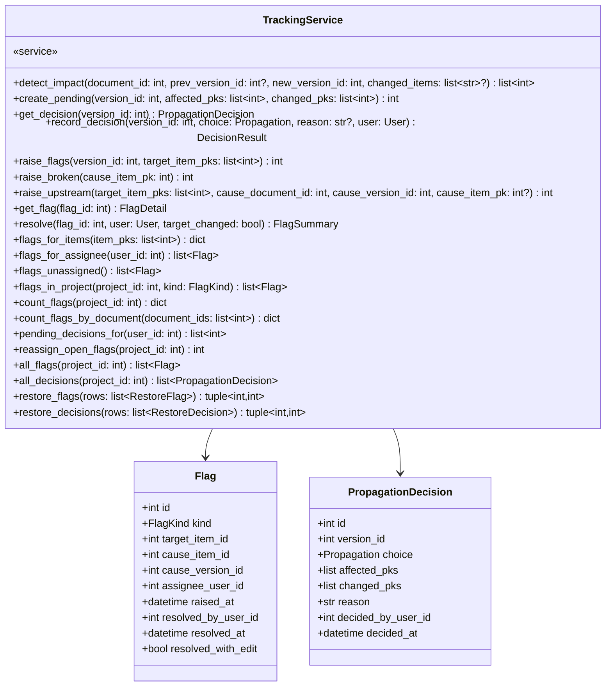

| 메서드 | 부르는 곳 | 유스케이스 | 던지는 에러 |
|---|---|---|---|
| `detect_impact` · `create_pending` | pipeline | [[SYNC-UC-001#UC-S3]] | |
| `get_decision` | [[SYNC-API-001#GET/api/decisions/{versionId}]] (queries) | [[SYNC-UC-001#UC-H10]] 1 | not-found |
| `record_decision` | [[SYNC-API-001#POST/api/decisions/{versionId}]] | [[SYNC-UC-001#UC-H10]] 2, 2a | reason-required, already-decided |
| `raise_flags` | record_decision | [[SYNC-UC-001#UC-S4]] | |
| `raise_broken` | pipeline (삭제 확정 시) | [[SYNC-UC-001#UC-H13]] 5 | |
| `raise_upstream` | pipeline (`upstream_impact` 지정 시 · change_status 승인 대조) | [[SYNC-UC-001#UC-S4]], [[SYNC-UC-001#UC-H8]] 5 | |
| `get_flag` | [[SYNC-API-001#GET/api/flags/{id}]] | [[SYNC-UC-001#UC-H11]] 2 | not-found |
| `resolve` | [[SYNC-API-001#POST/api/flags/{id}/resolve]] | [[SYNC-UC-001#UC-H11]] 5~6 | |
| `flags_for_*` · `count_flags*` · `pending_decisions_for` | queries | [[SYNC-UC-001#UC-H2]], H14, H15 | |

**규칙이 사는 곳**
- `detect_impact`: `SpecService.diff`로 바뀐 항목 ID를 얻고 `ReferenceService.downstream`으로 영향 목록. 신규 문서면 빈 목록([[SYNC-UC-001#UC-S3]] 1a). 있으면 `create_pending`으로 `undecided` 행 — "결정 안 된 저장"이 존재해야 한다
- `record_decision`: `skip and not reason` → reason-required. 이미 결정됐으면 already-decided. `propagate`면 `raise_flags`
- `raise_flags`: 담당자 = `SpecService.last_author(대상 문서)`. null이면 담당 미지정([[SYNC-UC-001#UC-S4]] 3b). 어느 경로든 `author_user_id`는 사람이라 작성자·지시자 구분이 무의미하다(5장 1)
- `get_flag`·`resolve`: 원인 diff는 `SpecService.diff(부여 시점 버전 → 현재)`. `resolved_with_edit`는 부여 후 대상 문서에 새 버전이 있었나로 서버가 판정([[SYNC-UC-001#UC-H11]] 3b)

### 4.5 collab

#### CommentService

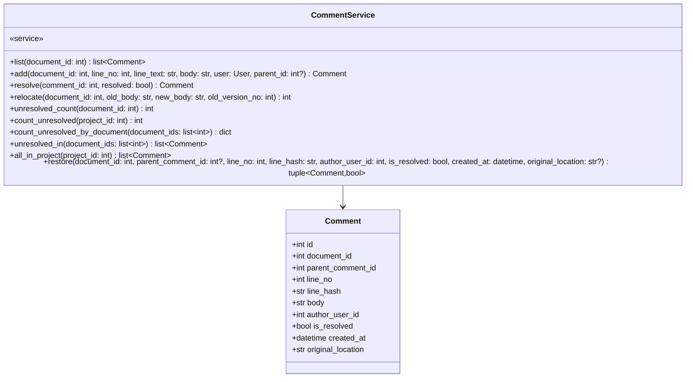

| 메서드 | 부르는 곳 | 유스케이스 |
|---|---|---|
| `list` | [[SYNC-API-001#GET/api/docs/{docId}/comments]] | [[SYNC-UC-001#UC-H9]] |
| `add` | [[SYNC-API-001#POST/api/docs/{docId}/comments]] | [[SYNC-UC-001#UC-H9]] 1~2 |
| `resolve` | [[SYNC-API-001#POST/api/comments/{id}/resolve]] | [[SYNC-UC-001#UC-H9]] 4, 4a |
| `relocate` | pipeline | [[SYNC-UC-001#UC-H9]] 2a, 2b |
| `unresolved_count` · `count_unresolved*` · `unresolved_in` | queries · pipeline.change_status | [[SYNC-UC-001#UC-H8]] 2a, H14, H15 |

**규칙이 사는 곳**
- `add`: **본문을 직접 읽지 않는다.** 라우터가 `SpecService.get_document`로 `line_text`를 뽑아 넘긴다(되먹임 #15). `line_hash = sha256(line_text.strip())`
- `relocate`: 새 본문에서 `line_hash`로 줄을 찾아 `line_no` 갱신. 못 찾으면 `original_location`에 "v{n}:{줄}"

### 4.6 account

#### AccountService

```mermaid
classDiagram
    class AccountService {
        «service»
        +async login_github(code: str, state: str) User
        +list_tokens(user: User) list~AccessToken~
        +issue_token(user: User, label: str) IssuedToken
        +revoke_token(user: User, token_id: int) None
        +authenticate_token(raw: str) User?
        +github_token_for(user: User) str
        +user_by_login(login: str) User?
        +users_by_ids(ids: list~int~) dict
        +create_placeholder(login: str) User
        +user_for_commit(email: str, login: str) User
        +commit_emails(user: User) list~CommitEmail~
        +add_commit_email(user: User, email: str) CommitEmail
        +remove_commit_email(user: User, email_id: int) None
    }
    class User {
        +int id
        +str github_login
        +int github_user_id
        +str display_name
        +bytes github_token_encrypted
        +datetime created_at
    }
    class AccessToken {
        +int id
        +int user_id
        +str token_hash
        +str label
        +datetime issued_at
        +datetime expires_at
        +datetime revoked_at
        +datetime last_used_at
    }
    class CommitEmail {
        +int id
        +int user_id
        +str email
        +datetime added_at
    }
    AccountService --> User
    AccountService --> AccessToken
    AccountService --> CommitEmail
```

| 메서드 | 부르는 곳 | 근거 |
|---|---|---|
| `login_github` | [[SYNC-API-001#GET/auth/github/callback]] | 인프라 5, SEQ-8 |
| `list_tokens` · `issue_token` · `revoke_token` | /api/me/tokens | UI-13 |
| `authenticate_token` | MCP 모든 요청 (SEQ-C2) | 인프라 5 |
| `github_token_for` | infra/git | 인프라 5. 복호화 |
| `user_by_login` · `create_placeholder` | `AccountService.user_for_commit` · web/auth | login으로 찾기·자리표시 만들기. **파이프라인이 직접 부르지 않는다** — `user_for_commit`을 거친다 |
| `user_for_commit` | pipeline.process_commit · pipeline.rebuild | [[SYNC-UC-001#UC-G1]]. 커밋 작성자 → User. **이메일 먼저**, 없으면 login, 없으면 자리표시 생성 |
| `commit_emails` · `add_commit_email` · `remove_commit_email` | /api/me/emails | UI-13 2.3~2.6 |

**규칙이 사는 곳**
- `issue_token`: 원문은 반환에만. 저장은 SHA-256 해시
- `login_github`: `github_user_id`로 upsert(로그인 ID 변경 대응). OAuth 토큰은 앱 비밀키로 암호화
- `authenticate_token`: `revoked_at`이 있거나 `expires_at`이 지났으면 None
- `user_for_commit`: **이메일 → login → 자리표시** 순. 자리표시를 만드는 곳이 여기 하나뿐이어야 판정이 두 경로에서 어긋나지 않는다(5장 결정 3)
- `add_commit_email`: `strip().lower()`로 정규화. 남이 이미 가진 이메일이면 거부, 내가 이미 가졌으면 그 행을 돌려준다(멱등)

### 4.7 pipeline — 쓰기 조율

묶음 밖. 클래스가 아니라 함수 일곱이다. 시퀀스 SEQ-1·2·5·7·19·21이 이 함수들의 시간축이다.

```
save_pipeline(entry: Entry, doc_id: str | None, doc_type: DocType | None,
              body: str, expected_version: int | None,
              project_code: str | None,
              author: Author, message: str,
              changed_items: list[str] | None = None,
              upstream_impact: list[str] | None = None,
              confirm_item_deletion: bool = False,
              commit_hash: str | None = None) -> SaveResult

    message       mcp: 에이전트가 준 것 · web: 서버가 만듦("status(…)", "revert to vN") · github: 커밋 메시지 그대로
    changed_items mcp: 에이전트가 지정 · web_revert·github: None → tracking.detect_impact가 diff로 판정

    entry ∈ {mcp, web_revert, web_status, github}

    0. repo lock 획득 (저장소 단위. 프로세스 내 락)
    1. spec.get_document(doc_id)                 (수정·되돌리기·상태 변경일 때)
    2. spec.validate(body, doc_type, entry)      → 위반이면 convention-violation
                                                   github 경로는 거부 대신 has_convention_error 표시
                                                   warnings는 incomplete_warnings에 저장
    3. expected_version != current_version_no    → version-conflict (mcp·web 경로만)
    4. spec.detect_deleted_items(document, body) → pk마다 reference.downstream
                                                   있고 confirm=False → item-deletion-needs-confirm
    5. git.commit_push(...)                      → push-failed. (github 경로는 건너뜀 — 이미 원격에 있음)
    ── 여기까지 DB 변경 없음. push 실패면 아무것도 안 남는다 ──
    6. 한 트랜잭션:
         spec.create 또는 spec.save(commit_hash, deleted_item_pks)
         tracking.raise_broken(pk) ×N            (삭제 확정 시)
         reference.extract
         tracking.detect_impact                  → 있으면 tracking.create_pending
         tracking.raise_upstream                 (upstream_impact 지정 시. 대상은 spec.resolve_item으로. 못 찾으면 경고)
         collab.relocate
    7. repo lock 해제. 반환 SaveResult

    entry=web_status: 1 → 2(frontmatter만) → 3 → 5(message "status(...)") → 6은 Document.status + StatusChange(commit_hash)만.
                      Version·extract·detect_impact 없음.

change_status(doc_id, to, user, reason, upstream_reviewed=False, upstream_mismatch=[]) -> DocumentSummary
    UC-H8. 검사(status-blocked·upstream-review-required) → frontmatter status 교체 → save_pipeline(entry=web_status, reason)
    → upstream_mismatch 있으면 tracking.raise_upstream. 세션 하나 — 자기가 열고 save_pipeline에 넘긴다.

revert(doc_id, to_version, user, confirm_item_deletion=False) -> SaveResult
    UC-H7. 옛 버전 본문 → save_pipeline(entry=web_revert). already-current 검사.

process_commit(repo: Repository, head_hash: str) -> list[SaveResult]
    webhook·폴링·기동 시 따라잡기가 부른다.
    git.changed_files(last_processed..head, "docs/specs/") → 파일마다 save_pipeline(entry=github, commit_hash=...)
    author = account.user_by_login(커밋 작성자)
    밀린 커밋 여럿이면 최종 상태만 저장. 중간 버전은 git에만 (인프라 7장)
    끝나면 repositories.last_processed_commit = head

rebuild(code: str, session: Session | None = None) -> RebuildResult
    [[SYNC-UC-001#UC-S6]]. 한 트랜잭션:
    reference.clear · spec.clear_index(versions만 삭제. documents·items는 유지 — 플래그·댓글이 FK로 물려 있음)
    파일마다 git.log → 커밋마다 spec.validate · spec.save(rebuild=True. items는 upsert)
    reference.extract(최신) · spec.mark_convention_error
    tracking.relink_versions(옛 지도, 새 지도) · tracking.reassign_open_flags

export_tracking(code: str) -> str
    [[SYNC-INFRA-001]] 6.1. 플래그·전파결정·댓글을 자연키 JSON으로 backup/tracking.json에 커밋.
    읽기만 한다. 등록자 토큰으로 push. 내용이 같으면 커밋이 안 생긴다(git.commit_push).

import_tracking(code: str) -> RestoreResult
    UI-14 요소 6. 그 파일을 읽어 이름으로 되붙인다. 멱등 — 이미 있는 행은 건너뛴다.
    이름이 안 붙는 행은 버리고 dropped에 센다.
```

**트랜잭션 경계** — 검증·버전 검사·삭제 검사는 DB를 읽기만 한다. push가 성공한 뒤에야 6번 트랜잭션 하나로 쓴다. push가 실패하면 롤백할 게 없다(되먹임 #3). 락은 두 에이전트가 같은 저장소에 동시에 push해 rebase 충돌을 내는 걸 막는다(#4).

### 4.8 queries — 읽기 조합

묶음 밖. 라우터·MCP 도구가 여러 묶음에서 모아야 하는 응답을 여기서 만든다. 시퀀스 SEQ-9~15·17·18이 이 함수들의 시간축이다. 서비스는 자기 묶음 테이블만 알고, `queries`가 ID로 이어 붙인다.

```
project_summary() -> list[ProjectSummary]           SEQ-9   projects → list_by_project → 단계 11칸 계산 → count_flags · count_unresolved
project_detail(code) -> ProjectDetail               SEQ-9   + recent_changes
document_list(code, stage?, status?) -> list        SEQ-10  list_by_project → count_flags_by_document · count_unresolved_by_document
document_view(doc_id) -> Document                   SEQ-11  get_document → flags_for_items → neighbors
item_view(doc_id, item_id) -> ItemView              SEQ-12  get_item → flags_for_items
item_references_view(doc_id, item_id) -> ItemReferences
                                                    SEQ-13  resolve_item → upstream · downstream · downstream_of_document → describe_items → flags_for_items
graph_view(code, stage?, doc?) -> Graph             SEQ-14  list_items_by_project → references_among → isolated 계산 (좌표 없음)
diff_with_impact(doc_id, from, to) -> Diff          SEQ-15  diff → resolve_items → count_downstream
todo(user) -> Todo                                  SEQ-17  flags_for_assignee · flags_unassigned · pending_decisions_for → versions_instructed_by
                                                            · convention_error_docs_by · documents_authored_by → unresolved_in · describe_items
project_items(code, kind) -> list                   SEQ-18  kind별로 flags_in_project | unresolved_in | list_by_project(has_convention_error)
decision_view(version_id) -> DecisionDetail         SEQ-3   get_decision → diff → describe_items · last_author
flag_view(flag_id) -> FlagDetail                    SEQ-6   get_flag → describe_items → diff(원인) 또는 get_item(하위, upstream_impact면) · get_item(대상) · 대상 변경 판정
upstream_checklist(doc_id) -> list                  SEQ-5   이 문서의 upstream 참조 전부 → describe_items · 대상 문서 상태·버전. 승인 대조용
downstream_view(doc_id) -> DownstreamView           —       이 문서를 참조하는 것. 추적표·하위 참조 수 (V-PRD)
```

**규칙** — `queries`는 쓰지 않는다. 읽고 조합만 한다. 건수는 `document_ids`로 묶어 한 번에 묻는다(N+1 금지). 단계 11칸 계산(가장 낮은 상태·gate_warning)은 `project_summary` 안에 있다 — `ProjectService`가 아니라.

### 4.9 infra — 어댑터

묶음 밖. 서비스가 아니라 git 명령·GitHub API를 감싸는 얇은 층. core는 이것을 통해서만 바깥을 만진다. 시그니처는 [[SYNC-MS-009]]에서 확정.

```
git.clone(remote_url, workdir, token) -> None
git.fetch(workdir, token=None) -> str          origin/HEAD 해시. v1은 public이라 토큰 없이
git.checkout(workdir, ref) -> None
git.commit_push(workdir, message, author, path=None, content=None, files=None) -> str
git.read(workdir, path, ref="HEAD") -> str
git.changed_files(workdir, range, prefix) -> list[ChangedFile]
git.list(workdir, glob, ref="HEAD") -> list[str]
git.log(workdir, path) -> list[Commit]
git.rev_list_count(workdir, range) -> int
git.last_commit_at(workdir, path) -> datetime | None
git.exists(workdir, path) -> bool
git.init_specs(workdir) -> dict[str, str]

github.verify_signature(body, header) -> bool
github.exchange_code(code) -> str
github.get_user(token) -> GithubUser
```

**규칙** — `git.commit_push`만 `AccountService.github_token_for`를 부른다(3.2). 토큰은 push URL에만 쓰고 `.git/config`에 남기지 않는다.

## 5. 판단이 필요한 지점

**1. `flags.assignee` — 결정: 대상 문서 최근 버전의 `author_user_id`.** 어느 경로든 이 값은 사람이다. MCP는 토큰 발급자, 웹은 로그인 사용자, GitHub는 커밋 작성자. "작성자 vs 지시자"는 둘이 항상 같아서 가짜 질문이었다.

**2. `display_name`과 항목 블록** — v2까지 미결이었으나 [[SYNC-STD-001]] 1.3으로 풀렸다. 항목 = ID로 시작하는 헤딩, 제목 = ID 뒤 나머지, 블록 = 같은 레벨 이상 다음 헤딩까지. `SpecService.item_blocks`가 구현한다.

**3. 미등록 GitHub 사용자 — 결정: 커밋 이메일로 먼저 잇고, 못 찾으면 자리표시 User + 규약 오류.** push는 이미 들어온 뒤라 거부할 수 없고 건너뛰면 원본·DB가 어긋난다.

**작성자를 찾는 순서는 셋이고, 순서가 규칙이다.**

1. **커밋 이메일**(`commit_emails`) — git 커밋이 남기는 신원 중 계정으로 이어지는 것은 이메일뿐이다
2. **`github_login`** — 커밋 이메일이 GitHub noreply(`{id}+{login}@users.noreply.github.com`)면 앞부분이 곧 로그인 ID다
3. **자리표시 생성** — `github_login`만 있는 User(`github_user_id`·`github_token_encrypted` null)

**자리표시의 `github_login`은 GitHub 로그인이 아닐 수 있다.** noreply가 아닌 커밋에서는 `%an`(사람 이름)이 대체값으로 들어간다 — 공백이 든 문자열이 컬럼에 앉는다. 그래서 그 사람이 나중에 OAuth 로그인해도 login 대조로는 합쳐지지 않는다. **합치는 경로는 본인이 UI-13에서 커밋 이메일을 등록하고 인덱스를 재구축하는 것이다.** 앞으로의 커밋은 GitHub 설정에서 메일 비공개를 켜 noreply로 나가게 하면 2번에서 바로 잡힌다([[SYNC-INFRA-001]] 5장).

**`author.unknown`은 「방금 자리표시를 만들었나」가 아니라 「작성자가 자리표시인가」(`github_user_id`가 null인가)로 판정한다.** 전자로 판정하면 같은 사람의 둘째 문서부터는 이미 행이 있어서 오류가 안 붙는다 — 첫 문서 하나만 막히고 나머지는 새어 나간다. 이 판정은 **저장 경로(`process_commit`)와 재구축 경로(`rebuild`) 둘 다**에 있어야 한다. 한쪽에만 두면 실물이 어느 경로로 만들어졌는지에 따라 오류가 0건이 된다(#34).

**계정을 합쳐도 옛 문서의 규약 오류는 저절로 안 풀린다.** `login_github`은 `users` 행만 합치고 `documents.convention_error_detail`은 그대로다. 재구축이 유일한 청소 경로다 — 계정 묶음이 명세 묶음을 직접 건드리는 것은 [[SYNC-DOM-001]] 4장 경계 위반이라 자동 청소를 두지 않는다.

**이메일 사칭은 막지 못한다 — 다만 권한은 안 준다.** 남의 이메일을 등록하면 그 사람 커밋이 내 이름으로 붙는다. `commit_emails.email`의 유일 제약이 1차 방어다(먼저 등록한 쪽이 임자, 둘째는 거부). push 권한은 여전히 `github_token_encrypted`가 있어야 한다. 저장소 권한이 곧 접근 권한이라는 전제([[SYNC-INFRA-001]] 5장) 아래 v1은 여기까지다.

---

## 6. 부록: FastAPI·SQLAlchemy 구현 형태

본문은 언어 중립이다. 이 절만 스택에 묶인다.

**모델**: SQLAlchemy 2.x declarative. 열거형은 `str` 컬럼 + `Enum` 파이썬 클래스로 검증.

```python
# core/spec/models.py
class Document(Base):
    __tablename__ = "documents"
    id: Mapped[int] = mapped_column(primary_key=True)
    doc_id: Mapped[str] = mapped_column(String(30), unique=True)
    status: Mapped[str] = mapped_column(String(10))
    ...
```

**세션**: 요청마다 하나. `pipeline.save_pipeline`은 push 전까지 DB를 읽기만 하고, push 성공 후 6번 단계를 한 트랜잭션으로 쓴다. push 실패 시 롤백할 게 없다. 저장소 단위 락은 `asyncio.Lock`을 저장소별로 하나씩 (프로세스 하나 전제).

**MCP**: `mcp` 파이썬 SDK의 streamable HTTP. 도구 하나가 `core/*/service` 메서드 하나에 대응.

**마이그레이션**: Alembic. 열거형 값 추가는 마이그레이션 없이 앱 상수만 바꾼다.

**렌더링**: 서버는 그림을 만들지 않는다. React가 원본 MD의 mermaid 블록을 mermaid.js로 렌더링한다.

---

## 7. 미결사항

- [x] 저장소 락 범위 — 지금은 저장소 단위. 파일 단위로 좁힐지 — 결정: 저장소(프로젝트 코드) 단위. `core/pipeline.py`의 `_lock(code)`. 파일 단위로 좁히는 건 경합이 실제로 보일 때
- [x] `repo_status`의 fetch를 캐시할지 — 결정: 캐시가 아니라 DB에서 읽는다. `Repository`에 `behind_by`·`fetched_at`을 두고 폴링이 갱신하며 화면은 읽기만 한다. 폴링이 이미 5분마다 같은 fetch를 하고 있어 지금은 이중으로 돈다
