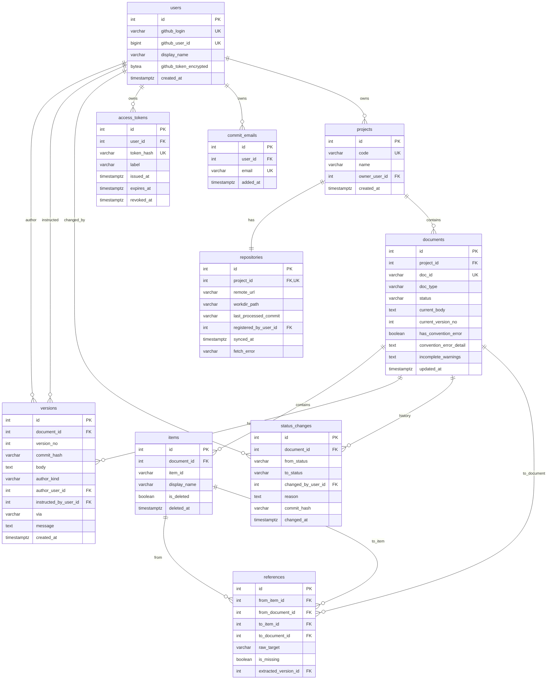

# ERD·DD: 싱크독 (SyncDoc)

---

## 0. 이 문서가 다루는 것

클래스 명세의 엔티티 클래스를 **테이블**로 옮긴다. ERD는 그림, DD는 컬럼마다 의미·타입·제약을 적은 설명서다. 둘은 한 세트다.

ORM 모델 = 도메인 객체로 정했으므로 이 문서의 테이블은 [[SYNC-DOM-002]]의 엔티티 클래스와 1:1이다. 클래스가 바뀌면 이 문서도 같이 고친다.

**전제**
- 기본키는 대리키(int 자동 증가). 사람이 부르는 ID는 unique 제약
- 버전 테이블에 본문 전체를 둔다
- 열거형은 DB enum이 아니라 varchar + 앱 검증
- 알림 테이블 없음

---

## 1. ERD

**설계 규칙**
- 모든 테이블 PK는 `int` 자동 증가. 사람이 부르는 ID(`doc_id`, `item_id`, `code`)는 UK
- 시각은 전부 `timestamptz`
- 열거형은 DB enum이 아니라 `varchar` + 앱 검증. 값 추가 시 마이그레이션을 피하기 위해서
- 삭제 컬럼은 `items`에만 있다. 문서·버전은 삭제하지 않는다 — 문서는 `documents.trashed_at`으로 **휴지통**에 넣는다(행은 남는다). **행까지 지우는 것**은 휴지통 안에서 다른 문서가 가리키지 않을 때만([[SYNC-MS-002#SpecService.delete_document]]) — 그 문서에 딸린 상태변경은 같이 지운다
- **재구축(UC-S6)은 `versions`·`references`만 지운다.** `documents`·`items`는 지우지 않는다 — 항목 ID 재사용 금지의 근거(`items.is_deleted`)와 휴지통 상태(`documents.trashed_at`)가 거기 산다. `items`는 upsert
- 상태 변경은 `versions` 행을 만들지 않는다. `status_changes.commit_hash`가 그 커밋을 가리킨다
- `references`의 `to_item_id`와 `to_document_id`는 CHECK로 하나만 채워지게 한다. `is_missing=true`면 둘 다 null
- **끊어진 참조는 별도 표가 아니다.** 대상 항목이 삭제되면 그것을 가리키던 참조의 `to_*`를 비우고 `is_missing=true`로 되돌린다([[SYNC-MS-003#ReferenceService.mark_missing]]). `raw_target`이 남아 있어 상대가 돌아오면 `resolve_missing`이 다시 잇는다. v1의 `flags`·`propagation_decisions`·`comments`는 v2에서 뺐다([[SYNC-DOM-001]] 3.3) — 리비전 0011이 세 표를 지운다. `downgrade`는 0001·0007·0008의 정의를 복원하지만 데이터는 돌아오지 않는다. 옛 행은 각 저장소의 `backup/tracking.json`과 태그 `v1-collab`의 `import_tracking`으로만 되살릴 수 있다
- **소유는 `projects.owner_user_id` 한 컬럼이다.** 별도 권한 표가 없다. 리비전 `0012_add_projects_owner`가 nullable로 더하고 `repositories.registered_by_user_id`(없으면 `min(users.id)`)로 채운 뒤 not null·FK로 조인다(0004 선례). `downgrade`는 컬럼을 지운다

---

## 2. DD (데이터 사전)

주요 컬럼만. 이름으로 뜻이 드러나는 것(`created_at`, `*_user_id`)은 뺐다.

### projects

클래스: [[SYNC-DOM-002#Project]]

| 컬럼 | 타입 | 제약 | 의미 | 예시 |
|---|---|---|---|---|
| code | varchar(4) | UK, `^[A-Z]{1,4}$` | 프로젝트 코드. 문서 ID 앞부분 | `SYNC` |
| name | varchar(100) | not null | 표시 이름 | `싱크독` |
| owner_user_id | int | FK not null | **소유자.** 등록한 사람이고 바뀌지 않는다([[SYNC-PRD-001#R12]]). 소유자가 아니면 이 프로젝트는 목록에도 없고 주소로 열어도 not-found — `ProjectService.get_owned`가 이 컬럼 하나로 판정한다. 자리표시 User는 앉을 수 없다(등록에 토큰이 필요). `repositories.registered_by_user_id`와 값이 같아도 뜻이 다르다([[SYNC-DOM-002]] 5장 결정 6) | |

### repositories

클래스: [[SYNC-DOM-002#Repository]]

| 컬럼 | 타입 | 제약 | 의미 | 예시 |
|---|---|---|---|---|
| remote_url | varchar(300) | not null | GitHub 저장소 주소 | `https://github.com/dfocus/syncdoc` |
| workdir_path | varchar(300) | not null | 노트북의 작업 사본 경로 | `/var/syncdoc/repos/SYNC` |
| last_processed_commit | varchar(40) | null 허용 | 파이프라인이 마지막으로 처리한 커밋. 밀린 커밋 따라잡기 기준 | `a1b2c3…` |
| registered_by_user_id | int | FK not null | **push 토큰의 주인.** GitHub 경로 자동 강등 커밋을 이 사람 토큰으로 민다. private 저장소를 지원할 때 fetch에 쓸 토큰의 주인이기도 하다. 소유자가 아니다 — 소유는 `projects.owner_user_id` — 폴링·재구축은 요청한 사람이 없거나 다른 사람일 수 있다. **v1은 public만 쓰므로 fetch에 토큰이 필요 없다**(MS-009 미결) | |
| synced_at | timestamptz | null 허용 | 마지막으로 원격을 받아온 시각. 폴링이 갱신 | |
| behind_by | int | null 허용 | 원격이 앞선 커밋 수. 0이면 최신, null이면 아직 못 받아봄 | `0` |
| fetched_at | timestamptz | null 허용 | `behind_by`를 잰 시각. 화면이 "언제 기준인지" 보여준다 | |
| fetch_error | varchar(300) | null 허용 | **마지막 폴링이 실패한 이유.** 성공하면 비운다. 폴링은 저장소 하나가 죽어도 다음을 계속하고 로그만 남기므로([[SYNC-MS-007#scheduler.catch_up]]), 이 값이 없으면 **사람은 「아무도 push를 안 했나 보다」로 읽는다**(#46) | `git rev-parse origin/main: fatal…` |

### documents

클래스: [[SYNC-DOM-002#Document]]

| 컬럼 | 타입 | 제약 | 의미 | 예시 |
|---|---|---|---|---|
| doc_id | varchar(30) | UK | 사람이 부르는 문서 ID | `SYNC-PRD-001` |
| doc_type | varchar(10) | DocType 중 하나 | 11단계 타입 코드 | `PRD` |
| status | varchar(10) | DocStatus (`draft` · `approved`) | frontmatter의 status와 같아야 한다. DB는 사본 | `approved` |
| current_body | text | not null | 현재 버전 본문 캐시. `versions.body`와 같다 | |
| current_version_no | int | not null, ≥1 | 낙관적 잠금용. save 시 대조 | `7` |
| has_convention_error | boolean | default false | GitHub 경로로 들어온 규약 위반 문서 | |
| convention_error_detail | text | null 허용 | 어느 규약을 어떻게 어겼는지. STD-001 3장 rule | `frontmatter.field: status` |
| incomplete_warnings | text | null 허용 | 미완성 경고(STD-001 4장). 있으면 `approved` 불가. JSON 배열 | `["section.missing: 성공지표"]` |
| trashed_at | timestamptz | null 허용 | 휴지통에 넣은 시각. null이면 살아 있는 문서. 목록·단계 칸·그래프에서 빠지고 저장·상태 변경이 막힌다(`document-trashed`). 되살리면 null | |
| trashed_by_user_id | int | FK users, null 허용 | 누가 넣었나 | |

### items

클래스: [[SYNC-DOM-002#Item]]

| 컬럼 | 타입 | 제약 | 의미 | 예시 |
|---|---|---|---|---|
| item_id | varchar(50) | (document_id, item_id) UK | `#` 뒤 부분. 문서 내 유일 | `R12`, `POST/orders` |
| display_name | varchar(200) | null 허용 | 항목이 붙은 줄의 제목. 본문에서 추출 | `문서를 조회한다` |
| is_deleted | boolean | default false | 본문에서 사라진 항목. 행은 남긴다 — ID 재사용 금지 검증용 | |

### versions

클래스: [[SYNC-DOM-002#Version]]

| 컬럼 | 타입 | 제약 | 의미 | 예시 |
|---|---|---|---|---|
| version_no | int | (document_id, version_no) UK | 문서 안 순번. 1부터 | `7` |
| commit_hash | varchar(40) | not null | 이 버전을 만든 git 커밋 | |
| body | text | not null | 본문 전체. diff·되돌리기용 | |
| author_kind | varchar(10) | AuthorKind | 사람이 썼나 에이전트가 썼나 | `agent` |
| author_user_id | int | FK not null | 커밋 작성자. 에이전트면 토큰 발급자 | |
| instructed_by_user_id | int | FK null 허용 | 에이전트에게 시킨 사람. 사람이 직접 썼으면 null | |
| via | varchar(8) | not null | 어느 입구로 저장됐나 — `mcp` / `web`(되돌리기) / `github`. `Author.via`를 접은 것. 이력 화면이 구분한다 | `web` |
| message | text | not null | 커밋 메시지 전문. 첫 줄 요약, 둘째 줄부터 이유(STD-001 1.7). git에도 있지만 이력 화면·최근 변경이 DB만으로 그리려고 사본 | `spec(SYNC-PRD-001): R12 …` |

### status_changes

클래스: [[SYNC-DOM-002#StatusChange]]

| 컬럼 | 타입 | 제약 | 의미 | 예시 |
|---|---|---|---|---|
| from_status | varchar(10) | DocStatus, null 허용 | 이전 상태. 문서 생성 시 첫 행은 null | `draft` |
| to_status | varchar(10) | DocStatus not null | 바뀐 상태 | `approved` |
| reason | text | null 허용 | 강등 사유 등. 완료 문서 수정으로 자동 강등되면 시스템이 채운다. 휴지통은 `휴지통`으로 적어 되살리기가 그 행의 커밋을 찾는다 | `본문 수정으로 자동 강등` |
| commit_hash | varchar(40) | null 허용 | 상태 변경으로 생긴 `status(...)` 커밋. 자동 강등(본문 커밋에 딸림)이면 null. 이력 화면이 `versions`와 합쳐 보여준다 | |

### references

클래스: [[SYNC-DOM-002#Reference]]

| 컬럼 | 타입 | 제약 | 의미 | 예시 |
|---|---|---|---|---|
| from_item_id | int | FK null 허용 | 참조를 적은 항목 (하위). 항목 밖(절 본문)이나 frontmatter `upstream`이면 null | |
| from_document_id | int | FK not null | 참조가 있는 문서. `from_item_id`가 null일 때 출발점 | |
| to_item_id | int | FK, to_document_id와 배타 | 가리키는 항목 (상위) | |
| to_document_id | int | FK, to_item_id와 배타 | 문서 전체를 가리킬 때 | |
| raw_target | varchar(100) | not null | 본문에 적힌 문자열 그대로. 미존재·끊어진 참조는 이걸로 표시 | `SYNC-PRD-001#R12` |
| is_missing | boolean | default false | 대상이 아직 없거나 삭제됐음. true면 to_*는 null | |
| extracted_version_id | int | FK | 어느 버전 저장 때 추출됐나 | |

### users

클래스: [[SYNC-DOM-002#User]]

| 컬럼 | 타입 | 제약 | 의미 | 예시 |
|---|---|---|---|---|
| github_login | varchar(50) | UK | GitHub 아이디. **자리표시 User에서는 아이디가 아닐 수 있다** — 커밋 이메일이 noreply가 아니면 `%an`(사람 이름)이 대체값으로 들어간다([[SYNC-DOM-002]] 5장 결정 3) | `hoyoung-park` |
| github_user_id | bigint | UK | GitHub 숫자 ID. 아이디 변경에 대비 | |
| github_token_encrypted | bytea | null 허용 | OAuth 토큰. 앱 비밀키로 암호화. push에 사용. **null이면 미등록** — GitHub 직접 push로만 알려진 사람(자리표시). 로그인하면 채워진다 | |

### commit_emails

클래스: [[SYNC-DOM-002#CommitEmail]]

| 컬럼 | 타입 | 제약 | 의미 | 예시 |
|---|---|---|---|---|
| email | varchar(255) | UK | git 커밋의 `%ae`. **소문자로 정규화해 저장한다** — git 이메일은 대소문자가 흔들린다. UK인 이유는 이메일 하나가 사람 하나여야 작성자 판정이 답을 하나로 내기 때문이다 | `you@example.com` |
| added_at | timestamptz | not null | 등록 시각. 사람이 UI-13 2.6에서 직접 등록한다 — 시스템이 추측해 넣지 않는다 | |

### access_tokens

클래스: [[SYNC-DOM-002#AccessToken]]

| 컬럼 | 타입 | 제약 | 의미 | 예시 |
|---|---|---|---|---|
| token_hash | varchar(64) | UK | 토큰 원문의 SHA-256. 원문은 저장 안 함 | |
| label | varchar(50) | | 사용자가 붙인 이름 | `Claude Code 노트북` |
| issued_at | timestamptz | not null | 발급 시각 | |
| expires_at | timestamptz | null 허용 | 만료 시각. **v1은 항상 null**(인프라 9장 — 만료 없음). 컬럼과 검증 분기는 정책이 바뀔 때를 위해 남겨 둔다 | |
| revoked_at | timestamptz | null 허용 | 폐기 시각. null이면 유효 | |
| last_used_at | timestamptz | null 허용 | 이 토큰으로 마지막에 들어온 시각. null이면 한 번도 안 씀. 만료가 없으므로 안 쓰는 토큰을 찾는 단서가 이것뿐이다(UI-13 3.5) | |

---

## 3. 인덱스와 정규화

[[SYNC-STD-004#DEV-8]] — 인덱스는 여기 적힌 것만. FK와 unique는 전부 인덱스(생략). 아래는 조회 패턴에서 온 추가 인덱스.

| 테이블 | 인덱스 | 이유 (어느 쿼리) |
|---|---|---|
| projects | `(owner_user_id)` | FK 컬럼(DEV-8) · `list_owned` |
| documents | `(project_id, doc_type)` | 단계별 목록 · `list_by_project(stage)` |
| documents | `(has_convention_error) where true` 부분 | 규약 오류 문서 · `convention_error_docs_by` |
| documents | `(trashed_by_user_id)` | FK 컬럼(DEV-8). 휴지통 목록은 프로젝트 단위라 `(project_id, doc_type)`로 충분 |
| items | `(document_id, is_deleted)` | 현재 항목 목록 · `detect_deleted_items` · `item_blocks` 대조 |
| versions | `(document_id, version_no desc)` | 최근 버전 · `last_author` · `current` |
| versions | `(author_user_id, created_at)` · `(instructed_by_user_id)` | FK 컬럼(DEV-8) · 작성자별 이력 |
| references | `(from_item_id)` · `(to_item_id)` · `(to_document_id)` · `(from_document_id)` | 상·하위 조회 전부 |
| references | `(is_missing) where true` 부분 | `resolve_missing` |
| status_changes | `(document_id, changed_at)` | 이력 병합 |
| access_tokens | `(token_hash)` unique — 이미 | MCP 인증 |

**정규화** — 전 테이블 3NF. 의도적 비정규화 하나([[SYNC-STD-004#DEV-9]]): `documents.current_body`(조회 캐시, `versions.body`와 같음). `versions.body` 전체 저장은 비정규화가 아니라 git 사본이다.

## 4. 판단이 필요한 지점

**1. `documents.status`와 frontmatter의 동기화.** 둘이 어긋나면 어느 쪽이 맞나? 원칙은 frontmatter. 파이프라인이 저장 때마다 frontmatter를 읽어 `status`를 덮어쓴다.

---

## 5. 미결사항

- [x] `versions.body`가 커지면 압축할지 — 지금은 안 함 — 결정: 압축하지 않는다. PostgreSQL이 2KB 넘는 텍스트를 TOAST로 밖에 빼 이미 압축한다(마크다운은 서너 배). 실측: 명세 40개 740KB, 전체 덤프 420KB. **전체 덤프가 100MB를 넘거나 한 프로젝트의 버전이 수천 개가 되면 다시 본다** — 그때는 압축보다 오래된 버전의 본문을 비우는 쪽(원본은 git에 있다)
- [x] DB 유실 시 복구 불가 항목(플래그·전파결정·댓글)의 백업 — 인프라 미결사항과 같음 — 결정: DB 덤프를 저장소에 커밋한다 ([[SYNC-INFRA-001]] 6장) → **v2에서 세 표를 뺐다**(카드 V). 복구 불가 항목이 없어졌으므로 백업도 없다
