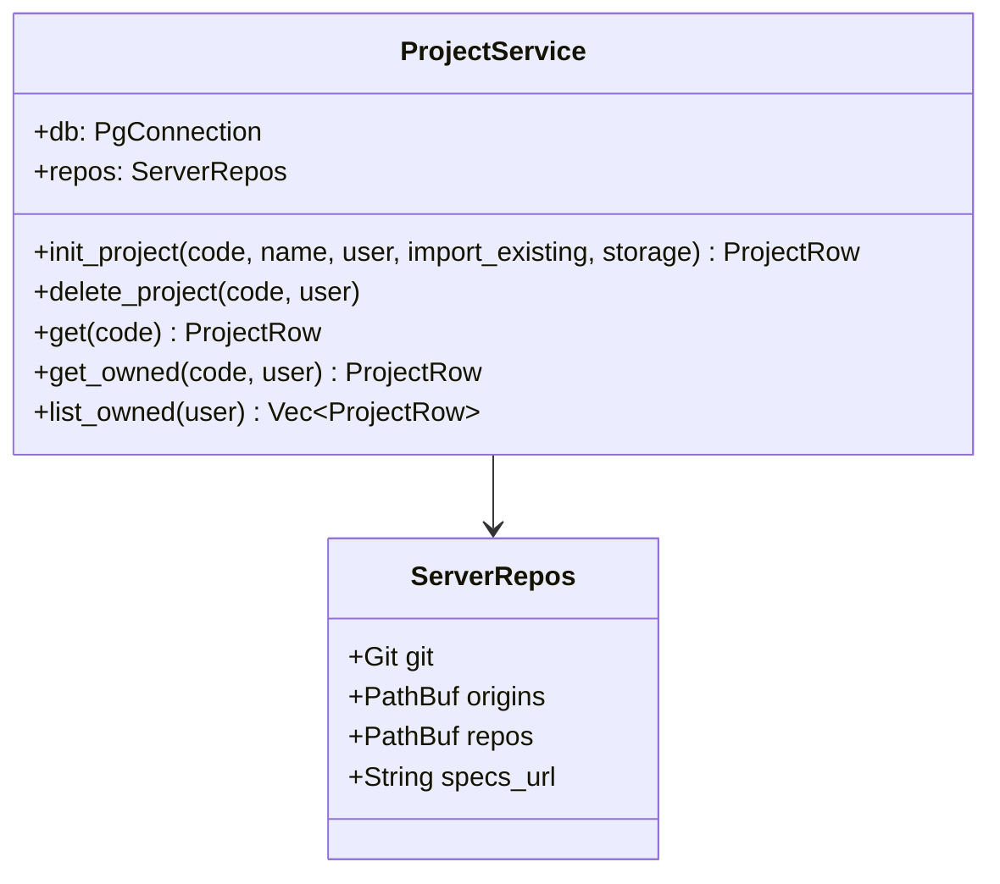
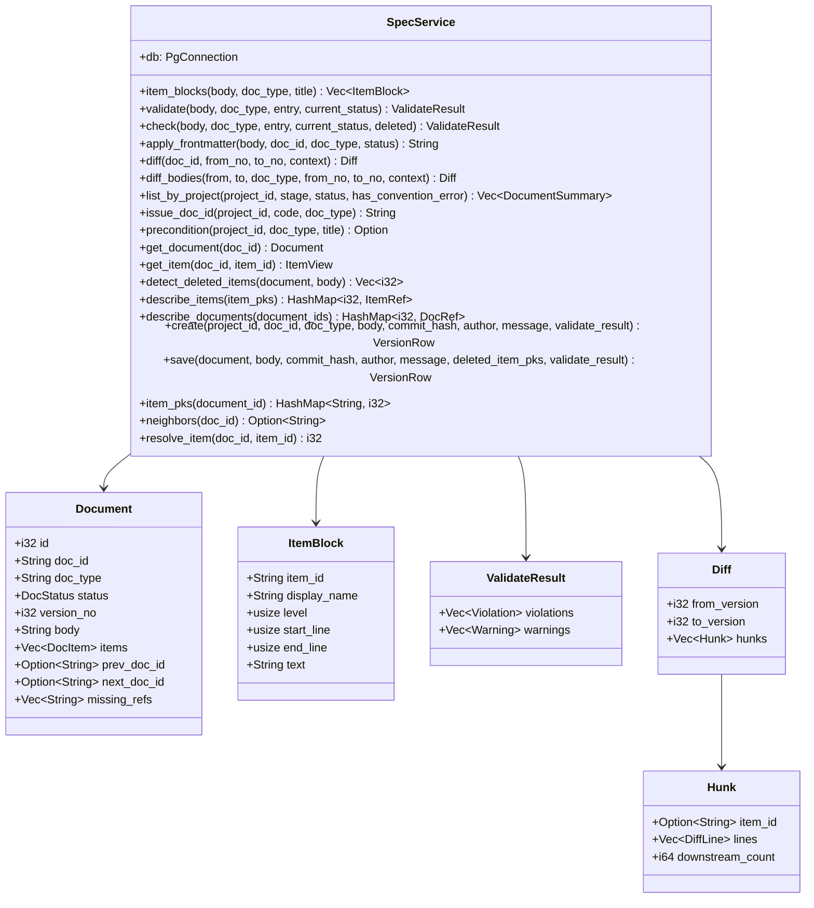
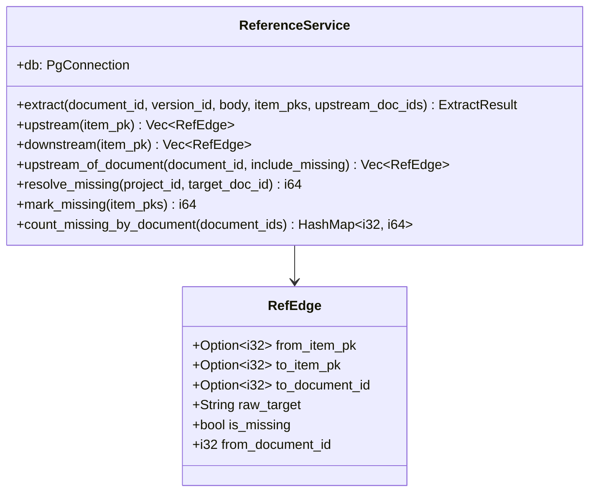
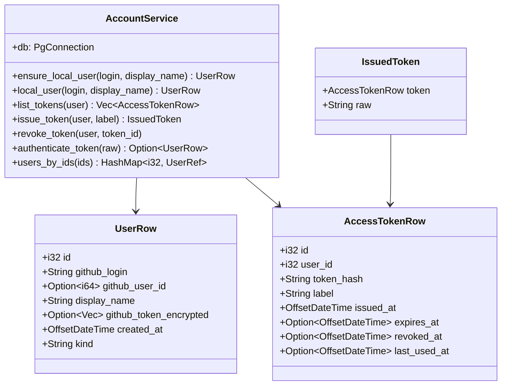
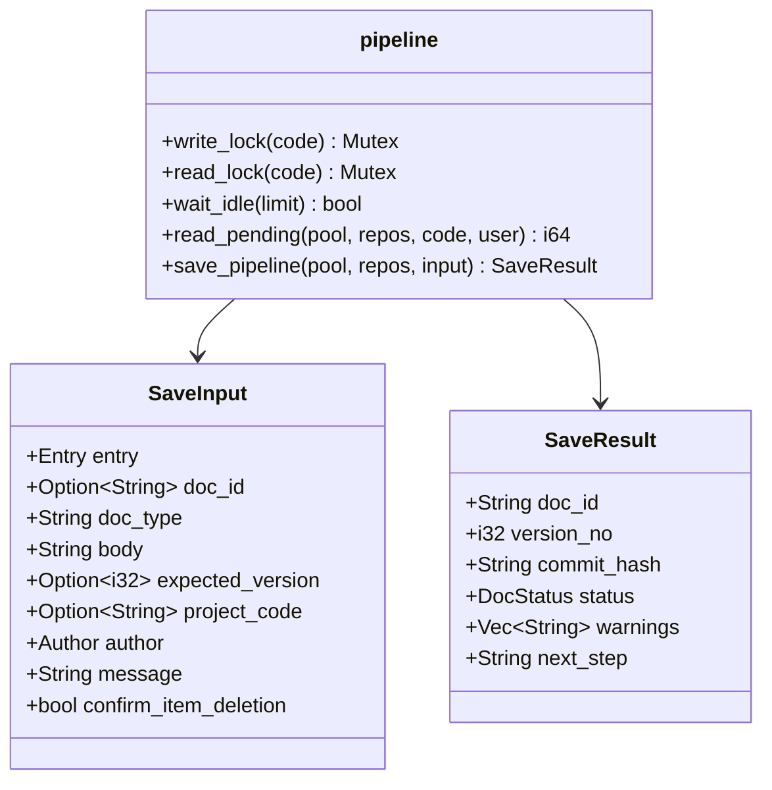
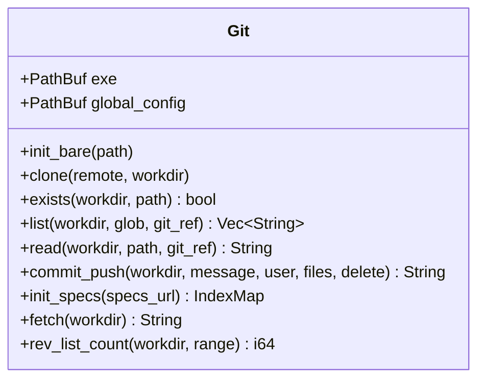

# 클래스 명세: 싱크독_로컬 (Rust)

---

## 0. 이 문서가 다루는 것

싱크독의 **둘째 구현**(Rust, `local/`)을 코드 구조로 옮긴다 — [[SYNC-INFRA-001#C11]] · [[SYNC-INFRA-001]] 9장. 파이썬 판의 클래스 명세 [[SYNC-DOM-002]]와 **같은 묶음·같은 서비스·같은 메서드 이름**이고, 이 문서는 다른 점만 적는다. 도메인 모델([[SYNC-DOM-001]])과 테이블([[SYNC-DOM-003]])은 두 구현이 함께 쓴다([[SYNC-STD-001]] 1.9·2.6).

**카드마다 자란다.** 뼈대(2026-10-07)에 카드 L1이 켜기·끄기(4.1)와 로컬 사용자(4.5)를, 카드 L3가 토큰(4.5)·MCP 입구·파이썬 호환 층(1장)을 더했다. 층 표의 줄과 설계 클래스(그림·메서드 표)는 카드마다 그 카드의 MINISPEC과 함께 더한다 — MINISPEC은 카드의 첫 커밋이다([[SYNC-STD-004#DEV-13]]). 카드는 [[SYNC-CODE-002]].

---

## 1. 폴더 구조

저장소 루트는 [[SYNC-DOM-002]] 1장이다. 여기는 `local/` 안만 적는다. Rust 카드가 루트에 더하는 것 — `contract/`(공용 계약 시험, 카드 L2)와 `.github/workflows/`(설치 파일 빌드, 카드 L4) — 은 그 카드가 [[SYNC-DOM-002]] 1장 루트 트리에 적는다.

**기본형과 다른 점, 그리고 왜.** [[SYNC-STD-001]] 1.9의 Rust 기본형(층마다 crate 하나)을 따른다. 다른 점은 둘이다.
- **라우터를 도메인 밖 `server`에 둔다** — 파이썬 판과 같은 이유다. 입구(웹·MCP·git)가 여럿이고 같은 저장 파이프라인을 타야 한다([[SYNC-INFRA-001#C4]] · [[SYNC-DOM-002]] 1장)
- **infra가 `core` 안에 있다** — 파이썬은 `app/infra/`가 core 밖에 있고 core가 부른다. crate 의존은 한 방향(`app → server → core → codegraph`)이라 core가 부르는 것은 core 안이나 그 아래에 있어야 한다

```
local/                          싱크독_로컬 (Rust) — 실행 파일 하나 (INFRA 9.1)
├── Cargo.toml · Cargo.lock     작업 공간 — crate 넷 + xtask. 의존 판은 여기 한곳에
├── rust-toolchain.toml         Rust 판 고정 — 1.99.0 (STD-001 1.9)
├── .cargo/config.toml          `cargo xtask` 별칭 · 개발용 PostgreSQL 자리(SYNCDOC_LOCAL_PG_DIR)
├── crates/                     층마다 crate 하나. 의존은 app → server → core → codegraph 한 방향
│   ├── app/                    실행 파일 syncdoc-local — 켜기·끄기·설정·데이터 자리·PostgreSQL 자식 프로세스 ·
│   │                           한 번만 실행·트레이·자동 시작·백업·주기 일
│   ├── server/                 axum 한 서버 — REST·SSE·MCP(/mcp)·git 입구(/git) · 화면과 /specs(실행 파일에 담음)
│   ├── core/                   도메인 묶음과 조율 — 파이썬 core/와 같은 묶음·같은 서비스 + infra · 이전
│   └── codegraph/              코드 그래프의 순수 부분 — 추출·줄이기·보강·대조·커뮤니티. DB 없음
├── migrations/                 이전 SQL — 원본은 backend/alembic. `cargo xtask migrations`가 리비전마다
│                               `alembic upgrade --sql`로 만든다. 손으로 고치지 않는다 (STD-004 DEV-7)
├── xtask/                      개발 도구 — pg-fetch(개발용 PostgreSQL 바이너리) · migrations [--check] ·
│                               schema-check(두 판의 스키마 같음) · test-db-clean · mcp-tools [--check](L3) ·
│                               package windows|linux · icon · pg-fetch --target(L4) · unicode-tables [--check] ·
│                               spec-golden [--check] · spec-diff(L5) · 속도 재기(L17)
├── packaging/                  설치 파일 재료 (L4) — `cargo xtask package`가 실행 파일·PostgreSQL·MinGit과 함께 모은다
│   ├── icon.svg                앱 아이콘 원본 — `cargo xtask icon`이 icon.ico·icon.png·tray.rgba(32×32 RGBA)를 만든다(생성물)
│   ├── NOTICE.txt              함께 담은 것과 라이선스·원본 주소(PostgreSQL · MinGit GPL)
│   ├── windows/installer.nsi   NSIS — 사용자 범위 설치·시작 메뉴·바탕화면(기본)·자동 시작(기본 끔)·제거는 프로그램만
│   └── linux/                  .desktop · AppRun — .deb(/opt/syncdoc-local)와 AppImage
└── target/                     빌드 결과 (gitignore). target/pg/16.15.0 — pg-fetch가 받은 PostgreSQL
```

**crate 이름** — 패키지 `syncdoc_app`(실행 파일 `syncdoc-local`) · `syncdoc_server` · `syncdoc_core` · `syncdoc_codegraph`. Rust 표준 `core`와 겹치지 않게 앞에 `syncdoc_`를 붙인다 — 이 문서의 `crates/core`는 `syncdoc_core`다.

crate마다 `src/`와 거울 `tests/`를 둔다. 단위 시험은 그 모듈의 `#[cfg(test)]`도 된다([[SYNC-STD-004]] 1장). DB가 드는 시험은 시험 컨테이너(5434)에 시험마다 DB 하나를 만든다 — 공용 도우미는 `crates/core/tests/support/`.

**app/ 안** — 켜기·끄기 (4.1)

```
crates/app/src/
├── main.rs                     진입 — 관리자 권한 내려놓기 → 인자를 읽어 runtime.run, 끝 코드 · 일꾼 스레드 스택(파이썬 판의 1만 겹 JSON을 받으려고, L3)
├── lib.rs                      공개 모듈
├── runtime.rs                  켠다·포트에 묶는다·끈다
├── tray.rs                     트레이 — 열기·끝내기 (윈도 메시지 루프 · 리눅스 StatusNotifierItem, L4)
├── privilege.rs                윈도 관리자 권한 내려놓기 — 관리자 그룹을 뺀 토큰으로 다시 켠다 (L4 · 저장소의 unsafe는 여기뿐)
├── paths.rs                    데이터 자리 · PostgreSQL 바이너리 자리
├── settings.rs                 settings.toml — INFRA 5.2와 같은 이름
├── logs.rs                     logs/ — 날마다 한 파일, 최근 14개
├── instance.rs                 한 번만 실행 — 잠금 · instance.json · 두 번째 실행
└── pg.rs                       함께 담은 PostgreSQL — initdb · postgres --single · pg_ctl
```

**server/ 안** — 입구. 파이썬 `web/`에 해당한다

```
crates/server/src/
├── lib.rs                      라우터 조립 · /health
├── state.rs                    AppState — 연결 풀 · 로컬 사용자 설정 · 공개 주소 · 서버 저장소 자리(`ServerRepos`, L6)
├── web/
│   ├── guard.rs                Host·Origin 가드 (SEQ-C3) — 라우팅 바깥에서 모든 요청에
│   ├── auth.rs                 현재 사용자 — 로컬 사용자
│   ├── problem.rs              problem+json 응답 · 405 · 패닉
│   ├── static_files.rs         화면 빌드(rust-embed) · 캐시 규칙 · 304 (INFRA 4.1)
│   ├── schemas.rs              응답 형태 (API-001 4장)
│   └── routes/                 API-001 경로 — account(/api/me · /api/me/tokens) · specs(/specs) · projects(/api/projects 목록·만들기·지우기, L6)
├── mcp/                        /mcp — 파이썬 mcp SDK의 핸드셰이크 경로를 옮긴 것 (API-002 1장, 카드 L3)
│   ├── auth.rs                 Bearer → AccountService.authenticate_token, 통과하면 응답 전에 커밋 (SEQ-C2)
│   ├── transport.rs            streamable HTTP, 세션 없음 — Accept·Content-Type·본문 읽기·SSE 쓰기
│   ├── dispatch.rs             JSON-RPC 봉투 검증 · 메서드 표(판마다) · 요청·알림 나누기 · 오류 꼴
│   ├── handlers.rs             initialize·ping·tools·resources·prompts — MCPServer와 같은 답
│   ├── tools.rs                도구 13개 — 인자 검증 후 카드마다 처리기, 없으면 not-implemented
│   └── declarations.json       도구 선언·안내문·서버 이름 — `cargo xtask mcp-tools`가 파이썬 판에서 만든다. 손으로 안 고친다
└── compat/                     파이썬 호환 층 — 오류 문장·값 꼴을 파이썬 판과 바이트로 같게 (INFRA 9.8)
    ├── pyvalue.rs              JSON → 파이썬 값(dict 순서·큰 정수·inf·nan·짝 없는 서로게이트) · repr(문자 표는 core `pycompat`)
    ├── pyjson.rs               파이썬 `json.loads`(`_json.c`) — FastAPI 본문·도구 인자 미리 읽기의 오류 위치·C 재귀 한도
    ├── pydantic/               검증 — 파이썬 판이 내보낸 core schema를 읽어(schema) lax 규칙으로 검증하고(validate)
    │                           같은 오류 줄·문장·`N validation errors for …` 꼴을 낸다(errors). smart union의 고르기까지
    ├── fastapi.rs              요청 본문(Content-Type·json.loads)·경로 값 → invalid-request(loc·msg) · 400
    └── uvicorn.rs              요청 경로를 `unquote`로 풀어 라우팅한다(`/api/m%65` = `/api/me`)
```

**옮긴 판** — `mcp/`와 `compat/`는 파이썬 판이 쓰는 꾸러미의 동작을 옮긴다(사용자 결정 2026-10-08 — 검증 문장까지 바이트로 같다, MCP는 핸드셰이크 경로 전부). 기준 판은 `backend/uv.lock`의 mcp 2.2.0 · pydantic 2.13.5(pydantic-core 2.46.5) · FastAPI 0.141.1 · starlette 1.6.0 · sse-starlette 3.4.11과 Python 3.12다. JSON 읽기는 pydantic-core와 같은 `jiter` crate를 같은 판으로 쓴다. 파이썬 쪽이 판을 올리면 계약 시험의 두 판 차이 시험이 어긋남을 잡는다 — 그때 이 층을 따라 고친다. 2026-07-28 새 프로토콜(`_streamable_http_modern`)은 카드 L18이다

**core/ 안** — 묶음은 파이썬 `core/`와 같다.

```
crates/core/
├── build.rs                    local/migrations/*.sql을 실행 파일에 담는 목록을 만든다
└── src/
    ├── lib.rs                      공개 모듈
    ├── project/ · spec/ · reference/ · account/ · conversation/ · codegraph/
    │   ├── model.rs                행 = 도메인 객체(`…Row`). 속성은 DOM-003 그대로
    │   ├── repo.rs                 조회·저장. DB만 안다
    │   └── service.rs              규칙. 여기서만 모델을 만진다
    ├── types.rs                    열거형·DTO (DOM-002 2.7·2.8)
    ├── clock.rs                    저장 시각 — 프로세스 안에서 뒤로 안 간다 (STD-004 DEV-18)
    ├── markdown.rs                 순수 — frontmatter·코드 마스킹·헤딩·참조·항목 블록
    ├── pycompat/                   파이썬 호환 — 문자 분류·repr·정규식·difflib을 파이썬 3.12와 같게 (L5)
    │   ├── unicode.rs              생성물 — `re`의 \s·\d·\w와 str.isprintable 구간(유니코드 15.0). `cargo xtask unicode-tables`
    │   ├── chars.rs                표 찾기 · 파이썬 strip
    │   ├── repr.rs                 파이썬 str repr — server/compat도 이것을 쓴다
    │   ├── re.rs                   파이썬 패턴 문자열의 \s·\S·\d·\w를 위 표로 바꿔 regex로 컴파일
    │   └── difflib.rs              SequenceMatcher(autojunk) · get_grouped_opcodes · unified_diff
    ├── errors.rs                   Problem 열거형 하나에 problem+json 종류 전부 (STD-004 DEV-5)
    ├── migrate.rs                  이전 SQL을 올린다 (4.1) — 모든 crate의 시험도 이것으로 DB를 만든다
    ├── pipeline.rs                 쓰기 조율 — 프로젝트마다 읽기·쓰기 락, 순서는 파이썬과 같다 (L7 — 저장은 따로 띄운 작업에서)
    ├── queries.rs                  읽기 조합
    └── infra/                      바깥 — git 자식 프로세스(`git.rs`, L6 — 사용자 git 설정을 막는다) · upload-pack·receive-pack · 모델 호출
```

지금(카드 L7) 있는 것은 `account`·`spec`·`project`·`reference`(뽑기·끊기·잇기·조회 셋·미존재 세기)·`markdown.rs`·`pycompat/`·`pipeline.rs`(MCP 저장)·`queries.rs`(프로젝트 요약·문서 목록·문서·항목·참조)·`infra/git.rs`·`types.rs`·`clock.rs`·`errors.rs`·`migrate.rs`다. `spec/`의 정답 파일은 `crates/core/tests/golden/spec.json`(생성물, `cargo xtask spec-golden`)이다. 나머지 묶음과 `codegraph`·`app`·`server`의 다음 파일은 그 카드가 만들고 여기에 적는다.

**층** — 함수 단위 명세(MINISPEC 카드·API 엔드포인트·UI 화면)가 없는 코드가 어느 층이고 그 층을 무슨 문서가 정하는지([[SYNC-STD-001]] 2.6). 코드 그래프가 읽는다. 위에서부터 첫 줄이 이긴다. **줄은 카드마다 더한다** — 코드가 없는 줄은 검사기(`check_calls`)가 「안 맞는 줄」로 잡는다. 함수가 없는 파일(구조체만 — `state.rs`·`model.rs`)은 적지 않는다.

| 경로 | 층 | 명세 |
|---|---|---|
| `local/crates/app/src/main.rs` | 실행 파일 진입 | [[SYNC-INFRA-001]] 9.1 · [[SYNC-MS-012]] |
| `local/crates/server/src/lib.rs` | 서버 조립·`/health` | [[SYNC-INFRA-001]] 4.1·9.1 |
| `local/crates/server/src/web/guard.rs` · `local/crates/server/src/web/auth.rs` · `local/crates/server/src/mcp/auth.rs` | 인증 | [[SYNC-INFRA-001]] 5장·9.4 · [[SYNC-SEQ-001#SEQ-C2]] · [[SYNC-SEQ-001#SEQ-C3]] |
| `local/crates/server/src/mcp/**` | MCP 입구 | [[SYNC-API-002]] 1장·2장 · [[SYNC-INFRA-001]] 9.8 |
| `local/crates/server/src/compat/**` · `local/crates/core/src/pycompat/**` | 파이썬 호환 | [[SYNC-INFRA-001]] 9.8 · [[SYNC-DOM-004]] 1장 |
| `local/crates/server/src/web/problem.rs` · `local/crates/core/src/errors.rs` | 에러 | [[SYNC-STD-004#DEV-5]] · [[SYNC-API-001]] 2장 |
| `local/crates/server/src/web/static_files.rs` | 정적 파일 | [[SYNC-INFRA-001]] 4.1 |
| `local/crates/core/src/types.rs` | 열거형·DTO | [[SYNC-DOM-002]] 2.7·2.8 |
| `local/crates/server/src/web/schemas.rs` | 응답 형태 | [[SYNC-API-001]] 4장 |
| `local/crates/core/src/clock.rs` | 시각 | [[SYNC-STD-004#DEV-18]] |
| `local/crates/core/src/*/repo.rs` | 리포지토리 | [[SYNC-DOM-004]] 4장 · [[SYNC-DOM-003]] |
| `local/crates/*/build.rs` | 빌드 설정 | [[SYNC-STD-004#DEV-7]] · [[SYNC-INFRA-001]] 9.2 |
| `local/xtask/**` | 개발 도구 | [[SYNC-STD-004#DEV-7]] · [[SYNC-STD-004#DEV-14]] |

---

## 2. 엔티티

테이블과 속성은 [[SYNC-DOM-003]] 그대로다 — 두 구현이 같은 표를 쓴다(이전의 원본은 Alembic 하나, [[SYNC-STD-004#DEV-7]]). 여기는 Rust 타입과 자리만 적는다 — DB 행 타입은 `…Row`다([[SYNC-STD-004#DEV-2]]). 관계·규칙은 [[SYNC-DOM-002]] 2장 그대로다.

### 2.1 프로젝트

#### Project 프로젝트

테이블: [[SYNC-DOM-003#projects]] · 도메인: [[SYNC-DOM-001#Project]]

`syncdoc_core::project::ProjectRow` — [[SYNC-DOM-002#Project]]

#### Repository 저장소

테이블: [[SYNC-DOM-003#repositories]] · 도메인: [[SYNC-DOM-001#Repository]]

`syncdoc_core::project::RepositoryRow` — [[SYNC-DOM-002#Repository]]

### 2.2 명세

#### Document 문서

테이블: [[SYNC-DOM-003#documents]] · 도메인: [[SYNC-DOM-001#Document]]

`syncdoc_core::spec::DocumentRow` — [[SYNC-DOM-002#Document]]

#### Item 항목

테이블: [[SYNC-DOM-003#items]] · 도메인: [[SYNC-DOM-001#Item]]

`syncdoc_core::spec::ItemRow` — [[SYNC-DOM-002#Item]]

#### Version 버전

테이블: [[SYNC-DOM-003#versions]] · 도메인: [[SYNC-DOM-001#Version]]

`syncdoc_core::spec::VersionRow` — [[SYNC-DOM-002#Version]]

#### StatusChange 상태변경

테이블: [[SYNC-DOM-003#status_changes]] · 도메인: [[SYNC-DOM-001#StatusChange]]

`syncdoc_core::spec::StatusChangeRow` — [[SYNC-DOM-002#StatusChange]]

### 2.3 참조

#### Reference 참조

테이블: [[SYNC-DOM-003#references]] · 도메인: [[SYNC-DOM-001#Reference]]

`syncdoc_core::reference::ReferenceRow` — [[SYNC-DOM-002#Reference]]

### 2.4 계정

#### User 사용자

테이블: [[SYNC-DOM-003#users]] · 도메인: [[SYNC-DOM-001#User]]

`syncdoc_core::account::UserRow` — [[SYNC-DOM-002#User]]. 싱크독_로컬에는 `kind=local` 사용자 하나뿐이다 — 커밋 작성자도 늘 그 사람이다([[SYNC-PRD-001#R15]] · [[SYNC-MS-006#AccountService.user_for_commit]] 0)

#### CommitEmail 커밋이메일

테이블: [[SYNC-DOM-003#commit_emails]] · 도메인: [[SYNC-DOM-001#CommitEmail]]

`syncdoc_core::account::CommitEmailRow` — [[SYNC-DOM-002#CommitEmail]]

#### AccessToken 액세스토큰

테이블: [[SYNC-DOM-003#access_tokens]] · 도메인: [[SYNC-DOM-001#AccessToken]]

`syncdoc_core::account::AccessTokenRow` — [[SYNC-DOM-002#AccessToken]]

### 2.5 대화

#### Conversation 대화

테이블: [[SYNC-DOM-003#conversations]] · 도메인: [[SYNC-DOM-001#Conversation]]

`syncdoc_core::conversation::ConversationRow` — [[SYNC-DOM-002#Conversation]]

#### Turn 턴

테이블: [[SYNC-DOM-003#turns]] · 도메인: [[SYNC-DOM-001#Turn]]

`syncdoc_core::conversation::TurnRow` — [[SYNC-DOM-002#Turn]]

#### Attachment 첨부

테이블: [[SYNC-DOM-003#attachments]] · 도메인: [[SYNC-DOM-001#Attachment]]

`syncdoc_core::conversation::AttachmentRow` — [[SYNC-DOM-002#Attachment]]

### 2.6 코드 그래프

#### CodeGraph 코드 그래프

테이블: [[SYNC-DOM-003#code_graphs]] · 도메인: [[SYNC-DOM-001#CodeGraph]]

`syncdoc_core::codegraph::CodeGraphRow` — [[SYNC-DOM-002#CodeGraph]]. 그래프를 만드는 순수 부분은 `codegraph` crate다

### 2.7 열거형·DTO

[[SYNC-DOM-002]] 2.7·2.8 그대로 — `syncdoc_core::types`. 직렬화 이름(JSON 키·열거형 값)도 같다. 화면과 에이전트가 두 판을 가리지 않는다.

---

## 3. 의존 관계

[[SYNC-DOM-002]] 3장과 같다 — Boundary → Control 선은 3.1, Control 사이의 선은 3.2 그대로다. 다른 점만 적는다.

- **crate가 층을 지킨다** — `app → server → core → codegraph` 한 방향이다. 거꾸로 부르면 컴파일이 안 된다. 파이썬 판은 규칙([[SYNC-DOM-002]] 1장 「규칙」)과 검사기로 지키던 것이다
- **입구가 셋이다** — 웹·MCP·git이 `server`에 있고, 셋 다 `core`의 서비스·`pipeline`·`queries`만 부른다
- **켜기·끄기·백업·주기 일은 `app`이 쥔다** — PostgreSQL과 git 자식 프로세스를 띄우고 멈추는 순서가 여기 있다([[SYNC-INFRA-001]] 9.1). 백업은 `core`의 쓰기 락을 쥐고 뜬다(9.6)
- **두 구현은 서로 부르지 않는다**([[SYNC-STD-001]] 1.9) — 같은 표와 같은 화면 빌드를 쓸 뿐이다

---

## 4. 설계 클래스

서비스·메서드 이름은 파이썬 판과 같다 — MINISPEC 항목 ID가 언어와 상관없이 점 꼴이다([[SYNC-STD-001]] 2.10). 서비스는 연결을 빌려 받는다(`SpecService { db: &mut PgConnection }` 꼴) — 트랜잭션은 입구가 쥔다([[SYNC-STD-004#DEV-10]]).

묶음 하나 = 절 하나 = MINISPEC 하나다. 절(그림·메서드 표)은 그 MINISPEC을 쓰는 카드가 더한다.

| 절 | 묶음 | MINISPEC | 자리 | 파이썬 판 |
|---|---|---|---|---|
| 4.1 | runtime — 켜기·끄기·설정·PostgreSQL·한 번만 실행 | [[SYNC-MS-012]] | `crates/app` · `crates/core/src/migrate.rs` | `main.py` · `config.py` · `db.py` |
| 4.2 | project | MS-013 | `crates/core/src/project` | [[SYNC-MS-001]] |
| 4.3 | spec · markdown | MS-014 | `crates/core/src/spec` · `markdown.rs` | [[SYNC-MS-002]] |
| 4.4 | reference | MS-015 | `crates/core/src/reference` | [[SYNC-MS-003]] |
| 4.5 | account | [[SYNC-MS-016]] | `crates/core/src/account` | [[SYNC-MS-006]] |
| 4.6 | pipeline · scheduler | [[SYNC-MS-017]] | `crates/core/src/pipeline.rs` · `crates/app` | [[SYNC-MS-007]] |
| 4.7 | queries | MS-018 | `crates/core/src/queries.rs` | [[SYNC-MS-008]] |
| 4.8 | git · git_rpc | MS-019 | `crates/core/src/infra` · `crates/server`(git 입구) | [[SYNC-MS-009]] |
| 4.9 | llm | MS-020 | `crates/core/src/infra` | [[SYNC-MS-009]] |
| 4.10 | conversation | MS-021 | `crates/core/src/conversation` | [[SYNC-MS-010]] |
| 4.11 | codegraph | MS-022 | `crates/codegraph` · `crates/core/src/codegraph` | [[SYNC-MS-011]] |
| 4.12 | 데이터 자리 옮기기 · 백업 | MS-023 | `crates/app` | — (Docker 판은 `scripts/backup.sh`, [[SYNC-CODE-001#BR]]) |


데이터 자리의 **기본값 찾기**는 4.1(MS-012 `paths.data_dir`)이고, 옮기기와 그 자리를 가리키는 파일은 4.12다.

### 4.1 runtime — 켜기·끄기 (MS-012)

클래스가 아니라 모듈 함수다 — 파이썬 판의 `main.py` lifespan·`config.py`·`db.py`와 Dockerfile의 `alembic upgrade head`가 하던 일을 한 프로세스가 한다.

| 함수 | 하는 일 | 부르는 곳 |
|---|---|---|
| [[SYNC-MS-012#runtime.run]] | 켠다 — 끌 때까지 | `main` |
| [[SYNC-MS-012#runtime.bind]] | 127.0.0.1의 8010, 못 쓰면 8011~8019 | `runtime.run` |
| [[SYNC-MS-012#runtime.shutdown]] | 끈다 | `runtime.run` |
| [[SYNC-MS-012#tray.run]] | 트레이 — 열기·끝내기 | `main`(트레이가 있을 때) |
| [[SYNC-MS-012#privilege.drop_admin]] | 윈도 관리자 권한을 내려놓고 다시 켠다 | `main`(맨 처음) |
| [[SYNC-MS-012#paths.data_dir]] · [[SYNC-MS-012#paths.pg_dir]] | 데이터 자리 · PostgreSQL 바이너리 자리 | `runtime.run` |
| [[SYNC-MS-012#settings.load]] | `settings.toml` | `runtime.run` |
| [[SYNC-MS-012#logs.init]] | 로그 | `runtime.run` |
| [[SYNC-MS-012#instance.acquire]] · [[SYNC-MS-012#instance.publish]] · [[SYNC-MS-012#instance.open_running]] | 한 번만 실행 | `runtime.run` |
| [[SYNC-MS-012#pg.start]] · [[SYNC-MS-012#pg.stop]] | 함께 담은 PostgreSQL | `runtime.run` · `runtime.shutdown` |
| [[SYNC-MS-012#migrate.apply]] | 이전 SQL | `runtime.run` · 모든 crate의 DB 시험 |

규칙
- 켜는 순서는 [[SYNC-INFRA-001]] 9.1 그대로다 — 잠금 → 로그 → 설정 → PostgreSQL → 이전 → 로컬 사용자 → 포트 → 서빙. 끄는 순서는 거꾸로
- PostgreSQL은 따로 프로세스 묶음으로 띄운다 — 터미널 신호가 먼저 닿지 않고, 멈추는 순서를 앱이 쥔다
- 트레이가 있으면 메인 스레드는 트레이 차지다(윈도 메시지 루프) — 서버·PostgreSQL은 tokio 일꾼 스레드에서 돈다. 「끝내기」는 Ctrl+C와 같은 끄는 순서를 탄다(L4)
- 켜는 중 실패는 `Problem::Internal`의 로그 문장으로 돌려주고 `main`이 끝 코드 1로 끝난다
- 윈도에서 관리자 권한으로 켜졌으면 맨 처음 관리자 그룹을 뺀 토큰으로 자신을 다시 켠다 — PostgreSQL은 관리자 권한으로 돌지 않는다. `unsafe`는 이 모듈의 Win32 호출뿐이다(작업 공간 lint `unsafe_code = "deny"`, 이 모듈만 허용, L4)

### 4.2 project (MS-013)

#### ProjectService



| 메서드 | 부르는 곳 | 근거 | 던지는 에러 |
|---|---|---|---|
| [[SYNC-MS-013#ProjectService.init_project]] | MCP `init_project` · `POST /api/projects` | [[SYNC-MS-001#ProjectService.init_project]] | `storage-unavailable` · `project-code-invalid` · `project-code-conflict` · `existing-specs` · `push-failed` · `not-implemented`(보관본 재구축, L11) |
| [[SYNC-MS-013#ProjectService.delete_project]] | `DELETE /api/projects/{code}` | [[SYNC-MS-001#ProjectService.delete_project]] | `not-found` |
| [[SYNC-MS-013#ProjectService.get]] · [[SYNC-MS-013#ProjectService.get_owned]] | `get_template` · `delete_project` | [[SYNC-MS-001#ProjectService.get_owned]] | `not-found` |
| [[SYNC-MS-013#ProjectService.list_owned]] | `queries.project_summary` | [[SYNC-MS-001#ProjectService.list_owned]] | — |

규칙 — [[SYNC-DOM-002]] 4.1과 같다. **싱크독_로컬은 서버 저장뿐이다** — 서버 저장소는 `origins/{code}.git`, 작업 사본은 `repos/{code}`, 지우면 `origins/_archive/{code}-{UTC}.git`으로 보관한다(지우지 않는다). 코드마다 잠금을 쥔다. 동기화·재구축·첨부·git 입구는 그 카드가 더한다.

### 4.3 spec · markdown (MS-014)

#### SpecService



| 메서드 | 부르는 곳 | 근거 | 던지는 에러 |
|---|---|---|---|
| [[SYNC-MS-014#SpecService.item_blocks]] | `check`·`diff_bodies` · 저장(L7)·항목 조회(L8) | [[SYNC-MS-002#SpecService.item_blocks]] | — |
| [[SYNC-MS-014#SpecService.validate]] | 저장 파이프라인(L7) | [[SYNC-MS-002#SpecService.validate]] | `internal`(DB) |
| [[SYNC-MS-014#SpecService.check]] | `validate` · `cargo xtask spec-diff` | [[SYNC-MS-002#SpecService.validate]] | — |
| [[SYNC-MS-014#SpecService.apply_frontmatter]] | 저장 파이프라인의 만들기(L7) | [[SYNC-MS-002#SpecService.apply_frontmatter]] | `convention-violation` |
| [[SYNC-MS-014#SpecService.diff]] | 이력 diff(L8) | [[SYNC-MS-002#SpecService.diff]] | `not-found` |
| [[SYNC-MS-014#SpecService.diff_bodies]] | `diff` · `cargo xtask spec-diff` | [[SYNC-MS-002#SpecService.diff]] | — |
| [[SYNC-MS-014#SpecService.list_by_project]] | `queries.project_summary`(L6) · `queries.document_list`(L7) | [[SYNC-MS-002#SpecService.list_by_project]] | — |
| [[SYNC-MS-014#SpecService.issue_doc_id]] · [[SYNC-MS-014#SpecService.precondition]] · [[SYNC-MS-014#SpecService.create]] | 저장 파이프라인의 만들기 | [[SYNC-MS-002#SpecService.create]] | `precondition-unmet`(파이프라인이) |
| [[SYNC-MS-014#SpecService.detect_deleted_items]] · [[SYNC-MS-014#SpecService.save]] · [[SYNC-MS-014#SpecService.item_pks]] | 저장 파이프라인의 고치기 | [[SYNC-MS-002#SpecService.save]] | — |
| [[SYNC-MS-014#SpecService.get_document]] | 저장 파이프라인 · `queries.document_view` | [[SYNC-MS-002#SpecService.get_document]] | `not-found` |
| [[SYNC-MS-014#SpecService.get_item]] · [[SYNC-MS-014#SpecService.resolve_item]] | `queries.item_view` · `queries.item_references_view` | [[SYNC-MS-002#SpecService.get_item]] | `not-found`(`available_items`) · `item-deleted` |
| [[SYNC-MS-014#SpecService.describe_items]] · [[SYNC-MS-014#SpecService.describe_documents]] · [[SYNC-MS-014#SpecService.neighbors]] | 저장 파이프라인(삭제 확인) · `queries` | [[SYNC-MS-002#SpecService.describe_items]] | — |

markdown 넷([[SYNC-MS-014#markdown.parse_frontmatter]] · [[SYNC-MS-014#markdown.masked_lines]] · [[SYNC-MS-014#markdown.headings]] · [[SYNC-MS-014#markdown.cut_blocks]])은 함수다 — spec과 reference(L7)가 같이 쓴다.

규칙 — [[SYNC-DOM-002]] 4.2와 같다. 항목 판정은 `item_blocks` 한 곳이다. **파이썬 판과 바이트까지 같다**(사용자 결정 2026-10-08) — 문자 분류·repr·정규식·difflib은 `pycompat/`가 파이썬 3.12와 같게 하고, 맞춤은 정답 파일(`cargo test`)과 `cargo xtask spec-diff`가 본다. 항목 패턴 표(`TYPES`·`SUBTYPES`)는 파이썬과 같은 문자열이다. 타입은 검사·저장 입구에서 문자열 그대로 받는다(모르는 타입도 `frontmatter.type` 위반까지 파이썬과 같게, L7). 나머지 메서드(버전 목록, 상태, 휴지통…)는 그 카드가 더한다.

### 4.4 reference (MS-015)

#### ReferenceService



| 메서드 | 부르는 곳 | 근거 | 던지는 에러 |
|---|---|---|---|
| [[SYNC-MS-015#ReferenceService.extract]] · [[SYNC-MS-015#ReferenceService.resolve_missing]] · [[SYNC-MS-015#ReferenceService.mark_missing]] | 저장 파이프라인 | [[SYNC-MS-003#ReferenceService.extract]] | — |
| [[SYNC-MS-015#ReferenceService.upstream]] · [[SYNC-MS-015#ReferenceService.downstream]] | `queries.item_references_view` · 저장 파이프라인(삭제 확인) | [[SYNC-MS-003#ReferenceService.downstream]] | — |
| [[SYNC-MS-015#ReferenceService.upstream_of_document]] | `queries.document_view` | [[SYNC-MS-003#ReferenceService.upstream_of_document]] | — |
| [[SYNC-MS-015#ReferenceService.count_missing_by_document]] | `queries.project_summary` · `queries.document_list` | [[SYNC-MS-003#ReferenceService.count_missing_by_document]] | — |

규칙 — [[SYNC-DOM-002]] 4.3과 같다. 참조 행이 끊어짐을 스스로 말한다(`is_missing`·`raw_target`) — 따로 표가 없다. 조회 차례는 id다(#353). 나머지 조회(관계도·휴지통)는 L8·L9가 더한다.

### 4.5 account (MS-016)

#### AccountService



| 메서드 | 부르는 곳 | 근거 | 던지는 에러 |
|---|---|---|---|
| [[SYNC-MS-016#AccountService.ensure_local_user]] | 켤 때 `runtime.run` | [[SYNC-MS-006#AccountService.ensure_local_user]] | `internal`(아이디가 남의 것) |
| [[SYNC-MS-016#AccountService.local_user]] | 웹 입구의 현재 사용자(`web/auth`) — 모든 웹 경로 | [[SYNC-SEQ-001#SEQ-C3]] | — |
| [[SYNC-MS-016#AccountService.list_tokens]] | `GET /api/me/tokens` | [[SYNC-MS-006#AccountService.list_tokens]] | — |
| [[SYNC-MS-016#AccountService.issue_token]] | `POST /api/me/tokens` | [[SYNC-MS-006#AccountService.issue_token]] | — |
| [[SYNC-MS-016#AccountService.revoke_token]] | `DELETE /api/me/tokens/{id}` | [[SYNC-MS-006#AccountService.revoke_token]] | `not-found` |
| [[SYNC-MS-016#AccountService.authenticate_token]] | MCP 입구(`mcp/auth`) | [[SYNC-SEQ-001#SEQ-C2]] | — |
| [[SYNC-MS-016#AccountService.users_by_ids]] | `queries.document_list` · `queries.document_view` | [[SYNC-MS-006#AccountService.users_by_ids]] | — |

규칙 — [[SYNC-DOM-002]] 4.6과 같다. 로컬 사용자는 `kind=local` 행 하나뿐이다. 서비스는 연결을 빌려 받고 트랜잭션은 부르는 쪽이 쥔다. 토큰 원문은 발급 응답에만 있고 DB·로그에는 해시만 남는다. 커밋 작성자(L11)는 그 카드가 더한다.

### 4.6 pipeline (MS-017)

클래스가 아니라 모듈 함수다 — 파이썬 `core/pipeline.py`와 같다. 연결 풀을 받아 트랜잭션을 연다.



| 함수 | 부르는 곳 | 근거 | 던지는 에러 |
|---|---|---|---|
| [[SYNC-MS-017#pipeline.save_pipeline]] | MCP `create_document` · `update_document` | [[SYNC-MS-007#pipeline.save_pipeline]] | `not-found` · `document-trashed` · `precondition-unmet` · `convention-violation` · `version-conflict` · `item-deletion-needs-confirm` · `push-failed` · `not-implemented`(밀린 커밋, L11) · `internal`(git) |
| [[SYNC-MS-017#pipeline.read_pending]] | `save_pipeline` | [[SYNC-MS-007#pipeline.read_pending]] | `not-found` · `not-implemented`(L11) · `internal`(git) |
| [[SYNC-MS-017#pipeline.write_lock]] · [[SYNC-MS-017#pipeline.read_lock]] | `save_pipeline` · `read_pending` | [[SYNC-MS-007]] 락 | — |
| [[SYNC-MS-017#pipeline.wait_idle]] | `runtime.shutdown` | [[SYNC-INFRA-001]] 9.1 | — |

규칙 — [[SYNC-DOM-002]] 4.4와 같다. 프로젝트마다 쓰기 락 하나·읽기 락 하나, 프로세스 전역이고 시간 제한이 없다. 읽기 → 쓰기 차례(`read_pending`은 쓰기 락 밖). 검사가 다 끝난 뒤에야 git을 쓰고, git이 끝난 뒤에야 DB를 쓴다 — 실패하면 DB는 그대로다. 저장은 따로 띄운 작업에서 돌아 부른 요청이 끊겨도 끝까지 간다. 웹·GitHub 입구 갈래와 주기 일(scheduler)은 L9·L11이 더한다.

### 4.7 queries (MS-018)

| 함수 | 부르는 곳 | 근거 | 던지는 에러 |
|---|---|---|---|
| [[SYNC-MS-018#queries.project_summary]] | `GET`·`POST /api/projects` · MCP `init_project` | [[SYNC-MS-008#queries.project_summary]] | — |
| [[SYNC-MS-018#queries.document_list]] | MCP `list_documents` | [[SYNC-MS-008#queries.document_list]] | `not-found` |
| [[SYNC-MS-018#queries.document_view]] | MCP `get_document` | [[SYNC-MS-008#queries.document_view]] | `not-found` |
| [[SYNC-MS-018#queries.item_view]] | MCP `get_item` | [[SYNC-MS-008#queries.item_view]] | `not-found`(`available_items`) · `item-deleted` |
| [[SYNC-MS-018#queries.item_references_view]] | MCP `get_references` | [[SYNC-MS-008#queries.item_references_view]] | `not-found` · `item-deleted` |

모듈 함수다 — 연결을 첫 인자로 받는다. 나머지 조회는 L8이 더한다.

### 4.8 git (MS-019)

#### Git



| 메서드 | 부르는 곳 | 근거 | 던지는 에러 |
|---|---|---|---|
| [[SYNC-MS-019#Git.init_bare]] · [[SYNC-MS-019#Git.clone]] · [[SYNC-MS-019#Git.exists]] · [[SYNC-MS-019#Git.list]] · [[SYNC-MS-019#Git.init_specs]] · [[SYNC-MS-019#Git.commit_push]] | `ProjectService.init_project` | [[SYNC-MS-009]] | `push-failed` · `internal`(git 실패) |
| [[SYNC-MS-019#Git.read]] | MCP `get_template`(저장소 규약 먼저) | [[SYNC-MS-009#git.read]] | `internal` |
| [[SYNC-MS-019#Git.commit_push]] · [[SYNC-MS-019#Git.fetch]] · [[SYNC-MS-019#Git.rev_list_count]] | 저장 파이프라인 | [[SYNC-MS-009]] | `push-failed` · `internal` |

규칙 — git CLI를 자식 프로세스로 부른다(윈도 MinGit · 리눅스 시스템 git). **사용자 git 설정을 막는다**(사용자 결정 2026-10-08) — 시스템·전역 설정 끔, 프롬프트·서명·autocrlf 끔, `LC_ALL=C`, `safe.directory=*`. 파이썬 판이 Docker 안에서 받는 깨끗한 환경과 같게 해 같은 명령이 같은 결과를 낸다. git 입구(upload-pack·receive-pack)는 L10이 더한다.

---

## 5. 미결사항

없음. 카드에서 정할 것은 [[SYNC-CODE-002]] 4장에 있다.
