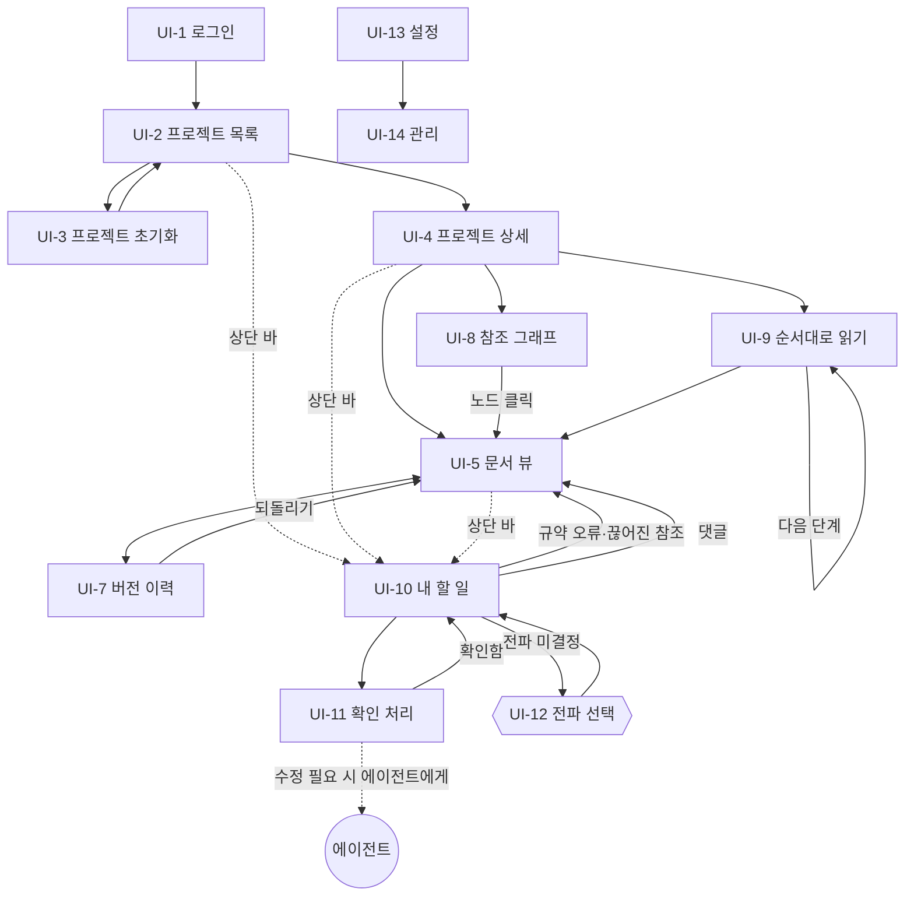

# 화면 설계: 싱크독 (SyncDoc)

---

## 0. 이 문서가 다루는 것

웹에 **어떤 화면이 있고, 어디서 어디로 가는지**를 정한다. 각 화면 안에 뭐가 어디 있는지는 와이어프레임에서 정한다.

대상은 사람용 웹뿐이다. 에이전트는 MCP로 붙으므로 화면이 없다.

**도출 방법** — 유스케이스에서 사람이 주 액터인 것([[SYNC-UC-001#UC-H2]]~H17)과 사람 경로가 있는 것([[SYNC-UC-001#UC-A1]]), 인프라에서 정한 인증·토큰을 화면으로 옮긴다. **본문 편집 화면은 없다.** 명세 본문은 각자의 에이전트가 MCP로 쓰고, 웹은 읽기·상태 변경·댓글·되돌리기까지다 (v1.1에서 UI-6 삭제). 유스케이스 하나가 화면 하나는 아니다. 같은 맥락에서 이어지는 일은 한 화면에 모으고, 흐름이 끊기는 일은 나눈다.

---

## 1. 유스케이스 대응

| 유스케이스 | 화면 | 화면 안 위치 |
|---|---|---|
| [[SYNC-UC-001#UC-A1]] 프로젝트 초기화 (사람 경로) | UI-3 | 전체 |
| [[SYNC-UC-001#UC-H2]] 사람용 뷰로 읽기 | UI-5 | 본문 (유저용 탭 / 원본 탭) |
| [[SYNC-UC-001#UC-H3]] 항목 참조 조회 | UI-5 | 오른쪽 패널 |
| [[SYNC-UC-001#UC-H4]] 참조 그래프 | UI-8 | 전체 |
| [[SYNC-UC-001#UC-H6]] 버전 이력·비교 | UI-7 | 전체 |
| [[SYNC-UC-001#UC-H7]] 되돌리기 | UI-7 | 이력 행의 동작 |
| [[SYNC-UC-001#UC-H8]] 상태 변경 | UI-5 | 상단 바. `승인`이면 상위 대조 다이얼로그 |
| [[SYNC-UC-001#UC-H9]] 댓글 | UI-5 | 줄 옆 + 오른쪽 패널 |
| [[SYNC-UC-001#UC-H10]] 전파 여부 선택 | UI-12 | UI-10에서 여는 다이얼로그 |
| [[SYNC-UC-001#UC-H11]] 확인 필요 처리 | UI-11 | 전체 |
| [[SYNC-UC-001#UC-H12]] 끊어진 참조 해소 | UI-10 | 발견만. 수정은 에이전트에게 |
| [[SYNC-UC-001#UC-H13]] 항목 삭제 | — | 웹 화면 없음. 에이전트가 UC-A6로 |
| [[SYNC-UC-001#UC-H14]] 대시보드 | UI-2, UI-4 | 전체 |
| [[SYNC-UC-001#UC-H15]] 내 할 일 | UI-10 | 전체 |
| [[SYNC-UC-001#UC-H16]] 순서대로 읽기 | UI-9 | 전체 |
| [[SYNC-UC-001#UC-S6]] 인덱스 재구축 | UI-14 | 전체 |
| 인프라 5장 GitHub OAuth | UI-1 | 전체 |
| 인프라 5장 토큰 발급 | UI-13 | 전체 |

**한 화면에 여러 유스케이스가 모인 곳**: UI-5 문서 뷰(H2·H3·H8·H9). 문서를 읽으면서 참조를 보고, 상태를 바꾸고, 댓글을 다는 건 한 맥락이다. 화면을 나누면 오가느라 흐름이 끊긴다.

**유스케이스 하나가 화면 둘로 갈린 곳**: [[SYNC-UC-001#UC-H14]] 대시보드. 프로젝트 여러 개를 훑는 것(UI-2)과 하나를 파고드는 것(UI-4)은 정보 밀도가 달라 한 화면에 못 둔다.

---

## 2. 화면 목록

#### UI-1 로그인

페이지. GitHub OAuth로 들어온다. 주 유스케이스: 인프라 5장

#### UI-2 프로젝트 목록

페이지. 프로젝트마다 11단계 상태를 한눈에. 주 유스케이스: [[SYNC-UC-001#UC-H14]]

#### UI-3 프로젝트 초기화

페이지. 저장소 주소와 코드를 넣어 등록. 주 유스케이스: [[SYNC-UC-001#UC-A1]]

#### UI-4 프로젝트 상세

페이지. 단계별 문서 목록, 플래그·댓글 수, 최근 변경. 11단계 표 아래에 단계 밖 `STD` 문서 묶음(표준)이 따로 보인다 — 싱크독 프로젝트에만 있다. 주 유스케이스: [[SYNC-UC-001#UC-H14]]

#### UI-5 문서 뷰

페이지. 유저용(사람용 뷰, 기본)과 원본(MD)을 탭으로. 참조 보고, 상태 바꾸고, 댓글. 주 유스케이스: UC-H2·H3·H8·H9

#### UI-7 버전 이력

페이지. 버전 목록, 두 버전 diff, 되돌리기. 주 유스케이스: UC-H6·H7

#### UI-8 참조 그래프

페이지. 프로젝트 전체 참조를 노드·간선으로. 주 유스케이스: [[SYNC-UC-001#UC-H4]]

#### UI-9 순서대로 읽기

페이지. RFQ부터 MINISPEC까지 이어서. 주 유스케이스: [[SYNC-UC-001#UC-H16]]

#### UI-10 내 할 일

페이지. 내 플래그·전파 미결정·규약 오류·댓글. 주 유스케이스: [[SYNC-UC-001#UC-H15]]

#### UI-11 플래그 처리

페이지. 원인(diff 또는 하위 항목 본문)과 내 항목을 나란히 보고 확인. `확인 필요`·`하위 불일치` 둘 다. 주 유스케이스: [[SYNC-UC-001#UC-H11]]

#### UI-12 전파 선택

다이얼로그. 내 할 일의 미결정 건에서 열어 하위 항목 목록 보고 전파 여부 선택. 주 유스케이스: [[SYNC-UC-001#UC-H10]]

#### UI-13 설정

페이지. MCP 토큰 발급·폐기. 주 유스케이스: 인프라 5장

#### UI-14 관리

페이지. 인덱스 재구축, 저장소 동기화 상태. 주 유스케이스: [[SYNC-UC-001#UC-S6]]


페이지 11, 다이얼로그 1(UI-12), 삭제 1(UI-6). UI-5 안의 오른쪽 패널은 별도 ID 없이 UI-5의 일부다.

---

## 3. 공통 틀

모든 페이지(UI-1 제외)가 같은 틀 안에 있다.

```
┌──────────────────────────────────────────────────────┐
│ 상단 바:  싱크독  [프로젝트 ▾]        [내 할 일 ●3] [설정] │
├──────────────────────────────────────────────────────┤
│                                                      │
│                    페이지 내용                        │
│                                                      │
└──────────────────────────────────────────────────────┘
```

- **프로젝트 선택** — 현재 보고 있는 프로젝트. UI-2에서는 비어 있고, 프로젝트를 고르면 UI-4로 간다
- **내 할 일 배지** — 처리할 건수. 0이면 배지 없음. 클릭 → UI-10
- **설정** — UI-13. 관리(UI-14)는 설정 안에서 들어간다

문서를 보는 페이지(UI-5·07)에는 상단 바 아래 **문서 바**가 하나 더 있다. 문서 ID, 상태, 버전, 그리고 유저용·원본·이력 탭. 유저용과 원본은 UI-5 안에서 본문만 바뀌고, 이력은 UI-7이다.

```
├──────────────────────────────────────────────────────┤
│ SYNC-PRD-001 · 승인 · v7   [유저용] [원본] [이력]  [상태 변경 ▾] │
├──────────────────────────────────────────────────────┤
```

---

## 4. 화면 흐름



**흐름의 두 축**
- **읽기 축**: 목록 → 상세 → 문서 뷰 → 편집/이력. 위에서 아래로 파고든다
- **처리 축**: 내 할 일 → 확인 처리 / 전파 선택. 할 일에서 시작해 판단하고, 수정이 필요하면 화면 밖의 에이전트에게 넘긴다

두 축은 문서 뷰(UI-5)에서 만난다. 어느 쪽에서 왔든 문서에 도착하면 같은 화면이다. **수정은 어느 축에도 없다.** 웹은 판단하고 확정하는 곳이고, 쓰는 건 에이전트다.

---

## 5. 화면별 진입과 이탈

| 화면 | 진입 | 이탈 | 뒤로 가면 |
|---|---|---|---|
| UI-1 | 미인증 상태로 어디든 접근 | OAuth 성공 → 원래 가려던 곳 | — |
| UI-2 | 로그인 직후, 상단 바 로고 | 프로젝트 클릭, 초기화 버튼 | — |
| UI-3 | UI-2 버튼 | 등록 성공 → UI-2 | UI-2 |
| UI-4 | UI-2 행 클릭, 상단 바 프로젝트 선택 | 문서·그래프·순서읽기 | UI-2 |
| UI-5 | UI-4 문서 클릭, 그래프 노드, 참조 링크, 할 일 항목 | 이력 탭, 참조 링크(다른 문서 UI-5) | 왔던 곳 |
| UI-7 | UI-5 이력 탭 | 되돌리기 → UI-5, 뷰 탭 | UI-5 |
| UI-8 | UI-4 | 노드 클릭 → UI-5 | UI-4 |
| UI-9 | UI-4 | 다음 단계(자기 자신), 문서 열기 → UI-5 | UI-4 |
| UI-10 | 상단 바 배지 | 항목 종류별로 UI-11·12·05 | 왔던 곳 |
| UI-11 | UI-10 플래그 행 | 확인함 → UI-10. 수정이 필요하면 화면 밖에서 에이전트에게 시키고 돌아옴 | UI-10 |
| UI-12 | UI-10 미결정 행 | 선택 → UI-10 | 닫기 = 미결정 유지 |
| UI-13 | 상단 바 | 관리 → UI-14 | 왔던 곳 |
| UI-14 | UI-13 | — | UI-13 |

**UI-12 전파 선택이 다이얼로그인 이유**: 내 할 일 목록 위에 떠서 판단하고 닫는 것이다. 답하지 않고 닫아도 미결정이 그대로 남아야 한다([[SYNC-UC-001#UC-H10]] 확장 `2b`). 페이지로 만들면 "닫았다"가 표현이 안 된다.

**UI-5 → 다른 문서 UI-5**: 참조 링크를 클릭하면 같은 화면 종류로 이동한다. 뒤로 가기가 원래 문서로 돌아가야 하므로 화면 안에서 바꿔치기가 아니라 페이지 이동이다.

---

## 6. 판단이 필요한 지점

**1. 편집 화면 — 결정: 없앴다.** 와이어프레임에서 그려보니 검사·충돌·삭제 확인을 사람이 손으로 하는 화면이 되어 에이전트가 관리하는 흐름과 어긋났다. 본문 쓰기는 에이전트(MCP)와 GitHub push뿐이다.

**2. UI-11 확인 처리가 UI-5 안에 들어갈 수 있는가.** 원인 diff와 내 항목을 나란히 보는 구조라 문서 뷰와 레이아웃이 다르다. 별도 페이지가 맞다고 본다.

**3. UI-8 참조 그래프의 범위.** 프로젝트 전체를 그리면 노드가 수백 개다. 단계·문서 단위로 좁히는 조작이 필요한데([[SYNC-UC-001#UC-H4]] 확장 `2b`), 어느 수준까지 이 화면이 감당할지 와이어프레임에서 정한다.

**4. 관리(UI-14)의 위치.** 인덱스 재구축은 위험한 동작이라 설정 안 깊숙이 뒀다. 하지만 저장소 동기화 상태(마지막 처리 커밋, 밀린 커밋)는 자주 볼 수 있어서 UI-4에 노출하는 게 나을 수도 있다.

---

## 7. 미결사항

- [x] UI-8 그래프 범위 제한 조작 — 와이어프레임에서 — 결정: 전체·단계·문서 셋 (UI-002 UI-8 요소 2.1~2.3). `frontend/src/pages/Graph.tsx`가 구현
- [ ] 저장소 동기화 상태를 UI-4에 노출할지
- [x] 모바일 대응 여부 — 현재 데스크톱만 전제 — 결정: v1은 안 한다. 프런트를 손볼 때 함께 본다. 앱 틀 CSS에 미디어 쿼리가 없고 UI-5는 목차·본문·패널 3단이 픽셀 고정이다. 대응하려면 뷰 CSS의 브레이크포인트(860·900·1000·1100·1200px)를 먼저 통일해야 한다
