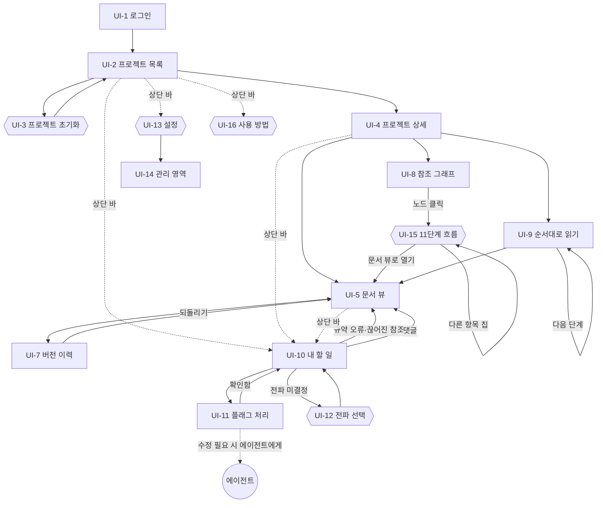

# 화면 설계: 싱크독 (SyncDoc)

---

## 0. 이 문서가 다루는 것

웹에 **어떤 화면이 있고, 어디서 어디로 가는지**를 정한다. 각 화면 안에 뭐가 어디 있는지는 와이어프레임에서 정한다.

대상은 사람용 웹뿐이다. 에이전트는 MCP로 붙으므로 화면이 없다.

**디자인 확정** — v1.2에서 하이피델리티 디자인 핸드오프를 받아 3장 토큰과 각 화면 규격을 확정했다. 색·타이포·간격은 이 문서가 원본이고, 화면 안 배치는 [[SYNC-UI-002]]가 이어받는다.

**도출 방법** — 유스케이스에서 사람이 주 액터인 것([[SYNC-UC-001#UC-H2]]~H17)과 사람 경로가 있는 것([[SYNC-UC-001#UC-A1]]), 인프라에서 정한 인증·토큰을 화면으로 옮긴다. **본문 편집 화면은 없다.** 명세 본문은 각자의 에이전트가 MCP로 쓰고, 웹은 읽기·상태 변경·댓글·되돌리기까지다 (v1.1에서 UI-6 삭제). 유스케이스 하나가 화면 하나는 아니다. 같은 맥락에서 이어지는 일은 한 화면에 모으고, 흐름이 끊기는 일은 나눈다.

---

## 1. 유스케이스 대응

| 유스케이스 | 화면 | 화면 안 위치 |
|---|---|---|
| [[SYNC-UC-001#UC-A1]] 프로젝트 초기화 (사람 경로) | UI-3 | 전체 |
| [[SYNC-UC-001#UC-H2]] 사람용 뷰로 읽기 | UI-5 | 본문 (유저용 탭 / 원본 탭) |
| [[SYNC-UC-001#UC-H3]] 항목 참조 조회 | UI-5 | 오른쪽 패널 |
| [[SYNC-UC-001#UC-H4]] 참조 그래프 | UI-8 | 전체 |
| [[SYNC-UC-001#UC-H6]] 버전 이력·비교 | UI-7 | 전체 |
| [[SYNC-UC-001#UC-H7]] 되돌리기 | UI-7 | 이력 행의 동작 |
| [[SYNC-UC-001#UC-H8]] 상태 변경 | UI-5 | 상단 바. `승인`이면 상위 대조 다이얼로그 |
| [[SYNC-UC-001#UC-H9]] 댓글 | UI-5 | 줄 옆 + 오른쪽 패널 |
| [[SYNC-UC-001#UC-H10]] 전파 여부 선택 | UI-12 | UI-10에서 여는 다이얼로그 |
| [[SYNC-UC-001#UC-H11]] 확인 필요 처리 | UI-11 | 전체 |
| [[SYNC-UC-001#UC-H12]] 끊어진 참조 해소 | UI-10 | 발견만. 수정은 에이전트에게 |
| [[SYNC-UC-001#UC-H13]] 항목 삭제 | — | 웹 화면 없음. 에이전트가 UC-A6로 |
| [[SYNC-UC-001#UC-H14]] 대시보드 | UI-2, UI-4 | 전체 |
| [[SYNC-UC-001#UC-H15]] 내 할 일 | UI-10 | 전체 |
| [[SYNC-UC-001#UC-H16]] 순서대로 읽기 | UI-9 | 전체 |
| [[SYNC-UC-001#UC-S6]] 인덱스 재구축 | UI-13 | 관리 영역(UI-14) |
| 인프라 5장 GitHub OAuth | UI-1 | 전체 |
| 인프라 5장 토큰 발급 | UI-13 | 전체 |

**한 화면에 여러 유스케이스가 모인 곳**: UI-5 문서 뷰(H2·H3·H8·H9). 문서를 읽으면서 참조를 보고, 상태를 바꾸고, 댓글을 다는 건 한 맥락이다. 화면을 나누면 오가느라 흐름이 끊긴다.

**유스케이스 하나가 화면 둘로 갈린 곳**: [[SYNC-UC-001#UC-H14]] 대시보드. 프로젝트 여러 개를 훑는 것(UI-2)과 하나를 파고드는 것(UI-4)은 정보 밀도가 달라 한 화면에 못 둔다.

---

## 2. 화면 목록

#### UI-1 로그인

페이지. GitHub OAuth로 들어온다. 주 유스케이스: 인프라 5장

#### UI-2 프로젝트 목록

페이지. 프로젝트마다 11단계 상태를 한눈에. 주 유스케이스: [[SYNC-UC-001#UC-H14]]

#### UI-3 프로젝트 초기화

다이얼로그. 저장소 주소와 코드를 넣어 등록. UI-2 위에 뜬다. 주 유스케이스: [[SYNC-UC-001#UC-A1]]

#### UI-4 프로젝트 상세

페이지. 단계별 문서 목록, 플래그·댓글 수, 최근 변경. 11단계 표 아래에 단계 밖 `STD` 문서 묶음(표준)이 따로 보인다 — 싱크독 프로젝트에만 있다. 주 유스케이스: [[SYNC-UC-001#UC-H14]]

#### UI-5 문서 뷰

페이지. 유저용(사람용 뷰, 기본)과 원본(MD)을 탭으로. 참조 보고, 상태 바꾸고, 댓글. 주 유스케이스: UC-H2·H3·H8·H9

#### UI-7 버전 이력

페이지. 버전 목록, 두 버전 diff, 되돌리기. 주 유스케이스: UC-H6·H7

#### UI-8 참조 그래프

페이지. 프로젝트 전체 참조를 노드·간선으로. 주 유스케이스: [[SYNC-UC-001#UC-H4]]

#### UI-9 순서대로 읽기

페이지. RFQ부터 MINISPEC까지 이어서. 주 유스케이스: [[SYNC-UC-001#UC-H16]]

#### UI-10 내 할 일

페이지. 내 플래그·전파 미결정·규약 오류·댓글. 주 유스케이스: [[SYNC-UC-001#UC-H15]]

#### UI-11 플래그 처리

페이지. 원인(diff 또는 하위 항목 본문)과 내 항목을 나란히 보고 확인. `확인 필요`·`하위 불일치` 둘 다. 주 유스케이스: [[SYNC-UC-001#UC-H11]]

#### UI-12 전파 선택

다이얼로그. 내 할 일의 미결정 건에서 열어 하위 항목 목록 보고 전파 여부 선택. 주 유스케이스: [[SYNC-UC-001#UC-H10]]

#### UI-13 설정

다이얼로그. MCP 토큰 발급·폐기, 에이전트 붙이는 설정 스니펫, 그리고 관리(UI-14). 어느 화면에서든 상단 바로 연다. 주 유스케이스: 인프라 5장

#### UI-14 관리

**UI-13 안의 영역.** 인덱스 재구축, 저장소 동기화 상태. v1.2에서 별도 페이지를 없애고 설정 다이얼로그 안 카드로 넣었다 — 재구축은 위험해서 깊이 두는 게 맞지만, 자주 보는 동기화 상태는 UI-4에도 함께 내보낸다. 주 유스케이스: [[SYNC-UC-001#UC-S6]]

#### UI-15 11단계 흐름

다이얼로그. 한 항목이 11단계 체인의 어디에 있고 어디로 흐르는지. 직접 참조가 아니라 상·하위 전이적 폐포를 따라간다. UI-8 노드 클릭으로 연다. 주 유스케이스: [[SYNC-UC-001#UC-H4]]

#### UI-16 사용 방법

다이얼로그. 처음 온 사람에게 6단계 사용법과 11단계가 뜻하는 것. 상단 바에서 연다. 주 유스케이스: 없음 — 안내 전용


페이지 9, 다이얼로그 5(UI-3·UI-12·UI-13·UI-15·UI-16), 삭제 1(UI-6). UI-14는 UI-13 안의 영역이 됐다. UI-5 안의 오른쪽 패널은 별도 ID 없이 UI-5의 일부다.

---

## 3. 디자인 토큰

화면 안 배치는 [[SYNC-UI-002]]가 정하고, **여기서는 어느 화면에서든 같아야 하는 값**을 정한다.
코드의 CSS 변수는 이 표의 전사다 — 값을 바꾸려면 여기를 먼저 고친다.

### 3.1 색

| 용도 | 값 | 쓰는 곳 |
|---|---|---|
| 배경 앱 | `#f7f6f3` | 화면 바탕 |
| 배경 카드 | `#ffffff` | 카드, 본문 |
| 배경 보조 | `#fbfaf8` | 사이드바, 표 머리, 다이얼로그 푸터 |
| 배경 진한 보조 | `#f3f1ec` | 줄번호 거터, 인라인 코드, ID 칩 |
| 잉크 본문 | `#17181c` | 글자, 상단 바 바탕 |
| 잉크 본문 대체 | `#1f2024` | 긴 문단 |
| 잉크 보조 | `#46443f` | 라벨, 메타, 설명 |
| 잉크 흐림 | `#6b6862` | 줄번호, 세 번째 위계 |
| 잉크 비활성 | `#a8a49c` | 빈 상태, 비활성 버튼 |
| 테두리 | `#e2e0da` | 기본 |
| 테두리 강조 | `#cfccc4` | 버튼, 입력, 툴팁 |
| 구분선 약함 | `#f0eeea` · `#f4f2ee` | 리스트 행 |
| 상태 초안 | `#9c9891` | |
| 상태 검토중 | `#d99b1e` | 항목 ID 뱃지 배경도 이 색 |
| 상태 승인 | `#2f7d5b` | 글자는 흰색 |
| 경고 | `#b8342a` | 플래그, 삭제 diff, 되돌리기, 내 할 일 카운트 |
| 경고 배경 | `#fdf1ef` | 플래그 카드, 삭제 줄 |
| 주의 배경 | `#fdf8ec` | 미완성 경고, 선택된 버전, 현재 단계 행 |
| 주의 잉크 | `#8a6410` | 미완성 라벨 |
| 되돌아오는 참조 | `#b8860b` | UI-8 전용 |
| 추가 diff 배경 | `#eef6f0` | |
| 그래프 간선 | `#8f8b83` | UI-8 전용 |
| 오버레이 | `rgba(23,24,28,.42)` | 다이얼로그 뒤 |

**상태 3색이 유일한 색 언어다.** 색은 상태와 플래그에만 쓰고 장식으로 쓰지 않는다. 단계 11개에 각각
색을 주지 않는 것도 같은 이유다 — 단계는 위치로 구분하고 색은 상태를 뜻한다.

### 3.2 타이포그래피

- 본문 **Pretendard Variable**, 대체 `Pretendard, system-ui, sans-serif`
- 고정폭 **IBM Plex Mono** — 문서 ID, 항목 ID, 버전, 커밋 해시, diff, 코드, 단계 코드, 줄번호

| 역할 | 크기 / 굵기 |
|---|---|
| 로그인 로고 | 27px / 700 |
| 화면 제목 | 22px / 600 |
| 문서 제목 | 27px / 600 |
| 절 제목 | 16.5px / 600. 아래 1px 테두리 |
| 카드 제목 | 15px / 600 |
| 항목 제목 | 14.5~15px / 600 |
| 본문 | 14.5px / 400, 줄높이 1.7 |
| UI 기본 | 14px / 400 |
| 보조 | 13~13.5px / 400 |
| 캡션 | 11.5~12.5px / 400 |
| 고정폭 ID | 12.5~13px / 500~600 |
| 고정폭 작게 | 11.5~12px / 400~500 |

한글 UI라 Pretendard를 고른다. 고정폭을 따로 두는 이유는 ID가 세로로 정렬돼야 훑기 좋기 때문이다.

### 3.3 간격·모서리·그림자

- 간격 2 · 3 · 4 · 5 · 6 · 7 · 8 · 9 · 10 · 11 · 12 · 13 · 14 · 16 · 18 · 20 · 22 · 26 · 30px
- 모서리 3px 작은 뱃지 · 4px 작은 버튼 · 5px 칩·노드 · 6px 버튼·입력 · 7px 항목 카드 · 8px 패널 카드 · 9px 상태 필 · 10px 다이얼로그 · 50% 점
- 그림자 다이얼로그 `0 18px 50px rgba(23,24,28,.3)` · 툴팁 `0 6px 18px rgba(23,24,28,.14)` · 토스트 `0 10px 30px rgba(23,24,28,.28)` · 카드 `0 1px 3px rgba(23,24,28,.05)` · 그래프 포커스 노드 `0 3px 10px rgba(23,24,28,.18)`

### 3.4 움직임

**애니메이션을 두지 않는다.** 상태 변화는 즉시 반영한다. 시간이 걸리는 것은 토스트가 사라지는 2.6초 하나뿐이다.

명세를 읽고 판단하는 도구라 화면이 움직이면 방해가 된다. 전환 효과가 필요해 보이면 그건 정보 구조가
잘못된 신호로 본다.

---

## 4. 공통 틀

모든 페이지(UI-1 제외)가 같은 틀 안에 있다.

```
┌──────────────────────────────────────────────────────┐
│ 싱크독          [사용 방법] [내 할 일 3] [설정] [로그아웃] │
├──────────────────────────────────────────────────────┤
│                                                      │
│                    페이지 내용                        │
│                                                      │
└──────────────────────────────────────────────────────┘
```

상단 바는 높이 50px, 바탕이 잉크 본문색이고 글자가 희다.

- **로고** — 클릭하면 UI-2로. **프로젝트 전환 경로는 이것 하나다.** 상단 바에 프로젝트 선택을 두지 않는다 — 프로젝트가 몇 개 안 되고, 목록 화면 자체가 프로젝트를 고르는 화면이라 선택기가 겹친다
- **사용 방법** — UI-16을 연다
- **내 할 일** — 처리할 건수를 경고색 필로. 0이면 필이 없다. 클릭 → UI-10. 담당 미지정은 이 수에 넣지 않는다
- **설정** — UI-13 다이얼로그를 연다. 관리(UI-14)는 그 안에 있다
- **로그아웃**

### 4.1 앱 셸

**페이지 전체는 스크롤하지 않는다.** 셸이 화면 높이를 꽉 채우고, 각 화면이 자기 안에서 스크롤한다.

이걸 지키지 않으면 탭을 오갈 때 스크롤바가 생겼다 없어지면서 가운데 정렬된 본문이 좌우로 흔들린다.
같은 이유로 UI-5의 유저용·원본·이력 세 탭은 본문 최대 폭이 같아야 한다.

### 4.2 문서 바

문서를 보는 페이지(UI-5·UI-7)에는 상단 바 아래 **문서 바**가 하나 더 있다. 문서 ID, 상태, 버전, 그리고 유저용·원본·이력 탭. 유저용과 원본은 UI-5 안에서 본문만 바뀌고, 이력은 UI-7이다.

```
├──────────────────────────────────────────────────────┤
│ SYNC-PRD-001 · 승인 · v7   [유저용] [원본] [이력]  [상태 변경 ▾] │
├──────────────────────────────────────────────────────┤
```

---

## 5. 화면 흐름



**흐름의 두 축**
- **읽기 축**: 목록 → 상세 → 문서 뷰 → 편집/이력. 위에서 아래로 파고든다
- **처리 축**: 내 할 일 → 확인 처리 / 전파 선택. 할 일에서 시작해 판단하고, 수정이 필요하면 화면 밖의 에이전트에게 넘긴다

두 축은 문서 뷰(UI-5)에서 만난다. 어느 쪽에서 왔든 문서에 도착하면 같은 화면이다. **수정은 어느 축에도 없다.** 웹은 판단하고 확정하는 곳이고, 쓰는 건 에이전트다.

---

## 6. 화면별 진입과 이탈

| 화면 | 진입 | 이탈 | 뒤로 가면 |
|---|---|---|---|
| UI-1 | 미인증 상태로 어디든 접근 | OAuth 성공 → 원래 가려던 곳 | — |
| UI-2 | 로그인 직후, 상단 바 로고 | 프로젝트 클릭, 초기화 버튼 | — |
| UI-3 | UI-2 버튼 | 등록 성공 → UI-2 목록에 새 행 | 닫기 = 등록 안 함 |
| UI-4 | UI-2 행 클릭, 상단 바 프로젝트 선택 | 문서·그래프·순서읽기 | UI-2 |
| UI-5 | UI-4 문서 클릭, 그래프 노드, 참조 링크, 할 일 항목 | 이력 탭, 참조 링크(다른 문서 UI-5) | 왔던 곳 |
| UI-7 | UI-5 이력 탭 | 되돌리기 → UI-5, 뷰 탭 | UI-5 |
| UI-8 | UI-4 | 노드 클릭 → UI-15 | UI-4 |
| UI-9 | UI-4 | 다음 단계(자기 자신), 문서 열기 → UI-5 | UI-4 |
| UI-10 | 상단 바 배지 | 항목 종류별로 UI-11·12·05 | 왔던 곳 |
| UI-11 | UI-10 플래그 행 | 확인함 → UI-10. 수정이 필요하면 화면 밖에서 에이전트에게 시키고 돌아옴 | UI-10 |
| UI-12 | UI-10 미결정 행 | 선택 → UI-10 | 닫기 = 미결정 유지 |
| UI-13 | 상단 바 (어느 화면에서든) | 닫기 → 왔던 화면 그대로 | 닫기 |
| UI-14 | UI-13 안 관리 카드 열기 | 재구축 확인 다이얼로그 | 카드 접기 |
| UI-15 | UI-8 노드 클릭 · UI-15 안 다른 항목 칩 | 문서 뷰로 열기 → UI-5 | 닫기 |
| UI-16 | 상단 바 (어느 화면에서든) | 닫기 | 닫기 |

**UI-12 전파 선택이 다이얼로그인 이유**: 내 할 일 목록 위에 떠서 판단하고 닫는 것이다. 답하지 않고 닫아도 미결정이 그대로 남아야 한다([[SYNC-UC-001#UC-H10]] 확장 `2b`). 페이지로 만들면 "닫았다"가 표현이 안 된다.

**UI-5 → 다른 문서 UI-5**: 참조 링크를 클릭하면 같은 화면 종류로 이동한다. 뒤로 가기가 원래 문서로 돌아가야 하므로 화면 안에서 바꿔치기가 아니라 페이지 이동이다.

---

## 7. 판단이 필요한 지점

**1. 편집 화면 — 결정: 없앴다.** 와이어프레임에서 그려보니 검사·충돌·삭제 확인을 사람이 손으로 하는 화면이 되어 에이전트가 관리하는 흐름과 어긋났다. 본문 쓰기는 에이전트(MCP)와 GitHub push뿐이다.

**2. UI-11 확인 처리가 UI-5 안에 들어갈 수 있는가.** 원인 diff와 내 항목을 나란히 보는 구조라 문서 뷰와 레이아웃이 다르다. 별도 페이지가 맞다고 본다.

**3. UI-8 참조 그래프의 범위 — 결정: 11단계를 열로 놓고 항상 다 그린다.** 프로젝트 전체를 그리면 노드가 수백 개인 건 맞다. 그런데 단계·문서로 좁혀 보니 한 걸음만 나가도 문서 대부분에 닿아 좁힌 의미가 없었다(27개 중 21개). 그래서 범위를 **잘라내는** 대신 **골라낸다** — 전체 / 승인만 / 플래그 있는 것 셋. 대신 열 안 순서를 정렬해 선 교차를 줄이고, 호버로 한 항목의 이웃만 남긴다. 체인을 따라가는 건 노드를 눌러 UI-15로.

**4. 관리(UI-14)의 위치 — 결정: 둘 다.** 위험한 동작(인덱스 재구축)은 설정 다이얼로그 안 관리 카드에 접어 둔다. 자주 보는 동기화 상태(마지막 처리 커밋, 밀린 커밋)는 **UI-4 최근 변경 아래에도** 내보낸다. 같은 값을 두 곳에서 보여주되 한쪽은 읽기 전용이다.

---

## 8. 미결사항

- [x] UI-8 그래프 범위 제한 조작 — 와이어프레임에서 — 결정: **전체 / 승인만 / 플래그 있는 것** 셋 (7장 3). v1.1의 전체·단계·문서 셋을 v1.2에서 갈아치웠다 — 단계로 좁혀도 한 걸음이면 문서 대부분에 닿아 소용이 없었다. 이로써 "범위 밖을 몇 단계까지 그릴지"라는 물음 자체가 사라졌다 ([[SYNC-MS-008#queries.graph_view]])
- [x] 저장소 동기화 상태를 UI-4에 노출할지 — 결정: 노출한다. 최근 변경 패널 맨 아래에 마지막 처리 커밋과 밀린 커밋 수를 붙인다(UI-002 UI-4). 폴링이 `behind_by`를 DB에 갱신하므로 화면은 읽기만 한다 — 화면 진입마다 fetch가 돌지 않는다 ([[SYNC-DOM-002#Repository]])
- [x] 모바일 대응 여부 — 현재 데스크톱만 전제 — 결정: v1은 안 한다. 프런트를 손볼 때 함께 본다. 앱 틀 CSS에 미디어 쿼리가 없고 UI-5는 목차·본문·패널 3단이 픽셀 고정이다. 대응하려면 뷰 CSS의 브레이크포인트(860·900·1000·1100·1200px)를 먼저 통일해야 한다
