# SEQUENCE: 싱크독 (SyncDoc)

---

## 0. 이 문서가 다루는 것

유스케이스 흐름을 **객체 수준**으로 내린다. 누가 누굴 어떤 순서로 부르고, 어디서 갈라지는지. 생명선은 클래스 명세 4장의 서비스와 인프라 4.1의 구성 요소다.

**1장 대응표의 입구 전부(REST 33 엔드포인트 + MCP 도구)를 다룬다.** v1.0에서는 "단순 조회는 안 그린다"고 했으나, 그려보니 단순해 보이던 조회가 묶음을 넘는 호출을 숨기고 있었다(`get_document`의 미존재 참조, 프로젝트 목록의 건수). 시퀀스는 그런 걸 잡으려고 그리는 것이므로 빠뜨리면 안 된다.

**v2에서 협업 장치를 걷어냈다.** 전파·플래그·댓글·내 할 일·백업의 시퀀스(SEQ-3·6·16·17)는 은퇴했고 번호는 비워 둔다. 남은 것 중 그 장치를 부르던 단계는 지웠다.

**두 종류로 나눈다.**
- **고유 흐름** SEQ-1·2·4·5·7~15·18~24 — 분기가 있거나 묶음을 넘는 것. 각자 그림
- **공통 형태** SEQ-C1·C2 — 정말로 `입구 → 서비스 하나 → DB → 반환`인 것. 그림 하나에 표로 어느 입구가 따르는지. **그려서 확인한 뒤에** 넣었다

**표기** — `alt` 분기, `opt` 조건부, `loop` 반복. 실선 호출, 점선 반환. `DB`는 어느 묶음이든 자기 테이블. 트랜잭션은 `rect`. `Q`는 `core/queries.py` — 읽기 집계 조합자(되먹일 것 #12).

### 0.1 생명선

다이어그램에 나오는 것이 실제로 무엇인지. 약어는 다이어그램 안 표기.

| 생명선 | 약어 | 실체 | 종류 | 정의한 곳 |
|---|---|---|---|---|
| 사람 | U | 브라우저를 쓰는 팀원 | 액터 | USECASE 1장 |
| 에이전트 | A | Claude Code·Codex·Gemini | 액터 | USECASE 1장 |
| GitHub | GH | 원격 저장소 | 액터 | USECASE 1장 |
| routers/* | RP·RD·RR·RT·RC·RA | `web/routers/*.py` 함수 | Boundary | 클래스 3.1, API REST |
| web/hooks | H | `web/hooks.py` | Boundary | 인프라 4.1 |
| mcp/tools | T | `mcp/tools.py` | Boundary | 클래스 3.1, API MCP |
| mcp 서버 | M | MCP 전송·인증 계층 | Boundary | 인프라 5 |
| pipeline | P | `core/pipeline.py` — 쓰기 조율 | Control | 클래스 4.7 |
| queries | Q | `core/queries.py` — 읽기 조합 | Control | 되먹일 것 #12 |
| ProjectService | PS | `core/project/service.py` | Control | 클래스 4.1 |
| SpecService | S | `core/spec/service.py` | Control | 클래스 4.2 |
| ReferenceService | R | `core/reference/service.py` | Control | 클래스 4.3 |
| AccountService | AS·AC | `core/account/service.py` | Control | 클래스 4.4 |
| infra/git | G | `infra/git.py` — clone·commit·push·fetch | 어댑터 | 인프라 4.3 |
| infra/github | GHI | `infra/github.py` — OAuth·webhook 검증 | 어댑터 | 인프라 5 |
| infra/llm | LLM | `infra/llm.py` — 모델 호출 | 어댑터 | 인프라 5.3 |
| DB | DB | PostgreSQL. 어느 묶음이든 자기 테이블 | 저장소 | ERD·DD |
| 입구 (공통) | B | 라우터 또는 mcp/tools — 흐름이 웹·MCP 공통일 때 | Boundary | 클래스 3.1 |
| 서비스 (공통) | SV | 네 서비스 중 하나 — SEQ-C1의 표가 지정 | Control | 클래스 4장 |

---

## 1. 대응표 — 입구 → 시퀀스

| 입구 | 시퀀스 | 묶음 넘음 |
|---|---|---|
| GET /auth/github | [[#SEQ-C1]] | |
| GET /auth/github/callback | [[#SEQ-8]] | |
| POST /auth/logout | [[#SEQ-C1]] | |
| POST /hooks/github | [[#SEQ-2]] | ○ |
| GET /api/projects | [[#SEQ-9]] | ○ |
| POST /api/projects · MCP init_project | [[#SEQ-4]] | ○ |
| GET /api/projects/{code} | [[#SEQ-9]] | ○ |
| GET /api/projects/{code}/docs · MCP list_documents | [[#SEQ-10]] | ○ |
| GET /api/projects/{code}/flags | [[#SEQ-18]] | ○ |
| GET /api/projects/{code}/graph | [[#SEQ-14]] | ○ |
| GET /api/docs/{docId} · MCP get_document | [[#SEQ-11]] | ○ |
| MCP get_item | [[#SEQ-12]] | ○ |
| GET …/items/{itemId}/references · MCP get_references | [[#SEQ-13]] | ○ |
| POST /api/docs/{docId}/status | [[#SEQ-5]] | ○ |
| GET /api/docs/{docId}/versions | [[#SEQ-C1]] | |
| GET /api/docs/{docId}/diff | [[#SEQ-15]] | ○ |
| POST /api/docs/{docId}/revert | [[#SEQ-7]] | ○ |
| DELETE /api/docs/{docId} | [[#SEQ-22]] | ○ |
| POST /api/docs/{docId}/restore | [[#SEQ-23]] | ○ |
| POST /api/docs/{docId}/purge | [[#SEQ-22]] 끝 | ○ |
| GET /api/projects/{code}/trash | [[#SEQ-C1]] | |
| GET /api/me | [[#SEQ-C1]] | |
| GET · POST /api/me/tokens · DELETE …/{id} | [[#SEQ-C1]] | |
| GET /api/admin/repos | [[#SEQ-20]] | |
| POST /api/admin/repos/{code}/rebuild | [[#SEQ-21]] | ○ |
| POST /api/docs/{docId}/ask | [[#SEQ-24]] | ○ |
| MCP create_document | [[#SEQ-19]] | ○ |
| MCP update_document | [[#SEQ-1]] | ○ |
| MCP delete_document | [[#SEQ-22]] | ○ |
| MCP restore_document | [[#SEQ-23]] | ○ |
| MCP 모든 도구의 인증 | [[#SEQ-C2]] | |

묶음을 넘는 것이 대응표 31행 중 22행이다(입구 여럿을 한 행에 묶은 것이 있다). v1.0에서 안 그린 조회 중 절반 이상이 묶음을 넘었다.

---

## SEQ-1 에이전트가 문서를 수정한다

[[SYNC-UC-001#UC-A6]] 기본 흐름 1~8, 확장 2a·4a·4b·5a·6a. MCP `update_document`.

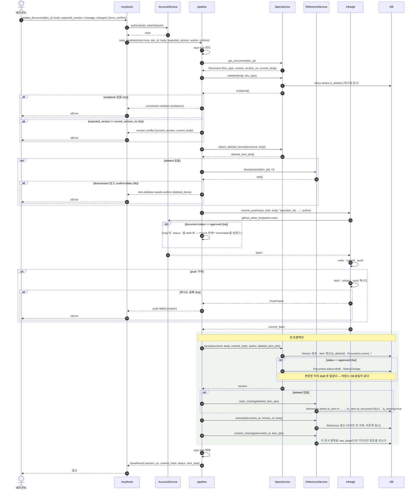
```mermaid
sequenceDiagram
    autonumber
    actor A as 에이전트
    participant T as mcp/tools
    participant AC as AccountService
    participant P as pipeline
    participant S as SpecService
    participant R as ReferenceService
    participant G as infra/git
    participant DB

    A->>T: update_document(doc_id, body, expected_version, message, changed_items, confirm)
    T->>AC: authenticate_token(bearer)
    AC-->>T: User
    T->>P: save_pipeline(entry=mcp, doc_id, body, expected_version, author, confirm)

    P->>P: repo lock 획득
    P->>S: get_document(doc_id)
    S-->>P: Document (doc_type, current_version_no, current_body)
    P->>S: validate(body, doc_type)
    S->>DB: items where is_deleted (재사용 검사)
    S-->>P: violations[]
    alt violations 있음 (2a)
        P-->>T: convention-violation {violations}
        T-->>A: isError
    end

    alt expected_version != current_version_no (4a)
        P-->>T: version-conflict {current_version, current_body}
        T-->>A: isError
    end

    P->>S: detect_deleted_items(document, body)
    S-->>P: deleted_item_pks[]
    opt deleted 있음
        P->>R: downstream(item_pk) ×N
        R-->>P: refs[]
        alt downstream 있고 confirm=false (4b)
            P-->>T: item-deletion-needs-confirm {deleted_items}
            T-->>A: isError
        end
    end

    P->>G: commit_push(repo, path, body, "spec(doc_id): …", author)
    G->>AC: github_token_for(author.user)
    opt document.status == approved (6a)
        P->>P: body 의 `status:` 를 draft 로 — **push 전에** frontmatter를 맞춘다 (#47)
    end
    AC-->>G: token
    G->>G: write · commit · push
    alt push 거부
        G->>G: fetch · rebase · push 재시도
        alt 재시도 실패 (5a)
            G-->>P: PushFailed
            P-->>T: push-failed {reason}
            T-->>A: isError
        end
    end
    G-->>P: commit_hash

    rect rgb(240,244,240)
        Note over P,DB: 한 트랜잭션
        P->>S: save(document, body, commit_hash, author, deleted_item_pks)
        S->>DB: Version 생성 · Item 갱신(is_deleted) · Document.current_*
        opt status == approved (6a)
            S->>DB: Document.status=draft · StatusChange
            Note over S,DB: 본문은 이미 draft 로 밀었다 — 저장소·DB·응답이 같다
        end
        S-->>P: Version
        opt deleted 있음
            P->>R: mark_missing(deleted_item_pks)
            R->>DB: references where to_item in … → to_item·to_document NULL · is_missing=true
        end
        P->>R: extract(document_id, version_id, body)
        R->>DB: Reference 갱신 (사라진 것 삭제, 미존재 표시)
        P->>R: resolve_missing(document_id, item_pks)
        R->>DB: 이 문서·항목을 raw_target으로 기다리던 참조를 잇는다
    end
    P->>P: repo lock 해제
    P-->>T: SaveResult {version_no, commit_hash, status, next_step}
    T-->>A: 결과
```

**읽을 때 볼 것**
- 검증(2a)·버전 충돌(4a)·삭제 확인(4b)은 **push 전에** 끝난다. push까지 갔으면 저장은 된다
- push가 DB 트랜잭션 **앞**이다. push가 실패하면 DB에 아무것도 안 남는다. 클래스 명세 4.7은 반대로 적혀 있었다 → 되먹일 것
- 삭제 확인은 `SpecService`가 아니라 `pipeline`이 한다. `SpecService`는 하위 참조를 모르기 때문이다(묶음 경계) → 되먹일 것
- **끊어진 참조는 표가 아니라 `references.is_missing`이다.** 항목이 지워지면 그것을 가리키던 참조가 미존재로 돌아가고(`mark_missing`), 대상이 다시 생기면 `resolve_missing`이 잇는다. 사람이 누르는 버튼이 없다 — 저장이 푼다
- **자동 강등(6a)은 push 전에 본문에도 쓴다.** DB에만 적으면 저장소 frontmatter가 `approved`로 남아 「`status`가 진실」이 깨지고, 다음 저장이 `frontmatter.status_change`로 막힌다 — 서버가 준 본문을 서버가 거부한다(#47). **서버가 에이전트의 본문을 고치는 유일한 자리다**

---

## SEQ-2 GitHub push를 받아 처리한다

[[SYNC-UC-001#UC-G1]] 기본 흐름 1~4, 확장 1a·1b·3a·3c. webhook 또는 폴링.

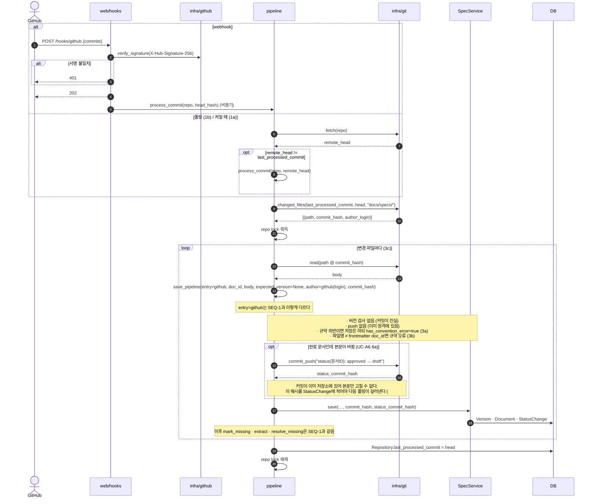
```mermaid
sequenceDiagram
    autonumber
    actor GH as GitHub
    participant H as web/hooks
    participant GHI as infra/github
    participant P as pipeline
    participant G as infra/git
    participant S as SpecService
    participant DB

    alt webhook
        GH->>H: POST /hooks/github {commits}
        H->>GHI: verify_signature(X-Hub-Signature-256)
        alt 서명 불일치
            H-->>GH: 401
        end
        H-->>GH: 202
        H->>P: process_commit(repo, head_hash) (비동기)
    else 폴링 (1b) / 켜질 때 (1a)
        P->>G: fetch(repo)
        G-->>P: remote_head
        opt remote_head != last_processed_commit
            P->>P: process_commit(repo, remote_head)
        end
    end

    P->>G: changed_files(last_processed_commit..head, "docs/specs/")
    G-->>P: [(path, commit_hash, author_login)]
    P->>P: repo lock 획득
    loop 변경 파일마다 (3c)
        P->>G: read(path @ commit_hash)
        G-->>P: body
        P->>P: save_pipeline(entry=github, doc_id, body, expected_version=None, author=github(login), commit_hash)
        Note over P: entry=github는 SEQ-1과 이렇게 다르다
        Note over P,S: · 버전 검사 없음 (커밋이 진실)<br/>· push 없음 (이미 원격에 있음)<br/>· 규약 위반이면 저장은 하되 has_convention_error=true (3a)<br/>· 파일명 ≠ frontmatter doc_id면 규약 오류 (3b)
        opt 완료 문서인데 본문이 바뀜 (UC-A6 6a)
            P->>G: commit_push("status(문서ID): approved → draft")
            G-->>P: status_commit_hash
            Note over P,G: 커밋이 이미 저장소에 있어 본문만 고칠 수 없다.<br/>이 해시를 StatusChange에 적어야 다음 폴링이 걸러낸다 (#58)
        end
        P->>S: save(…, commit_hash, status_commit_hash)
        S->>DB: Version · Document · StatusChange
        Note over P: 이후 mark_missing · extract · resolve_missing은 SEQ-1과 같음
    end
    P->>DB: Repository.last_processed_commit = head
    P->>P: repo lock 해제
```

**읽을 때 볼 것**
- `author`는 커밋 작성자 GitHub 로그인으로 User를 찾는다. 등록 안 된 사람이면? → 되먹일 것
- 밀린 커밋이 여럿이면 `changed_files`가 범위 전체를 한 번에 준다. 커밋마다 돌지 않고 **최종 상태**만 저장한다. 중간 버전은 git에만 있다 → 되먹일 것

---

## SEQ-4 프로젝트를 초기화한다

[[SYNC-UC-001#UC-A1]] 기본 흐름 1~6, 확장 2a·2b·3a·4a. 웹(UI-3)이든 MCP(`init_project`)든 같다.

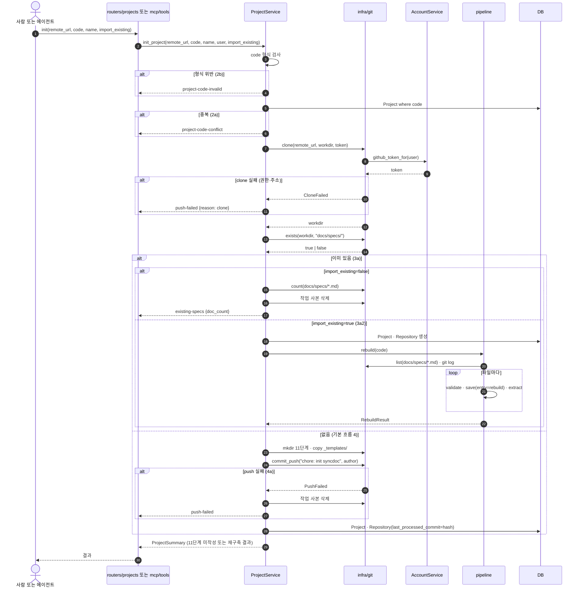
```mermaid
sequenceDiagram
    autonumber
    actor U as 사람 또는 에이전트
    participant B as routers/projects 또는 mcp/tools
    participant PS as ProjectService
    participant G as infra/git
    participant AC as AccountService
    participant P as pipeline
    participant DB

    U->>B: init(remote_url, code, name, import_existing)
    B->>PS: init_project(remote_url, code, name, user, import_existing)
    PS->>PS: code 형식 검사
    alt 형식 위반 (2b)
        PS-->>B: project-code-invalid
    end
    PS->>DB: Project where code
    alt 중복 (2a)
        PS-->>B: project-code-conflict
    end
    PS->>G: clone(remote_url, workdir, token)
    G->>AC: github_token_for(user)
    AC-->>G: token
    alt clone 실패 (권한·주소)
        G-->>PS: CloneFailed
        PS-->>B: push-failed {reason: clone}
    end
    G-->>PS: workdir
    PS->>G: exists(workdir, "docs/specs/")
    G-->>PS: true | false

    alt 이미 있음 (3a)
        alt import_existing=false
            PS->>G: count(docs/specs/*.md)
            PS->>G: 작업 사본 삭제
            PS-->>B: existing-specs {doc_count}
        else import_existing=true (3a2)
            PS->>DB: Project · Repository 생성
            PS->>P: rebuild(code)
            P->>G: list(docs/specs/*.md) · git log
            loop 파일마다
                P->>P: validate · save(entry=rebuild) · extract
            end
            P-->>PS: RebuildResult
        end
    else 없음 (기본 흐름 4)
        PS->>G: mkdir 11단계 · copy _templates/
        PS->>G: commit_push("chore: init syncdoc", author)
        alt push 실패 (4a)
            G-->>PS: PushFailed
            PS->>G: 작업 사본 삭제
            PS-->>B: push-failed
        end
        PS->>DB: Project · Repository(last_processed_commit=hash)
    end
    PS-->>B: ProjectSummary (11단계 미작성 또는 재구축 결과)
    B-->>U: 결과
```

**읽을 때 볼 것**
- `existing-specs`로 거부할 때 clone한 작업 사본을 지운다. 안 지우면 재요청 때 "이미 clone됨"이 된다
- 재구축(3a2)은 `rebuild`가 하고 `init_project`는 등록만. 같은 `rebuild`를 UI-14가 부른다

---

## SEQ-5 문서 상태를 바꾼다

[[SYNC-UC-001#UC-H8]] 기본 흐름 1~3, 확장 1a. UI-5 요소 3. 초안 ⇄ 완료 토글.

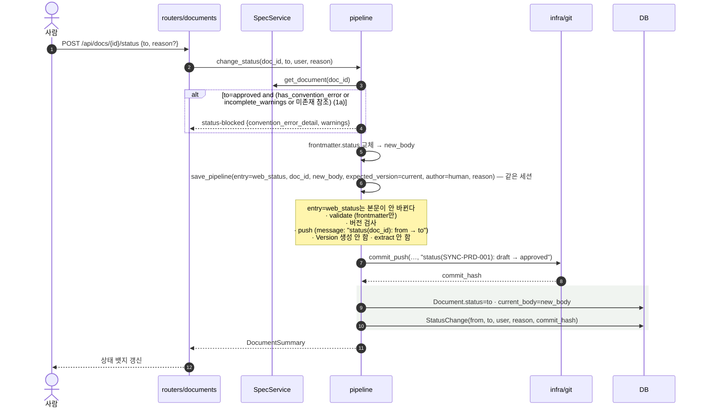
```mermaid
sequenceDiagram
    autonumber
    actor U as 사람
    participant RD as routers/documents
    participant S as SpecService
    participant P as pipeline
    participant G as infra/git
    participant DB

    U->>RD: POST /api/docs/{id}/status {to, reason?}
    RD->>P: change_status(doc_id, to, user, reason)
    P->>S: get_document(doc_id)
    alt to=approved and (has_convention_error or incomplete_warnings or 미존재 참조) (1a)
        P-->>RD: status-blocked {convention_error_detail, warnings}
    end
    P->>P: frontmatter.status 교체 → new_body
    P->>P: save_pipeline(entry=web_status, doc_id, new_body, expected_version=current, author=human, reason) — 같은 세션
    Note over P: entry=web_status는 본문이 안 바뀐다<br/>· validate (frontmatter만)<br/>· 버전 검사<br/>· push (message: "status(doc_id): from → to")<br/>· Version 생성 안 함 · extract 안 함
    P->>G: commit_push(…, "status(SYNC-PRD-001): draft → approved")
    G-->>P: commit_hash
    rect rgb(240,244,240)
        P->>DB: Document.status=to · current_body=new_body
        P->>DB: StatusChange(from, to, user, reason, commit_hash)
    end
    P-->>RD: DocumentSummary
    RD-->>U: 상태 뱃지 갱신
```

**읽을 때 볼 것**
- 상태 변경은 `pipeline.change_status`가 조율한다(B2 되먹임으로 SpecService에서 옮김). SpecService는 `get_document`·`apply_status`만
- 완료로 올리는 조건은 셋뿐이다 — 규약 오류·미완성·미존재 참조가 없을 것. 셋 다 한 문서만 보고 판정된다. 상위 대조·댓글 확인은 v2에서 사라졌다
- 상태 변경은 **Version을 만들지 않는다.** `StatusChange`가 커밋 해시를 갖는다. UI-7 이력에서 `status` 행은 `StatusChange`에서, `spec` 행은 `Version`에서 와서 시각순으로 합친다

---

## SEQ-7 이전 버전으로 되돌린다

[[SYNC-UC-001#UC-H7]] 기본 흐름 1~4, 확장 4a. UI-7 요소 2.2 → 4.

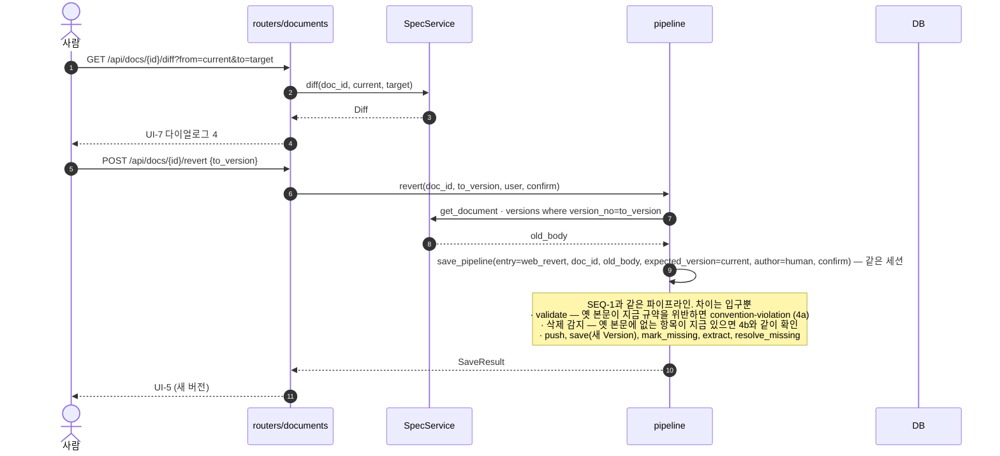
```mermaid
sequenceDiagram
    autonumber
    actor U as 사람
    participant RD as routers/documents
    participant S as SpecService
    participant P as pipeline
    participant DB

    U->>RD: GET /api/docs/{id}/diff?from=current&to=target
    RD->>S: diff(doc_id, current, target)
    S-->>RD: Diff
    RD-->>U: UI-7 다이얼로그 4

    U->>RD: POST /api/docs/{id}/revert {to_version}
    RD->>P: revert(doc_id, to_version, user, confirm)
    P->>S: get_document · versions where version_no=to_version
    S-->>P: old_body
    P->>P: save_pipeline(entry=web_revert, doc_id, old_body, expected_version=current, author=human, confirm) — 같은 세션
    Note over P: SEQ-1과 같은 파이프라인. 차이는 입구뿐<br/>· validate — 옛 본문이 지금 규약을 위반하면 convention-violation (4a)<br/>· 삭제 감지 — 옛 본문에 없는 항목이 지금 있으면 4b와 같이 확인<br/>· push, save(새 Version), mark_missing, extract, resolve_missing
    P-->>RD: SaveResult
    RD-->>U: UI-5 (새 버전)
```

**읽을 때 볼 것**
- 되돌리기가 항목을 없애는 경우가 있다. 지금 v7에 있는 `#R15`가 v3엔 없으면 되돌리기 = 삭제. 웹엔 `confirm` 인자가 없으므로 `item-deletion-needs-confirm`이 오면 UI-7이 확인 다이얼로그를 띄우고 `confirm_item_deletion=true`로 재요청해야 한다 → 되먹일 것 (API에 그 인자가 없다)

---

## SEQ-8 GitHub로 로그인한다

인프라 5장. UI-1.

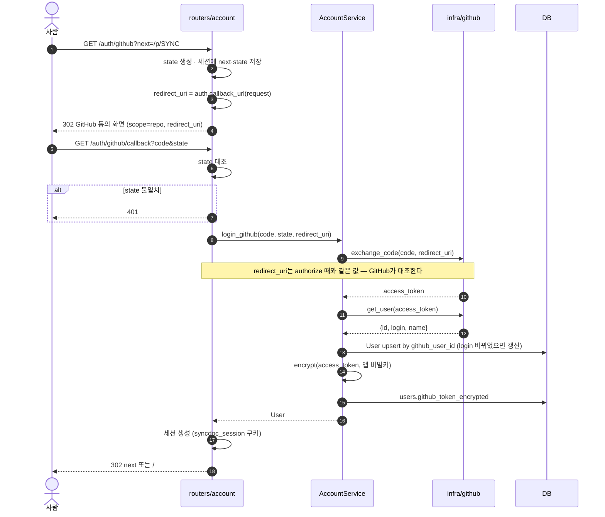
```mermaid
sequenceDiagram
    autonumber
    actor U as 사람
    participant RA as routers/account
    participant AS as AccountService
    participant GHI as infra/github
    participant DB

    U->>RA: GET /auth/github?next=/p/SYNC
    RA->>RA: state 생성 · 세션에 next·state 저장
    RA->>RA: redirect_uri = auth.callback_url(request)
    RA-->>U: 302 GitHub 동의 화면 (scope=repo, redirect_uri)
    U->>RA: GET /auth/github/callback?code&state
    RA->>RA: state 대조
    alt state 불일치
        RA-->>U: 401
    end
    RA->>AS: login_github(code, state, redirect_uri)
    AS->>GHI: exchange_code(code, redirect_uri)
    Note over RA,GHI: redirect_uri는 authorize 때와 같은 값 — GitHub가 대조한다
    GHI-->>AS: access_token
    AS->>GHI: get_user(access_token)
    GHI-->>AS: {id, login, name}
    AS->>DB: User upsert by github_user_id (login 바뀌었으면 갱신)
    AS->>AS: encrypt(access_token, 앱 비밀키)
    AS->>DB: users.github_token_encrypted
    AS-->>RA: User
    RA->>RA: 세션 생성 (syncdoc_session 쿠키)
    RA-->>U: 302 next 또는 /
```

**읽을 때 볼 것** — `github_user_id`로 upsert한다. 로그인 ID를 바꾼 사람도 같은 User다(DD users). `redirect_uri`를 보내므로 OAuth 앱 하나에 콜백을 여럿(로컬·공개) 등록해도 요청한 주소로 돌아온다(인프라 5장).

---

## SEQ-9 프로젝트 목록·상세를 본다

[[SYNC-UC-001#UC-H14]] 기본 흐름 1~3. UI-2, UI-4. 프로젝트마다 단계 요약과 건수를 모으느라 묶음 셋을 넘는다.

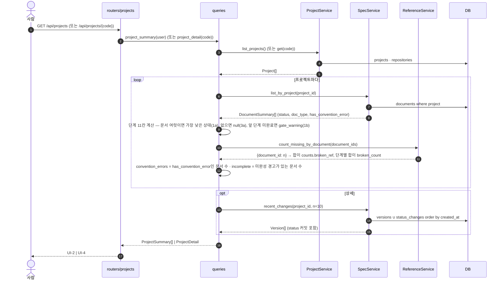
```mermaid
sequenceDiagram
    autonumber
    actor U as 사람
    participant RP as routers/projects
    participant Q as queries
    participant PS as ProjectService
    participant S as SpecService
    participant R as ReferenceService
    participant DB

    U->>RP: GET /api/projects (또는 /api/projects/{code})
    RP->>Q: project_summary(user) (또는 project_detail(code))
    Q->>PS: list_projects() (또는 get(code))
    PS->>DB: projects · repositories
    PS-->>Q: Project[]
    loop 프로젝트마다
        Q->>S: list_by_project(project_id)
        S->>DB: documents where project
        S-->>Q: DocumentSummary[] (status, doc_type, has_convention_error)
        Q->>Q: 단계 11칸 계산 — 문서 여럿이면 가장 낮은 상태(1a), 없으면 null(3a), 앞 단계 미완료면 gate_warning(1b)
        Q->>R: count_missing_by_document(document_ids)
        R-->>Q: {document_id: n} → 합이 counts.broken_ref, 단계별 합이 broken_count
        Q->>Q: convention_errors = has_convention_error인 문서 수 · incomplete = 미완성 경고가 있는 문서 수
    end
    opt 상세
        Q->>S: recent_changes(project_id, n=10)
        S->>DB: versions ∪ status_changes order by created_at
        S-->>Q: Version[] (status 커밋 포함)
    end
    Q-->>RP: ProjectSummary[] | ProjectDetail
    RP-->>U: UI-2 | UI-4
```

**읽을 때 볼 것**
- 단계 11칸 계산은 `queries`가 한다. `ProjectService`는 `documents` 테이블을 모른다(spec 묶음). → 되먹일 것 #12·#13
- `recent_changes`가 `versions`와 `status_changes`를 합친다 → 되먹일 것 #6

---

## SEQ-10 문서 목록을 본다

[[SYNC-UC-001#UC-A5]], [[SYNC-UC-001#UC-H14]]·H16. REST `GET /api/projects/{code}/docs` · MCP `list_documents`.

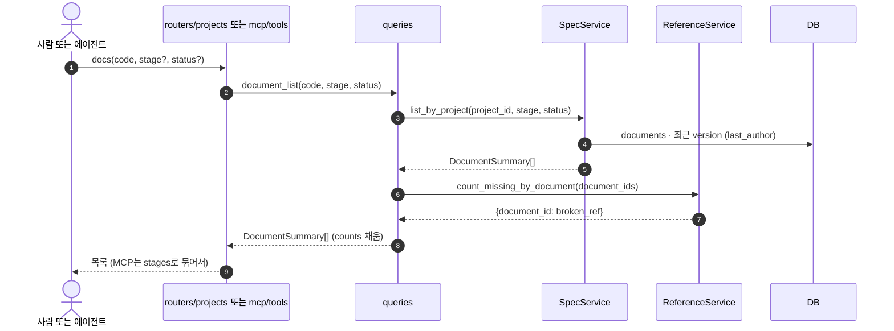
```mermaid
sequenceDiagram
    autonumber
    actor A as 사람 또는 에이전트
    participant B as routers/projects 또는 mcp/tools
    participant Q as queries
    participant S as SpecService
    participant R as ReferenceService
    participant DB

    A->>B: docs(code, stage?, status?)
    B->>Q: document_list(code, stage, status)
    Q->>S: list_by_project(project_id, stage, status)
    S->>DB: documents · 최근 version (last_author)
    S-->>Q: DocumentSummary[]
    Q->>R: count_missing_by_document(document_ids)
    R-->>Q: {document_id: broken_ref}
    Q-->>B: DocumentSummary[] (counts 채움)
    B-->>A: 목록 (MCP는 stages로 묶어서)
```

**읽을 때 볼 것** — 문서마다 건수 하나. 문서 N개면 쿼리 N번이 아니라 `document_ids`로 한 번에 묶어 묻는다 → MINISPEC.

---

## SEQ-11 문서를 본다

[[SYNC-UC-001#UC-A2]], [[SYNC-UC-001#UC-H2]]. REST `GET /api/docs/{docId}` · MCP `get_document`. 유저용·원본 탭 공통.

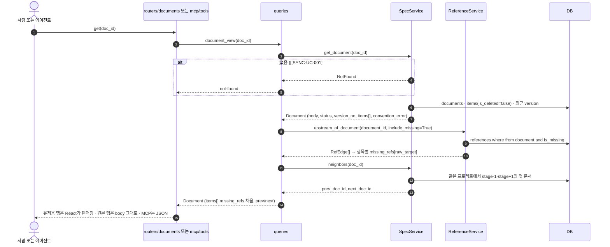
```mermaid
sequenceDiagram
    autonumber
    actor A as 사람 또는 에이전트
    participant B as routers/documents 또는 mcp/tools
    participant Q as queries
    participant S as SpecService
    participant R as ReferenceService
    participant DB

    A->>B: get(doc_id)
    B->>Q: document_view(doc_id)
    Q->>S: get_document(doc_id)
    alt 없음 ([[SYNC-UC-001#UC-A2]] 1a)
        S-->>Q: NotFound
        Q-->>B: not-found
    end
    S->>DB: documents · items(is_deleted=false) · 최근 version
    S-->>Q: Document (body, status, version_no, items[], convention_error)
    Q->>R: upstream_of_document(document_id, include_missing=True)
    R->>DB: references where from document and is_missing
    R-->>Q: RefEdge[] → 항목별 missing_refs[raw_target]
    Q->>S: neighbors(doc_id)
    S->>DB: 같은 프로젝트에서 stage-1·stage+1의 첫 문서
    S-->>Q: prev_doc_id, next_doc_id
    Q-->>B: Document (items[].missing_refs 채움, prev/next)
    B-->>A: 유저용 탭은 React가 렌더링 · 원본 탭은 body 그대로 · MCP는 JSON
```

**읽을 때 볼 것**
- `items[].missing_refs`를 붙이려고 `ReferenceService`를 부른다. `SpecService`가 직접 부르면 묶음 경계 위반 → `queries`가 조합 (되먹일 것 #12)
- 규약 오류 문서는 에러가 아니라 정상 반환 + `has_convention_error`([[SYNC-UC-001#UC-A2]] 2a)

---

## SEQ-12 항목을 본다

[[SYNC-UC-001#UC-A3]]. MCP `get_item`.

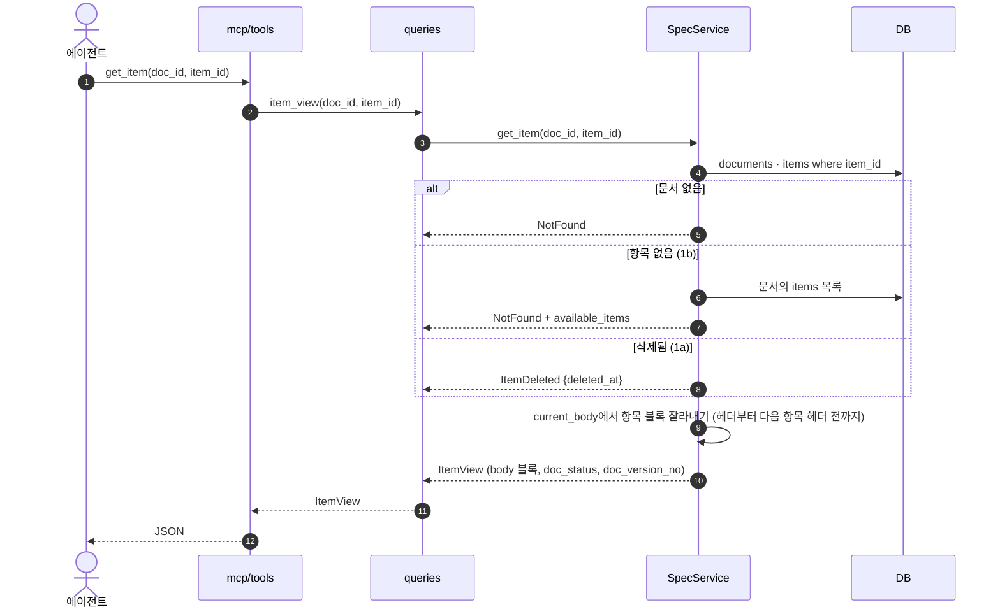
```mermaid
sequenceDiagram
    autonumber
    actor A as 에이전트
    participant T as mcp/tools
    participant Q as queries
    participant S as SpecService
    participant DB

    A->>T: get_item(doc_id, item_id)
    T->>Q: item_view(doc_id, item_id)
    Q->>S: get_item(doc_id, item_id)
    S->>DB: documents · items where item_id
    alt 문서 없음
        S-->>Q: NotFound
    else 항목 없음 (1b)
        S->>DB: 문서의 items 목록
        S-->>Q: NotFound + available_items
    else 삭제됨 (1a)
        S-->>Q: ItemDeleted {deleted_at}
    end
    S->>S: current_body에서 항목 블록 잘라내기 (헤더부터 다음 항목 헤더 전까지)
    S-->>Q: ItemView (body 블록, doc_status, doc_version_no)
    Q-->>T: ItemView
    T-->>A: JSON
```

**읽을 때 볼 것** — "항목 블록"의 경계를 어떻게 자르나가 MINISPEC 과제. 문서 타입마다 헤더 형식이 다르다(클래스 미결 `display_name`과 같은 문제).

---

## SEQ-13 항목의 참조를 본다

[[SYNC-UC-001#UC-A4]], [[SYNC-UC-001#UC-H3]]. REST `GET …/items/{itemId}/references` · MCP `get_references`. UI-5 패널 8.1.

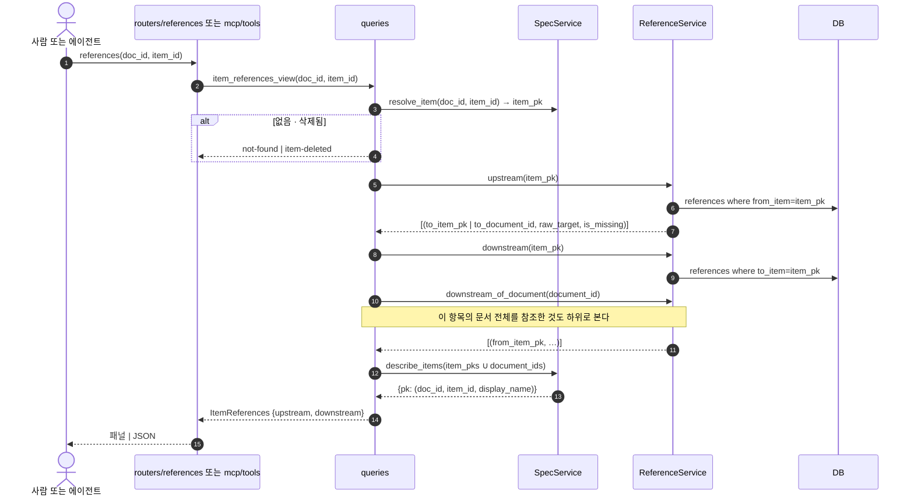
```mermaid
sequenceDiagram
    autonumber
    actor A as 사람 또는 에이전트
    participant B as routers/references 또는 mcp/tools
    participant Q as queries
    participant S as SpecService
    participant R as ReferenceService
    participant DB

    A->>B: references(doc_id, item_id)
    B->>Q: item_references_view(doc_id, item_id)
    Q->>S: resolve_item(doc_id, item_id) → item_pk
    alt 없음 · 삭제됨
        Q-->>B: not-found | item-deleted
    end
    Q->>R: upstream(item_pk)
    R->>DB: references where from_item=item_pk
    R-->>Q: [(to_item_pk | to_document_id, raw_target, is_missing)]
    Q->>R: downstream(item_pk)
    R->>DB: references where to_item=item_pk
    Q->>R: downstream_of_document(document_id)
    Note over Q,R: 이 항목의 문서 전체를 참조한 것도 하위로 본다
    R-->>Q: [(from_item_pk, …)]
    Q->>S: describe_items(item_pks ∪ document_ids)
    S-->>Q: {pk: (doc_id, item_id, display_name)}
    Q-->>B: ItemReferences {upstream, downstream}
    B-->>A: 패널 | JSON
```

**읽을 때 볼 것**
- `ReferenceService`는 pk만 안다. 사람이 읽을 `doc_id#item_id`와 표시 이름은 `SpecService.describe_items`로 채운다 → 되먹일 것 #14
- 문서 전체를 참조한 것(`to_document_id`)이 하위 목록에 섞인다. `item_id: null`로 구분

---

## SEQ-14 참조 그래프를 본다

[[SYNC-UC-001#UC-H4]]. UI-8.

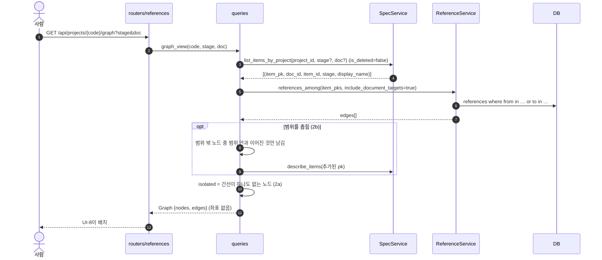
```mermaid
sequenceDiagram
    autonumber
    actor U as 사람
    participant RR as routers/references
    participant Q as queries
    participant S as SpecService
    participant R as ReferenceService
    participant DB

    U->>RR: GET /api/projects/{code}/graph?stage&doc
    RR->>Q: graph_view(code, stage, doc)
    Q->>S: list_items_by_project(project_id, stage?, doc?) (is_deleted=false)
    S-->>Q: [(item_pk, doc_id, item_id, stage, display_name)]
    Q->>R: references_among(item_pks, include_document_targets=true)
    R->>DB: references where from in … or to in …
    R-->>Q: edges[]
    opt 범위를 좁힘 (2b)
        Q->>Q: 범위 밖 노드 중 범위 안과 이어진 것만 남김
        Q->>S: describe_items(추가된 pk)
    end
    Q->>Q: isolated = 간선이 하나도 없는 노드 (2a)
    Q-->>RR: Graph {nodes, edges} (좌표 없음)
    RR-->>U: UI-8이 배치
```

**읽을 때 볼 것** — 좌표는 서버가 안 준다. 노드·간선만. 배치는 브라우저(drawio 뺀 것과 같은 원칙).

---

## SEQ-15 두 버전의 diff를 본다

[[SYNC-UC-001#UC-H6]]. UI-7. 항목별로 묶고 하위 참조 건수를 붙인다(3a).

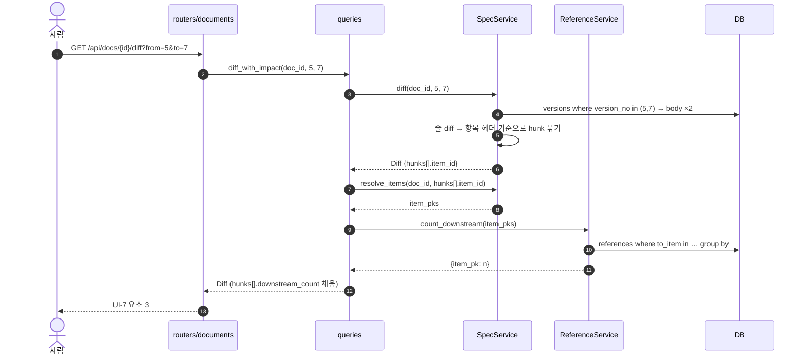
```mermaid
sequenceDiagram
    autonumber
    actor U as 사람
    participant RD as routers/documents
    participant Q as queries
    participant S as SpecService
    participant R as ReferenceService
    participant DB

    U->>RD: GET /api/docs/{id}/diff?from=5&to=7
    RD->>Q: diff_with_impact(doc_id, 5, 7)
    Q->>S: diff(doc_id, 5, 7)
    S->>DB: versions where version_no in (5,7) → body ×2
    S->>S: 줄 diff → 항목 헤더 기준으로 hunk 묶기
    S-->>Q: Diff {hunks[].item_id}
    Q->>S: resolve_items(doc_id, hunks[].item_id)
    S-->>Q: item_pks
    Q->>R: count_downstream(item_pks)
    R->>DB: references where to_item in … group by
    R-->>Q: {item_pk: n}
    Q-->>RD: Diff (hunks[].downstream_count 채움)
    RD-->>U: UI-7 요소 3
```

**읽을 때 볼 것** — `SpecService.diff`는 참조를 모른다. 건수는 `queries`가 붙인다.

---

## SEQ-18 프로젝트의 끊어진 참조·오류·미완성 목록을 본다

[[SYNC-UC-001#UC-H14]] 기본 흐름 4. UI-4 다이얼로그 6.

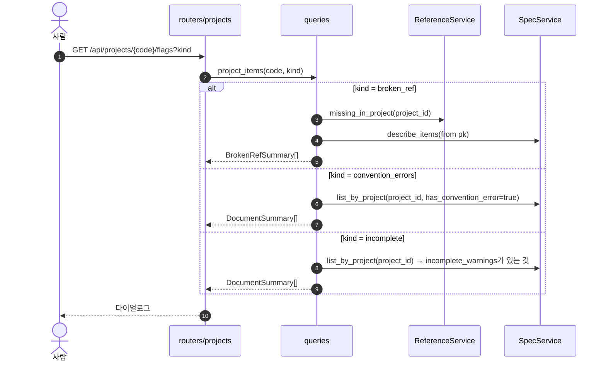
```mermaid
sequenceDiagram
    autonumber
    actor U as 사람
    participant RP as routers/projects
    participant Q as queries
    participant R as ReferenceService
    participant S as SpecService

    U->>RP: GET /api/projects/{code}/flags?kind
    RP->>Q: project_items(code, kind)
    alt kind = broken_ref
        Q->>R: missing_in_project(project_id)
        Q->>S: describe_items(from pk)
        Q-->>RP: BrokenRefSummary[]
    else kind = convention_errors
        Q->>S: list_by_project(project_id, has_convention_error=true)
        Q-->>RP: DocumentSummary[]
    else kind = incomplete
        Q->>S: list_by_project(project_id) → incomplete_warnings가 있는 것
        Q-->>RP: DocumentSummary[]
    end
    RP-->>U: 다이얼로그
```

**읽을 때 볼 것** — `kind`로 두 서비스 중 하나로 갈린다. 경로 이름 `flags`는 v1의 것이 남은 것이다([[SYNC-API-001]] 3.3).

---

## SEQ-19 에이전트가 문서를 만든다

[[SYNC-UC-001#UC-A6]] (생성). MCP `create_document`. SEQ-1과 같은 파이프라인이되 앞부분이 다르다.

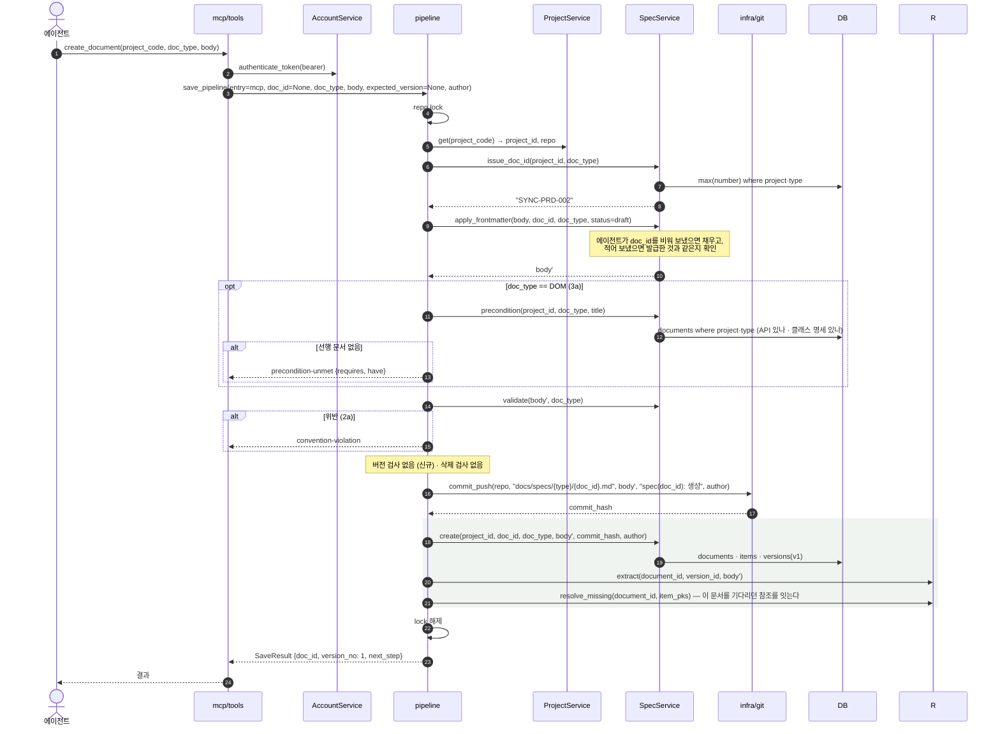
```mermaid
sequenceDiagram
    autonumber
    actor A as 에이전트
    participant T as mcp/tools
    participant AC as AccountService
    participant P as pipeline
    participant PS as ProjectService
    participant S as SpecService
    participant G as infra/git
    participant DB

    A->>T: create_document(project_code, doc_type, body)
    T->>AC: authenticate_token(bearer)
    T->>P: save_pipeline(entry=mcp, doc_id=None, doc_type, body, expected_version=None, author)
    P->>P: repo lock
    P->>PS: get(project_code) → project_id, repo
    P->>S: issue_doc_id(project_id, doc_type)
    S->>DB: max(number) where project·type
    S-->>P: "SYNC-PRD-002"
    P->>S: apply_frontmatter(body, doc_id, doc_type, status=draft)
    Note over S: 에이전트가 doc_id를 비워 보냈으면 채우고,<br/>적어 보냈으면 발급한 것과 같은지 확인
    S-->>P: body'
    opt doc_type == DOM (3a)
        P->>S: precondition(project_id, doc_type, title)
        S->>DB: documents where project·type (API 있나 · 클래스 명세 있나)
        alt 선행 문서 없음
            P-->>T: precondition-unmet {requires, have}
        end
    end
    P->>S: validate(body', doc_type)
    alt 위반 (2a)
        P-->>T: convention-violation
    end
    Note over P: 버전 검사 없음 (신규) · 삭제 검사 없음
    P->>G: commit_push(repo, "docs/specs/{type}/{doc_id}.md", body', "spec(doc_id): 생성", author)
    G-->>P: commit_hash
    rect rgb(240,244,240)
        P->>S: create(project_id, doc_id, doc_type, body', commit_hash, author)
        S->>DB: documents · items · versions(v1)
        P->>R: extract(document_id, version_id, body')
        P->>R: resolve_missing(document_id, item_pks) — 이 문서를 기다리던 참조를 잇는다
    end
    P->>P: lock 해제
    P-->>T: SaveResult {doc_id, version_no: 1, next_step}
    T-->>A: 결과
```

**읽을 때 볼 것**
- 파일 경로가 `docs/specs/{type}/{doc_id}.md`다. 11단계 디렉터리가 타입 코드다 → 인프라·PRD에 경로 규약이 없다 (되먹일 것 #16)
- `apply_frontmatter`가 새 메서드. 에이전트가 frontmatter를 비워도 서버가 채운다 → #17
- DOM 선행조건(3a)은 **push 전에** 끝난다. 존재만 본다 — 상태는 신호다([[SYNC-PRD-001#R6]]). `next_step`은 결과에 매번 실린다 — 문서 하나 쓰고 멈추라는 규약([[SYNC-STD-001]] 1.8)을 응답이 다시 말한다

---

## SEQ-20 저장소 동기화 상태를 본다

UI-14 표 2. [[SYNC-UC-001#UC-G1]] 1a·1b의 근거 데이터.

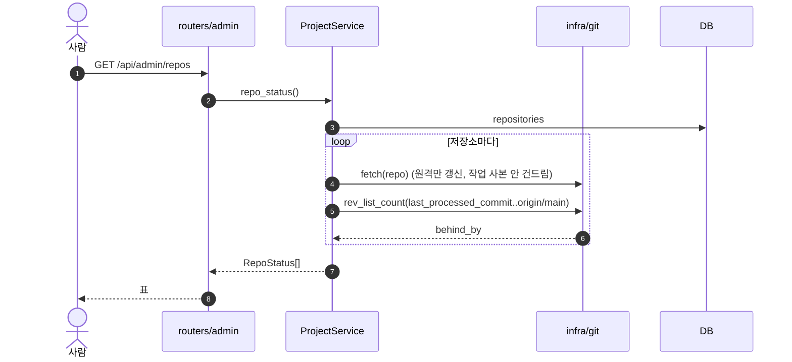
```mermaid
sequenceDiagram
    autonumber
    actor U as 사람
    participant RA as routers/admin
    participant PS as ProjectService
    participant G as infra/git
    participant DB

    U->>RA: GET /api/admin/repos
    RA->>PS: repo_status()
    PS->>DB: repositories
    loop 저장소마다
        PS->>G: fetch(repo) (원격만 갱신, 작업 사본 안 건드림)
        PS->>G: rev_list_count(last_processed_commit..origin/main)
        G-->>PS: behind_by
    end
    PS-->>RA: RepoStatus[]
    RA-->>U: 표
```

**읽을 때 볼 것** — 화면 열 때마다 fetch를 저장소 수만큼 한다. 느리면 폴링이 갱신한 값을 DB에 캐시하고 여기서는 읽기만 → 미결.

---

## SEQ-21 인덱스를 재구축한다

[[SYNC-UC-001#UC-S6]]. UI-14 요소 3~5. 참조·버전·항목을 저장소에서 다시 만든다.

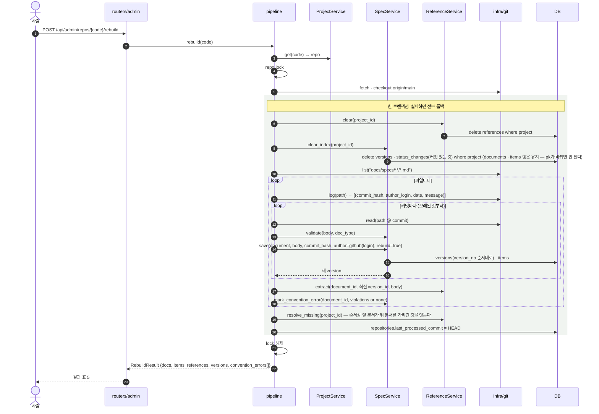
```mermaid
sequenceDiagram
    autonumber
    actor U as 사람
    participant RA as routers/admin
    participant P as pipeline
    participant PS as ProjectService
    participant S as SpecService
    participant R as ReferenceService
    participant G as infra/git
    participant DB

    U->>RA: POST /api/admin/repos/{code}/rebuild
    RA->>P: rebuild(code)
    P->>PS: get(code) → repo
    P->>P: repo lock
    P->>G: fetch · checkout origin/main
    rect rgb(240,244,240)
        Note over P,DB: 한 트랜잭션. 실패하면 전부 롤백
        P->>R: clear(project_id)
        R->>DB: delete references where project
        P->>S: clear_index(project_id)
        S->>DB: delete versions · status_changes(커밋 있는 것) where project (documents · items 행은 유지 — pk가 바뀌면 안 된다)
        P->>G: list("docs/specs/**/*.md")
        loop 파일마다
            P->>G: log(path) → [(commit_hash, author_login, date, message)]
            loop 커밋마다 (오래된 것부터)
                P->>G: read(path @ commit)
                P->>S: validate(body, doc_type)
                P->>S: save(document, body, commit_hash, author=github(login), rebuild=true)
                S->>DB: versions(version_no 순서대로) · items
                S-->>P: 새 version
            end
            P->>R: extract(document_id, 최신 version_id, body)
            P->>S: mark_convention_error(document_id, violations or none)
        end
        P->>R: resolve_missing(project_id) — 순서상 앞 문서가 뒤 문서를 가리킨 것을 잇는다
        P->>DB: repositories.last_processed_commit = HEAD
    end
    P->>P: lock 해제
    P-->>RA: RebuildResult {docs, items, references, versions, convention_errors[]}
    RA-->>U: 결과 표 5
```

**읽을 때 볼 것**
- `documents`·`items` 행은 지우지 않는다. 문서 pk는 상태 변경·휴지통이 물고 있고, 항목은 upsert한다 (되먹일 것 #18). v1에서는 플래그·댓글이 이 pk를 물어 재구축이 `relink`·`reassign` 두 단계를 더 가졌다 — v2에서 그 표가 사라지면서 `versions`를 가리키는 FK는 `references.extracted_version_id` 하나만 남았고, 지우고 다시 만드는 것으로 끝난다
- 커밋마다 돌아서 버전 이력을 복원한다. SEQ-2(밀린 커밋)는 최종 상태만 저장하는 것과 다르다

---

## SEQ-22 문서를 휴지통에 넣는다 · 완전히 지운다

[[SYNC-UC-001#UC-A7]] 기본 흐름 1~6 · [[SYNC-UC-001#UC-H18]] 1~3·6~8. MCP `delete_document` · `DELETE /api/docs/{docId}` · `POST …/purge`. 입구가 둘이고 파이프라인은 하나다.

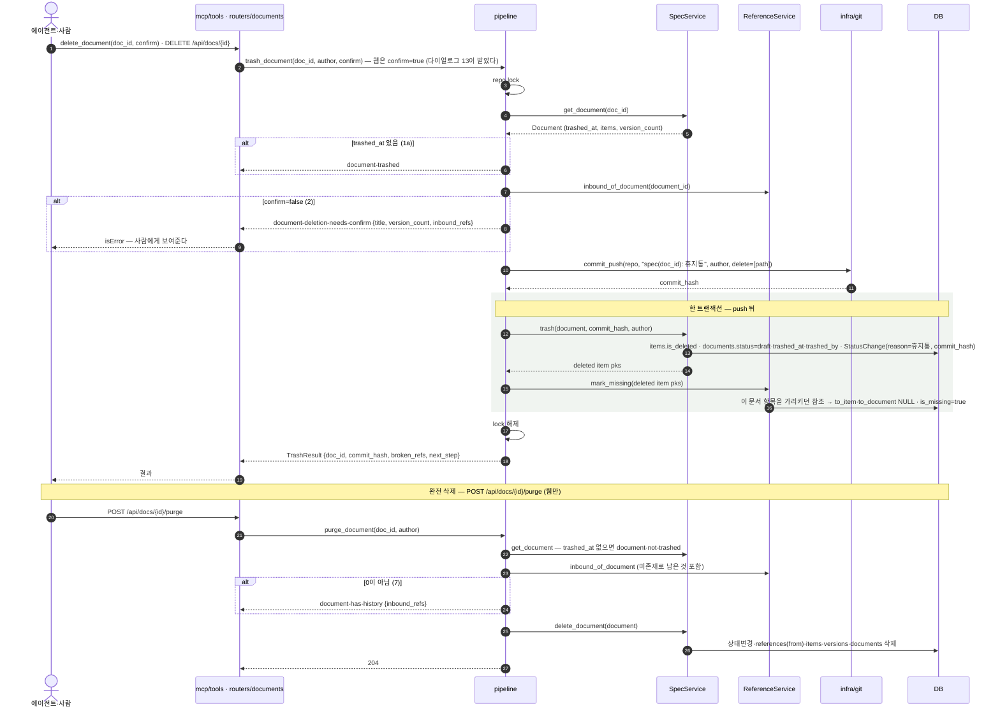
```mermaid
sequenceDiagram
    autonumber
    actor A as 에이전트·사람
    participant T as mcp/tools · routers/documents
    participant P as pipeline
    participant S as SpecService
    participant R as ReferenceService
    participant G as infra/git
    participant DB

    A->>T: delete_document(doc_id, confirm) · DELETE /api/docs/{id}
    T->>P: trash_document(doc_id, author, confirm) — 웹은 confirm=true (다이얼로그 13이 받았다)
    P->>P: repo lock
    P->>S: get_document(doc_id)
    S-->>P: Document (trashed_at, items, version_count)
    alt trashed_at 있음 (1a)
        P-->>T: document-trashed
    end
    P->>R: inbound_of_document(document_id)
    alt confirm=false (2)
        P-->>T: document-deletion-needs-confirm {title, version_count, inbound_refs}
        T-->>A: isError — 사람에게 보여준다
    end
    P->>G: commit_push(repo, "spec(doc_id): 휴지통", author, delete=[path])
    G-->>P: commit_hash
    rect rgb(240,244,240)
        Note over P,DB: 한 트랜잭션 — push 뒤
        P->>S: trash(document, commit_hash, author)
        S->>DB: items.is_deleted · documents.status=draft·trashed_at·trashed_by · StatusChange(reason=휴지통, commit_hash)
        S-->>P: deleted item pks
        P->>R: mark_missing(deleted item pks)
        R->>DB: 이 문서 항목을 가리키던 참조 → to_item·to_document NULL · is_missing=true
    end
    P->>P: lock 해제
    P-->>T: TrashResult {doc_id, commit_hash, broken_refs, next_step}
    T-->>A: 결과

    Note over A,DB: 완전 삭제 — POST /api/docs/{id}/purge (웹만)
    A->>T: POST /api/docs/{id}/purge
    T->>P: purge_document(doc_id, author)
    P->>S: get_document — trashed_at 없으면 document-not-trashed
    P->>R: inbound_of_document (미존재로 남은 것 포함)
    alt 0이 아님 (7)
        P-->>T: document-has-history {inbound_refs}
    end
    P->>S: delete_document(document)
    S->>DB: 상태변경·references(from)·items·versions·documents 삭제
    P-->>T: 204
```

**읽을 때 볼 것**
- 휴지통 넣기는 **하드 삭제가 아니다.** GitHub에서 파일을 지워 push한 것(UC-G1 3d)과 같은 상태에 `trashed_at`만 더한 것이다 — 규약 오류로 세지 않고, 목록·단계 칸·그래프에서 빠지고, 저장·상태 변경이 `document-trashed`로 막힌다
- 삭제 커밋은 다음 폴링에 `D`로 온다. `trashed_at`이 있는 문서의 `D`는 앱이 만든 것이라 [[SYNC-MS-007#pipeline.process_commit]]이 건너뛴다
- 완전 삭제의 문지기는 하나 — 들어오는 참조(미존재로 남은 것 포함). 상태 변경·버전·항목·나가는 참조는 이 문서의 것이라 함께 지운다

---

## SEQ-23 휴지통에서 되살린다

[[SYNC-UC-001#UC-A8]] 기본 흐름 1~5 · [[SYNC-UC-001#UC-H18]] 4~5. MCP `restore_document` · `POST /api/docs/{docId}/restore`.

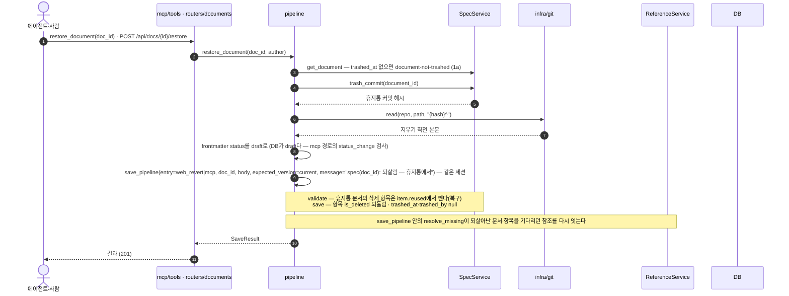
```mermaid
sequenceDiagram
    autonumber
    actor A as 에이전트·사람
    participant T as mcp/tools · routers/documents
    participant P as pipeline
    participant S as SpecService
    participant G as infra/git
    participant R as ReferenceService
    participant DB

    A->>T: restore_document(doc_id) · POST /api/docs/{id}/restore
    T->>P: restore_document(doc_id, author)
    P->>S: get_document — trashed_at 없으면 document-not-trashed (1a)
    P->>S: trash_commit(document_id)
    S-->>P: 휴지통 커밋 해시
    P->>G: read(repo, path, "{hash}^")
    G-->>P: 지우기 직전 본문
    P->>P: frontmatter status를 draft로 (DB가 draft다 — mcp 경로의 status_change 검사)
    P->>P: save_pipeline(entry=web_revert|mcp, doc_id, body, expected_version=current, message="spec(doc_id): 되살림 — 휴지통에서") — 같은 세션
    Note over P,S: validate — 휴지통 문서의 삭제 항목은 item.reused에서 뺀다(복구)<br/>save — 항목 is_deleted 되돌림 · trashed_at·trashed_by null
    Note over P,R: save_pipeline 안의 resolve_missing이 되살아난 문서·항목을 기다리던 참조를 다시 잇는다
    P-->>T: SaveResult
    T-->>A: 결과 (201)
```

**읽을 때 볼 것**
- 되살리기는 **새 버전**이다(되돌리기와 같은 원칙 — 이력을 안 지운다). 휴지통 사이의 시간도 이력에 남는다
- `save`가 `trashed_at`을 비운다 — **어느 입구든** 저장되면 휴지통에서 나온다. GitHub에서 파일을 되살려 push해도 같다
- 미존재 참조는 대상이 돌아왔으니 다시 잇는다(`resolve_missing`). 가리키던 쪽 문서는 손대지 않는다

---

## SEQ-24 읽다가 항목에 대해 묻는다

[[SYNC-UC-001#UC-H19]] 기본 흐름 1~4. `POST /api/docs/{docId}/ask` — 응답은 SSE(`text/event-stream`). **쓰지 않는다 — `pipeline`을 거치지 않는 유일한 외부 호출이다.** 모델이 도구로 같은 프로젝트를 읽는 ReAct 루프다(사용자 결정 2026-09-22).

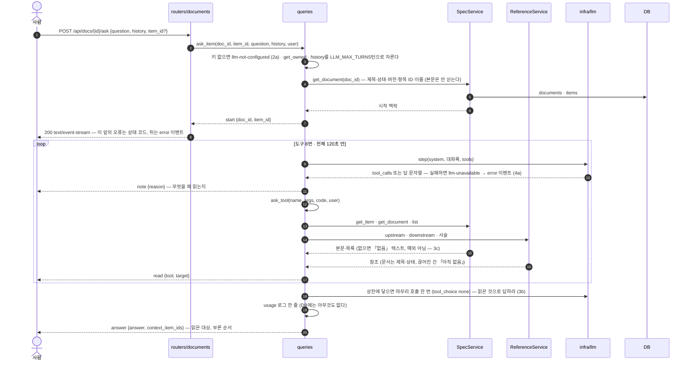
```mermaid
sequenceDiagram
    autonumber
    actor U as 사람
    participant RD as routers/documents
    participant Q as queries
    participant S as SpecService
    participant R as ReferenceService
    participant LLM as infra/llm
    participant DB

    U->>RD: POST /api/docs/{id}/ask {question, history, item_id?}
    RD->>Q: ask_item(doc_id, item_id, question, history, user)
    Q->>Q: 키 없으면 llm-not-configured (2a) · get_owned · history를 LLM_MAX_TURNS턴으로 자른다
    Q->>S: get_document(doc_id) — 제목·상태·버전·항목 ID·이름 (본문은 안 싣는다)
    S->>DB: documents · items
    S-->>Q: 시작 맥락
    Q-->>RD: start {doc_id, item_id}
    RD-->>U: 200 text/event-stream — 이 앞의 오류는 상태 코드, 뒤는 error 이벤트
    loop 도구 8번 · 전체 120초 안
        Q->>LLM: step(system, 대화록, tools)
        LLM-->>Q: tool_calls 또는 답 문자열 — 실패하면 llm-unavailable → error 이벤트 (4a)
        Q-->>U: note {reason} — 무엇을 왜 읽는지
        Q->>Q: ask_tool(name, args, code, user)
        Q->>S: get_item · get_document · list
        Q->>R: upstream · downstream · 사슬
        S-->>Q: 본문·목록 (없으면 「없음」 텍스트, 예외 아님 — 3c)
        R-->>Q: 참조 (문서는 제목·상태, 끊어진 건 「아직 없음」)
        Q-->>U: read {tool, target}
    end
    Q->>LLM: 상한에 닿으면 마무리 호출 한 번 (tool_choice none) — 읽은 것으로 답하라 (3b)
    Q->>Q: usage 로그 한 줄 (DB에는 아무것도 없다)
    Q-->>U: answer {answer, context_item_ids} — 읽은 대상, 부른 순서
```

**읽을 때 볼 것**
- **DB에 쓰지 않는다.** 대화는 클라이언트가 들고 요청마다 `history`로 온다. 서버에 상태가 없으므로 같은 질문을 두 번 보내면 두 번 나간다
- `queries`가 어댑터를 직접 부르는 유일한 자리다([[SYNC-DOM-002]] 3.2). 도구 실행도 `queries`가 이미 가진 조회로 닫힌다 — 쓰기가 없어 `pipeline`을 거칠 이유가 없다
- **모델이 고른 것만 읽는다.** 시작 맥락에는 본문이 없다. 상한은 호출 수(8)와 시간(120초)이지 글자가 아니다([[SYNC-INFRA-001]] 5.3)
- **첫 이벤트(`start`) 전의 오류는 HTTP 상태 코드**(404·503)이고, 뒤의 오류는 `error` 이벤트다. 라우터가 제너레이터를 한 번 당겨 `start`를 받은 뒤에야 스트림을 연다
- 항목은 힌트다. 없어도 문서 전체로 묻는다(1a). 항목 ID가 문서에 없으면 `start` 전에 `not-found`

---

## SEQ-C1 공통 형태 — 입구 → 서비스 하나 → DB

그려서 확인한 결과 정말로 묶음을 안 넘는 것들. 그림 하나로 대신한다.

```mermaid
sequenceDiagram
    autonumber
    actor U as 사람
    participant B as 라우터
    participant SV as 서비스 하나
    participant DB

    U->>B: 요청
    B->>SV: 메서드(인자)
    SV->>DB: 조회 또는 갱신
    alt 없음
        SV-->>B: NotFound
        B-->>U: 404
    end
    SV-->>B: 결과
    B-->>U: 응답
```

| 입구 | 서비스.메서드 | 비고 |
|---|---|---|
| GET /auth/github | (라우터만) | state 생성, 302 |
| POST /auth/logout | (라우터만) | 세션 삭제 |
| GET /api/docs/{docId}/versions | SpecService.list_versions | `versions ∪ status_changes` 시각순 — 한 서비스 안이지만 두 테이블 |
| GET /api/me | (세션 User) | |
| GET /api/me/tokens | AccountService.list_tokens | 폐기된 것 포함 |
| POST /api/me/tokens | AccountService.issue_token | raw 생성 → sha256 저장 → raw는 응답에만 |
| DELETE /api/me/tokens/{id} | AccountService.revoke_token | 본인 것만. 아니면 404 |

**읽을 때 볼 것**
- 여기 있는 것은 전부 서비스 하나만 부른다. 두 번째 서비스가 필요해지는 순간 고유 시퀀스로 옮긴다
- `GET /api/docs/{docId}`는 처음엔 여기 넣으려 했으나 미존재 참조 뱃지 때문에 SEQ-11로. `GET /api/projects`도 건수 때문에 SEQ-9로

---

## SEQ-C2 공통 형태 — MCP 인증

모든 MCP 도구 호출 앞에 붙는다. SEQ-1·10·11·12·13·19에서 생략한 부분.

```mermaid
sequenceDiagram
    autonumber
    actor A as 에이전트
    participant M as mcp 서버
    participant AS as AccountService
    participant DB

    A->>M: POST /mcp (Authorization: Bearer raw) {tool, args}
    M->>AS: authenticate_token(raw)
    AS->>AS: sha256(raw)
    AS->>DB: access_tokens where token_hash and revoked_at is null and (expires_at is null or > now)
    alt 없음 · 폐기 · 만료
        AS-->>M: None
        M-->>A: isError {type: unauthorized}
    end
    AS->>DB: users where id
    AS-->>M: User
    M->>M: author = Author(kind=agent, user, instructed_by=user, via=mcp)
    M->>M: 도구 실행 (SEQ-xx)
```

**읽을 때 볼 것** — 토큰 원문은 요청 헤더에만 있고 서버 어디에도 안 남는다. 로그에도 남기지 않는다 → MINISPEC.

---

## 2. 되먹일 것

시퀀스를 그려서 드러난 구멍. **클래스 명세 v3, ERD·DD, API, 인프라, 와이어프레임에 반영했다** (#22는 다른 문서에서 닫혔다 — 아래 미결사항). 이 절은 v3가 왜 그렇게 됐는지의 기록이다. **기록이라 고치지 않는다** — `TrackingService`·`CommentService`와 그 메서드(#5·#15·#19·#20·#21)는 v2에서 걷어냈고 지금 코드에 없다.

### 저장 파이프라인 (v1.0에서 발견)

| # | 발견 | 고칠 문서 | 내용 |
|---|---|---|---|
| 1 | `pipeline`이 `SpecService.get_document`를 부른다 (doc_type·현재 버전) | 클래스 3.2 | 화살표 추가 |
| 2 | 삭제 확인을 `pipeline`이 한다. `SpecService`는 하위 참조를 모른다 | 클래스 4.2 | `sync_items` → `detect_deleted_items(document, body) list~int~`. `save`는 `deleted_item_pks`를 받아 `is_deleted`만 찍는다 |
| 3 | **push가 DB 트랜잭션 앞이다.** 실패 시 롤백할 게 없다 | 클래스 4.7, 6장 | "검증·버전검사·삭제검사 → push → 한 트랜잭션(save·extract·detect·relocate)" |
| 4 | 저장은 **저장소 단위 락** | 클래스 4.7, 인프라 4.2 | `pipeline`이 repo lock. 프로세스 내 락으로 충분 |
| 5 | `raise_flags`가 담당자를 정하려고 `SpecService.last_author(document_id)` | 클래스 3.2, 4.2 | 추가 |
| 6 | **상태 변경은 Version을 만들지 않는다.** `StatusChange`가 커밋을 갖는다 | ERD·DD, 클래스 4.2 | `status_changes.commit_hash`. `list_versions`·`recent_changes`는 두 테이블 합침 |
| 7 | `save_pipeline`의 `entry=web_status` 경로 | 클래스 4.7 | validate·push·StatusChange만 |
| 8 | GitHub 커밋 작성자가 미등록일 수 있다 | 클래스 4.6, ERD | **결정: 커밋 이메일 → login → 자리표시.** `commit_emails` 신설, `AccountService.user_for_commit`. 자리표시면 `author.unknown`으로 승인만 막는다 |
| 9 | 밀린 커밋 여럿은 최종 상태만 저장 | 인프라 7장 | 명시. 재구축(SEQ-21)은 커밋마다 |
| 10 | 되돌리기가 삭제를 일으키는데 웹 API에 `confirm`이 없다 | API REST, UI-7 | `POST /revert`에 `confirm_item_deletion`. UI-7 확인 다이얼로그 |
| 11 | `save_pipeline(entry=github)`는 `commit_hash`를 갖고 들어온다 | 클래스 4.7 | 인자 추가 |

### 읽기 집계 (v1.1에서 발견)

| # | 발견 | 고칠 문서 | 내용 |
|---|---|---|---|
| 12 | **읽기에서 묶음을 넘는 조합이 9곳이다.** 서비스끼리 부르면 3.2 의존 그림이 거미줄이 된다 | 클래스 1장, 3.2, 4장 | **`core/queries.py` 신설.** `pipeline`이 쓰기 조율자면 `queries`는 읽기 조합자. 묶음 밖에 두고 여러 서비스를 ID로 부른다. 라우터·MCP 도구는 집계가 필요하면 `queries`를, 아니면 서비스를 직접 부른다. 함수: `project_summary` `project_detail` `document_list` `document_view` `item_view` `item_references_view` `graph_view` `diff_with_impact` `todo` `project_items` |
| 13 | `ProjectService`가 `documents` 테이블을 알면 안 된다 | 클래스 4.1·4.2 | `SpecService.list_by_project(project_id, stage?, status?, has_convention_error?)` 추가. `get_stage_summary`는 `queries`로 이동 |
| 14 | `ReferenceService`는 pk만 안다. 표시용 이름이 없다 | 클래스 4.2·4.3 | `SpecService.describe_items(pks) dict`, `resolve_item(doc_id, item_id) int`, `list_items_by_project(...)`, `neighbors(doc_id)` 추가. `ReferenceService.references_among(pks)`, `count_downstream(pks)` 추가 |
| 15 | `CommentService.add`가 본문을 직접 읽으면 안 된다 | 클래스 4.5 | `add(document_id, line_no, line_text, body, user, parent_id)` — `line_text`를 인자로 |
| 16 | 파일 경로 규약이 없다 | 인프라 4.3, PRD R5 | `docs/specs/{TYPE}/{doc_id}.md`. `_templates/`, `assets/` |
| 17 | 생성 시 frontmatter를 서버가 채운다 | 클래스 4.2 | `SpecService.apply_frontmatter(body, doc_id, doc_type, status) str` |
| 18 | 재구축이 `items`를 지우면 플래그가 끊긴다 | 클래스 4.7 rebuild, ERD | `items`는 upsert. `versions`·`references`만 지운다 |
| 19 | `TrackingService`에 집계용 메서드가 없다 | 클래스 4.4 | `count_flags(project_id)`, `count_flags_by_document(ids)`, `flags_for_items(pks)`, `flags_for_assignee(user_id)`, `flags_unassigned()`, `flags_in_project(project_id, kind)`, `pending_decisions_for(user_id)` |
| 20 | `CommentService`에 집계용 메서드가 없다 | 클래스 4.5 | `count_unresolved(project_id)`, `count_unresolved_by_document(ids)`, `unresolved_in(doc_ids)` |
| 21 | `SpecService`에 내 할 일용 조회가 없다 | 클래스 4.2 | `versions_instructed_by(ids, user_id)`, `convention_error_docs_by(user_id)`, `documents_authored_by(user_id)`, `recent_changes(project_id, n)` |
| 22 | `ProjectService.repo_status`가 저장소마다 fetch한다 | 인프라 7장, 클래스 4.1 | 폴링이 `behind_by`를 DB에 갱신하고 화면은 읽기만 — **미결** |

**12번이 v1.1의 핵심이야.** v1.0 되먹임이 "쓰기 조율은 pipeline이 한다"였다면, v1.1은 "읽기 조합은 queries가 한다"다. 둘 다 묶음 밖에 있고, 그래서 서비스는 자기 묶음만 알면 된다. 3.2 의존 그림에 서비스→서비스 화살표가 `TrackingService → ReferenceService·SpecService` 둘만 남는다(detect_impact·raise_flags). 나머지는 전부 `pipeline`이나 `queries`를 거친다.

---

## 3. 미결사항

- [x] #8 — 미등록 GitHub 사용자의 push — 결정: 커밋 이메일(`commit_emails`)로 먼저 잇고, 못 찾으면 `github_login`, 그것도 없으면 자리표시 User + `author.unknown`으로 승인만 막는다. git 커밋이 남기는 신원 중 계정으로 이어지는 것은 이메일뿐이다. 앞으로의 커밋은 GitHub 메일 비공개(noreply)로 로그인 ID가 바로 잡힌다. 이미 쌓인 것은 인덱스 재구축으로 옮긴다 ([[SYNC-DOM-002]] 5장 결정 3, [[SYNC-MS-006#AccountService.user_for_commit]])
- [x] #4 — 락 범위. 저장소 단위 vs 문서 단위 — 결정: 저장소(프로젝트 코드) 단위. `core/pipeline.py`의 `_lock(code)`. 파일 단위로 좁히는 건 경합이 실제로 보일 때 ([[SYNC-DOM-002]] 7장에서 이미 닫힌 것의 사본이었다)
- [x] #22 — 저장소 동기화 상태를 실시간 fetch할지 캐시할지 — 결정: DB에서 읽는다. 폴링이 `behind_by`·`fetched_at`을 갱신하고 `repo_status`는 조회만 ([[SYNC-MS-001#ProjectService.repo_status]]에서 이미 닫힌 것의 사본이었다)
- [ ] SEQ-12 항목 블록 경계 — 문서 타입별 헤더 형식. 템플릿 규약과 함께
