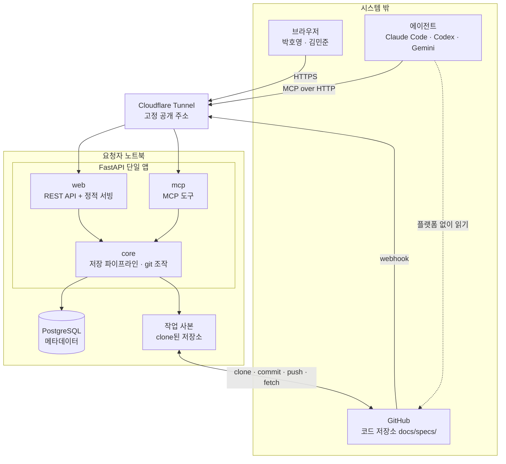
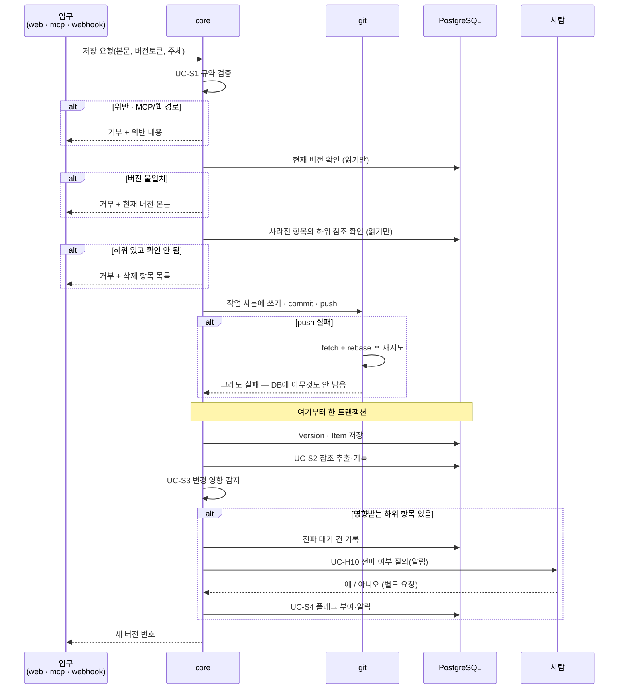

# 인프라 아키텍처: 싱크독 (SyncDoc)

---

## 0. 이 문서가 다루는 것

앞 단계(RFQ~USECASE)는 **무엇을** 만드는지를 정했다. 이 문서부터 **어떻게** 만드는지를 정한다.

여기서 정하는 것: 구성 요소와 경계, 기술 스택, 데이터가 어디 사는지, 요청이 어떻게 흐르는지, 인증, 배치.
여기서 정하지 않는 것: 도메인 모델과 클래스(다음 단계), API 시그니처, 테이블 컬럼.

---

## 1. 제약

앞 단계에서 확정되어 이 설계를 묶는 조건들이다.

#### C1 명세 원본은 각 프로젝트 코드 저장소의 `docs/specs/`에 산다

출처: [[SYNC-PRD-001#R5]]

#### C2 저장소가 단일 진실 원천이다. DB는 색인이며 재구축 가능해야 한다

출처: [[SYNC-PRD-001#N3]]

#### C3 입구가 둘이다 — 사람은 웹, 에이전트는 MCP. 본문 쓰기는 MCP와 GitHub push뿐이고 웹은 읽기·상태·댓글·되돌리기

출처: [[SYNC-PRD-001#R9]], USECASE 액터

#### C4 저장 경로(MCP·GitHub push, 그리고 웹의 되돌리기·상태 변경)가 **같은 파이프라인**을 거쳐야 한다

출처: UC-S1~S3

#### C5 플랫폼이 꺼져 있어도 팀원이 저장소에서 명세를 읽고 쓸 수 있어야 한다. 싱크독이 관여하지 않는 경로이므로 유스케이스가 아니라 제약이며, R1(frontmatter에 상태)·R5(MD를 git에)로 충족된다

출처: [[SYNC-PRD-001#N3]], [[SYNC-SCN-001#S7]]

#### C6 실사용 2~3명. 같이 일하는 사람만 쓴다

출처: RFQ

#### C7 요청자 노트북에서 서버가 돈다. 상시 가동 서버가 없다

출처: RFQ

#### C8 저장 파이프라인 중간에 사람 판단이 끼어든다 (UC-S3 → UC-H10 → UC-S4)

출처: USECASE

#### C9 바이브코딩으로 혼자 만든다

출처: RFQ


**C7과 C8이 이 설계의 두 축이다.** C7 때문에 상시 가동을 전제한 구조를 쓸 수 없고, C8 때문에 저장이 한 번의 트랜잭션으로 끝나지 않는다.

---

## 2. 구성도



**설명**

- **Cloudflare Tunnel** — 노트북이 공개 IP 없이 고정 주소를 갖게 한다. 브라우저·에이전트·GitHub webhook이 모두 이 주소로 들어온다. 노트북에서 밖으로 나가는 연결만 쓰므로 방화벽 설정이 필요 없다.
- **FastAPI 단일 앱** — 입구는 둘이지만 앱은 하나다. 이유는 4.1 참조.
- **작업 사본** — 등록된 저장소를 노트북에 clone해 둔 것. 저장 시 여기에 쓰고 커밋해 push한다.
- **점선** — 플랫폼을 거치지 않고 에이전트가 저장소를 직접 읽는 경로. C5의 보장.

---

## 3. 기술 스택

| 층 | 선택 | 이유 |
|---|---|---|
| 백엔드 | Python 3.12 / FastAPI | 요청자 주력 언어. MCP 파이썬 SDK 사용 가능 |
| 프론트엔드 | React + Vite + TS (SPA, `frontend/`). 유저용 탭 렌더링은 **`tools/view_build.py`를 TS로 옮긴 것**(`md.ts`·`views.ts`·타입별 모듈) — `react-markdown`은 쓰지 않는다(뷰 규약과 바이트 단위로 같아야 해서). `mermaid`(다이어그램) · `react-flow`(UI-8 그래프. **dagre는 안 쓴다** — UI-8 규칙이 열을 11단계로 고정해 배치가 결정적이다) · diff는 직접 | 빌드 결과는 `syncdoc/web/static/`으로, FastAPI가 `/{path:path}` 폴백으로 서빙. 별도 호스팅 없음 |
| 메타데이터 DB | PostgreSQL | 아래 참고 |
| Git 조작 | GitPython 또는 `git` CLI 호출 | 작업 사본에서 clone·commit·push |
| 다이어그램 | mermaid.js (브라우저 렌더링). 서버 생성물 없음 | PRD R10 |
| 외부 노출 | Cloudflare Tunnel | C7을 우회하는 유일한 현실적 방법 |
| 인증 | GitHub OAuth (웹) / 개인 토큰 (MCP) | 5장 |
| 실행 | Docker Compose (app + db) | 명령 하나로 켜고 끈다 |

> **PostgreSQL 선택에 따르는 부담** — 노트북에서 앱을 켤 때마다 DB 컨테이너가 함께 떠 있어야 한다. 2~3명 규모에서는 SQLite로도 충분하며 설치와 기동이 없다. 나중에 상시 가동 서버로 옮길 계획이 있다면 지금 PostgreSQL로 시작하는 편이 이전 비용을 줄인다. 그 계획이 없다면 SQLite가 가볍다. 이 문서는 PostgreSQL 기준으로 작성한다.

---

## 4. 내부 구조

### 4.1 입구는 둘, 알맹이는 하나

```
FastAPI 단일 앱
├── web    ← REST API + React 빌드 결과 서빙
├── mcp    ← MCP 도구 정의
└── core   ← 알맹이. 입구와 무관하게 동일하게 동작
```

`core`의 내부 구조는 이 문서에서 정하지 않는다. 도메인 개념이 나온 뒤에 그 경계를 따라 나누는 것이 맞으므로, 도메인 모델과 클래스 명세 단계로 넘긴다.

**왜 프로세스를 나누지 않는가.** C4가 이유다. 저장 파이프라인이 세 경로에서 똑같이 돌아야 하는데, 프로세스를 나누면 파이프라인 코드를 두 벌 갖거나 한쪽이 다른 쪽을 내부 API로 호출하게 된다. 두 벌이면 언젠가 어긋나고, 내부 호출이면 프로세스 하나와 그 사이 통신을 더 관리해야 한다. 2~3명이 쓰는 앱에서 치를 비용이 아니다.

경로로 구분한다.

| 경로 | 용도 |
|---|---|
| `/api/*` | 웹 REST API |
| `/mcp` | MCP 엔드포인트 |
| `/auth/*` | GitHub OAuth 콜백 |
| `/hooks/github` | GitHub webhook 수신 |
| `/` 및 정적 | React 빌드 결과 |

나중에 부하가 문제가 되면 `core`를 그대로 둔 채 `web`과 `mcp`를 각각 다른 프로세스로 띄우면 된다. 지금 나눌 필요는 없다.

### 4.2 저장 파이프라인

C4의 실체. 세 경로가 모두 이 함수 하나로 들어온다.



**C8이 여기서 드러난다.** UC-S3에서 사람 판단을 기다려야 하므로 저장이 한 번의 요청으로 끝나지 않는다. 설계상 처리는 이렇게 나눈다.

- 검증·버전 검사·삭제 검사는 DB를 읽기만 하고, **push가 성공한 뒤** Version·참조·영향을 한 트랜잭션으로 쓴다. push 실패면 롤백할 게 없다. 새 버전 번호는 즉시 돌려준다.
- 전파 대기 건은 DB에 남기고 알림만 보낸다. 사람의 응답은 나중에 별도 요청으로 들어온다.
- 응답이 없으면 UC-H10 확장 `2b`에 따라 "전파 미결정" 상태로 남는다. 이 상태가 DB에 실재해야 한다.

### 4.3 작업 사본

저장소마다 노트북에 clone본을 하나 둔다. 모든 git 조작은 여기서 일어난다.

- 프로젝트 등록(UC-A1) 시 clone
- 저장 시 쓰기 → commit → push
- push 거부 시 fetch + rebase 후 재시도 (UC-S7 확장 `2a`)
- 커밋 메시지는 규격을 따른다. 본문 변경 `spec(문서ID): 요약`, 상태 변경만 `status(문서ID): 이전 → 새상태`. 상태만 바꿔도 커밋이 생기며 접두어로 걸러 볼 수 있다. 둘째 줄부터 이유 — 변경 이력 절을 원본에 두지 않기 때문(STD-001 1.7)
- 파일 경로는 [[SYNC-STD-001]] 1.1 — `docs/specs/{TYPE}/{doc_id}.md`, `_templates/`, `assets/`, `STD/`
- **저장은 저장소 단위 락** 안에서 한다. 두 에이전트가 같은 저장소에 동시에 push하면 한쪽 rebase가 충돌하기 때문(클래스 4.7)
- webhook 또는 폴링으로 외부 변경 감지 시 fetch → 변경 파일 추출 → 파이프라인 재실행

**주의**: 커밋 작성자는 요청한 사람의 GitHub 계정으로 남긴다. MCP 경로에서도 지시한 사람 계정을 쓴다. UC-A6의 "작성 주체 기록"이 실제 커밋 이력과 일치해야 한다.

---

## 5. 인증과 접근

C6이 요구하는 것은 권한 구분이 아니라 **누가 들어올 수 있는가**다. PRD 비목표에 역할·권한 관리를 두지 않기로 했으므로, 들어온 사람은 모두 같은 일을 할 수 있다.

| 액터 | 방식 | 확인하는 것 |
|---|---|---|
| 사람 (웹) | GitHub OAuth | 등록된 저장소에 접근 권한이 있는 GitHub 계정인가 |
| 에이전트 (MCP) | 개인 액세스 토큰 | 사람이 웹에서 발급한 토큰인가. 토큰은 발급한 사람에 묶인다 |
| GitHub (webhook) | 서명 검증 | webhook secret으로 요청이 GitHub에서 왔는지 |

**GitHub OAuth를 고른 이유**는 여러 문제를 하나로 묶기 때문이다.

- 접근 통제 — 저장소 권한이 곧 접근 권한. 별도 사용자 관리가 없다
- 사용자 식별 — PRD 미결사항이던 "계정 로그인 vs 이름 입력"이 해결된다
- 커밋 작성자 — 각자의 계정으로 커밋이 남는다. 한 계정으로 몰지 않는다
- 저장소 접근 — 각자의 토큰으로 push한다

**MCP 배치**: `mcp` 2.x `MCPServer`, streamable HTTP. FastAPI 안에 `/mcp` **정확 경로 Route**로(Mount면 뒤 라우트를 삼킨다). 세션 매니저는 인스턴스당 한 번만 돌므로 lifespan마다 앱을 새로 만든다. DNS rebinding 보호는 터널 뒤 고정 도메인이라 끈다.

**웹 세션**: 테이블 없이 서명 쿠키 `syncdoc_session`(`itsdangerous`)에 `github_login`만 담고, 요청마다 `AccountService.user_by_login`으로 User를 얻는다. 노트북 재시작에도 로그인이 유지된다.

**MCP 인증이 다른 이유**: 에이전트에는 브라우저가 없어 OAuth 동의 화면을 띄울 수 없다. 사람이 웹에 로그인한 뒤 토큰을 발급받아 자기 에이전트 설정에 넣는다. 토큰으로 들어온 요청은 발급자 계정으로 기록된다.

**GitHub 토큰 보관**: 각자의 계정으로 커밋·push하려면 서버가 각 사용자의 GitHub OAuth 토큰을 갖고 있어야 한다. 요청자 노트북이지만 역할은 서버이므로, **토큰은 앱 비밀키로 암호화해 DB에 보관한다.** 비밀키는 DB 밖(환경 변수 또는 별도 파일)에 두어 DB만 유출되어도 토큰이 풀리지 않게 한다. 토큰은 저장소 `repo` 범위만 요청한다. OAuth 앱에서 **"Expire user access tokens"를 끈다** — 토큰 갱신 경로가 없어(MS-006 미결) 만료되면 push가 죽는다. git 작업 사본의 `.git/config`에는 토큰을 남기지 않는다 — push할 때만 URL에 붙인다(MS-009 `git.clone`·`commit_push`).

---

## 6. 데이터가 사는 곳

C2에 따라 **저장소가 원본이고 DB는 색인**이다. 어느 쪽에 무엇이 사는지가 명확해야 재구축(UC-S6)이 성립한다.

| 데이터 | 사는 곳 | DB 유실 시 |
|---|---|---|
| 명세 본문 | 저장소 `docs/specs/*.md` | 손실 없음 |
| 문서 상태 | 저장소 frontmatter | 손실 없음 |
| 첨부 파일 | 저장소 `docs/specs/assets/` | 손실 없음 |
| 버전 이력 | 저장소 git 커밋 | 손실 없음 |
| 참조 관계 | DB (본문에서 추출) | 본문에서 재추출 가능 |
| 프로젝트 등록 | DB | 재등록 필요 |
| 플래그 (확인 필요·끊어진 참조) | DB | **복구 불가** |
| 전파 대기·미결정 | DB | **복구 불가** |
| 댓글 | DB | **복구 불가** |
| 발급 토큰 | DB | 재발급 필요 |

**복구 불가 항목이 셋 있다.** 원본에 없는, 시스템이 만든 정보이기 때문이다. C2가 보장하는 것은 "명세와 참조가 살아남는다"이지 "모든 것이 살아남는다"가 아니다. 이를 줄이려면 DB를 주기적으로 덤프해 저장소에 함께 커밋하는 방법이 있으나, 그러면 명세와 무관한 파일이 저장소에 섞인다. **미결사항으로 둔다.**

---

## 7. 외부 변경 감지

C7 때문에 원래는 webhook을 받을 수 없었으나, Cloudflare Tunnel로 공개 주소가 생기므로 받을 수 있다.

- **주 경로**: GitHub webhook → `/hooks/github` → 서명 검증 → fetch → 변경 파일 파이프라인 (UC-G1 기본 흐름)
- **보조 경로**: 5분 주기 폴링. webhook 유실과 서버가 꺼져 있던 구간을 메운다 (UC-G1 확장 `1a`, `1b`)

두 경로 모두 필요하다. 노트북이 꺼져 있는 동안 온 webhook은 사라지므로, 켜질 때 마지막 처리 커밋 이후를 조회해 따라잡는 절차가 반드시 있어야 한다.

**밀린 커밋이 여럿이면 최종 상태만 저장한다.** `last_processed_commit..HEAD` 범위의 변경 파일을 한 번에 읽어 파일마다 버전 하나. 중간 커밋은 git에만 남는다. 커밋마다 버전을 복원하는 건 재구축(UC-S6)뿐이다.

---

## 8. 배치와 운영

```
docker compose up
├── app   FastAPI + React 빌드 결과   :8000
└── db    PostgreSQL                  :5432
```

Cloudflare Tunnel은 노트북에서 별도로 실행하며 `:8000`을 공개 주소에 연결한다.

**운영상 전제**
- 노트북이 꺼지면 웹과 MCP가 모두 멈춘다. 이 구조의 근본 한계이며 C5(저장소 직접 읽기)가 대비책이다.
- 켜질 때마다 밀린 커밋 따라잡기(7장)가 자동으로 돌아야 한다.
- 작업 사본이 손상되면 다시 clone하고 UC-S6으로 인덱스를 재구축한다.

---

## 9. 미결사항

- [ ] SQLite vs PostgreSQL 최종 확정 — 3장 참고. 상시 가동 서버로 옮길 계획 유무에 달렸다
- [ ] 플래그·댓글의 백업 방식 — 6장 참고. DB 덤프를 저장소에 커밋할지, 유실을 감수할지
- [ ] MCP 토큰의 만료·회수 정책
- [ ] 토큰 암호화 비밀키의 보관 위치와 교체 절차
- [ ] 저장소를 여러 개 등록했을 때 작업 사본 디스크 사용량 한도
- [ ] Cloudflare Tunnel 고정 주소용 도메인 확보 여부
- [ ] 원격 기본 브랜치 `main` 고정 — 다른 브랜치 저장소 지원은 v2
