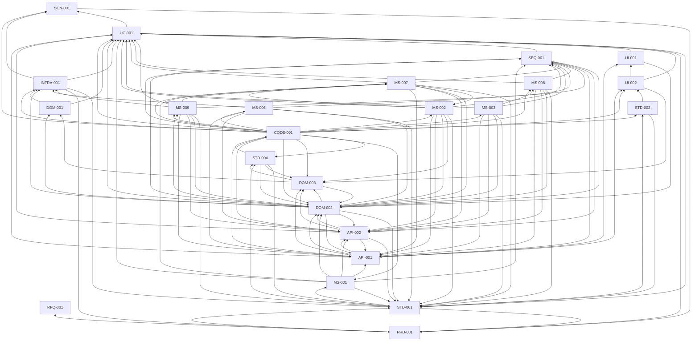

# 명세 체인 지도

## 0. 이 문서가 다루는 것

싱크독 자체를 11단계 체인으로 만든 결과가 실제로 어떻게 생겼는지. [[SYNC-STD-001]]이 "이렇게 써야 한다"면 이 문서는 "이렇게 썼다"다. 다음 프로젝트가 표준으로 삼을 때 규약과 함께 본다.

**카드 V(1인 도구 전환)로 MS-004·MS-005가 빠져 문서 25개다.** 그 둘은 웹 휴지통으로 지운다.

**전부 문서에서 뽑았다.** 절 이름·항목 수·참조는 원본을 파싱한 것이지 손으로 적은 게 아니다. 원본이 바뀌면 이 문서를 다시 생성한다.

## 1. 체인과 문서

11단계 + 단계 밖 STD. 문서 25개(이 문서 포함), 항목 357개, 문서 간·안 참조 1085개.

| 단계 | 문서 ID | 제목 | 파일 | 항목 | 절 | 상위(frontmatter) |
|---|---|---|---|---|---|---|
| 1 | `SYNC-RFQ-001` | RFQ — 프로젝트 명세 관리 플랫폼 | `RFQ_싱크독.md` | 6 | 7 | — |
| 2 | `SYNC-PRD-001` | PRD — 싱크독 | `PRD_싱크독.md` | 20 | 6 | RFQ-001 |
| 3 | `SYNC-SCN-001` | 사용자 시나리오 — 싱크독 | `사용자시나리오_싱크독.md` | 9 | 4 | PRD-001 |
| 4 | `SYNC-UC-001` | USECASE — 싱크독 | `USECASE_싱크독.md` | 26 | 5 | PRD-001, SCN-001 |
| 5 | `SYNC-INFRA-001` | 인프라 아키텍처 — 싱크독 | `인프라아키텍처_싱크독.md` | 8 | 10 | PRD-001, UC-001 |
| 6 | `SYNC-DOM-001` | 도메인 모델 — 싱크독 | `도메인모델_싱크독.md` | 10 | 7 | UC-001, INFRA-001 |
| 6 | `SYNC-DOM-002` | 클래스 명세 — 싱크독 | `클래스명세_싱크독.md` | 14 | 8 | DOM-001, INFRA-001, API-001, API-002 |
| 6 | `SYNC-DOM-003` | ERD·DD — 싱크독 | `ERD_DD_싱크독.md` | 10 | 6 | DOM-002, DOM-001 |
| 7 | `SYNC-UI-001` | 화면 설계 — 싱크독 | `화면설계_싱크독.md` | 12 | 9 | UC-001, DOM-002 |
| 7 | `SYNC-UI-002` | 와이어프레임 — 싱크독 | `와이어프레임_싱크독.md` | 12 | 14 | UI-001 |
| 8 | `SYNC-API-001` | API 명세 REST — 싱크독 | `API_REST_싱크독.md` | 33 | 7 | UI-002, DOM-002, DOM-003 |
| 8 | `SYNC-API-002` | API 명세 MCP — 싱크독 | `API_MCP_싱크독.md` | 10 | 7 | UC-001, DOM-002, DOM-003, STD-001 |
| 9 | `SYNC-SEQ-001` | SEQUENCE — 싱크독 | `SEQUENCE_싱크독.md` | 22 | 26 | DOM-002, API-001, API-002, UC-001 |
| 10 | `SYNC-MS-001` | MINISPEC — ProjectService | `MINISPEC_001_project_싱크독.md` | 6 | 3 | DOM-002, SEQ-001, API-001, API-002, STD-001 |
| 10 | `SYNC-MS-002` | MINISPEC — SpecService | `MINISPEC_002_spec_싱크독.md` | 34 | 3 | DOM-002, SEQ-001, API-001, API-002, STD-001 |
| 10 | `SYNC-MS-003` | MINISPEC — ReferenceService | `MINISPEC_003_reference_싱크독.md` | 13 | 3 | DOM-002, SEQ-001, API-001, API-002, STD-001 |
| 10 | `SYNC-MS-006` | MINISPEC — AccountService | `MINISPEC_006_account_싱크독.md` | 13 | 3 | DOM-002, SEQ-001, API-001, API-002, STD-001 |
| 10 | `SYNC-MS-007` | MINISPEC — pipeline — 쓰기 조율 | `MINISPEC_007_pipeline_싱크독.md` | 10 | 3 | DOM-002, SEQ-001, API-001, API-002, STD-001 |
| 10 | `SYNC-MS-008` | MINISPEC — queries — 읽기 조합 | `MINISPEC_008_queries_싱크독.md` | 13 | 3 | DOM-002, SEQ-001, API-001, API-002, STD-001 |
| 10 | `SYNC-MS-009` | MINISPEC — infra — git·github 어댑터 | `MINISPEC_009_infra_싱크독.md` | 16 | 3 | DOM-002, SEQ-001, API-001, API-002, STD-001 |
| 11 | `SYNC-CODE-001` | 구현 계획 — 슬라이스 카드와 커밋 기록 | `CODE_구현계획_싱크독.md` | 30 | 5 | STD-004, MS-001, MS-002, MS-003, MS-006, MS-007, MS-008, MS-009, API-001, API-002, UI-002, SCN-001 |
| — | `SYNC-STD-001` | 명세 작성 규약 | `STD_명세작성규약_싱크독.md` | 0 | 8 | PRD-001 |
| — | `SYNC-STD-002` | 뷰 규약 — 사람용 뷰 타입별 렌더링 | `STD_뷰규약_싱크독.md` | 12 | 7 | STD-001, UI-002 |
| — | `SYNC-STD-004` | 개발 규약 — 코드 파트 표준 | `STD_개발규약_싱크독.md` | 18 | 5 | STD-001, DOM-002, DOM-003 |
**아직 없는 것**: 프로토타입(`SYNC-UI-004`, 선택 — `view_*.html` 25개가 대신함). 명세 파트 전부 + CODE 구현 계획까지 있다. 남은 건 코드 자체.

**되돌아오는 문서**: `SYNC-DOM-002` 클래스 명세는 6단계에서 엔티티(v1)까지, API(8) 뒤 컨트롤(v2), SEQUENCE(9) 뒤 되먹임(v3). SEQ 승인 조건이 그 v3다. 지금 v3까지 반영됐다.

## 2. 문서마다 실제 절

규약 2장의 필수 절과 대조한 결과 전부 통과. 여기는 실제 절 이름.

**SYNC-RFQ-001** RFQ — 프로젝트 명세 관리 플랫폼
- 1. 배경과 동기
- 2. 명세 체인 (11단계)
- 3. 요구 사항
- 4. 사용자와 환경
- 5. 이 플랫폼의 첫 프로젝트
- 6. 미정 / 다음 단계로 넘기는 것
- 7. 써 본 뒤 (2026-09-21)

**SYNC-PRD-001** PRD — 싱크독
- 1. 목표
- 2. 비목표
- 3. 요구사항
- 4. 성공지표
- 5. ID 체계
- 6. 미결사항

**SYNC-SCN-001** 사용자 시나리오 — 싱크독
- 0. 범위와 전제
- 1. 페르소나
- 2. 시나리오
- 3. 대응표 — 시나리오 ↔ 요구사항

**SYNC-UC-001** USECASE — 싱크독
- 0. 이 문서의 형식
- 1. 액터
- 2. 사용자 목표 수준 유스케이스
- 3. 하위기능 수준 유스케이스
- 4. 대응표

**SYNC-INFRA-001** 인프라 아키텍처 — 싱크독
- 0. 이 문서가 다루는 것
- 1. 제약
- 2. 구성도
- 3. 기술 스택
- 4. 내부 구조
- 5. 인증과 접근
- 6. 데이터가 사는 곳
- 7. 외부 변경 감지
- 8. 배치와 운영
- 9. 미결사항

**SYNC-DOM-001** 도메인 모델 — 싱크독
- 0. 이 문서가 다루는 것
- 1. 개념 식별
- 2. 개념 모델
- 3. 개념별 정리
- 4. 경계
- 5. 판단이 필요한 지점
- 6. 미결사항

**SYNC-DOM-002** 클래스 명세 — 싱크독
- 0. 이 문서가 다루는 것
- 1. 폴더 구조
- 2. 엔티티
- 3. 의존 관계 (v2)
- 4. 설계 클래스 다이어그램 (v3)
- 5. 판단이 필요한 지점
- 6. 부록: FastAPI·SQLAlchemy 구현 형태
- 7. 미결사항

**SYNC-DOM-003** ERD·DD — 싱크독
- 0. 이 문서가 다루는 것
- 1. ERD
- 2. DD (데이터 사전)
- 3. 인덱스와 정규화
- 4. 판단이 필요한 지점
- 5. 미결사항

**SYNC-UI-001** 화면 설계 — 싱크독
- 0. 이 문서가 다루는 것
- 1. 유스케이스 대응
- 2. 화면 목록
- 3. 디자인 토큰
- 4. 공통 틀
- 5. 화면 흐름
- 6. 화면별 진입과 이탈
- 7. 판단이 필요한 지점
- 8. 미결사항

**SYNC-UI-002** 와이어프레임 — 싱크독
- 0. 형식
- 1. 공통 컴포넌트
- UI-5 문서 뷰
- UI-4 프로젝트 상세
- UI-7 버전 이력
- UI-2 프로젝트 목록
- UI-1 로그인
- UI-3 프로젝트 초기화
- UI-8 참조 그래프
- UI-9 순서대로 읽기
- UI-13 설정
- UI-14 관리
- UI-15 11단계 흐름
- UI-16 사용 방법

**SYNC-API-001** API 명세 REST — 싱크독
- 0. 이 문서가 다루는 것
- 1. 규칙
- 2. 에러
- 3. 엔드포인트
- 4. 스키마
- 5. 판단이 필요한 지점
- 6. 미결사항

**SYNC-API-002** API 명세 MCP — 싱크독
- 0. 이 문서가 다루는 것
- 1. 규칙
- 2. 도구 이름
- 3. 도구 정의
- 4. 에이전트 순서
- 5. 판단이 필요한 지점
- 6. 미결사항

**SYNC-SEQ-001** SEQUENCE — 싱크독
- 0. 이 문서가 다루는 것
- 1. 대응표 — 입구 → 시퀀스
- SEQ-1 에이전트가 문서를 수정한다
- SEQ-2 GitHub push를 받아 처리한다
- SEQ-4 프로젝트를 초기화한다
- SEQ-5 문서 상태를 바꾼다
- SEQ-7 이전 버전으로 되돌린다
- SEQ-8 GitHub로 로그인한다
- SEQ-9 프로젝트 목록·상세를 본다
- SEQ-10 문서 목록을 본다
- SEQ-11 문서를 본다
- SEQ-12 항목을 본다
- SEQ-13 항목의 참조를 본다
- SEQ-14 참조 그래프를 본다
- SEQ-15 두 버전의 diff를 본다
- SEQ-18 프로젝트의 끊어진 참조·오류·미완성 목록을 본다
- SEQ-19 에이전트가 문서를 만든다
- SEQ-20 저장소 동기화 상태를 본다
- SEQ-21 인덱스를 재구축한다
- SEQ-22 문서를 휴지통에 넣는다 · 완전히 지운다
- SEQ-23 휴지통에서 되살린다
- SEQ-24 읽다가 항목에 대해 묻는다
- SEQ-C1 공통 형태 — 입구 → 서비스 하나 → DB
- SEQ-C2 공통 형태 — MCP 인증
- 2. 되먹일 것
- 3. 미결사항

**SYNC-MS-001** MINISPEC — ProjectService
- 1. 함수 목록
- 2. 함수
- 3. 미결사항

**SYNC-MS-002** MINISPEC — SpecService
- 1. 함수 목록
- 2. 함수
- 3. 미결사항

**SYNC-MS-003** MINISPEC — ReferenceService
- 1. 함수 목록
- 2. 함수
- 3. 미결사항

**SYNC-MS-006** MINISPEC — AccountService
- 1. 함수 목록
- 2. 함수
- 3. 미결사항

**SYNC-MS-007** MINISPEC — pipeline — 쓰기 조율
- 1. 함수 목록
- 2. 함수
- 3. 미결사항

**SYNC-MS-008** MINISPEC — queries — 읽기 조합
- 1. 함수 목록
- 2. 함수
- 3. 미결사항

**SYNC-MS-009** MINISPEC — infra — git·github 어댑터
- 1. 함수 목록
- 2. 함수
- 3. 미결사항

**SYNC-CODE-001** 구현 계획 — 슬라이스 카드와 커밋 기록
- 1. 슬라이스
- 2. 통합 테스트 시나리오
- 3. CODE 단계 전 결정
- 4. 커밋·PR 목록
- 5. 미결사항

**SYNC-STD-001** 명세 작성 규약
- 1. 공통 규약
- 2. 타입별 구조
- 3. 규약 위반 — 저장 거부
- 4. 미완성 — 경고
- 5. 예시 — 규약을 다 지킨 최소 문서
- 6. 규약 적용 기록 — 13개 문서에 한 것
- 7. 되먹인 것
- 8. 미결사항

**SYNC-STD-002** 뷰 규약 — 사람용 뷰 타입별 렌더링
- 1. 공통 틀 — 확정 (PRD 뷰로 검증)
- 2. 타입별 본문
- 3. 뷰가 원본에 없는 것을 만드는 곳
- 4. 구현
- 5. 이미 만든 뷰 셋과의 차이
- 6. 미결사항 — v2로 미룬 가시성 강화
- 7. 미결사항 (기존)

**SYNC-STD-004** 개발 규약 — 코드 파트 표준
- 1. 코딩 규약
- 2. DB 물리 규칙
- 3. 작업 단위 — 슬라이스 카드
- 4. 완료 조건
- 5. 미결사항

**SYNC-STD-003** 명세 체인 지도 — 싱크독 첫 프로젝트의 실제 구조
- 0. 이 문서가 다루는 것
- 1. 체인과 문서
- 2. 문서마다 실제 절
- 3. 문서 간 참조
- 4. 산출물 외 자산
- 5. 미결 모음
- 6. 미결사항

## 3. 문서 간 참조

본문 `[[ ]]`와 frontmatter `upstream`에서 뽑은 문서 단위 참조. 화살표는 하위 → 상위(근거).

읽는 법 — 화살표가 많이 들어오는 노드가 많이 참조되는 문서(PRD·UC·STD-001). 화살표가 안 들어오는 노드는 아직 아무도 근거로 안 삼은 문서.

## 4. 산출물 외 자산

문서는 아니지만 체인이 돌아가는 데 필요한 것.

| 자산 | 위치 | 무엇 | 근거 |
|---|---|---|---|
| 규약 검증기 | `_tools/validate.py` | STD-001 3·4장을 코드로. `SpecService.validate`의 원형 | [[SYNC-STD-001]] |
| 템플릿 12개 | `_templates/{TYPE}.md` | 타입별 뼈대. `init_project`가 복사, `get_template`이 반환 | [[SYNC-STD-001]] 2장 |
| 뷰 생성기 | `_tools/view_build.py --all` (안에서 parse·build·wf·seq·ms 빌더를 씀) | 원본 25개 → `view_*.html` + `index.html`. 12타입 V-* 전부 | [[SYNC-STD-002]] |
| 사람용 뷰 | `index.html` + `view_SYNC-*.html` 25개 | 검토용이자 UI-5 유저용 탭 프로토타입. 파일 하나에 CSS 내장 | [[SYNC-STD-002]] |
| 수정 전 원본 | `_archive/before_std/` | 규약 적용 전 13개. 규약이 문서를 어떻게 바꿨는지 대조용 | |

전 타입에 뷰가 있다. 가시성 강화(읽기 층·구조 그래프·요약)는 [[SYNC-STD-002]] 6장 v2 미결.

---

## 5. 미결 모음

문서 전부의 미결사항 절에서 **열려 있는 것만** 모았다. 이 목록은 `tools/open_items.py`가 만든다 — 손으로 고치지 않는다. 원본을 고치고 다시 생성한다.
닫힌 미결은 각 문서에 결정과 함께 남아 있다.

**SYNC-SEQ-001**
- [ ] SEQ-12 항목 블록 경계 — 문서 타입별 헤더 형식. 템플릿 규약과 함께

---

## 6. 미결사항

- [x] 이 문서를 생성하는 스크립트를 뷰 생성기와 같은 곳에 둘지 — 결정: `tools/`에 둔다. 5장 미결 모음은 `tools/open_items.py`가 만든다
- [x] 다음 프로젝트가 이 체인을 따를 때 15개 중 무엇을 빼도 되는지 — 2~3명 프로젝트가 화면 13개·시퀀스 23개를 다 쓰지는 않을 것 — **결정: 규모가 정한다. RFQ·PRD·UC·DOM·API·CODE 여섯이 실질이고 SCN·INFRA·UI 와이어프레임·SEQ·MS는 선택이다.** 실물로 둘을 써 보고 얻은 답이다 — 40명짜리 동아리 게시판(문서 14개)에서는 SEQ가 시퀀스 3개, MS가 함수 8개로 끝나 형식만 남았고 UI 와이어프레임도 그랬다. 반면 45,000줄짜리 보험 서비스(문서 14개)에서는 열한 단계가 다 필요했다 — 특히 DOM 셋과 SEQ가 「이 함수 하나가 사실상 제품 명세」인 자리를 드러냈다. **가르는 것은 사람 수가 아니라 「머리에 안 들어가는가」다.** 한 사람이 전체를 쥘 수 있으면 여섯으로 충분하고, 그렇지 않으면 나머지가 지도가 된다. 건너뛰어도 시스템은 막지 않는다([[SYNC-RFQ-001]] 2장) — 빈 단계는 화면에 「미작성」으로 남아 선택했다는 사실 자체가 보인다
