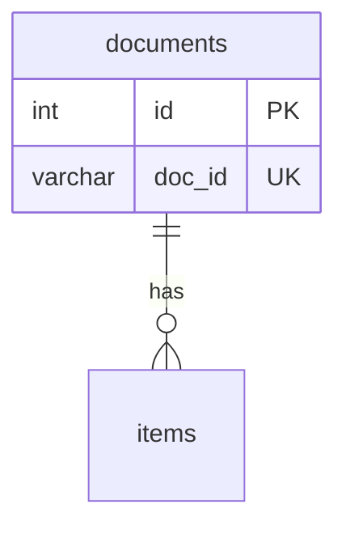

# ERD·DD — {프로젝트}

<!-- 템플릿. [[SYNC-STD-001]] 2.6의 DOM 셋 중 ERD·DD. doc_id는 서버가 채운다 -->
<!-- title에 「ERD」가 들어가야 한다 — 그것으로 셋 중 무엇인지 안다 (없으면 위반) -->
<!-- 필수 절 넷: ERD · DD · 인덱스 · 미결사항. 아래 절 이름을 그대로 쓰면 미완성 경고가 안 난다 -->
<!-- 클래스 명세 뒤에 쓴다 — 테이블은 엔티티 클래스에서 나온다. 같은 프로젝트에 클래스 명세가 없으면 create_document가 받지 않는다(precondition-unmet) -->
<!-- 항목 = 테이블. 헤딩은 테이블명 소문자(snake_case). 대문자로 쓰면 항목으로 안 잡혀 「항목이 하나도 없음」 경고가 난다 -->
<!-- 문서 하나를 만들면 멈춘다 (STD-001 1.8) -->

## 0. 이 문서가 다루는 것

…

## 1. ERD

## 2. DD (데이터 사전)

#### documents

클래스: [[XXXX-DOM-002#Document]]

| 컬럼 | 타입 | 제약 | 의미 | 예시 |
|---|---|---|---|---|
| id | int | PK | | |
| doc_id | varchar(30) | UK | 사람이 부르는 문서 ID | `XXXX-PRD-001` |

## 3. 인덱스와 정규화

어느 질의를 빠르게 하려는 인덱스인지. 일부러 정규화를 깬 곳이 있으면 왜인지.

## 4. 미결사항

- [ ] …
