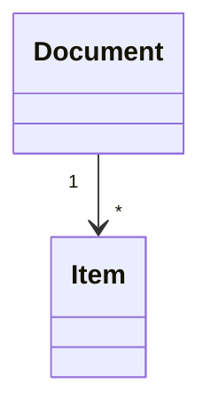

# 도메인 모델 — {프로젝트}

<!-- 템플릿. [[SYNC-STD-001]] 2.6의 DOM 셋 중 도메인 모델. doc_id는 서버가 채운다 -->
<!-- title에 「도메인」이 들어가야 한다 — 그것으로 셋 중 무엇인지 안다 (없으면 위반) -->
<!-- 필수 절 다섯: 개념 식별 · 개념 모델 · 개념별 정리 · 경계 · 미결사항. 아래 절 이름을 그대로 쓰면 미완성 경고가 안 난다 -->
<!-- 셋 중 첫째다. 6단계에서 UC·INFRA 뒤에 쓴다. 클래스 명세는 8 API 뒤에 돌아와서, ERD는 클래스 명세 뒤에 — STD-001 2.6 -->
<!-- 문서 하나를 만들면 멈춘다 — 사람이 웹에서 읽고 「다음」이라고 한 뒤에 다음 문서 (STD-001 1.8) -->

## 0. 이 문서가 다루는 것

…

## 1. 개념 식별

유스케이스·요구에서 명사를 모아 개념 후보로 추린 것. 무엇을 개념으로 남기고 무엇을 속성으로 내렸는지.

## 2. 개념 모델

## 3. 개념별 정리

<!-- 항목 = 개념. 헤딩은 영문명(대문자로 시작) + 한국어 이름. 클래스 명세·ERD가 같은 이름으로 가리킨다 -->

#### Document 문서

속성 목록 · 관계 · 판정 근거.

## 4. 경계

이 모델이 다루지 않는 것과 그 이유.

## 5. 미결사항

- [ ] …
