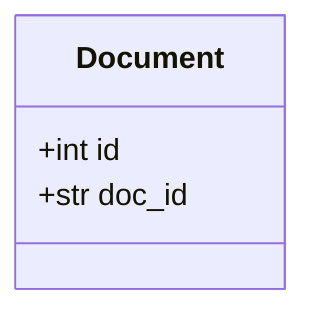
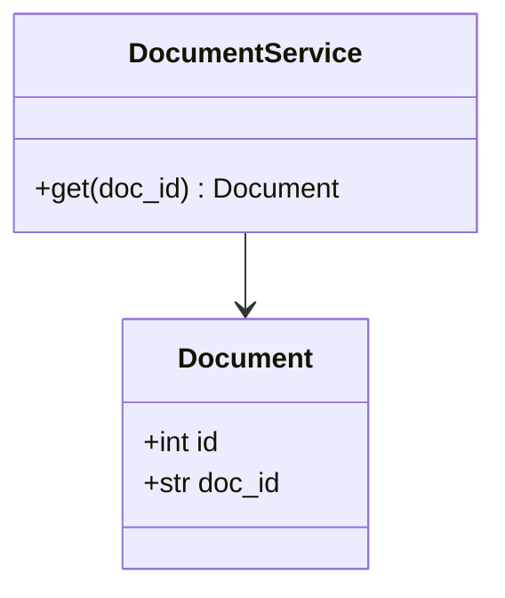

# 클래스 명세 — {프로젝트}

<!-- 템플릿. [[SYNC-STD-001]] 2.6의 DOM 셋 중 클래스 명세. doc_id는 서버가 채운다 -->
<!-- title에 「클래스」가 들어가야 한다 — 그것으로 셋 중 무엇인지 안다 (없으면 위반) -->
<!-- 필수 절 다섯: 폴더 구조 · 엔티티 · 의존 관계 · 설계 클래스 · 미결사항. 아래 절 이름을 그대로 쓰면 미완성 경고가 안 난다 -->
<!-- 8 API 뒤에 돌아와서 쓴다 — 클래스의 메서드는 API가 정한다. 같은 프로젝트에 API 문서가 없으면 create_document가 받지 않는다(precondition-unmet) -->
<!-- 2장(엔티티)과 4장(설계 클래스)의 mermaid에서 같은 클래스의 속성이 다르면 경고다(entity.mismatch). 장 번호를 바꾸지 않는다 -->
<!-- 문서 하나를 만들면 멈춘다 (STD-001 1.8) -->

## 0. 이 문서가 다루는 것

…

## 1. 폴더 구조

<!-- 저장소 루트부터 트리 + 폴더마다 한 줄. 기본형(STD-001 1.9)과 다르면 왜 다른지를 적는다 — 결과만 적으면 다음 사람이 따를지 고칠지 모른다 -->

```
{저장소}/
├── backend/        서버
├── frontend/       화면. 빌드 결과가 어디로 가는지
├── docs/specs/     명세 원본
└── …
```

## 2. 엔티티



<!-- 항목 = 클래스. 헤딩은 클래스명(대문자로 시작) + 한국어 이름. 바로 아래 줄에 테이블·도메인 링크 — check_dom이 이 줄로 세 문서의 이름을 맞춘다. 테이블이 없는 클래스(DTO·열거형)는 링크를 안 단다 -->

#### Document 문서

테이블: [[XXXX-DOM-003#documents]] · 도메인: [[XXXX-DOM-001#Document]]

속성마다 한 줄 — 무엇이고 왜 있나.

## 3. 의존 관계

어느 클래스가 어느 것을 부르나. 한 방향으로만 흐른다(router → service → repository).

## 4. 설계 클래스

<!-- 엔티티 속성은 2장과 같게 다시 그린다 — 서비스와 속성이 한 그림에 있어야 읽힌다. 어긋나면 2장이 진실 -->



#### DocumentService 문서 서비스

| 메서드 | 부르는 곳 | 유스케이스 | 던지는 에러 |
|---|---|---|---|
| `get(doc_id) -> Document` | `GET/api/docs/{docId}` | [[XXXX-UC-001#UC-H1]] | `not-found` |

규칙 — …

## 5. 미결사항

- [ ] …
