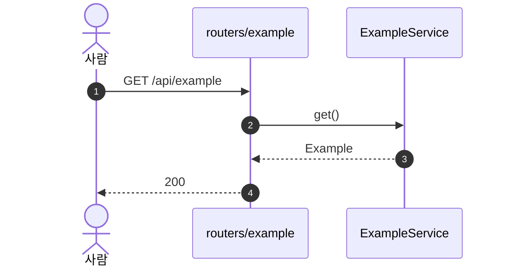

# SEQUENCE

<!-- 템플릿. [[SYNC-STD-001]] 2장의 SEQ 구조. doc_id는 서버가 채운다. 필수 절은 규약 2장 참조 — 없으면 미완성 경고 -->

## 0. 이 문서가 다루는 것

…

### 0.1 생명선

| 생명선 | 약어 | 실체 | 종류 | 정의한 곳 |
|---|---|---|---|---|

<!-- 항목 = 시퀀스. 헤딩은 SEQ-번호 + 이름. 번호에 0을 채우지 않는다(SEQ-1). 아래에 근거 유스케이스 한 줄 + mermaid sequenceDiagram + 「읽을 때 볼 것」 -->

## SEQ-1 {무엇을 한다}

[[XXXX-UC-001#UC-H1]] 기본 흐름 1~3.

**읽을 때 볼 것**
- …

## 1. 대응표

…

## 2. 되먹일 것

…

## 3. 미결사항

- [ ] …

