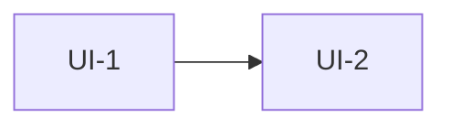

# 화면 설계·와이어프레임 — {프로젝트}

<!-- 템플릿. [[SYNC-STD-001]] 2.7의 UI 구조. doc_id는 서버가 채운다. 필수 절은 「미결사항」 하나 — 없으면 미완성 경고 -->
<!-- title에 「화면 설계」「와이어프레임」 중 하나가 들어가야 한다(없으면 위반). 둘 다 넣기를 권장 — 검사기 둘이 각각 다른 키워드로 이 문서를 찾는다 -->
<!-- 화면 설계와 와이어프레임을 한 문서에 써도 되고 둘로 나눠도 된다. 규약은 같다 -->

## 0. 이 문서가 다루는 것

…

## 1. 유스케이스 대응

| 유스케이스 | 화면 |
|---|---|
| [[XXXX-UC-001#UC-H1]] | UI-1 |

## 2. 화면 목록

| 화면 | 경로 | 한 줄 목적 |
|---|---|---|
| UI-1 첫 화면 | `/` | … |

<!-- 화면마다 절 하나. 헤딩 단계는 자유(##~#####)지만 화면 헤딩이 그 안 소제목보다 상위여야 한다 -->

## UI-1 첫 화면

| 항목 | 내용 |
|---|---|
| 경로 | `/` |
| 주 유스케이스 | [[XXXX-UC-001#UC-H1]] |
| 진입 / 이탈 | … / … |

<!-- 배치는 필수. html 코드블록 하나, 요소마다 data-el 번호 -->
### 배치
```html
<div data-el="1"></div>
```

<!-- 아래 셋은 있으면 쓴다. 없어도 막지 않는다 -->
### 요소
| # | 이름 | 종류 | 보여주는 것 | 누르면 |
|---|---|---|---|---|
| 1 | … | … | … | … |

### 규칙
- …

### 시나리오
**S-1 …** — [[XXXX-UC-001#UC-H1]]
1. …

## 3. 공통 틀

…

## 4. 화면 흐름



## 5. 미결사항

- [ ] …
